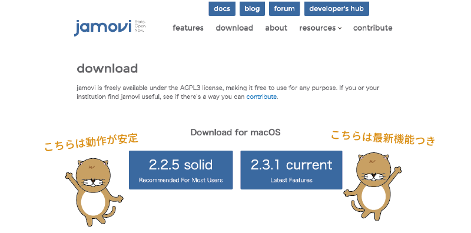
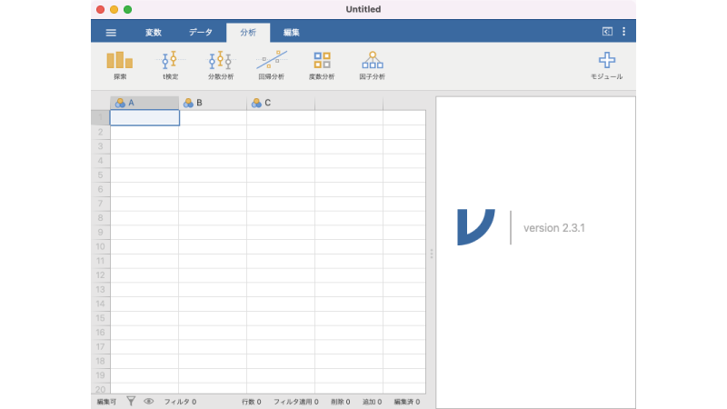
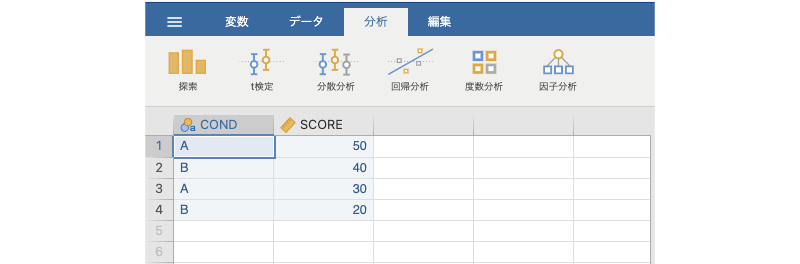

```{r, echo =F,message=FALSE}
  source("rscripts/_utility.R")

  data01 <- read.csv("data/intro_data01.csv")

  out <- jmvReadWrite::write_omv(data01, "data/omv/intro_data01.omv")

```

# jamoviの導入 {#ch-introduction}

この章ではまず，jamoviのインストール方法やソフトウェア全体の基本操作について見ていきます。jamoviはメニューやツールが非常によく整理されて作られていますので，他の統計ソフトに比べて操作に迷うことはだいぶ少ないはずです。

また，jamoviは心理学者が中心に開発していることもあって，心理学系の論文やレポートに適した設定が初めからなされています。そのため，普段の使用で設定を変更する必要はほとんどないかもしれませんが，念のため，ひととおりの設定項目についても見ておきましょう。


## jamoviのインストール {#sec-intro-install}

まずはソフトウェアのインストールからです。jamoviウェブサイトの[ダウンロードページ](https://www.jamovi.org/download.html)から，ソフトウェアをダウンロードしましょう。ダウンロードページには「2.x.xx solid」というダウンロードボタンと「2.x.xx current」というダウンロードボタンの2種類があります（図\@ref(fig:jamovi-download)）。

このうちの「solid」のほうは「安定版」で，最新の機能は含まれていませんが，動作が安定しているバージョンです。もう一方の「current」は最新版で，最新の機能が取り入れられているのですが，やや動作が不安定かもしれません。どちらを選ぶか迷った場合は，ひとまず「solid（安定板）」を選んでおくとよいでしょう。

なお，本書ではバージョン2.3.0(current)を元に説明します^[執筆時点での安定版は2.2.5ですが，2.3.0から日本語への対応が追加されているためです。]。

```{r jamovi-download, fig.cap='jamoviのダウンロード画面（Mac版）', echo=FALSE}

```


#### Windowsでのインストール方法 {-#sub:intro-install-win}

Windowsを使用している人の場合，ダウンロードしたファイルをダブルクリックするとインストーラが実行されるので，あとはインストーラの指示にしたがっていけばインストールは完了です。

#### Macでのインストール方法 {-#sub:intro-install-mac}

Macを使用している人の場合，ダウンロードしたファイルをダブルクリックして開き，その中にある「jamovi」を「アプリケーション」フォルダにドラッグ・アンド・ドロップすればインストールは完了です。

#### LinuxまたはChromebookでのインストール方法 {-#sub:intro-install-other}

最近のバージョンでは，LinuxやChromebook^[Chromebookにインストールするには「Linux」サポートが有効になっている必要があります。]でもjamoviを利用できるようになりました。Linuxの場合にはディストリビューションごとに設定方法が少しずつ異なりますので，ここでは具体的なインストール方法は省略します。ウェブサイトに示された手順にしたがってインストールしてください。


## 起動と終了{#sec-intro-launch-quit}

まずはソフトウェアの起動と終了の仕方を見ておきましょう。

### jamoviの起動 {#sub:intro-launch}

Windowsの場合，jamoviを起動するにはデスクトップに配置されている`r infig('logo-v')`アイコンをダブルクリックしてください。デスクトップにアイコンがない場合，「スタートメニュー」の「すべてのアプリ」から「jamovi」を選択すれば起動することができます。Macの場合は，「アプリケーション」フォルダまたはLaunchpadで`r infig('logo-v')`を選択して実行してください。

jamoviを起動すると図\@ref(fig:jamovi-screen)のような画面が現れます。

```{r jamovi-screen, fig.cap='jamoviのアプリケーション画面', echo=FALSE}

```

基本的な使い方については「[次章](##ch-basics)」で説明しますので，ここでは起動できるかどうかだけ確認しておきましょう。

### jamoviの終了 {#sub:intro-quit}

jamoviの終了方法は，開いているjamoviウィンドウをすべて閉じるだけです。作業中の内容がある場合には，忘れずに作業内容を保存しておいてください。ファイルの保存方法についてはこの後の「[ファイル操作](#sec-intro-file)」で説明します。

## 環境設定{#sec-intro-option}

画面最上部，青色の帯の一番右端にある「**⋮**」をクリックすると，ウィンドウ右側にjamoviの画面表示や動作に関する設定項目が表示されます（図\@ref(fig:options-menu)）。


```{r options-menu, fig.cap='環境設定メニュー', echo=FALSE }
knitr::include_graphics("images/intro/options-menu.png")
```

実際の使用場面では環境設定を変更する必要はほとんどないと思いますが，どのような設定項目があるのかをひととおり見ておくことにしましょう（図\@ref(fig:options-window)）。

```{r options-window, fig.cap='環境設定項目', echo=FALSE }

```

これらの項目のうち，数値書式と*p値*の書式については説明が必要かもしれません（図\@ref(fig:options-number-format)）。


```{r options-number-format, fig.cap='数値表示形式の設定', echo=FALSE}

```

「数値書式」と「p値の書式」の表示形式は，「有効桁数」と「小数位」の2とおりの方法で設定できます。「有効桁数」は，結果を表示させる際に整数部分を含めて最低何桁まで表示させるかを指定する方法で，有効桁数を`3桁`にすると，「1」は「1.00」，「1.3」は「1.30」，「12.3」は「12.3」というように，少なくとも3桁分の数値が表示されるようになります。なお，指定した有効桁数よりも整数部分の桁数が多い場合は，整数部分のみが表示され，小数点以下は表示されません。たとえば，有効桁数`3桁`で結果の値が「9999.999」であったような場合には，画面上では「9999」という表示になります。

これに対し，「小数位」は小数点以下を何桁目まで表示させるかという設定方法で，小数位を`第2位`にすると，「1」は「1.00」，「1.3」は「1.30」，「12.3」は「12.30」と表示されます。先ほどの有効桁数の場合とよく似ていますが，「12.3」の場合には表示方法が異なっている点に注意してください。小数位による指定では，整数部分が何桁あるかにかかわらず，小数点以下は指定した桁数だけ表示されるのです。またこの場合，指定した桁数よりも数値が短い場合には，その分を「0」で埋める形で表示されます。たとえば，小数`第2位`の指定で結果の数値が「12」であった場合には，画面上には「12.00」と表示されます。

実験レポートの場合，小数位の桁数がそろっていることが求められるため，「小数第2位」あるいは「小数第3位」の設定にしておくのがよいでしょう。なお，この設定はあくまでも結果の表示に関するものなので，ここを変更しても入力中のデータの表示は変わりません。


#### シンタックスモード {-#syn}

環境設定項目の「シンタックスモード」は，「シンタックスモード」と呼ばれる特殊モードのオン・オフです。jamoviは内部でRのスクリプト^[小規模なプログラムのことです。]を実行しており，このモードをオンにすると，分析のために使用したRスクリプトが結果画面に表示されます。将来的にjamoviからRへとステップアップしたい人にとって，このような機能はとても役立つことでしょう。


## 結果ウィンドウの拡大・非表示{#sec-intro-window}

環境設定用の「**⋮**」の隣にあるアイコンをクリックすると，分析結果の表示画面を全画面表示にしたり隠したりすることができます（図\@ref(fig:fullscreen-hide)）。できるだけ広い画面で入力したデータを確認したい場合などには，このボタンをクリックして分析結果を非表示にするとよいでしょう。

```{r fullscreen-hide, fig.cap='結果ウィンドウの拡大・非表示', echo=FALSE}

```

なお，このボタンの形状は使用しているタブによって異なり，アプリケーション起動時と同じ「分析タブ」やその隣の「編集タブ」では`r infig('fullscreen-hide-data')`（データを隠す），「変数タブ」や「データタブ」では`r infig('fullscreen-hide-results')`（結果を隠す）になっていて，それぞれクリックした際には結果ウィンドウが全画面化されたり，非表示になったりします。なお，結果ウィンドウとデータ画面（スプレッドシート）の大きさは，両画面の間にあるグレーの部分をマウスでドラッグして自由に変更することもできます。


## ファイル操作{#sec-intro-file}

### ファイルメニュー{#subsec:intro-file-menu}
jamoviでデータファイルを読み込んだり作業内容を保存したりする場合には，画面左上の「**≡**」を使用します（図\@ref(fig:file-menu)）。

```{r file-menu, fig.cap='ファイルメニュー', echo=FALSE}
knitr::include_graphics("images/intro/file.png")
```


#### 新規{-#subsec:intro-file-new}

新規に別のファイルを作成したい場合は，ファイルメニューの「**新規**」を使用します。「**新規**」を実行すると，アプリの起動直後と同じ空白のファイルが作成されます。

#### 開く{-#subsec:intro-file-open}

「**開く**」メニューは，すでにあるjamoviファイルやデータファイルを開く際に使用します（図\@ref(fig:file-open)）。

```{r file-open, fig.cap='「開く」メニュー',echo=F, fig.align='center'}

```

「**開く**」を選択すると，さらに「**このPC**」と「**データライブラリ**」の2つのメニューが表示されます。「**このPC**」はそのコンピューター上のファイル，「**データライブラリ**」はデータライブラリのファイルを開くことを意味しています。ExplorerやFinderなど，OS標準のファイルブラウザ（ファイルマネージャ）でファイルを選択して開きたい場合には，「**このPC**」が選択されていることを確認してから「`r infig('place-browse')` ブラウズ」をクリックしてください。

jamoviで開くことのできるデータファイルは，次のとおりです。

:::{.jmvblue data-latex=""}
+ jamoviファイル（拡張子「.omv」）
+ コンマ区切りテキストファイル（.csv，.txt）
+ オープンドキュメント（LibreOffice）形式ファイル（.ods）
+ Excelファイル（.xlsx）
+ SPSS（市販統計ソフト）ファイル（.sav，.zsav，.por）
+ R（オープンソースの統計ソフト）ファイル（.RData，.RDS）
+ Stata（市販統計ソフト）ファイル（.dta）
+ SAS（市販統計ソフト）ファイル（.xpt，.sas7bdat）
+ JASP（オープンソースの統計ソフト）ファイル（.jasp）
:::

また，これらのデータ形式に加え，jamoviのテンプレートファイル（分析手順が保存されたファイル「.omt」）を開くこともできます。


#### 読み込み{-#sec-intro-file-import}

「**読み込み**」のメニューは，いま作業中のファイルに別のデータファイルの内容を追加する場合に使用します。「**開く**」とよく似ているのですが，「**読み込み**」の場合には現在開いているデータファイルの内容が読み込んだファイルの内容に更新される点が異なります。なお，開いているデータファイルと「読み込み」したファイルで変数名が異なる場合には，それらは新たな*変数*としてデータファイルに追加されます。


#### 保存，別名で保存{-#sec-intro-file-save}

入力したデータや分析結果をjamoviファイルとして保存するには「**保存**」または「**別名で保存**」を使用します。保存場所を指定するには「`r infig('place-browse')` ブラウズ」をクリックしてください。なお，jamoviファイルの拡張子は「.omv」です。

#### 書き出し{-#sec-intro-file-export}

作業中のデータや分析結果をワープロソフトや別の統計ソフトなどで使用したい場合に使用します。書き出し可能なデータ形式は次のとおりです。

:::{.jmvblue data-latex=""}
+ 別の統計ソフト用にデータを書き出す
  - コンマ区切りテキストファイル（.csv）
  - Rオブジェクト（.rds，RData）
  - SPSSファイル（.sav）
  - SAS形式（.sas7bdat，.xpt）
  - Stata形式（.dta）
+ 分析結果をワープロなどで利用できるように書き出す
  - PDFファイル（.pdf）
  - Webページ（.html，.htm）
  - LaTeXバンドル^[LaTeXはオープンソースの組版システムです。]（.zip）
+ 分析手順をテンプレートとして書き出す
  - jamoviテンプレート（.omt）
:::

## 演習：ファイルを開く{#sec-intro-exercise1}

#### jamoviデータファイルの場合 {-#jamovidatafilenobaai}

それでは，ファイルを開く練習をしましょう。まず，次の練習用データファイルをダウンロードしてください。

+ 練習用データファイル1（[intro_data01.omv](https://github.com/sbtseiji/jmv_compguide/raw/main/data/omv/intro_data01.omv)）


このファイルはjamoviのデータファイルなので，通常はこのファイルをダブルクリックすればjamoviで開くことができるのですが，ここではファイルメニューを使ってこのファイルを開いてみます。

##### 手順1 {-#iti}
「≡」をクリックしてファイルメニューを開きます。


##### 手順2 {-#ni}
「開く」で「このPC」が選択されていることを確認します。

##### 手順3 {-#san}

「`r infig('place-browse')` ブラウズ」をクリックします（図\@ref(fig:file-exercise)）。

```{r file-exercise, fig.cap='ファイルを開く手順',echo=F, fig.align='center'}
knitr::include_graphics("images/intro/exercise.png")
```

##### 手順4 {-#yon}

目的のデータファイルを選択します。


図\@ref(fig:file-exercise-done)のような画面が表示されたら完了です。

```{r file-exercise-done, fig.cap='データファイルを開いた様子',echo=F, fig.align='center'}

```


#### テキストファイル・Excelファイルの場合 {-#exceldatafilenobaai}

テキストファイル（`.csv`）やExcelファイル（`.xlsx`）として保存されているデータファイルの開き方も手順は同じです。次の2つのデータファイルをダウンロードしてください。

+ 練習用データファイル2（[intro_data01.csv](https://github.com/sbtseiji/jmv_compguide/raw/main/data/csv/intro_data01.csv)）

+ 練習用データファイル3（[intro_data01.xlsx](https://github.com/sbtseiji/jmv_compguide/raw/main/data/xlsx/intro_data01.xlsx)）

この2つのデータファイルをそれぞれjamoviで開いてみましょう。テキストファイル（`.csv`）とExcelファイル（`.xlsx`）のどちらから先に開いても構いません。どちらの場合も，先ほどと同じ画面になるはずです。

なお，テキストファイルやExcelファイルを使用する場合，データファイルの1行目は変数名とみなされます。実際のデータは2行目以降に入力されている必要がありますので注意してください。また，テキストファイルでは，各データ値の区切りには半角のコンマ（`,`）を使用します（図\@ref(fig:file-exercise-example)）。

```{r file-exercise-example, fig.cap='データファイルの入力例',echo=F, fig.align='center'}

```
