```{r, echo =F,message=FALSE}
  source('rscripts/_utility.R')
```

# Data：データ操作 {#ch:basics}

本章では，jamoviでのデータ操作の方法について見ていきます。jamoviでのデータの操作はExcelなどの表計算ソフトによく似ていますので，それらに慣れた人であればjamoviでの操作にもすぐ慣れるはずです。また，jamoviではかなり幅広い種類のファイルをデータとして読み込むことができますので，大量のデータを入力する際には，慣れたソフトで入力したものをjamoviで開いて分析するという使い方もできるでしょう。

また，複数の質問への回答を合計あるいは平均して得点を算出するということはExcelのような表計算ソフトでも可能ですが，データに修正が生じた場合などのことを考えると，それらをjamoviでできるようになっておくのがよいでしょう。

この章では，jamoviにおけるそうしたデータ操作の基本について見ていきます。

## Application Window：画面構成 {#sec:components}

jamoviの画面は，以下の要素で構成されています。

:::{.jmvblue data-latex=""}
+ **タブ**　使用するツールボタンを切り替える際に使用します
+ **ツールボタン（リボン）**　jamoviのさまざまな機能にアクセスするためのボタン群です
+ **スプレッドシート**　データの入力や編集を行う部分です
+ **出力ウィンドウ**　ここに分析結果が表示されます
:::


### タブ{#subsec:tabs}

jamoviには，「Data（データ）」，「Analyses（分析）」，「Edit（編集）」の3つのタブが用意されています。Dataタブにはデータの入力や編集の際に，Analysesタブにはデータの分析の際に使用するツールボタンが集められています。Editタブは，分析結果にメモを書き込んだりする場合に使用します。

それぞれのタブにどのような項目が用意されているのかを見てみましょう。

#### Data：データタブ {-#subsubsec:data-tab}  
Dataタブにはデータの入力や編集に使用するツールボタンが並んでいます（図\@ref(fig:data-overview)）。

```{r data-overview, fig.cap='データタブのツールボタン',echo=F, fig.align='center'}
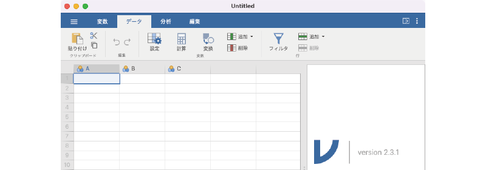
```

:::{.jmvribbon data-latex=""}
+ **Clipboard**（クリップボード）　データのコピー（`r infig('menu-data-copy')`）や貼り付け（`r infig('menu-data-paste')`），切り取り（`r infig('menu-data-cut')`）などに使用します。使い方はWordやExcelなどと基本的に同じです。
+ **Edit**（編集）　操作の取り消し（`r infig('menu-undo')`），やり直し（`r infig('menu-redo')`）を行います。
+ **Variables**（変数）　変数の設定や変数値の処理に使用するツール群です。
    - `r infig('menu-variable-edit')` Setup（設定）　データの種類や変数名の設定を行います。
    - `r infig('menu-compute')` Compute（計算）　すでにある変数値から新たな変数を作成します
    - `r infig('menu-data-transform')` Transform（変換）　すでにある変数値に変換を適用して新たな変数を作成します。
    - `r infig('menu-variable-add')` Add（追加）　スプレッドシートの選択位置に変数（列）を挿入（`r infig('menu-variable-insert')` Insert）または列の最後に追加（`r infig('menu-variable-append')` Append）します。
    - `r infig('menu-variable-remove')` Delete（削除）　スプレッドシート上で選択した変数（列）を削除します。
+ **Rows**（データ行）　データ行の追加や削除に使用するツール群です。
    - `r infig('menu-data-filter')` Filters（フィルタ）　特定の条件に適合する行のみ表示させたい場合（男性のみ，女性のみ，など）に使用します。
    - `r infig('menu-row-add')` Add（追加）　選択部分にデータ行を挿入（`r infig('menu-row-insert')`）または最後の行にデータ行を追加（`r infig('menu-row-append')`）します。
    - `r infig('menu-row-remove')` Delete（削除）　選択行を削除します。
:::

変数操作に関するボタン群，データ行の編集に関するボタン群の詳しい使い方については「[データ変数](#sec:data-handling)」の操作のところで説明します。

#### Analyses：分析タブ {-#subsubsec:analyses-tab}  
Analysesタブには，統計分析のためのツールボタンが並んでいます（図\@ref(fig:analyses-tab)）。


```{r analyses-tab, fig.cap='Analyses（分析）タブのツールボタン', echo=FALSE}

```

:::{.jmvribbon data-latex=""}
+ `r infig('analysis-descriptives')` Exploration（探索）　平均値などの基本統計量の算出やグラフの作成に使用します（第\@ref(ch:exploration)章）
+ `r infig('analysis-ttest')` T-Tests（t検定）　1つあるいは2つの平均値の差の検定を行います（第\@ref(ch:ttests)章）
+ `r infig('analysis-anova')` ANOVA（分散分析）　3つ以上の平均値の差の検定を行います（第\@ref(ch:ANOVA)章）
+ `r infig('analysis-regression')` Regression（回帰分析）　回帰分析と呼ばれる手法を用いて変数間の関係を分析します（第\@ref(ch:regression)章）
+ `r infig('analysis-frequencies')` Frequencies（度数分析）　$\chi^{2}$（カイ二乗）検定など，度数・比率の検定を行います（第\@ref(ch:frequencies)章）
+ `r infig('analysis-factor')` Factor（因子分析）　因子分析を実施します（第\@ref(ch:factor)章）
:::

このように，分析タブのツールは分析手法ごとに非常にわかりやすく整理されています。また，これらの基本メニューに加え，画面の一番右には「`r infig('analysis-more')`Modules（モジュール）」というツールもあります。これはjamoviにさらに高度な機能を追加したい場合に使用します^[jamovi 1.8以降のバージョンでは，さまざまな散布図を作成するための`scatr`というモジュールが標準でインストールされており，このモジュールをオンにするとExplorationツールに「Scatterplot(散布図)」と「Pareto Chart（パレート図）」いうメニュー項目が追加されます。これらの項目については，本書では省略します。]。

これら分析ツールの使用方法については，「分析編」で詳しく説明します。

#### Edit：編集タブ {-#subsubsec:edit-tab}  
Editタブには，フォントや段落の設定など，編集に関連したツールボタンが並んでいます（図\@ref(fig:edit-tab)）。

```{r edit-tab, fig.cap='Edit（編集）タブのツールボタン', echo=FALSE}

```

:::{.jmvribbon data-latex=""}
+ Clipboard（クリップボード）　Dataタブのボタンと同じです。
+ Edit（編集）　**Data**タブのボタンと同じです。
+ Font（書体）　文字を太字にしたり，斜体にしたりする際に使用します。
+ Paragraph（段落）　文字全体を中央揃えにしたり，箇条書きにしたりなど，段落の書式を変更する際に使用します。
+ Insert（挿入）　メモに数式を含めたい場合に使用します。数式はTeX形式で記述します^[厳密には[KaTeX](https://katex.org/docs/supported.html)というシステムの書式を使用しています。]。 
+ Styles（スタイル）　その他の文書スタイルを設定するためのツールボタン群です。
  - `r infig('edit-code')` Code-Block（コードブロック）　メモ中に分析プログラムを記載したい場合に使用します。
  - `r infig('edit-heading')` Heading（見出し）　指定した部分を「見出し」行にしたい場合に使用します。
  - `r infig('edit-link')` Link（リンク）　メモにリンクを挿入したい際に使用します。
:::

これらのボタンは，いずれも出力ウィンドウの内容を編集してメモを作成する際に用いられるものです。

## Data Variable：データ変数 {#sec:data-handling}

jamoviが扱う*変数*には，「*Data Variable*（データ変数）」，「*Computed Variable*（計算変数）」，「*Transformed Variable*（変換変数）」の３種類があります。このうち，もっとも基本的で重要なものがテータ変数です。ここではまず，データ変数を用いてjamoviにおけるデータの操作方法を見ていきましょう。

データ変数は，調査や実験で得られた測定値（データ値）を格納するための変数で，jamoviにおける分析の基本となるものです。データファイルから読み込んだ値は，すべてデータ変数として扱われます。また，データ変数の値はスプレッドシートに直接入力することもできます。

データファイルからデータを読み込む方法についてはすでに第\@ref(ch:introduction)章の「[ファイル操作](#sec:intro-file)」で説明しましたので，ここではスプレッドシートを用いたデータの編集方法について見ておきましょう。


### スプレッドシートでの入力{#sub:basics2-spreadsheet}

スプレッドシートでの入力は，Excelの操作によく似ています。入力したいセル（マス目）をマウスクリックし，キーボードから値を入力するだけです。入力後，「Enter」キーまたは「↓」キーを押すと次の値が入力できるようになります。

基本的に，統計処理をするデータは各行が1人分（あるいは1試行分）の測定値で，各列はさまざまな変数（参加者番号や年齢，性別など）となります。なお，jamoviを起動した直後の画面にはＡ，Ｂ，Ｃの3つの変数しかありませんが，4列目以降にも値を入力することができます。空白の列に値を入力すると，その列は新たなデータ変数として扱われます。

では，実際にスプレッドシートにデータを入力してみましょう。ここでは表\@ref(tab:basics-datavariable-sampledata)のデータを用いることにします。

```{r basics-datavariable-sampledata}

data<-data.frame(
  ID = c(1,2,3),
  性別 = c('男','女','男'),
  年齢 = c(18,19,19),
  身長 = c(175,158,172),
  体重 = c(70,45,62)
  )

data %>% 
  kable(align="ccccc", caption = "サンプルデータ",booktabs=T) #%>%
#  row_spec(0, background = bgcolor) # %>%
#  row_spec(1:3, background = "#EFF3F9")
```


スプレッドシートの1列目（Aの列）にIDの値，2列目に性別の値を入力してください。なお，性別については「男」を「1」，「女」を「2」として入力してください。また，3列目から5列目には「年齢」，「身長」，「体重」の値をそれぞれ入力しましょう。変数名は後で設定しますので，ここでは数値を入力するだけです。

入力が終わった状態では，画面は図\@ref(fig:data-sample-data)のようになっているはずです。

```{r data-sample-data, fig.cap='データ変数の入力例',echo=F, fig.align='center'}

```

このように，jamoviではExcelなどの表計算ソフトを操作する感覚で簡単にデータ入力を行うことができます。

### 行・列の編集{#sub:basics-data-variable-row-edit}

今度は，入力済みデータを行・列の単位で編集する方法についてみてみましょう。jamoviでは，データの行と列はそれぞれ異なった意味をもちますので，追加・削除のメニューは行と列のそれぞれに別々に用意されています（図\@ref(fig:edit-row-col)）。

```{r edit-row-col, fig.cap='行・列の編集',echo=F, fig.align='center'}
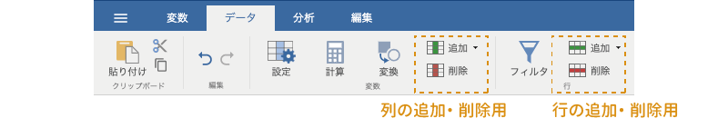
```

#### 行の編集 {-}

基本的に，jamoviではスプレッドシートの行は「参加者1人分のデータ」を意味します。つまり，スプレッドシートに25行のデータが入力されていれば，それは参加者25人分のデータがあるということです。

すでに入力されているデータに新たな参加者のデータを追加する場合は単純で，データがまだ入力されていない行にデータを入力するだけです。そうでなく，途中にデータを追加したい場合には，データを挿入したい部分を選択してDataタブの「Rows」にある「Add」から「Insert（挿入）」を選択します（図\@ref(fig:add-row)）。

```{r add-row, fig.cap='行の追加',echo=F, fig.align='center'}
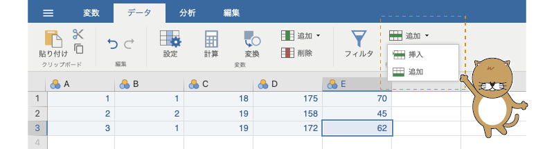
```

なおこの際，「Insert」の代わりに「Append（追加）」を実行すると，データの最後に新しい行が追加されます。

また，不要な行がある場合には，その行を選択し，Dataタブの「Rows」にある「Delete（削除）」を実行します（図\@ref(fig:edit-row-delete)）。

```{r edit-row-delete, fig.cap='行の削除',echo=F, fig.align='center'}

```


なお，これらの操作は，右クリックで表示されるメニューからも行うことができます（図\@ref(fig:add-row-submenu)）。

<!-- ボタンの画面 -->
```{r add-row-submenu, fig.cap='行の追加',echo=F, fig.align='center'}
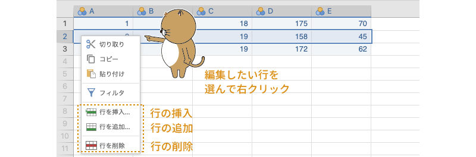
```


#### 列の編集 {-}

jamoviスプレッドシートの列は，*変数*（回答者番号や年齢，性別，回答値，測定値など）として扱われます。列の編集方法も基本的には行の編集方法と同じで，列（変数）を追加・削除したい箇所を選択してから，Dataタブの「Variables」にある「Add（追加）」または「Delete（削除）」を実行するだけです。

ただし，jamoviが扱う変数には「Data Variable（データ変数）」，「Computed Variable（計算変数）」，「Transformed Variable（変換変数）」の3種類がありますので，変数を追加する際にはどの種類の変数を追加するのかを指定しなければなりません（図\@ref(fig:edit-col-add)）。

```{r edit-col-add, fig.cap='列（変数）の追加',echo=F, fig.align='center'}
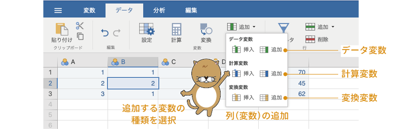
```

なお，jamoviの現在のバージョンでは，変数の順序を並び替えることができません。変数を追加する場合には，追加する場所をよく考えてからにしましょう。

#### データ変数の設定{-#subsubsec:data-data-setup}

空白のスプレッドシートにデータを入力した場合，そのままでは変数名が「A」，「B」，「C」などになっていて，どの列が何のデータなのかがわかりにくいですね。そこで，先ほど入力したデータを用い，基本的な変数設定の方法を見ておきましょう。

「A」列の変数名の部分（「A」の部分）をダブルクリックするか，または「A」列を選択してからツールバーの「`r infig('menu-variable-edit')` Setup（設定）」ボタンをクリックしてください（図\@ref(fig:data-variable-open)）。


```{r data-variable-open, fig.cap='データ変数の設定画面を開く',echo=F, fig.align='center'}
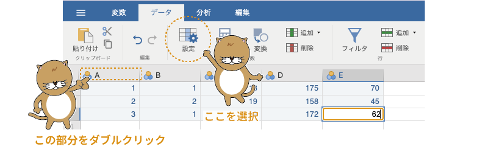
```

すると，データ変数の設定画面が表示されますので（図\@ref(fig:data-variable)），この画面の「DATA VARIABLE（データ変数）」の欄に変数名を入力します。データの1列目には「ID」が入力されているので，変数名は「ID」としておきましょう。

```{r data-variable, fig.cap='データ変数の設定画面',echo=F, fig.align='center'}

```

変数名には日本語を使用することも可能です。ただし，グラフなどの一部の機能で日本語がうまく表示されないことがありますので，そうしたトラブルを避けたければ，変数名はアルファベットと数字の組み合わせにしておいた方がいいでしょう。本書では，わかりやすさを重視して変数名に日本を用いることにします。


その下の「Description（説明）」の欄は，変数の説明を記入する部分です。この欄は分析には影響しませんので，ここは空欄でも構いません。

1列目の変数名の設定が終わったら，画面右横の「`r infig('modules-analyses-arrow-r')`（次へ）」をクリックして2列目以降の変数名も設定しましょう。2列目の変数名は「性別」，3列目以降はそれぞれ「年齢」，「身長」，「体重」としておきます。

##### Measure type（尺度型）{-}

設定画面の「Measure type（尺度型）」は，変数の尺度型の設定です。データ変数には，測定値の尺度水準に応じて次の４つの尺度型があります（図\@ref(fig:data-variable-measure-type)）。

```{r data-variable-measure-type, fig.cap='データ変数の尺度型',echo=F, fig.align='center'}
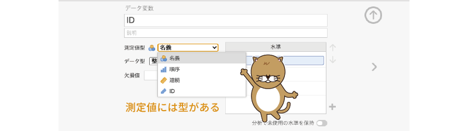
```

:::{.jmvsettings data-latex=""}
+ `r infig('variable-nominal')` Nominal（名義）型　*名義尺度*で測定されたデータです。
+ `r infig('variable-ordinal')` Ordinal（順序）型　*順序尺度*で測定されたデータです。
+ `r infig('variable-continuous')` Continuous（連続）型　*比率尺度*や*間隔尺度*で測定されたデータです。
+ `r infig('variable-id')` ID型　参加者番号など，それぞれのデータを識別するために用いる特殊なデータ型です。
:::

データ変数の尺度型によって使用可能な分析手法が変わってきますので，変数の尺度型は適切に設定しましょう。なお，それぞれの変数がどの尺度型として扱われているのかについては，スプレッドシートの変数名の横にあるアイコンで確認することもできます。

データ1列目の`ID`変数は個人を特定するための番号ですので，尺度タイプは「`r infig('variable-continuous')` ID」型にしておきましょう。2列目の「性別」変数は「`r infig('variable-nominal')` Nominal」型，「年齢」から「体重」まではすべて「`r infig('variable-continuous')` Continuous」型です。

##### Data type：データ型{-}

データ変数には，さらに「Integer（整数）」，「Decimal（小数）」，「Text（文字）」というデータ型の区別もあります。

「Integer」型は，「1」や「15」など，測定値に小数点以下の値が含まれない場合，「Decimal」型は，「1.5」や「7.49」など，測定値に小数点以下の値が含まれる場合です。この2つのデータ型は画面上の表示方法がやや異なるくらいで本質的な違いはありませんが，「Decimal」型は尺度型が「Continuous（連続）」の場合にしか指定できません。「Text」型は，入力されたデータ値を「数値」としてではなく「文字」として扱います。「Text」型を指定できるのは，「`r infig('variable-nominal')` Nominal」型または「`r infig('variable-ordinal')` Ordinal」型の場合のみです。

ほとんどの場合，データ型についてはjamoviが自動的に判定してくれますので，設定の必要はないでしょう。何からの理由でデータ型を指定したい場合，データ変数の測定型と指定できるデータ型の関係は表\@ref(tab:measure-data-type)の通りです。

```{r, echo=FALSE, message=FALSE}
  data <- data.frame(
    a = c('×','○','○'),
    b = c('○','○','○'),
    c = c('○','○','×')    
  )
  names(data)<-c('Decimal（小数型）','Integer（整数型）','Text（文字型）')
  row.names(data)<-c('Nominal（名義型）','Ordinal（順序型）','Continuous（連続型）')
  data %>% 
  kable(align='ccc', caption = "データ変数の測定型とデータ型 \\label{tab:measure-data-type}", booktabs=T) #%>%
#  row_spec(0, background = bgcolor) # %>%
```


##### Missing values：欠損値{-#Missinmissin}

「Missing values（欠損値）」の欄では，データ中の欠損値の指定を行います。たとえば，1〜5の５段階尺度で得られたデータで未回答の部分を「9」として入力したようなデータの場合には，ここで「9」を欠損値として指定することができます。

今回のサンプルデータには欠損値はありませんので，ここは空欄のままにしておいてください。

#### Levels：水準{-#levelslvels}

「Levels（水準）」は，その変数が「`r infig('variable-ordinal')` Ordinal」型あるいは「`r infig('variable-nominal')` Nominal」型の場合に使用できます。たとえば「S・A・B・C・D」の5段階で入力された成績評価データがあったとします。そしてそのデータでは，1人目が「D」，2人目が「A」，3人目が「S」，4人目が「C」というようなものだったとしましょう。この場合，そのままではこの変数値が「D・A・S・C・B」という順で扱われたり，あるいはアルファベット順に「A・B・C・D・S」という順に扱われたりしてしまいます。なぜなら，統計ソフトには成績の良いほうから「S・A・B・C・D」の順であるという知識はないからです。

このような場合には，この「Levels」の右横にある上下矢印で変数値を適切な順番に並べ替えることで，分析においても「S・A・B・C・D」という順が維持されるようになります（図\@ref(fig:data-variable-levels-order)）。

```{r data-variable-levels-order, fig.cap='データ順序の設定',echo=F, fig.align='center'}
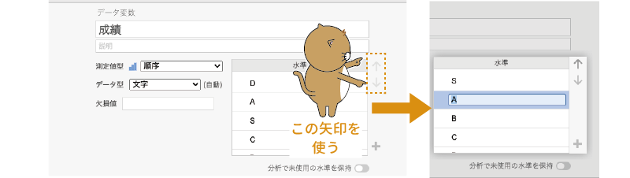
```


また，今回のサンプルデータのように，「性別」の値で男性が「1」，女性が「2」と入力されている場合，分析結果の出力画面には性別の値は入力値のまま「1」や「2」と表示されるのですが，「1」や「2」という表示ではどちらが男性でどちらが女性なのかがわかりづらいですね。もし，男女をとり違えて結果を解釈してしまったら大変です。

そのような場合，この「Levels」の「1」の欄に「男」，「2」の欄に「女」と入力し，それぞれの値に*変数ラベル*をつけることができます。そうすると，データ画面上や結果の表示では性別データの「1」が「男」，「2」が「女」と表示されるようになり，男女のとり違えといったミスを防ぐことができるのです（図\@ref(fig:data-variable-levels)）。

```{r data-variable-levels, fig.cap='変数ラベルの設定',echo=F, fig.align='center'}
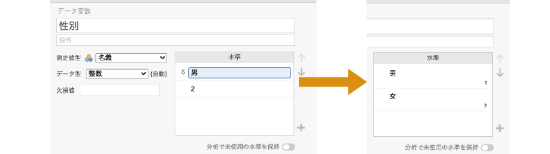
```

このようにして変数ラベル設定した場合，本来の変数値は「Levels」欄の右下で確認できます。

なお，その下にある「Retain unused levels（未使用の水準を保持）」のスイッチを「オン」にした場合，データの修正などによって特定の水準値を含む行の数が0になった場合にもその水準値が保持されます。ここを「オフ」にした場合には，データ中に含まれていない水準値は「Levels」から削除されます。

```{=latex}
\clearpage
```

さて，これでサンプルデータの入力と設定は完了です。変数の設定画面を閉じるとスプレッドシートは図\@ref(fig:data-sample-data-complete)のようになっているはずです。

```{r data-sample-data-complete, fig.cap='データの入力と設定が終わった後の画面',echo=F, fig.align='center'}

```


## Computed Variable：計算変数{#sec:basics-computed-variable}

実際のデータ分析では，複数の質問項目の回答値から参加者ごとに合計得点を算出したり，平均値を算出したりして，それをデータとして使用する場合が多々あります。このように，他の変数値を用いた計算の結果を新たな変数値として使用するのが「Computed Variable（計算変数）」です。

### 計算変数の作成 {#sub:basics-computed-variable-new}

先ほど作成したデータを使って計算変数の作成方法について見てみましょう。ここでは，身長と体重のデータから，一人一人のBMI値（体格指数）を算出することにします。


計算変数を使用するには，スプレッドシートで列名が空欄になっている部分をダブルクリックするか，その列を選択してツールバーの「`r infig('menu-variable-edit')` Setup（設定）」ボタンをクリックします。すると，図\@ref(fig:data-new-variable)のような変数作成画面が表示されますので，ここで「NEW COMPUTED VARIABLE（新規計算変数）」のボタンをクリックします。

```{r data-new-variable, fig.cap='新規に変数を作成する',echo=F, fig.align='center'}

```

あるいは，ツールバーの「`r infig('menu-compute')` Compute（計算）」ボタンをクリックすると，新しい列に計算変数が作成されて変数設定画面になります。

計算変数の設定画面は図\@ref(fig:data-computed-variable)のようになっています。変数名と説明の部分はデータ変数の場合と同じです。この計算変数の変数名は「BMI」としておきましょう。

```{r data-computed-variable, fig.cap='計算変数の設定画面',echo=F, fig.align='center'}
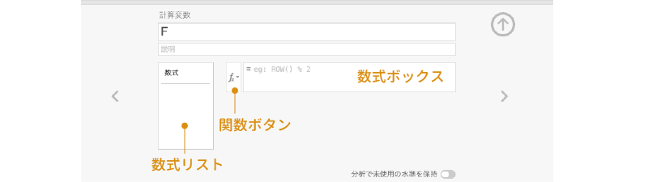
```


その下の部分はデータ変数の場合とはだいぶ違いますね。計算変数は，この設定画面の中央，数式ボックスの「=」の後ろに計算式を入力して値を設定します。

### 計算変数の設定 {#sub:basics-computed-variable-setting}

では，早速BMI値を計算変数として設定しましょう。数式ボックスに計算式を入力します。BMIの値は，次のようにして求められます。

\[
\text{BMI} = \text{体重(kg)} \div (\text{身長(m)})^2
\]

これを入力式の形に直すと「= 体重 / (身長/100)^2」になります。BMIの式では身長はメートルで計算する必要がありますので，センチメートルで記録されている身長データを100で割ってメートルに変換するのを忘れないようにしてください。数式ボックスの「=」の後ろの部分をクリックし，この式を入力します。

このとき，変数名の入力ミスなどがあるとエラーになってしまいますので注意してください。変数名の入力ミスを防ぐには，数式ボックスのすぐ左隣にある「関数ボタン（`r infig('filters-formula')`）」を使うのがよいでしょう。この部分をクリックすると，「Functions（関数）」と「Variables（変数）」という画面が表示されます（図\@ref(fig:data-computed-variable-function)）。左側の「Functions」の部分は，平均値などの計算用の関数のリストで，それぞれの関数名をクリックするとその関数簡単な説明が下側に表示されるようになっています。

```{r data-computed-variable-function, fig.cap='計算変数の作成結果',echo=F, fig.align='center'}
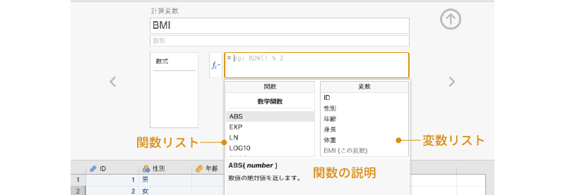
```

ここでは関数は使用しませんが，「Functions」の関数は，複数の質問項目の回答値を平均して合成得点を求めたりする場合に役立ちます。なお，計算変数に使用できる関数は，以下のグループに分類されています。これらの関数の詳細については[付録](#ch:appendix)にまとめてありますのでそちらを参照してください。

:::{.jmvfunctions data-latex=""}
+ **Math**（数学関数）　絶対値（ABS），指数（EXP），対数（LN）など，数学的な計算を行う関数群です。
+ **Statistical**（統計関数）　合計値（SUM），平均値（MEAN）など，基本的な統計量を算出する関数群です。
+ **Logical**（論理関数）　条件に応じて異なる計算を行いたい場合に使用する関数群です。
+ **Text**（文字関数）　文字データを結合したり，数値を文字に変換したりする場合に使用する関数群です。
+ **Reference**（参照関数）　特定の条件に合致するセルを指定して計算を行いたい場合などに使用します。
+ **Misc**（その他）　数値と文字の変換など，その他の処理を行うための関数群です。
+ **Simulation**（シミュレーション）　特定の確率分布をもつデータを擬似的に作成したい場合に使用します。
:::

この画面で，「Variables」にある「体重」をダブルクリックすると，その変数名が数式ボックスに入力されます（図\@ref(fig:data-sample-data-computed)）。こうした機能を使いながら，計算変数の数式を完成させましょう。式を入力し終わったら，キーボードの「エンター（リターン）」キーを押して式を確定させます。


```{r data-sample-data-computed, fig.cap='関数と変数のリスト',echo=F, fig.align='center'}
knitr::include_graphics("images/basics/data-sample-data-computed.png")
```

すると，スプレッドシートの「体重」の横に「BMI」という変数が作成され，そこに各個人のBMI値が入力されます。なお，この計算変数に格納されているのは式だけですので，計算変数の作成後に計算に使われている変数（「体重」と「身長」）の値が変更されると自動的に再計算されて新しい値に更新されます。計算変数は，スプレッドシートでは変数名の欄の右上に黒丸がついた状態で表示されます。

計算変数の計算式を修正したい場合には，計算変数のタイトル部分をダブルクリックするか，修正したい計算変数の列を選択したうえで「`r infig('menu-variable-edit')` Setup」ボタンをクリックしてください。


## Transformed Variable：変換変数{#subsec:tranformed-variable}

質問紙調査のデータで*逆転項目*が複数ある場合，その回答値の逆転処理は計算変数でも可能ですが，逆転項目がたくさんある場合，その1つ1つに対して計算式を入力して計算変数を作成するのは面倒ですし，途中でミスが発生する可能性も増大します。

このように，複数の変数に対して同じ処理を繰り返し実施したい場合には，「Transformed Variable（変換変数）」が便利です。変換変数は，空の列の列名をダブルクリックして変数作成画面を開き，そこで「NEW TRANSFORMED VARIABLE（新規変換変数）」を選択するか，ツールバーの「`r infig('menu-data-transform')` Transfrom（変換）」ボタンをクリックすることで作成できます。

サンプルデータでは変換変数を使う必要性はとくにありませんが，せっかくなので使ってみましょう。ここでは，身長の測定値をセンチメートルからメートルに変換する処理を，変換変数を使って行ってみます。

スプレッドシートで「身長」の列を選択したら，ツールバーの「`r infig('menu-data-transform')` Transfrom」をクリックして変換変数を1つ作成してください。「身長」を選択してから「`r infig('menu-data-transform')` Transfrom」をクリックすると，変数名などが自動で入力された状態で設定画面が開きます（図\@ref(fig:data-transformed-setting)）。


```{r data-transformed-setting, fig.cap='変換関数の設定画面',echo=F, fig.align='center'}
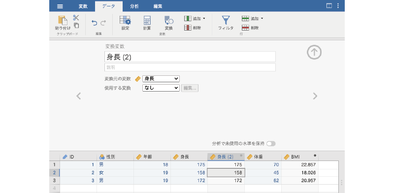
```

変数名は，これがメートル単位の身長だということがわかりやすいように「身長 (m)」としておきましょう。その下の「Source variable」の部分は，変換を適用する変数を指定します（図\@ref(fig:data-transformed-source-select)）。「身長」の列を選択してから変換変数を作成した場合，ここは自動的にその変数が選択された状態になります。もし変換対象とは異なる変数が指定されている場合には，適切な変数を選択してください。

```{r data-transformed-source-select, fig.cap='変換対象の選択',echo=F, fig.align='center'}
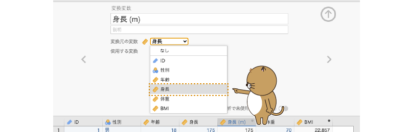
```

変換対象を適切に設定したら，その下の「using transform」の部分で適用する変換を指定します。今はまだ適用できる変換がありませんので，「Create New Transform...（変換の新規作成）」を選択して変換を作成しましょう（図\@ref(fig:data-transformed-transform-select)）。

```{r data-transformed-transform-select, fig.cap='変換の指定',echo=F, fig.align='center'}
knitr::include_graphics("images/basics/data-transformed-transform-select.png")
```

すると，図\@ref(fig:data-transformed-transform)のような設定画面が表示されます。

```{r data-transformed-transform, fig.cap='変換の設定画面',echo=F, fig.align='center'}
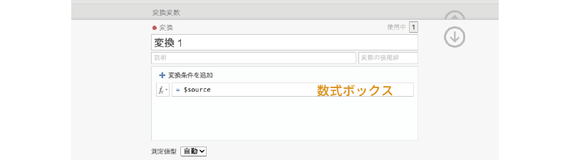
```

最初の部分はこの変換の名前です。再利用する際に便利なように，できるだけわかりやすい名前をつけておきましょう。今回の変換はセンチメートルからメートルへの変換ですので，「cm -&gt; m」という名前にしておきます。

その下の「Description」の部分は変換の説明です。変換名からどのようなことをしているのかがわかるようであればここは空欄で構いませんが，そうでない場合はここに簡単に説明を書いておいたほうがよいでしょう。

この「Description」の隣の「Variable suffix」は，この変換を適用した後の変数名の末尾に自動的につける文字を設定します。ここでは空欄にしておきますが，たとえば逆転項目の逆転処理を行うような変換の場合には，ここに「R」と設定しておけば，「Q1 - R」，「Q2 - R」のように，変換後の変数名として元の変数名（「Q1」や「Q2」など）の末尾に「 - R」をつけた名前が自動的に設定されるようになります。

関数ボタンと数式ボックスの使用方法は計算変数の場合と同じです。必要に応じて関数ボタンで変数名や関数を選択し，数式ボックスの中に変換式を記入します。今回の変換ではセンチメートルで記録された身長のデータをメートルに変換するので，数式ボックス内の式は「\$source / 100」となります（図\@ref(fig:data-transformed-transform-complete)）。なお，「\$source」は変換元の値を意味します。

```{r data-transformed-transform-complete, fig.cap='変換式の作成',echo=F, fig.align='center'}

```


ここでは使用しませんが，変換ボックスのすぐ上にある「Add recode condition（変換条件の追加）」を用いれば，元の値の範囲に応じて異なる変換式を適用するようなこともできます。

変換式が完成したら，「エンター（リターン）」キーで式を確定し，設定画面を閉じてください。

```{r data-transformed-transform-recoded, fig.cap='変換の設定が完了した様子',echo=F, fig.align='center'}
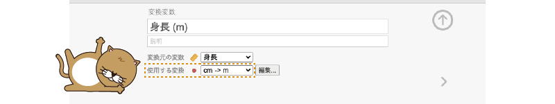
```

すると，「using transform」の部分が先ほど作成した「cm -&gt; m」になっているはずです（図\@ref(fig:data-transformed-transform-recoded)）。この変換変数も，計算変数の場合と同様に，変換元の変数値が変化すると自動的に値が更新されます。また，この変換式は，その右横にある「Edit...（編集）」ボタンをクリックすることで修正可能です。変換変数は，スプレッドシートでは変数名の欄の右上に赤丸がついた状態で表示されます。

変換対象の変数が1つしかない場合には，計算変数と変換変数のどちらを用いてもあまり違いはありませんが，質問紙調査における逆転項目の処理のように，同じ変換を複数の変数に対して適用する場合には，1つの「変換式」を複数の変数に適用できる変換変数のほうが効率的でしょう。

## Filters：データフィルタ{#sec:data-filter}

データ分析では，データ全体のうちの一部だけを使って分析したいということもよくあります。たとえば，男性のデータだけを分析したいとか，小学校低学年の児童のデータだけを分析したいとかいうような場合です。そのような場合，分析のたびに全体のデータファイルから特定の行をとり出し，それを別のデータファイルとして作成するというのも1つの方法ですが，そのような方法はかなり手間がかかりますし，対象データを抜き出す過程でミスが生じる可能性も高くなります。

jamoviには，そのような場合に便利なフィルタ（Filters）と呼ばれる機能が搭載されています。フィルタは条件に合致するデータ行だけを表示し，それ以外を非表示にすることができる機能で，フィルタをオンにしている間は，表示されているデータのみが分析の対象となります。また，フィルタはいつでも簡単にオン・オフの切り替えができますので，男女別や学年別にデータファイルを別々にしなくても，フィルタを使えば男女別の分析や特定の学年のみを対象とした分析が簡単に実行できるのです。

では，これまでに使用してきたサンプルのデータを用いてフィルタを体験してみましょう。ここでは，フィルタを使って男性のデータだけを抽出してみます。

フィルタを使用するには，ツールバーの「`r infig('menu-data-filter')` Filters（フィルタ）」をクリックします。すると，図\@ref(fig:data-filter-setting)のような設定画面が表示されます。

```{r data-filter-setting, fig.cap='フィルタの設定画面',echo=F, fig.align='center'}

```

設定画面の左側にある十時のボタン（`r infig('filters-add')`）はフィルタの追加ボタンです。フィルタは必要に応じて複数設定することができます。その下の目の形をしたアイコン（`r infig('filters-visible')`）は，フィルタにあてはまる行だけを表示させるかどうかを切り替えるボタンです。

画面中央の部分がフィルタの条件式を設定する部分で，最初の関数ボタンとボックスは計算変数や変換変数の場合と基本的には同じです。ただ，ここには計算式ではなく，表示させるデータの条件を示す式を記入します。条件式を複数使用したい場合は，ボックスの右側にある小さいほうの「（`r infig('filters-add')`）」ボタンをクリックすると条件式を追加できます。

その下の「Description」の部分は，そのフィルタについての説明欄です。後から見返したときにそのフィルタが何のためのものなのかがわからなくならないように，説明をきちんと書いておきましょう。条件式ボックスの右上にあるのは，そのフィルタのオン・オフの切り替えスイッチとフィルタの削除ボタンです。

では，男性のデータだけを表示させるフィルタを作成しましょう。条件式のボックスに「`性別 == 1`」と入力してください。このとき，「性別」と「1」の間の等号（=）は2つ連続で入力する必要がある点に注意してください。式を入力して確定すると，スプレッドシートの表示が図\@ref(fig:data-filter-gender)のようになります。

```{r data-filter-gender, fig.cap='男性フィルタの設定後',echo=F, fig.align='center'}
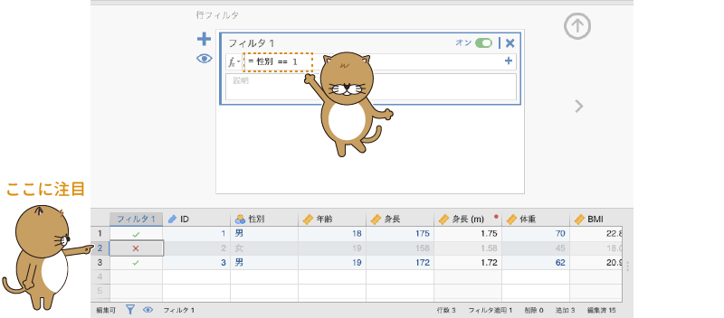
```

「Filter 1」の列に「`r infig('correct')`」が表示されているのがこのフィルタの条件にあてはまるデータ行，「`r infig('incorrect')`」が表示されているのがフィルタにはあてはまらないデータ行です。見てわかるように，性別が「男」の行だけ「`r infig('correct')`」になっています。また，フィルタ設定画面あるいはスプレッドシート下部にある`r infig('filters-visible')`アイコンをクリックすると，フィルタにあてはまらない行を非表示にすることができます（図\@ref(fig:data-filter-on-off)）。

```{r data-filter-on-off, fig.cap='フィルタ表示方法の変更',echo=F, fig.align='center'}

```

フィルタ設定画面の条件式ボックス右上にあるスイッチでは，フィルタのオン・オフをフィルタごとに個別に切り替え可能です。フィルタを使用しない場合は，忘れずに「inactive（オフ）」にしておきましょう。

なお，「20代の女性で〜な人のみ」というような複雑な条件でデータを抽出する場合は，複雑な条件式のフィルタを1つ作るよりも，「20代の女性」，「〜な人」というシンプルなフィルタを作成し，それらを組み合わせて使用するほうがよいでしょう。そうすることで，思い通りの結果が得られない場合にどのフィルタ条件がおかしいのかを簡単に突き止められるようになります。

## Exercise：調査票データの処理{#sec:practice-handling}

ここまで，jamoviにおけるデータ操作方法の基本について一通り見てきましたので，ここでは実際の分析場面により近い形で実践してみましょう。まず，練習用データファイル（[basics_data01.omv](https://github.com/sbtseiji/jmv_compguide/raw/main/data/omv/basics_data01.omv)）をjamoviで開いてください。


```{r}
data01<-read.csv('data/basics_data01.csv')

# ID
attributes(data01$ID)$`jmv-id`<-TRUE

# 連続変数
attributes(data01$年齢)$measureType<-c('Continuous')
attributes(data01$Q1)$measureType<-c('Continuous')
attributes(data01$Q2)$measureType<-c('Continuous')
attributes(data01$Q3)$measureType<-c('Continuous')
attributes(data01$Q4)$measureType<-c('Continuous')
attributes(data01$Q5)$measureType<-c('Continuous')
attributes(data01$Q6)$measureType<-c('Continuous')
attributes(data01$Q7)$measureType<-c('Continuous')

# 離散変数
data01$性別<-factor(data01$性別)
attributes(data01$性別)$levels<-c('女','男')
attributes(data01$性別)$values<-c(1,2)
attributes(data01$性別)$measureType<-c('Nominal')

out<-jmvReadWrite::jmvWrite(data01,'data/omv/basics_data01.omv')

```


```{r basics-exercise, fig.cap='練習用データファイル',echo=F, fig.align='center'}
knitr::include_graphics("images/basics/exercise.png")
```

このデータファイルには，「ID」，「年齢」，「性別」の各変数値と，「Q1」から「Q7」までの回答値が入力されています（図\@ref(fig:basics-exercise)）。「Q1」から「Q7」は，それぞれ「外向性」を測定する心理尺度の回答データで，いずれも「まったくそう思わない(1)」から「とてもそう思う(7)」までの7段階で回答されています。

この練習データを用い，調査票データの分析場面でよく用いられる次の処理について実践してみましょう^[1.8.0以降のバージョンでは，ここでとりあげる3つの処理のうち，最初の2つについてはjamoviの分析ツールを使用して行うこともできます。]。

* 逆転項目の処理を行う
* 尺度得点を算出する
* 尺度得点に基づいて対象者をグループに分割する


### 逆転項目の処理 {#sub:basics-reverse-items}

一般に，リカート法^[各質問文に対し「あてはまらない」，「どちらでもない」，「あてはまる」など，複数の段階で回答させて数量化する方法]などを用いた心理尺度では，1つの測定概念について複数の質問を用意して測定を行います。たとえば，「外向性」を測定したい場合には，「初対面の人とでも会話を楽しめる」や「いろんな人と出会うのは楽しい」といった，外向性の高さに関連する質問文を複数用意して，そのすべてに「まったくそう思わない(1)」から「とてもそう思う(7)」の7段階で回答させるということを行うわけです。

この際，それらの質問文の中には「よく知らない人との交流は苦手だ」のような，外向性の高さとは逆の内容の文が含まれていることがあります。このように，本来測定したいものとは逆の内容を含む質問文のことを*逆転項目*といいます（図\@ref(fig:basics-exercise-reverse)）。

```{r basics-exercise-reverse, fig.cap='逆転項目',echo=F, fig.align='center'}

```


練習用データでは質問文の内容がわかりませんが，ここでは仮に，偶数番号の質問（Q2，Q4，Q6）が逆転項目だったとしましょう。この場合，「Q1」や「Q3」の質問に対して`6`や`7`と回答した人は外向性が高いことになるのですが，「Q2」や「Q4」に「6」や「7」と回答した人は外向性が低いことを意味します。このように，逆転項目は他の項目とは点数の方向が逆になるため，その扱いには注意が必要です。通常，こうした逆転項目の回答値は，それ以外の回答値と向きがそろうように変換したうえで分析に用います。

jamoviでは，逆転項目は「Computed Variable（計算変数）」または「Transformed Variable（変換変数）」を用いて処理することができます。どちらを用いても構いませんが，逆転項目が複数ある場合には，変換変数を用いたほうが手軽に処理できるでしょう。そこで，ここでは変換変数を用いて逆転項目を処理することにします。


#### 「変換変数」の作成{-}

それでは，「Q2」について逆転項目の処理を行いましょう。ここでは，「Q2」のすぐ後ろに，回答値を逆転した変換変数「Q2.R」を作成します。

まず，「Q2」の列名のところをクリックして，「Q2」の列を選択します（図\@ref(fig:basics-exercise-select-col)）。

```{r basics-exercise-select-col, fig.cap='列の選択',echo=F, fig.align='center'}

```


その状態でDataタブの「Variables」にある「`r infig('menu-data-transform')`  Transform」ボタンをクリックします（図\@ref(fig:basics-exercise-add-transform)）。

```{r basics-exercise-add-transform, fig.cap='変換変数の追加',echo=F, fig.align='center'}

```


すると，図\@ref(fig:basics-exercise-set-transform)のような変換変数の設定画面が表示されますので，作成した変換変数の名前を「Q2.R」に設定しましょう。このとき，「Source variable」の部分が「Q2」になっていることを確認してください。

```{r basics-exercise-set-transform, fig.cap='変換変数名の設定',echo=F, fig.align='center'}

```

次に，「using transform」のメニューから「Create New Transform...」を選択して実行します（図\@ref(fig:basics-exercise-using-transform)）。

```{r basics-exercise-using-transform, fig.cap='「変換」の作成',echo=F, fig.align='center'}

```

すると，図\@ref(fig:basics-exercise-transform-name)のような「TRANSFORM（変換）」の設定画面が表示されます。再利用の際にわかりやすいように，この変換の名前を「逆転項目」にしましょう。

```{r basics-exercise-transform-name, fig.cap='変換名の設定',echo=F, fig.align='center'}
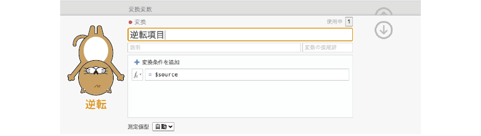
```

そして「Add recode condition」の数式ボックスに逆転のための変換式を設定します。

5段階尺度や7段階尺度の場合，逆転項目の変換式は次の形で求めることができます。

\[
\text{逆転項目の回答値} = (\text{回答段階の最大値}+\text{回答段階の最小値}) - \text{元の回答値}
\]

練習データでは，「Q2」は「1」から「7」までの値で回答してもらう形式ですので，逆転項目を処理する際の変換式は次のようになります。

\[
\text{逆転項目の回答値} = (7+1) - \text{元の回答値} = 8 - \text{元の回答値}
\]

そこで，変換式の部分を次のように設定します（図\@ref(fig:basics-exercise-transform-formula)）。

:::{.jmvformula data-latex=""}
= 8 - $source
:::

```{r basics-exercise-transform-formula, fig.cap='変換式の設定',echo=F, fig.align='center'}
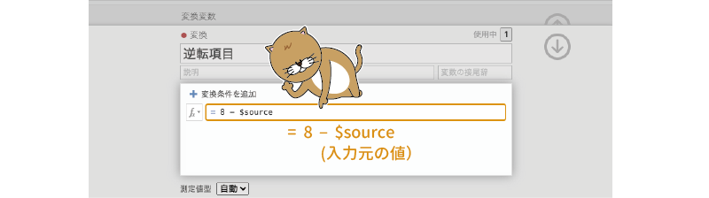
```


画面右側の`r infig('action-back-circle-d')`をクリックして変換の設定画面を閉じ，`r infig('action-back-circle-u')`で変数設定画面を閉じると，「Q2」のすぐ後ろの列に「Q2.R」という変換変数が作成されていることが確認できます
（図\@ref(fig:basics-exercise-trans-q2)）。この変数が変換変数であることは，変数名の部分の右肩に小さな赤丸がついていることから判断できます。

この変数の値を確認すると，「Q2」の値が「1」の場合には「Q2.R」は「7」，「Q2」の値が「7」の場合には「Q2.R」は「1」というように，値が逆転しているのがわかると思います。

```{r basics-exercise-trans-q2, fig.cap='作成した変換変数とその目印',echo=F, fig.align='center'}

```

`Q2`の逆転処理はこれでおしまいです。次は「Q4」の逆転処理を行いましょう。「Q4」の列を選択して「`r infig('menu-data-transform')`  Transform」をクリックすると，再び変換変数の設定画面が表示されます。新しく作成した変換変数の名前を「Q4.R」に設定したら，「Source variable」の部分が「Q4」になっていることを確認し，「using transform」のメニューをクリックしてください。すると，メニュー項目の中に，先ほど作成した「逆転項目」があるはずです
（図\@ref(fig:basics-exercise-set-transform-q4)）。

```{r basics-exercise-set-transform-q4, fig.cap='作成済みの変換を他の変数に適用',echo=F, fig.align='center'}
knitr::include_graphics("images/basics/exercise-set-transform-q4.png")
```


この「逆転項目」を選択して変数設定画面を閉じれば「Q4」の逆転処理は完了です。このように，一度作成した変換式は繰り返し利用できますので，逆転項目が複数ある場合には変換変数で逆転処理を行うのが便利です。

先ほどと同様の手順で，「Q6」についても逆転処理を行ってください。これで逆転項目の処理はおしまいです。


### 尺度得点の算出 {#sub:basics2-scale-score}

「外向性」などの単一の概念について複数の質問文を用いて測定する場合には，それら複数の質問文に対する回答値を合計または平均し，それを*尺度得点*として用いるのが一般的です。ここでは，「Q1」から「Q7」までの回答の合計値を尺度得点として算出することにしましょう。なお，その際，「Q2」や「Q4」などの逆転項目については逆転処理を行った後の変数値（「Q2.R」や「Q4.R」など）を用いる必要がある点に注意してください。

この「外向性尺度」の尺度得点は，データの一番最後の列に新たな計算変数として作成しましょう。Dataタブの「Variables」にある「`r infig('menu-variable-add')` Add（追加）」を使用して，新たな「Computed Variable（計算変数）」を「`r infig('menu-computed-append')` Append（追加）」してください
（図\@ref(fig:basics-exercise-add-compvar)）。

```{r basics-exercise-add-compvar, fig.cap='計算変数の追加',echo=F, fig.align='center'}

```


作成された計算変数の変数名部分をダブルクリックすると，変数の設定画面が表示されます。変数名は「N」になっているかと思いますが，このままだと何の値か分からないので，変数名を「外向性」に変更します
（図\@ref(fig:basics-exercise-gaiko)）。

```{r basics-exercise-gaiko, fig.cap='計算変数の名前を設定',echo=F, fig.align='center'}

```


変数名の設定ができたら，その下の計算式の部分に，変数値を合計するための式を入力します。ここでは尺度得点として回答値の合計を用いるので，関数ボタン（`r infig('filters-formula')`）で表示される関数の中から「SUM」を探してダブルクリックします
（図\@ref(fig:basics-exercise-sum)）。この「SUM」という関数は，括弧の中に指定された値の合計値を求める関数です^[尺度得点に平均値を用いる場合には，「MEAN」関数を使用します。これらの関数の詳細については，付録を参照してください。]。

```{r basics-exercise-sum, fig.cap='関数一覧からSUM関数を入力する',echo=F, fig.align='center'}
knitr::include_graphics("images/basics/exercise-sum.png")
```

数式ボックスの中に「`= SUM()`」と入力されているのを確認したら，括弧の間に合計対象となる変数を記入していきます。この際，変数名はキーボードから入力してもよいですが，関数の右側に表示される変数一覧から必要な変数名をダブルクリックして入力したほうが，タイプミスの心配もなく，わかりやすいでしょう。今回，合計値の対象となるのは，「Q1」，「Q2.R」，「Q3」，「Q4.R」，「Q5」，「Q6.R」，「Q7」の7つの変数です。各変数の区切りにはコンマ（,）を使用します。変数名を1つ入力したら，日本語入力はオフにした状態でコンマ（,）を入力し，次の変数名を入力するようにしてください。

完成した外向性得点の算出式は次のようになります
（図\@ref(fig:basics-exercise-sum-complete)）。

:::{.jmvformula data-latex=""}
= SUM(Q1,Q2.R,Q3,Q4.R,Q5,Q6.R,Q7)
:::

```{r basics-exercise-sum-complete, fig.cap='SUM関数を完成させる',echo=F, fig.align='center'}

```


式の入力が終わったら，画面右の`r infig('action-back-circle-u')`をクリックして変数設定画面を閉じます。これで各対象者の外向性得点（合計値）が算出されました
（図\@ref(fig:basics-exercise-sumscore)）。

```{r basics-exercise-sumscore, fig.cap='算出された外向性得点',echo=F, fig.align='center'}

```


### グループへの分割 {#sub:basics2-split-groups}

実際の分析場面では，算出された尺度得点を元に，対象者を外向性が高い群と低い群に分けて分析するといったこともよく行われます。ここでは，外向性得点の平均値を基準に，平均値以上の人を外向性「高群」，平均値未満の人を外向性「低群」としてグループ分けする方法についてみていきます。

対象者を外向性の高・低2群に分割した結果は計算変数に格納しますので，「Variables」の「`r infig('menu-variable-add')` Add（追加）」から，新たな「Computed Variable（計算変数）」を「`r infig('menu-computed-append')` Append（追加）」してください
（図\@ref(fig:basics-exercise-grouping)）。

```{r basics-exercise-grouping, fig.cap='グループ分け用の計算変数を追加',echo=F, fig.align='center'}

```


そして新しく作成した計算変数の設定画面を開き，変数名を「群」に変更しましょう
（図\@ref(fig:basics-exercise-group-name)）。

```{r basics-exercise-group-name, fig.cap='計算変数の名前を`Group`に設定',echo=F, fig.align='center'}
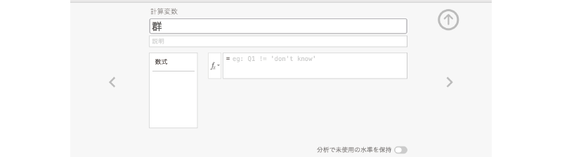
```

続いて，数式ボックスにグループ分けのための式を入力します。関数ボタン（`r infig('filters-formula')`）で表示される関数一覧の中から，「IF」を選択してください
（図\@ref(fig:basics-exercise-group-if)）。このIF関数は，条件式の結果に応じて異なる値を設定できる関数です。

```{r basics-exercise-group-if, fig.cap='計算式でIF関数を使用',echo=F, fig.align='center'}

```

この「IF( )」の括弧の中には，次のように「条件式」，「条件式にあてはまる場合の値」，「条件式にあてはまらない場合の値」の3つをコンマで区切って指定します。

```
IF(条件式, あてはまる場合の値, あてはまらない場合の値)
```

今回は，外向性得点の平均値を基準にして対象者を外向性高群と低群の2群に分割したいので，「条件式」の部分には各対象者の外向性得点が平均値以上であるかどうかを判断する式（\(\text{外向性得点} \geqq \text{外向性得点の平均値}\)）を記入することになります。

そこでまず，変数名一覧から「外向性」をダブルクリックして括弧内に入力し，続けてキーボードから`>=`と入力します
（図\@ref(fig:basics-exercise-group-if-formula)）。

```{r basics-exercise-group-if-formula, fig.cap='条件式の入力',echo=F, fig.align='center'}
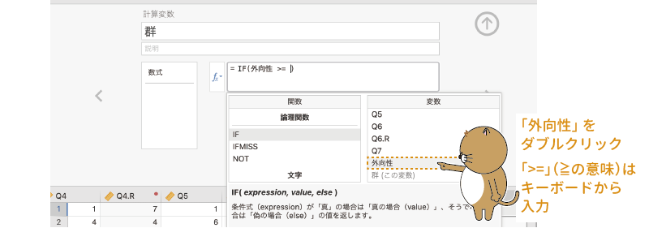
```

さらに，関数一覧から「VMEAN」を選択して入力します
（図\@ref(fig:basics-exercise-group-vmean)）。この「VMEAN」は，指定した変数の平均値を算出する関数です^[平均値を算出する関数には「MEAN」と「VMEAN」の2つがありますが，「MEAN」は複数の変数値の平均値を「各対象者ごと」に計算するのに対し，「VMEAN」は1つの変数値について「対象者全体」での平均値を算出する点が異なります。]。

```{r basics-exercise-group-vmean, fig.cap='全体の平均値の算出式を入力',echo=F, fig.align='center'}

```


そしてこの「VMEAN」関数の括弧の中に「外向性」を指定します
（図\@ref(fig:basics-exercise-group-vmean-gaiko)）。

```{r basics-exercise-group-vmean-gaiko, fig.cap='平均値を算出する変数を指定',echo=F, fig.align='center'}

```


この「`Gaiko >= VMEAN(Gaiko)`」の式が，「\(\text{外向性得点} \geqq \text{外向性得点の平均値}\)」を意味します。この条件式に続けて，条件式にあてはまる場合の値として「高群」，あてはまらない場合の値として「低群」を，それぞれコンマ（,）で区切って入力します
（図\@ref(fig:basics-exercise-group-if-full)）。このとき，変数値に「高群」や「低群」のような文字を用いる場合には，その値を引用符（""）で括る必要がありますので注意してください。

```{=html}
<pre><code>
=IF(Gaiko >= VMEAN(Gaiko),"高群","低群")
</code></pre>
```

```{=latex}
\begin{jmvgray}
  \verb|=IF(Gaiko >= VMEAN(Gaiko),"高群","低群")|
\end{jmvgray}
```

```{r basics-exercise-group-if-full, fig.cap='グループ分けの式を完成させる',echo=F, fig.align='center'}

```

式を完成させて変数設定画面を閉じると，新しく作成した「群」変数に「高群」または「低群」が値として入力されているのを確認することができます
（図\@ref(fig:basics-exercise-group-var)）。条件式の部分がやや難しく感じられたかもしれませんが，計算変数ではこのようにしてデータをグループ分けすることもできるのです。

```{r basics-exercise-group-var, fig.cap='グループ分けの変数の完成',echo=F, fig.align='center'}
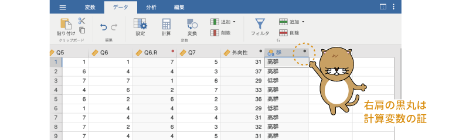
```

このような，逆転項目の回答値の処理や尺度得点の算出，グループ分けといった処理は，Excelなどの表計算ソフトで行うこともできますし，そのほうが簡単だと思う人もいるかもしれません。しかし，表計算ソフトで処理をした場合，元のデータに入力ミスが見つかったなどの理由でデータに修正が生じた際には，これらの処理をやり直さなければなりません。

これに対し，jamoviでこれらの処理を行った場合には，仮に元のデータに修正が生じたとしても，計算変数や変換変数の値は自動的に最新の内容に更新されるため，計算し直す必要がありません。分析データを確実に最新の状態に保てることは，jamoviでデータ処理を行う大きな利点といえます。

