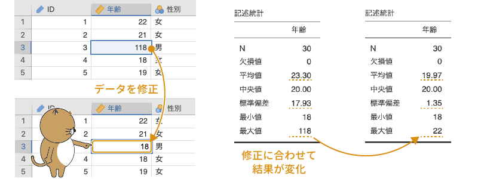
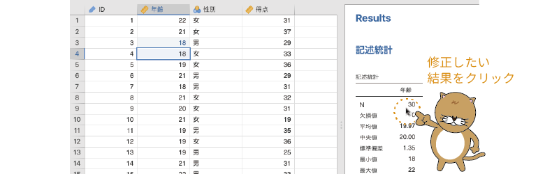
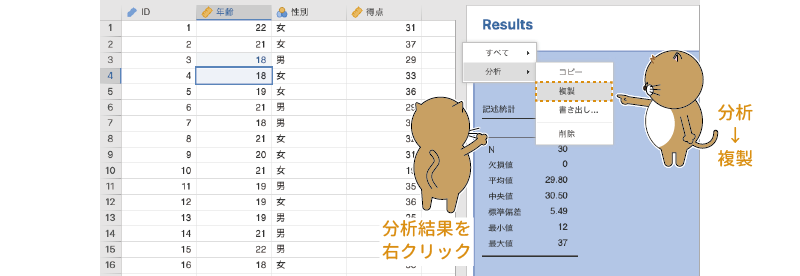
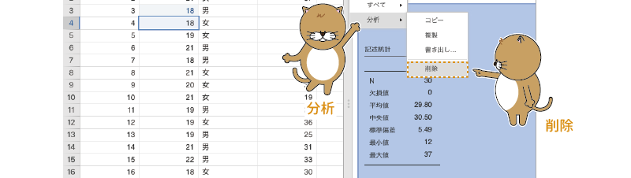
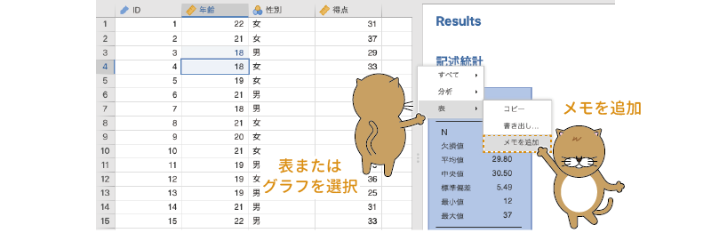

```{r, echo =F, message=FALSE}
  source("rscripts/_utility.R")
```

# 分析と編集 {#ch-basics-more}

この章では，jamoviにおける基本的な分析の手順，およびメモ作成機能について見ていきましょう。より詳細については「分析編」で説明しますが，jamoviでは1つ1つの分析が簡単にできるだけでなく，それを再利用して効率的に分析が進められるような工夫がなされています。

また，多くの統計ソフトでは，結果に注釈をつけたり説明を加えたりするには分析結果をワープロソフトに貼り付けたりする必要がありますが，jamoviでは分析結果に直接説明を加えることが可能です。論文の序論から考察までのすべてをjamoviだけでやろうというのはさすがに無理ですが，ちょっとした分析結果のレポート程度であれば，jamoviだけで完了してしまうかもしれません。

## 分析の基本操作 {#sec-analysis-basic}

```{r}
data01 <- read.csv("data/basics2_data01.csv")

# ID
attributes(data01$ID)$`jmv-id` <- TRUE

# 連続変数
attributes(data01$年齢)$measureType <- c("Continuous")
attributes(data01$得点)$measureType <- c("Continuous")

# 離散変数
data01$性別 <- factor(data01$性別)
attributes(data01$性別)$levels <- c("女", "男")
attributes(data01$性別)$values <- c(1, 2)
attributes(data01$性別)$measureType <- c("Nominal")

out <- jmvReadWrite::write_omv(data01, "data/omv/basics2_data01.omv")

```

ここでは，次のサンプルデータ（[basics2_data01.omv](https://github.com/sbtseiji/jmv_compguide/raw/main/data/omv/basics2_data01.omv)）を用いて，jamoviにおける分析の基本的な手順，そして分析作業を効率化してくれるいくつかの機能について見ていくことにしましょう（図\@ref(fig:bs2-data01)）。


```{r bs2-data01, fig.cap='サンプルデータの中身', echo=FALSE}

```


このデータには，対象者の`ID`，「年齢」，「性別」，そして何の得点かはわかりませんが，各対象者の「得点」が含まれています。

### 分析の実行 {#subsec:basic2-execute-analysis}

jamoviでは，分析のためのツールはすべて「分析」タブのリボンにまとめられています（図\@ref(fig:bs2-analyses-tab)）。第\@ref(ch-basics)章で説明したように，jamoviの分析タブは非常にわかりやすく整理されているので，心理統計の基本的な知識があれば必要な分析手法を見つけることは難しくないでしょう。


```{r bs2-analyses-tab, fig.cap='分析タブ', echo=FALSE}
knitr::include_graphics("images/basics2/analyses-tab.png")
```


ここでは，jamoviにおける分析手順を理解するために，サンプルデータを用いて基本的な記述統計量の算出を行うことにします。

jamoviでの記述統計量の算出には，分析タブの「`r infig('analysis-descriptives')` 探索」を使用します。「探索」をクリックすると「記述統計」という項目が表示されるので，それを選択してください（図\@ref(fig:bs2-descriptives-menu)）。


```{r bs2-descriptives-menu, fig.cap='記述統計量の算出', echo=FALSE}

```

すると図\@ref(fig:bs2-descriptives-setting)のような設定画面が現れます

<!-- 図 -->
```{r bs2-descriptives-setting, fig.cap='記述統計の設定画面', echo=FALSE}

```


この設定画面の左側には，分析で使用可能な変数の一覧が示されています。jamoviでは，この変数一覧から分析対象の変数を選択し，右側の欄に移動する形で分析を進めていきます。

また，この時点ですでに出力ウィンドウには「記述統計」という表が表示されていますが，表の中に数値はありません。表の中身は分析の設定後に反映されます。

さて，まず対象者の「年齢」について記述統計量を算出してみましょう。それには，画面左側の変数一覧から「年齢」を選択し，「→」をクリックして「変数」の欄に移動するだけです（図\@ref(fig:bs2-descriptives-var)）。

```{r bs2-descriptives-var, fig.cap='分析対象の指定', echo=FALSE}

```

すると，先ほどまでは空欄だった結果の表に，数値が表示されているはずです（図\@ref(fig:bs2-descriptives-res)）。一般的な統計ソフトでは，分析についてあれこれと設定をした後に何らかの形で「実行」処理をしないと計算が行われないのですが，jamoviでは分析設定がほぼリアルタイムで結果に反映されていきますので，他の統計ソフトのようにいちいち「実行」を指示する必要はないのです。

```{r bs2-descriptives-res, fig.cap='分析結果', echo=FALSE}

```


なお，ここではあくまでも分析の基本手順について説明することを目的にしていますので，結果の見方などについては触れません。それらの詳細については，「分析編」を参照してください。分析が終わったら，設定画面右上の`r infig('action-back-circle')`をクリックして設定画面を閉じましょう。

### 分析の修正 {#subsec:basic2-modify-analysis}

#### データ修正後の再分析 {-}

実際の分析場面では，分析中にデータに入力ミスが見つかった，というようなこともあり得ます。たとえば，サンプルデータの「年齢」には，入力ミスと思われるデータが1つ含まれています。「ID」が「3」の対象者の年齢が「118」になっているのがわかるでしょうか（図\@ref(fig:bs2-data-error)）。他の対象者の年齢は「18」から「22」なので，この値だけが突出しています。

```{r bs2-data-error, fig.cap='ID=3の対象者の年齢が118', echo=FALSE}

```


ここで，この「118」という値は「18」の打ち間違いだったとしましょう。このようにしてデータの入力ミスが見つかった場合，一般的な統計ソフトでは，この値を修正したあとで再度分析を実行し直す必要があります。

しかしjamoviでは，データを修正するとそれが自動で分析結果に反映されます。つまり，分析をし直す必要がないのです。実際に試してみましょう。「118」という値を「18」と修正すると，結果に表示されている値のいくつかがほぼリアルタイムに変更されるのがわかると思います（図\@ref(fig:bs2-edit-analysis)）。


<!-- 図 -->
```{r bs2-edit-analysis, fig.cap='データの修正と分析結果', echo=FALSE}

```


#### 分析設定の変更 {-}

データ分析の際には，途中で分析対象の変数を変更したくなったり，平均値と標準偏差を中央値と四分位数に変更したいなど，算出する値を変更したくなったりすることがあるかもしれません。たとえば，先ほど算出した記述統計量の分析対象を「年齢」から「得点」に変更したいとしましょう。一般的な統計ソフトでは，このような場合には再度「得点」を対象とした分析を実行し直すことになります。その場合，分析対象を変更する前の分析結果（「年齢」の記述統計量）の後に変更後の分析結果（「得点」の記述統計量）の両方が表示されることになり，分析結果がごちゃごちゃしたものになりがちです。

jamoviでは，このような場合にもとても柔軟に対応することができます。出力ウィンドウに表示されている結果の表をクリックしてみてください。すると，その分析の設定画面が開くはずです（図\@ref(fig:bs2-modify-analysis)）。

<!-- 図 -->
```{r bs2-modify-analysis, fig.cap='分析設定の変更', echo=FALSE}

```

そして，ここで分析対象の変数を「年齢」から「得点」に変更すると，分析結果も「得点」の記述統計量に変更されるのです。これなら，古い分析結果と新しい分析結果が混在してごちゃごちゃになるということがありません。分析対象の変数を「年齢」から「得点」に変更するには，「変数」にある「年齢」を選択して「`r infig('action-back')`」で変数一覧に戻した後に，「得点」を「変数」に入れるだけです。すると，すぐに結果の表の中身が「得点」のものに更新されます（図\@ref(fig:bs2-change-var)）。

<!-- 図 -->
```{r bs2-change-var, fig.cap='分析対象を変更', echo=FALSE}

```


#### 分析の複製 {-}

複数の変数に対して同じような分析を繰り返したい場合というのもあるはずです。その場合には，分析結果の複製機能を使うとよいでしょう。

出力ウィンドウの分析結果を右クリックしてみてください。すると，図\@ref(fig:bs2-duplicate-analysis)のようなメニュー項目が表示されます。

<!-- 図 -->
```{r bs2-duplicate-analysis, fig.cap='分析を複製', echo=FALSE}

```

ここで「分析」の「複製」を実行すると，選択した結果が複製されます。この複製された結果をクリックすると，先ほどと同様に分析設定画面が表示されます。ここで分析対象の変数を変更すれば，最初の分析結果は残したままで，まったく同じ分析を別の変数に対しても実行できるわけです。

#### 分析の削除 {-}

実行した分析結果が不要になるような場合もあるでしょう。その場合には，不要な分析結果を右クリックし，「分析」から「削除」を選択することで不要な分析結果を削除できます（図\@ref(fig:bs2-remove-analysis)）。

<!-- 図 -->
```{r bs2-remove-analysis, fig.cap='分析結果を削除', echo=FALSE}

```

#### 注釈の追加 {-}
分析結果として表示される表や図には，注釈をつけることもできます。注釈をつけたい図あるいは表を右クリックしてください。すると，「画像」や「表」というメニュー項目が表示されます。その中にある「メモを追加」という項目を選択すれば，図あるいは表の下に注釈を記入することができるのです（図\@ref(fig:bs2-add-note)）。


<!-- 図 -->
```{r bs2-add-note, fig.cap='表に注釈を追加', echo=FALSE}

```

#### 分析結果の書き出し {-}

jamoviの分析結果は，結果全体，分析ごと，図・表ごとなどいくつかの単位で書き出すことができます。出力ウィンドウで右クリックすると，右クリックする場所によって，「すべて」，「分析」，「表」などのメニューが表示されるので，そこから「書き出し…」を選択すれば，それぞれ結果全体（すべて），その分析のみ（分析），その表のみ（表）をPDFファイル，またはhtmlファイルとして書き出せます（図\@ref(fig:bs2-result-export)）。


<!-- 図 -->
```{r bs2-result-export, fig.cap='分析結果の書き出し', echo=FALSE}

```


このとき，結果を画像ファイルとして書き出すのであればPDFファイルとして，表の内容をWordなどで編集したいのであればhtmlファイル（Webページ）として書き出すのがよいでしょう^[htmlファイルをそのままダブルクリックして開こうとするとWebブラウザが起動し，結果がWebページとして表示されますが，Microsoft Wordのファイルメニューでhtmlファイルを選択して開けば，結果ファイルをWordで開いて編集することができるようになります。]。


## メモの作成 {#sec-reporting}

多くの統計用ソフトウェアでは，表示された分析結果に手を加えることはできません。そのため，多数の分析を行った場合には，どの結果がどの分析のものだったかがわからなくなってしまいがちです。

しかし，jamoviではタイトルを変更したり，分析結果に説明や注釈を加えたりすることができます。分析結果に必要な説明を加えておけば，どの結果がどの分析のものかがわからなくなるということがなくなります。また，しっかりとした説明をつけておけば，実験レポートや研究論文を書く際の時間短縮にもなるでしょう。

出力ウィンドウに表示されている結果のタイトル部分をクリックすると，その部分を変更できるのがわかると思います（図\@ref(fig:bs2-report)）。また，タイトルの下の部分には説明文を追加することができます。その際，ワープロソフトほどではありませんが，文字を太字にしたり斜体にしたりすることも可能ですし，箇条書きや数式などを用いることも可能です。それらの書式の指定には「編集」タブのツールボタンを用います。

```{r bs2-report, fig.cap='結果のタイトルや説明の編集', echo=FALSE}

```
