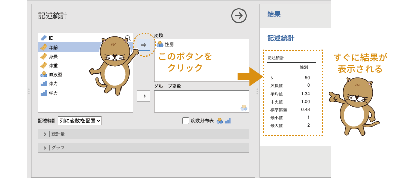
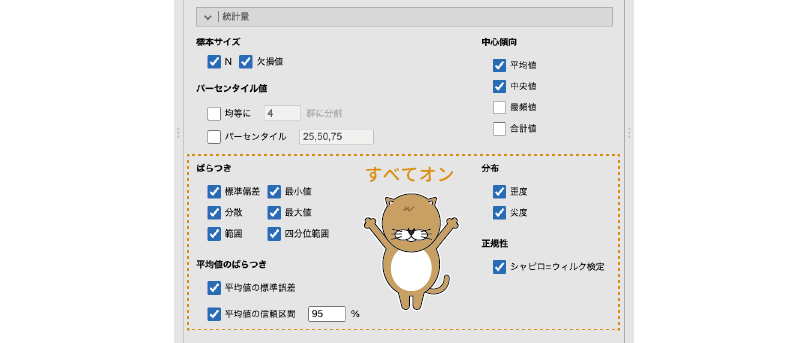
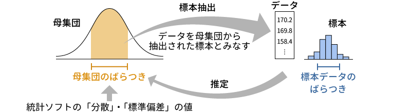
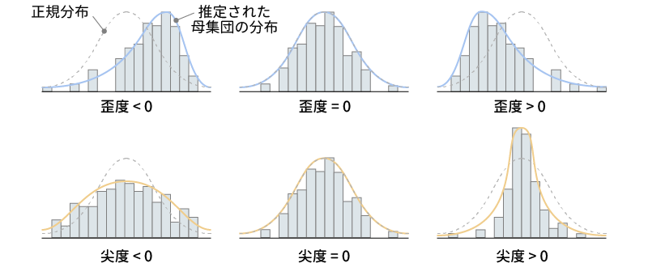
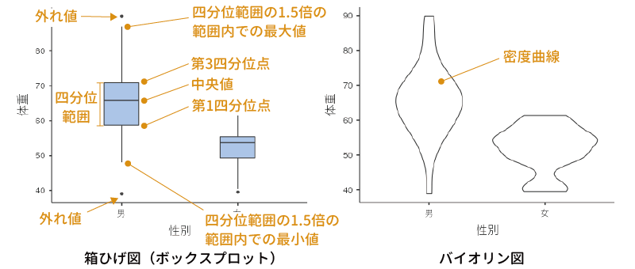
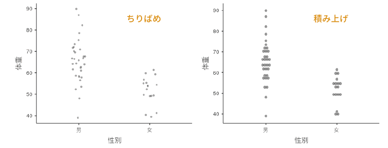

```{r, echo =F, message=FALSE}
  source("rscripts/_utility.R")

data01 <- read.csv("data/exploration_data01.csv")

# ID
attributes(data01$ID)$`jmv-id` <- TRUE

# 連続変数
attributes(data01$年齢)$measureType <- c("Continuous")
attributes(data01$身長)$measureType <- c("Continuous")
attributes(data01$体重)$measureType <- c("Continuous")

# 離散変数
data01$性別 <- factor(data01$性別)
attributes(data01$性別)$levels <- c("男", "女")
attributes(data01$性別)$values <- c(1, 2)
attributes(data01$性別)$measureType <- c("Nominal")

data01$血液型 <- factor(data01$血液型)
attributes(data01$血液型)$levels <- c("A", "B", "O", "AB")
attributes(data01$血液型)$values <- c(1, 2, 3, 4)
attributes(data01$血液型)$measureType <- c("Nominal")

attributes(data01$体力)$measureType <- c("Ordinal")
attributes(data01$学力)$measureType <- c("Ordinal")

# 変数の説明
attributes(data01$ID)$description <-"対象者のID"
attributes(data01$性別)$description <-"対象者の性別"
attributes(data01$年齢)$description <-"対象者の年齢"
attributes(data01$身長)$description <-"対象者の身長（cm）"
attributes(data01$体重)$description <-"対象者の体重（kg）"
attributes(data01$血液型)$description <-"対象者の血液型"
attributes(data01$体力)$description <-"対象者の体力レベル（5段階判定）"
attributes(data01$学力)$description <-"対象者の学力レベル（5段階判定）"

out <- jmvReadWrite::write_omv(data01, "data/omv/exploration_data01.omv", frcWrt = TRUE)

```

# 探索{#ch-exploration}

ここからはjamoviを使った分析方法についての説明です。「分析編」では，jamoviのメニュー順に分析手法について見ていくことにします。


まずは「`r infig("analysis-descriptives")` 探索」ツールから見ていきましょう。このツールはデータを記述要約するためのものです。データの特徴を知るためには欠かせないツールですので，使い方をしっかり理解しましょう。

この分析ツールの使い方を見るために，簡単なサンプルデータ（[exploration_data01.omv](https://github.com/sbtseiji/jmv_compguide/raw/main/data/omv/exploration_data01.omv)）を用いることにします（図\@ref(fig:exploration-sample)）。

```{r exploration-sample, fig.cap="サンプルデータ", echo=FALSE}
knitr::include_graphics("images/exploration/exploration-sample.png")
```

このサンプルデータには，男女計50人分の次の変数値が格納されています^[本書で利用するサンプルデータはすべて架空のデータです。]。これらの内容は「変数」タブでも確認することができます。

:::{.jmvvar data-latex=""}

+ `ID`　対象者のID：`r infig("variable-id")` ID型
+ `性別`　対象者の性別：`r infig("variable-nominal")` 名義型
+ `年齢`　対象者の年齢：`r infig("variable-continuous")` 連続型
+ `身長`　対象者の身長（cm）：`r infig("variable-continuous")` 連続型
+ `体重`　対象者の体重（kg）：`r infig("variable-continuous")` 連続型
+ `血液型`　対象者の血液型：`r infig("variable-nominal")` 名義型
+ `体力`　対象者の体力レベル（5段階判定）：`r infig("variable-ordinal")` 順序型
+ `学力`　対象者の学力レベル（5段階判定）：`r infig("variable-ordinal")` 順序型
:::

この「`r infig("analysis-descriptives")` 探索」は，記述統計など，データの特徴を掴むために使用するツールです。jamoviの基本構成では，ここには「記述統計」という項目が含まれています（図\@ref(fig:Exploration-menu)）。

```{r Exploration-menu, fig.cap="探索ツールの構成", echo=FALSE}

```

それでは，メニューから「記述統計」を選択してください。これで分析開始です。

## 記述統計 {#sec-exp-exploration-descriptives}

記述統計の設定画面は図\@ref(fig:Exploration-descriptives-panel)のようになっています。

```{r Exploration-descriptives-panel, fig.cap="記述統計の分析設定画面", echo=FALSE}

```

画面左側の部分は，データファイルに含まれている変数の一覧です。ここから，分析したい変数を選択し，それをその右側にある「変数」の欄に移動すると，指定した変数に関する記述統計量を算出することができます。また，画面の下のほうには［統計量］や［グラフ］と書かれた部分がありますが，この部分の左側にある「`r infig("modules-analyses-arrow-r")`」をクリックすると，それぞれ統計量の算出や作図に関する詳細設定項目が表示されるようになっています。

各項目の詳細の説明は後回しにして，まずは実際にいろいろと分析してみましょう。まず，「性別」について記述統計量を求めてみます。左側の変数リストで「性別」を選択したら，変数の隣にある「`r infig("action-forward")`」をクリックしてください。すると，「性別」が左の変数リストから右側の変数に移動され，それと同時に画面右側の出力ウィンドウに計算結果が表示されます（図\@ref(fig:Exploration-descriptives-seibetsu)）。

```{r Exploration-descriptives-seibetsu, fig.cap="「性別」の記述統計量の算出", echo=FALSE}

```

ここがjamoviのおもしろいところで，分析画面で変数を指定したり，あるいは分析の設定を変更したりすると，その変更がすぐに結果画面に反映されるのです。他の多くの統計ソフトでは，分析対象の変数を変更したり，分析の設定を変更したりした場合には，分析の再実行を行わないと結果は更新されません。しかし，jamoviでは，このようにほぼリアルタイムに結果が更新されていくので，設定変更による結果を確認しながら分析を進めていくことができます。

では，計算結果についても簡単に見ておきましょう。

```{r Exploration-descriptives-seibetsu-table, fig.cap="「性別」の記述統計量", echo=FALSE}
knitr::include_graphics("images/exploration/Exploration-descriptives-seibetsu-table.png")
```

図\@ref(fig:Exploration-descriptives-seibetsu-table)の結果から，N（データの総数）が「50」，平均値が「1.34」といったことがわかります。

また，この結果では各統計量が縦（行）に並び，変数が横（列）に並んでいますが，変数が多く，算出する統計量の種類が少ない場合には，縦と横の表示を入れ替えた方が見やすいでしょう。その場合には，設定画面の変数一覧の下にある「記述統計」の横の「列に変数を配置」となっている部分を「行に変数を配置」に変更することで，行方向と列方向の表示を入れ替えることもできます図\@ref(fig:Exploration-descriptives-seibetsu-table-direction)。

```{r Exploration-descriptives-seibetsu-table-direction, fig.cap="結果表示の方向を変更", echo=FALSE}

```

さて，これでひとまず結果は出たのですが，この計算結果には問題があります。「性別」は名義型変数なので，平均値は意味をなしません。この変数は男性を「1」，女性を「2」として入力されていて，平均値の計算自体はできるのですが，この「性別の平均値が1.34」というのはまったく意味がないのです。

このような名義尺度データでは，まず男性と女性がそれぞれ何人ずつなのか，といったことを知りたいはずです。その場合，変数リストのすぐ下にある「度数分布表」のチェックをオンにします（図\@ref(fig:Exploration-descriptives-seibetsu-frequency-tables)）。なお，この「度数分布表」のところには`r infig("variable-nominal")` `r infig("variable-ordinal")`というアイコンが付けられています。これは，この項目は分析変数の型が「`r infig("variable-nominal")` 名義」と「`r infig("variable-ordinal")` 順序」の場合のみ使用できるということを意味しています。


```{r Exploration-descriptives-seibetsu-frequency-tables, fig.cap="度数分布表の表示設定", echo=FALSE}
knitr::include_graphics("images/exploration/Exploration-descriptives-seibetsu-frequency-tables.png")
```

このチェックをオンにすると，すぐに出力ウィンドウに図\@ref(fig:Exploration-descriptives-seibetsu-table2)のような度数分布表が表示されます。度数分布表には，変数値ごとの度数とその全体における比率（全体%），および累積パーセント値が示されています。


```{r Exploration-descriptives-seibetsu-table2, fig.cap="度数分布表", echo=FALSE}

```


### 統計量{#subsec:exp-statistics}

さて，これで度数分布表はできましたが，先ほどの平均値の表はそのままになっていますので，これをなんとかしたいですね。そこで，結果に表示させる値をもう少し細かく設定することにしましょう。そのためには，`r groupbar("統計量")`の左側にある「`r infig("modules-analyses-arrow-r")`」をクリックし，詳細項目を展開します。

すると，非常にたくさんの項目が表示されました（図\@ref(fig:Exploration-descriptives-statistics)）。各項目の使い方についてはまた後ほど説明することとして，ここではこの画面で設定可能な項目の一覧を見ておきましょう。

```{r Exploration-descriptives-statistics, fig.cap="統計量の詳細設定", echo=FALSE}

```

:::{.jmvsettings data-latex=""}
+ **標本サイズ**　標本サイズに関連する情報の設定を行います。
  - N　分析変数に含まれるデータ総数を表示します。
  - 欠損値　分析変数に含まれる欠損値の個数を表示します。

+ **パーセンタイル値**　パーセンタイル値や分位数に関する設定を行います。
  - 均等に［　　］群に分割　データ全体をn等分する位置にある値を算出します。
  - パーセンタイル　値の小さいほうから数えてn%の位置にある値を算出します。複数のパーセント点を指定する場合は，それらの値をコンマで区切って入力します。

+ **ばらつき**　パーセンタイル値や分位数に関する設定を行います。
  - 標準偏差　標準偏差を算出します。
  - 分散　分散を算出します。
  - 範囲　範囲（最大値 – 最小値の幅）を算出します。
  - 最小値　最小値を算出します。
  - 最大値　最大値を算出します。
  - 四分位範囲　四分位範囲を算出します。

+ **平均値のばらつき**
  - 平均値の標準誤差　平均値の推定における標準誤差を算出します。
  - 平均値の信頼区間　平均値の信頼区間（下限値と上限値）を算出します。初期設定では95%信頼区間を算出しますが，数値を変更すれば90%や99％などで信頼区間を算出することができます。

+ **中心傾向**　データの中心位置に関する統計量を算出します。
  - 平均値　平均値を算出します。
  - 中央値　中央値を算出します。
  - 最頻値　最頻値を算出します。
  - 合計値　合計値を算出します。

+ **分布**　データの分布に関する統計量を算出します。
  - 歪度　歪度（分布が左右対称からずれている程度）を算出します。
  - 尖度　尖度（分布が中心に集中している程度）を算出します。

+ **正規性**
  - シャピロ=ウィルク検定　分布が正規分布からずれているかどうかを検定します。
:::


「性別」の記述統計で平均値などの不要な値を表示しないようにするには，この画面で「平均値」などの不要な項目のチェックを外すだけです。「N」と「欠損値」だけを残してそれ以外のチェックを外すと，結果の表示は図\@ref(fig:Exploration-descriptives-seibetsu-table3)のようになります。これですっきりです。

```{r Exploration-descriptives-seibetsu-table3, fig.cap="設定変更後の結果", echo=FALSE}

```


では，他の変数についても同様に記述統計量を算出しましょう。次は，「性別」と同じく名義尺度型変数である「血液型」について記述統計量を算出することにします。まずは，設定画面の右上にある`r infig("action-back-circle")`をクリックして，この設定画面をいったん閉じましょう。

そして，再度「`r infig("analysis-descriptives")` 探索」から「記述統計」を実行して設定画面を開きます。すると，先ほどの分析結果の下に新しい結果の表が作成され，そして再び先ほどの設定画面が現れます。

「血液型」でも，性別のときと同様に度数分布表を作成することにしましょう。また，性別と違って血液型には4種類の値が含まれていますので，今回は*最頻値*についても算出することにします。この場合，分析の設定画面は図\@ref(fig:Exploration-descriptives-ketsueki)のようになります。

```{r Exploration-descriptives-ketsueki, fig.cap="血液型の記述統計", echo=FALSE}

```

最頻値は`1.00`となっていますが，このデータでは血液型が「A=1，B=2，O=3，AB=4」として入力されているので，最頻値は「A型」ということになります。度数分布表では値そのものではなく変数ラベルが表示されるのですが，記述統計量の表では残念ながら変数ラベルではなく値そのものが表示されるので，その点は注意が必要です。

#### 順序尺度データの記述統計 {-#subsub:exp-ordinal}

今度は順序尺度データである「体力」と「学力」について記述統計量を算出しましょう。いったんこの設定画面を閉じ，再び「`r infig("analysis-descriptives")` 探索」から「記述統計」を選択して設定画面を開いてください。

なお，この「体力」と「学力」の変数の値はどちらも5段階評価によるもので，値が大きいほど評価が高いことを意味します。このように，この2つの変数は共通した部分が多いのでまとめて分析することにしましょう。変数の欄に，「体力」と「学力」の2つを移動させると，出力ウィンドウにはこれらの変数についての計算結果がひとまとめに表示されます。

この2つの変数は，値が5種類しかない順序尺度変数ですので，今回も度数分布表を作成することにしましょう。また，順序尺度データなので，平均値や標準偏差にはあまり意味はありませんね。ですので，これらは非表示にしておきます。その代わり，データのばらつきの指標として*四分位数*を算出したいと思います。四分位数を算出するには，設定画面の「均等に［　］群に分割」の部分にチェックを入れ，入力欄の数値を「4」にします。なお，第2四分位数（50％点）は*中央値*と同じですので，「中央値」のチェックは外してしまいましょう（図\@ref(fig:Exploration-descriptives-tairyoku)）。

```{r Exploration-descriptives-tairyoku, fig.cap="体力と学力の記述統計の算出", echo=FALSE}

```


この設定にすると，分析結果には2変数の測定値の総数と欠損値の個数，第1四分位数（25％点），第2四分位数（50％点=中央値），第3四分位数（75％点）が含まれた記述統計量の表と，それぞれの変数の度数分布表が表示されます（図\@ref(fig:Exploration-descriptives-tairyoku-tables)）。

```{r Exploration-descriptives-tairyoku-tables, fig.cap="体力と学力の記述統計量", echo=FALSE}

```

記述統計量だけで見ると2つの変数は非常によく似た結果になっていますが，度数分布表を見ると「体力」のほうがややばらつきが大きいようです。

#### 間隔・比率尺度データの記述統計 {-#subsub:exp-continuous}

最後に連続型変数，つまり，間隔尺度あるいは比率尺度による測定値の記述統計です。サンプルデータでは「年齢」，「身長」，「体重」の3つがこの型です。「記述統計」の設定画面を閉じ，再び「`r infig("analysis-descriptives")` 探索」から「記述統計」を選択して分析を実行してください。

「年齢」，「身長」，「体重」の3つを変数に移動したら，せっかくなので［統計量］で設定できるさまざまな値を算出してみましょう^[ここでは説明のためにいろいろな値を算出していますが，実際の分析では必要なものだけを選んで実行してください。]。「**ばらつき**」，「**平均値のばらつき**」，「**分布**」，「**正規性**」にある項目のすべてにチェックを入れてみてください（図\@ref(fig:Exploration-descriptives-continuous-setting)）。

```{r Exploration-descriptives-continuous-setting, fig.cap="分析の設定", echo=FALSE}

```

なお，連続型の変数の場合には「度数分布表」のチェックをオンにしても度数分布表は作成されません。度数分布表は，その横のアイコンからわかるように，名義型（`r infig("variable-nominal")`）と順序型（`r infig("variable-ordinal")`）の変数の場合のみの機能だからです。

設定が終わると，分析結果は図\@ref(fig:Exploration-descriptives-continuous-table)のようになっているはずです。

```{r Exploration-descriptives-continuous-table, fig.cap="記述統計の結果の表", echo=FALSE}

```

結果の表には，上から順に標本サイズ，中心傾向，ばらつき，分布，正規性に関する値が示されています。「平均値のばらつき」で設定を行う「平均値の標準誤差」と「95%信頼区間 下限」，「95%信頼区間 上限」の値は，平均値の推定精度に関する指標のため，中心傾向の項目である「平均値」のすぐ下に示されます。

なお，ほとんどの統計ソフトでもそうなのですが，jamoviで算出される分散や標準偏差などのばらつきの指標は，このデータの母集団がもつ値についての推定値であって，データそのものについての値ではありません。そのため，「分散」は，平均値からの偏差2乗の合計を「標本サイズ – 1」で割った，*不偏分散*の値になっています。また，「標準偏差」には，この不偏分散の正の平方根が用いられていますので，その点は注意してください（図\@ref(fig:exp-dispersion)）。

```{r exp-dispersion, fig.cap="統計ソフトで算出される分散と標準偏差の値", echo=FALSE}

```

その下の「分布」の項目については，あまり馴染みがないかもしれません。これらは，このデータの分布（標本）から推定される母集団の分布が*正規分布*からどれだけずれているかを示すものです。心理統計におけるさまざまな分析手法は，その多くがデータの母集団が正規分布であることを前提としていますので，分布に極端な偏りがないことを確認しておくことはとても重要です。この分布の指標は，そうした偏りの程度を数値化したものです（図\@ref(fig:exp-distribution)）。


```{r exp-distribution, fig.cap="歪度と尖度", echo=FALSE}

```

このうちの「*歪度*」は，分布の中心が左右にどれだけ偏っているかを示す値です。歪度がプラスの値の場合には，分布の中心が真ん中より左にずれていることを，マイナスの値の場合には右にずれていることを示します。歪度が「0」の場合には分布の中心が分布全体のちょうど真ん中にあるということです。jamoviでは，この歪度の推定値とその標準誤差が算出されます。一般に，この歪度の絶対値がその標準誤差の2倍以上の大きさである場合，分布が左右にかなり偏っているとみなされます。

もう1つの「*尖度*」は，分布がどの程度尖った形になっているかを示す値です。分布が尖った形になっているというのは，中心部分に多くの値が集まり，周辺部分には値が少ないことを意味します。反対に，分布が平たい形の場合には，値が全体的に広い範囲に散らばっているということになります。この尖度がプラスの値の場合，その母集団分布は正規分布よりも尖った形に，マイナスの値の場合には，正規分布よりも平たい形になっていることを意味します。この尖度の値についても，推定値と標準誤差が算出され，尖度の絶対値がその標準誤差の2倍以上の大きさである場合，分布の尖り具合に偏りが大きいとみなされます。

一番下の「*シャピロ=ウィルク検定*」は，このデータの母集団の分布が正規分布から大きくずれているかどうかについての検定です。シャピロ=ウィルク検定では，「母集団分布は正規分布である（母集団の分布と正規分布のずれは0である）」という*帰無仮説*を用いた統計的仮設検定を実施します。結果の表の「シャピロ=ウィルクのW」は，この検定で算出される検定統計量Wの値で，この値が1であれば正規分布からのずれが0であり，そこから値が小さくなるほど正規分布からのずれが大きいことを意味します。ただし，正規分布からのずれが大きいといえるかどうかの基準は標本サイズ（データの総数）によって異なるため，このWの値だけでは判断が困難です。そこで，「シャピロ=ウィルク（p値）」として，このWの値の有意確率（*p値*）の算出結果が合わせて示されます。一般に，このp値が有意水準（一般にα=0.05）未満である場合に，母集団の分布が正規分布でないとみなされます。


#### グループごとの記述統計 {-#subsub:exp-groupby}

ところで，先ほど算出した身長や体重の平均値は，男女を区別せず，すべての測定値を用いて算出されています。ですが，身長や体重というのは男女差が比較的大きいですよね？ですので，平均値や標準偏差などは男女別に算出しておいたほうがよさそうです。その場合，どうすればよいでしょうか。その1つとして，「男性のデータのみ」，「女性のデータのみ」というフィルタ（第\@ref(ch-basics)章「[フィルタ](#sec-data-filter)参照」）を作成し，そのフィルタを結果に適用するという方法が挙げられます。ただ，その場合，男性と女性の結果を同時に見ることはできません。それでは不便ですので，別の方法を用いたほうがよいでしょう。

このような場合，設定画面の「変数」の下にある「グループ変数」を使うと便利です。変数リストから「性別」を選び，それを「グループ変数」に移動しましょう。すると，すべての記述統計量が男女別に算出されます（図\@ref(fig:Exploration-descriptives-split-by)）。なお，この「グループ変数」には右下に名義型変数のアイコン（`r infig("variable-nominal")`）がついていますので，ここに指定できるのは名義の変数だけです。

```{r Exploration-descriptives-split-by, fig.cap="グループごとの分析", echo=FALSE}

```

### グラフ{#subsec:exp-plots}

ここまでは「記述統計」を使った記述統計量の算出方法を見てきました。多くの場合，これらの機能だけでも十分ではあるのですが，数値だけではわかりにくい部分もあるので，データの特徴を視覚的に捉えることができるといいですね。jamoviには基本的な作図機能も備わっていますので，今度はデータの視覚化の方法について見ていきましょう。

#### 名義型・順序型データの視覚化 {-#subsub:exp-plot-nominal}

ではまず，名義型（`r infig("variable-nominal")`）データである血液型の分析結果をグラフ表示してみようと思います。なお，順序型（`r infig("variable-ordinal")`）データの場合も視覚化の手順は同じです。

画面右側の出力ウィンドウから，「血液型」の分析結果を探し，それをクリックしてください。すると，この分析の際に使用した設定画面が表示されます。これもjamoviのおもしろく，かつ便利なところで，jamoviでは一度実行した分析をクリックすれば，いつでもその分析の設定を変更することができるのです。

また，第\@ref(ch-basics-more)章の「[分析の修正](#subsec:basic2-modify-analysis)」のところで見たように，jamoviの分析結果はデータに修正を加えると分析結果も自動的に更新されるようになっています。SPSSなどの統計ソフトでは，一度実行した分析の結果は変更できません。そのため，分析の設定を変更したい場合には，再度分析をやり直すしかありませんし，データに修正が生じた場合も分析をやり直すしかないのですが，jamoviならそうした手間は不要です。

さて，「血液型」の分析画面を開いたら，その下のほうにある`r groupbar("グラフ")`の欄を展開して表示させてください。統計量については変更しませんので，`r groupbar("統計量")`の部分は畳んで設定項目を非表示にしておくとよいでしょう。

`r groupbar("グラフ")`には，次の項目が含まれています（図\@ref(fig:Exploration-descriptives-plots-setting)）。

```{r Exploration-descriptives-plots-setting, fig.cap="作図の設定項目", echo=FALSE}

```

:::{.jmvsettings data-latex=""}
+ **ヒストグラム**　ヒストグラムに関する設定項目です。
  - ヒストグラム　度数分布をヒストグラムとして図示します。
  - 密度曲線　度数分布をカーネル平滑化した密度曲線グラフを作成します。

+ **Q-Qプロット**　正規Q-Qプロットの設定項目です。
  - Q-Qプロット　正規Q-Qプロットを作成します。

+ **箱ひげ図**　箱ひげ図（ボックスプロット）に関する設定項目です。
  - 箱ひげ図　箱ひげ図を作成します。
  - バイオリン図　バイオリン図を作成します。
  - データ　1つ1つのデータを点として表示します。
  - 平均値　箱ひげ図やバイオリン図上に平均値を表示します。

+ **棒グラフ**　棒グラフに関する設定項目です。
  - 棒グラフ　棒グラフを作成します。
:::

これらのうち，名義尺度データで有効なのは「**棒グラフ**」の項目です。それ以外の項目も使用できなくはないですが，グラフの性質上，意味のある結果は得られません。

「**棒グラフ**」にある「棒グラフ」のチェックをオンにすると，図\@ref(fig:Exploration-descriptives-plots-bar-plot)のようなグラフが作成されます。

```{r Exploration-descriptives-plots-bar-plot, fig.cap="棒グラフ", echo=FALSE}

```

#### 連続型データの視覚化 {-#subsub:exp-plot-continuous}

今度は連続型（`r infig("variable-continuous")`）のデータを視覚化してみましょう。「年齢」，「身長」，「体重」の分析結果をクリックし，これらの変数に関する分析設定画面を表示させてください。連続型のデータでは，`r groupbar("グラフ")`にあるすべての項目が使用可能です。 順番に見ていきましょう。

#### ヒストグラム{-#subsubsub:exp-plots-histograms}

「**ヒストグラム**」には，「ヒストグラム」と「密度曲線」の2つの項目があります。この2つは，組み合わせて使用することもできます。図\@ref(fig:Exploration-descriptives-plots-histograms)は，「体重」のヒストグラムと密度曲線，その2つを組み合わせた場合の結果のグラフです。ここでは性別をグループ変数として用いているので，男女別に図が作成されています。


```{r Exploration-descriptives-plots-histograms, fig.cap="ヒストグラム", echo=FALSE}

```

##### ヒストグラム{-}

2種類のグラフのうち，*ヒストグラム*についてはとくに説明は必要ないでしょう。これは度数分布を視覚化する際によく用いられるグラフです。なお，身長や体重のような連続変数で度数を集計する際の測定値の間隔（*階級*，*ビン*）は，jamoviでは自動的に設定されます。残念ながら階級の幅を自分で設定することはできませんので，思ったとおりの結果が得られない場合には，ExcelやRなどを用いて自分で作成する必要があります。

##### 密度曲線{-}

2つ目の*密度曲線*は，*カーネル平滑化*と呼ばれる手法を用い，度数分布を滑らかな曲線で表現したものです。こうすることによってヒストグラムに見られる細かな凸凹が平滑化され，全体的な傾向を捉えやすくなります。


#### Q-Qプロット{-#subsubsub:exp-plots-qq}

「**Q-Qプロット**」にある「Q-Qプロット」の項目では，*Q-Qプロット*や*正規Q-Qプロット*と呼ばれる図を作成します（図\@ref(fig:Exploration-descriptives-plots-qq)）。


```{r Exploration-descriptives-plots-qq, fig.cap="正規Q-Qプロット", echo=FALSE}

```

これはデータの分布が*正規分布*になっているかどうかを視覚的に確かめるために用いられるもので，グラフの横軸にはこのデータが正規分布である場合にとると考えられる値（理論的分位点），そして縦軸は「標準化残差」となっていますが，ここでは実際の測定値の標準得点がとられています。このグラフのデータ点が，グラフ中央の直線上に並べばデータが正規分布しているといえ，そこから大きくずれていれば正規分布から外れているということになります。

#### 箱ひげ図{-#subsubsub:exp-plots-box}

「**箱ひげ図**」には，箱ひげ図やそれに関連した作図の項目が含まれています。

##### 箱ひげ図{-}

1つ目の「箱ひげ図」は，箱ひげ図（ボックスプロット）と呼ばれるグラフを作成します（図\@ref(fig:Exploration-descriptives-plots-box)）。箱ひげ図は，中央値と四分位数を用いてデータのばらつきを示すためのグラフで，「箱」の部分には四分位数，「ひげ」の部分には*四分位範囲*（第3四分位数 – 第1四分位数の幅）の1.5倍の範囲内における最大値および最小値までの幅が示されます。また，それより外の範囲にあるデータは*外れ値*として点で示されます。

<!-- その際，「Label outliers（外れ値にラベル付与）」をチェックしておくと，外れ値の値がグラフ上に表示されます。 -->

##### バイオリン図{-}

その下にある「バイオリン図」で作成されるバイオリン図は，密度曲線を横倒しにし，さらに左右対称にして分布の特徴を表したものです（図\@ref(fig:Exploration-descriptives-plots-box)）。

```{r Exploration-descriptives-plots-box, fig.cap="箱ひげ図とバイオリン図", echo=FALSE}

```

##### データ{-}
一番下の「データ」のチェックをオンにすると，1つ1つのデータが点として示されます（図\@ref(fig:Exploration-descriptives-plots-data-jittered)）。その際，その下のメニューで，それぞれのデータ点が重ならないように点の位置をちりばめるようにしてずらす（ちりばめ）か，積み上げるような形にして表示する（積み上げ）かを選択することができます。

```{r Exploration-descriptives-plots-data-jittered, fig.cap="データ点の表示", echo=FALSE}

```

この箱ひげ図とバイオリン図，データ点の表示は，複数を重ね合わせて使用することもできます（図\@ref(fig:Exploration-descriptives-plots-box-combined)）。また，**箱ひげ図**の一番下にある「平均値」にチェックを入れると，各グループの平均値をグラフ上に示すことができます。

```{r Exploration-descriptives-plots-box-combined, fig.cap="グラフの重ね合わせ", echo=FALSE}

```

```{=latex}
\clearpage
```

#### 棒グラフ{-#subsubsub:exp-plots-bar}

連続型の変数の場合，「**棒グラフ**」の「棒グラフ」では平均値の棒グラフが作成されます。このとき，グラフには平均値とその*標準誤差*が示されます（図\@ref(fig:Exploration-descriptives-plots-bar)）。グラフの誤差線（ひげの部分）は標準偏差ではありませんので，その点は注意してください。

```{r Exploration-descriptives-plots-bar, fig.cap="棒グラフ", echo=FALSE}

```
