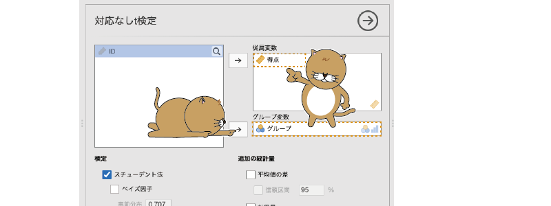
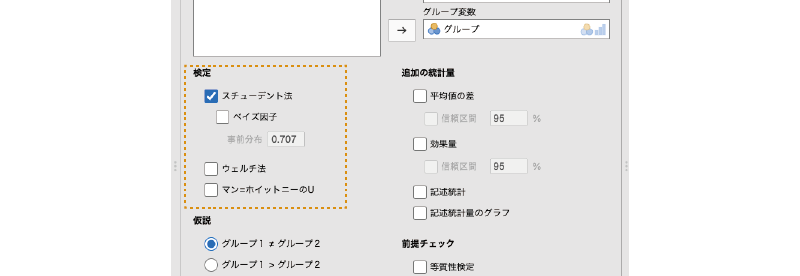
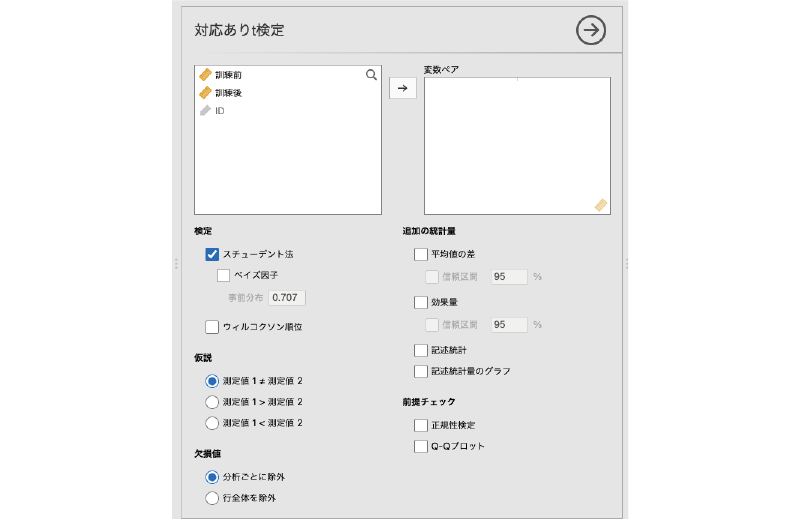
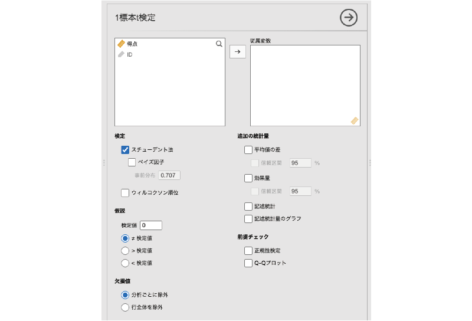
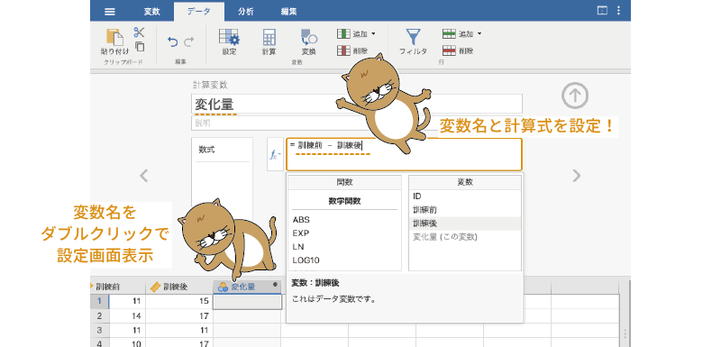
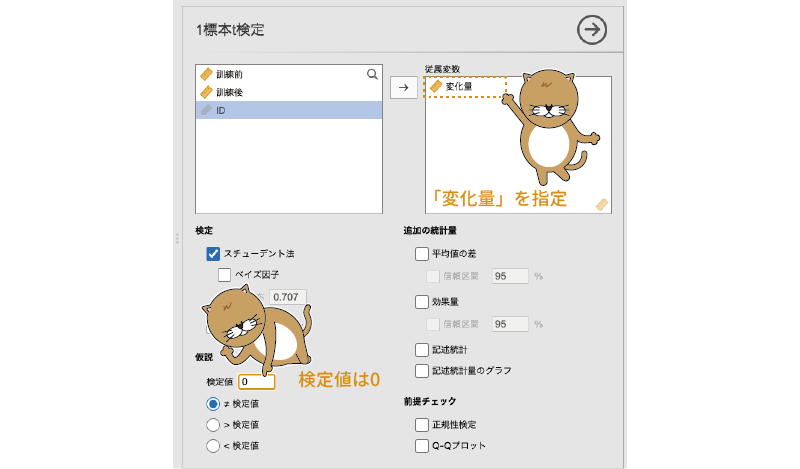
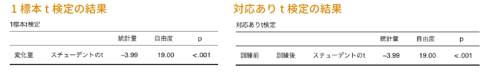

```{r, echo =F, message=FALSE}
 source("rscripts/_utility.R")
```

# t検定 {#ch-ttests}

「`r infig("analysis-ttest")` t検定」は，1つあるいは2つの平均値の検定のためのツールです。jamoviの基本構成では，ここには次の3つの分析メニューが含まれています（図\@ref(fig:ttests-ttest-menu)）。

```{r ttests-ttest-menu, fig.cap="t検定のメニュー", echo=FALSE}

```

:::{.jmvmenu data-latex=""}
+ 対応なしt検定　2群の独立標本（対応なしデータ）の平均値の検定を行います
+ 対応ありt検定　対応ありデータの2つの平均値の検定を行います
+ 1標本t検定　標本の平均値と基準となる平均値の間で検定を行います
:::

これらの分析メニューでは，平均値の検定だけでなく，それぞれに対応した*ノンパラメトリック検定*を行うこともできます。また，本書では詳しくはとりあげませんが，*ベイズ統計*の考え方を用いた指標を算出することも可能です。

## 対応なしt検定{#sec-ttests-independent-samples}

対応なしt検定（独立標本t検定）は，お互いに関連のない（*独立*な）2つのグループの間で母集団の平均値に統計的な差があるといえるかどうかを確かめたい場合に使用される分析手法です（図\@ref(fig:ttests-independent-t)）。

```{r ttests-independent-t, fig.cap="対応なしt検定", echo=FALSE}

```


### 考え方 {#subsec:ttests-independent-basics}

統計的仮説検定は，*推測統計*と呼ばれる統計手法を応用したもので，手元にあるデータは関心の対象である集団全体（*母集団*）から*無作為抽出*された一部（*標本*，*サンプル*）であるとみなします（図\@ref(fig:ttests-population-sample)）。

```{r ttests-population-sample, fig.cap="母集団と標本", echo=FALSE}

```

推測統計の詳細については統計法の入門書を参照していただきたいと思いますが，母集団からその一部を標本として無作為抽出したとき，その標本がもつ値（平均値や分散など）は母集団のもつ値（母平均や母分散など）とは必ずしも一致しません。母集団の中から無作為に標本を抽出するということは，標本抽出のたびにそこからとり出される値が異なるということですから，同じ母集団から抽出された標本であっても，その平均値や分散は標本ごとにいくらか異なる値になるためです。

<!-- -->

もちろん，標本ごとに平均値や分散が異なるとはいえ，まったくでたらめに異なるわけではなく，そこには確率的な法則性が存在します。たとえば，平均値0，分散1で正規分布する母集団から無作為抽出された標本の平均値は0に近い値になる場合がほとんどで，10や\(-\textsf{8}\)といった値になることは確率的にごくまれです。統計的仮説検定では，こうした母集団と標本の間の確率的な関係を利用しながら，母集団の特徴について判断を行うのです。

<!-- -->

対応なしt検定では，「両母集団の平均値は同じである（母集団間の平均値の差は0である）」という仮説（*帰無仮説*）についての検討を行います。もし2つの母集団（2つのグループ）の平均値が同じであるならば，そこからそれぞれ別々に抽出された標本の平均値もほぼ同じ値になるはずです。にもかかわらず，2グループの標本の平均値が大きく異なっていたとしたら，それは「両母集団の平均値は同じ」という仮説自体に無理があるということになるでしょう。

<!-- -->

このような考え方に基づいて，対応なしt検定では，2標本の平均値の差が帰無仮説のもとではあり得ないほど大きなものである場合に帰無仮説を*棄却*します。このとき，この「あり得なさ」の判断基準となるのが*有意確率*（*p*）です。このp値は，「帰無仮説が正しい」場合に手元の標本における平均値の差と同じかそれより大きな差が得られる確率を示しており，この値が*有意水準* *α*（一般には0.05）より小さい場合に，帰無仮説が正しくない（つまり2グループの平均値に*有意差*がある）と判断します。

### 分析手順 {#subsec:ttests-independent-analysis}

ここでは次のサンプルデータ（[ttests_data01.omv](https://github.com/sbtseiji/jmv_compguide/raw/main/data/omv/ttests_data01.omv)）を用いて対応なしt検定の実施方法について見ていきましょう。このデータに含まれている変数は次のとおりです（図\@ref(fig:ttests-data01)）。データファイルには，グループ1とグループ2のそれぞれ20名ずつ，計40名の課題得点データが含まれています。

```{r}
data01 <- read.csv("data/ttest_data01.csv")

# ID
attributes(data01$ID)$`jmv-id` <- TRUE

# 連続変数
attributes(data01$得点)$measureType <- c("Continuous")

# 名義変数
data01$グループ <- factor(data01$グループ)
attributes(data01$グループ)$measureType <- c("Nominal")

# 説明
attributes(data01$ID)$description <- "対象者のID"
attributes(data01$得点)$description <- "対象者の課題得点"
attributes(data01$グループ)$description <- "対象者のグループ（1または2）"


out <- jmvReadWrite::write_omv(data01, "data/omv/ttest_data01.omv", frcWrt = TRUE)

```


```{r ttests-data01, fig.cap="サンプルデータ", echo=FALSE}

```

:::{.jmvvar data-latex=""}
* `ID`　対象者のID
* `グループ`　対象者のグループ（`1`または`2`）
* `得点`　対象者の課題得点
:::

それでは，グループ1とグループ2で，課題得点の平均値に差があるといえるかどうかを検定してみましょう。対応なしt検定を行うには，分析タブの「`r infig("analysis-ttest")` t検定」から「対応なしt検定」を選択します（図\@ref(fig:ttests-independent-menu)）。

```{r ttests-independent-menu, fig.cap="対応なしt検定の実行", echo=FALSE}

```

すると，図\@ref(fig:ttests-independent-analysis)のような画面が表示されます。設定項目がたくさんあるので，まずは全体的な構成を見ておきましょう。

```{r ttests-independent-analysis, fig.cap="対応なしt検定の分析設定画面", echo=FALSE}

```

:::{.jmvsettings data-latex=""}
+ 従属変数　分析対象の変数を指定します。
+ グループ変数　グループの別が入力されている変数を指定します。
+ **検定**　分析に用いる検定のタイプを指定します。
+ **仮説**　検定に用いる仮説を選択します。
+ **欠損値**　データに欠損値が含まれている場合の対処方法を指定します。
+ **追加の統計量**　一般的な分析結果に加えて算出したい統計量を指定します。
+ **前提チェック**　検定に必要な前提条件が満たされているかどうかの確認を行います。
:::

この分析で必ず設定する必要がある項目は「従属変数」と「グループ変数」の2つです。従属変数は検定対象になる平均値を算出する変数（サンプルデータでは「得点」），グループ変数は比較したいグループの分類基準となる変数（サンプルデータでは「グループ」）です。2つのグループの平均値の差について検定するわけですから，「グループ」と「得点」の指定が必要なのは当然でしょう。

```{r ttests-t-setting, fig.cap="対応なしt検定の分析設定", echo=FALSE}

```

<!-- -->
この2つを設定すると，すぐにそれが分析結果に反映されます（図\@ref(fig:ttests-t-results)）。

```{r ttests-t-results, fig.cap="対応なしt検定の分析結果", echo=FALSE}

```


<!-- -->

結果の表の一番左（「得点」）は従属変数の名前，左から2番目は検定方法の名前です。対応なしt検定には*スチューデントの検定*と*ウェルチの検定*と呼ばれる2とおりの方法があり，ここに「スチューデントのt」と示されていれば，それはスチューデントの検定の結果であるということを示しています。

その隣の「統計量」の列は検定統計量（ここでは*スチューデントのt*），その隣は「*自由度*」，「p」は有意確率（*p値*）です。このpが有意水準（一般にはα=0.05）より小さい場合に「差が有意」と判断します。ここで表示されている結果ではp=0.024ですから，グループ1と2の平均値の間には統計的に有意な差があるということになります。

さて，ほとんどの場合，これで「対応なしt検定」はおしまいです。拍子抜けするくらいに簡単ですね。

### 分析の詳細設定 {#sub:ttest-setting2}

先ほど見たように，jamoviを用いたt検定では設定らしい設定が不要で，分析の実行は驚くほど簡単なのですが，場合によっては分析設定の変更が必要になる場合があるかもしれません。そこで，ここでは対応なしt検定における設定の詳細について見ておくことにしましょう。

#### 検定{-#subsub:ttest-test2}

「**検定**」には，次の項目が含まれています（図\@ref(fig:ttests-tests)）。ここでは，t検定における検定統計量の算出方法について設定を行います。

<!-- -->
```{r ttests-tests, fig.cap="「検定」の設定項目", echo=FALSE}

```

:::{.jmvsettings data-latex=""}
+ スチューデント法　スチューデントの検定による検定結果を表示します。
  - ベイズ因子　帰無仮説と対立仮説の間でベイズ因子を算出します。
+ ウェルチ法　ウェルチの検定による検定結果を表示します。
+ マン=ホイットニーのU　マン=ホイットニーのU検定の結果を表示します。
:::


##### スチューデント法{-#subsub:ttest-student}

この項目がチェックされている場合，*スチューデントのt検定*を用いた検定結果が表示されます。スチューデントのt検定では，平均値の差について検討する2つの母集団は平均値だけでなく分散も等しいという仮定のもとで検定統計量を算出します。そのため，一般には「2つの母集団で分散が等しい」という仮定から大きく逸脱しないデータで検定する際の方法として使用されています。

この項目に含まれる「*ベイズ因子*」は，ベイズ統計の考え方を用いて仮説検定をする際に用いられる値です。この値は，*対立仮説*の確からしさと*帰無仮説*の確からしさを比で表したもので，この値が1の場合には帰無仮説と対立仮説の確からしさが同じであることを，1未満の場合には帰無仮説の方が，1より大きい場合には対立仮説の方が確からしいことを意味します。一般には，このベイズ因子の値が3.0以上である場合に，帰無仮説を棄却して対立仮説を採択します^[jamoviのt検定におけるベイズ因子は「対立仮説（H\(_1\)）：帰無仮説（H\(_0\)）」の比（BF\(_{10}\)）の形で示されています。「帰無仮説（H\(_0\)）：対立仮説（H\(_1\)）」の比（BF\(_{01}\)）として示されている場合には，ベイズ因子の値が0に近いほど対立仮説が確からしいことを意味します。]。

このベイズ因子の項目にある「事前分布」はベイズ因子の算出に使用されるもので，これは*事前分布*に関する設定値です。この値は初期値では「\(\sqrt{2}/2=0.707\)」に設定されています。ベイズ因子の算出にチェックを入れた場合，ベイズ因子の隣にその推定誤差（±%）も表示されます。

<!-- -->

##### ウェルチ法{-#subsub:ttest-welch}

スチューデントの検定では2つの母集団で分散が等しいという仮定を用いて検定統計量を算出しますが，*ウェルチのt検定*ではそうした前提を設けずに検定統計量を算出します。そのため，一般にこの方法は2つの母集団で分散が異なっている場合に用いられます。

ウェルチの検定の項目にチェックを入れた場合，結果の表では「ウェルチのt」の行にその分析結果が表示されます。ウェルチの検定では，多くの場合，自由度が整数でなく，小数値を含んだものになります。

##### マン=ホイットニーのU{-#subsub:ttest-mann}

t検定は母集団の分布が正規分布であるという前提のもとで計算を行います。しかし実際のデータでは，このような前提が成り立たない場合，あるいは成り立つかどうかが不明な場合というのもあり得ます。

これに対し，*マン=ホイットニーのU検定*は，母集団の分布の形に特別な仮定を設けずに検定を行うため，正規分布でないようなデータであっても分析が可能になります。このような方法は，*ノンパラメトリック検定*と呼ばれます。

「マン=ホイットニーのU」にチェックを入れた場合，その結果は「マン=ホイットニーのU」の行に表示されます。

#### 仮説{-#subsub:ttest-hypothesis}

「**仮説**」には，次の項目が含まれています（図\@ref(fig:ttests-hypothesis)）。
<!-- -->

```{r ttests-hypothesis, fig.cap="「仮説」の設定項目", echo=FALSE}

```

:::{.jmvsettings data-latex=""}
+ グループ1 ≠ グループ2　グループ1とグループ2で平均値が異なるかどうかを検定します（両側検定）
+ グループ1 &gt; グループ2　グループ1の平均値がグループ2の平均値より大きいかどうかを検定します（片側検定）
+ グループ1 &lt; グループ2　グループ1の平均値がグループ2の平均値より小さいかどうかを検定します（片側検定）
:::

ここでは検定に使用する対立仮説の設定を行います。一般に，t検定における対立仮説には「グループ1 ≠ グループ2」が用いられます。この対立仮説は，2つのグループで平均値が異なるということのみを示しており，グループ1とグループ2のどちらの平均値が大きいかまでは述べていません。この場合，グループ1の平均値がグループ2の平均値より大きくても小さくても検定結果が有意になります。このような検定方法は*両側検定*と呼ばれます。

これに対し，「グループ1 &gt; グループ2」はグループ1の平均値がグループ2より大きい場合のみ，「グループ1 &lt; グループ2」はグループ1の平均値がグループ2より小さい場合のみ検定結果が有意になります。このように，一方のグループの平均値がもう一方よりも大きいかどうかのみ，あるいは小さいかどうかのみを確かめる検定方法は*片側検定*と呼ばれます。

#### 欠損値{-#subsub:ttest-missing-values}

「**欠損値**」には，次の項目が含まれています（図\@ref(fig:ttests-missing-values)）。

<!-- -->
```{r ttests-missing-values, fig.cap="「欠損値」の設定項目", echo=FALSE}

```

:::{.jmvsettings data-latex=""}
+ 分析ごとに除外
+ 行全体を除外
:::

ここでは，データに欠損値があった場合にどう対処するかについての設定を行います。この設定は，同時に複数の変数について平均値の検定を行う場合にのみ影響します。

###### 分析ごとに除外{-}

ここで「分析ごとに除外」を選択した場合，それぞれの検定において欠損値を分析から除外します。2種類の変数XとYについてグループ1とグループ2で平均値に差があるかどうかを検定している場合で，ある対象者のXの値が欠落している場合，Xの平均値の検定においてはその対象者のデータは分析から除外されますが，Yの平均値の検定でその対象者のデータが分析から除外されることはありません。

###### 行全体を除外{-}

これに対し，「行全体を除外」を選択した場合には，XまたはYのいずれかの値が欠落している対象者のデータは，XとYの両方の検定で分析から除外されます。

#### 追加の統計量{-#subsub:ttest-additional-statistics}

「**追加の統計量**」には，次の項目が含まれています（図\@ref(fig:ttests-additional)）。

<!-- -->
```{r ttests-additional, fig.cap="「追加の統計量」の設定項目", echo=FALSE}

```

:::{.jmvsettings data-latex=""}
+ 平均値の差　グループ間の平均値の差とその標準誤差を算出します。
  - 信頼区間　平均値の差の信頼区間を算出します。
+ 効果量　平均値の差についての効果量を算出します。
  - 信頼区間　効果量の信頼区間を算出します。
+ 記述統計　従属変数について，グループごとの記述統計量を算出します。
+ 記述統計量のグラフ　従属変数の平均値と中央値についてのグラフを作成します。
:::

##### 平均値の差{-}

「平均値の差」にチェックを入れると，2グループ間の平均値の差の値と，その標準誤差が表示されます。なお，t検定の検定統計量（t）は，この「グループ間の平均値の差」を標準誤差で割ることによって算出されます。

その下にある「信頼区間」にチェックを入れると，平均値の差の信頼区間（下限および上限）が算出されます。信頼区間の幅は初期設定では95%になっていますが，数値を変更すれば99%信頼区間などを算出することも可能です。

##### 効果量{-}

「効果量」にチェックを入れると，平均値の差についての効果量が算出されます。また，その下にある「信頼区間」にチェックを入れると，その効果量についての信頼区間が算出できます。なお，t検定に対する効果量としては「*コーエンのd*（Cohen's d）」が，マン=ホイットニーのU検定に対する効果量としては「*順位双列相関係数*」が算出されます。

平均値の検定で検定統計量として用いられるtは，「差の大きさ」を表す値ではありません。この値は平均値の差を標準誤差で割って求められますが，標準誤差は標本サイズが大きくなるほど小さくなるため，標本サイズの大きなデータを対象とした検定では，平均値の差が実質的に無意味なほど小さなものであっても結果が有意になる場合があるのです。

これに対し，コーエンのdという統計量は，平均値の差が標準偏差の何倍の大きさであるかを示した値です。標準誤差と違い，標準偏差は標本サイズの大小によって極端に変わるようなことがありません。そのため，どのような標本データに対しても「差の大きさ」を安定的に評価できるのです。このdの値（の絶対値）が大きいほど，平均値の差が大きいことを意味します。コーエンのdの大きさの解釈については，一般に表\@ref(tab:ttests-d-cohen)のような目安が用いられています。[APAの論文執筆マニュアル第7版](https://apastyle.apa.org/products/publication-manual-7th-edition)や[日本心理学会の論文執筆・投稿の手びき](https://psych.or.jp/manual/)に見られるように，近年では分析結果で効果量を示すよう求められることが多くなってきています。

```{r, ttests-d-cohen}
d.cohen %>%
 kable(align = "cc", caption = "効果量dの解釈の目安", booktabs = T) %>%
 kable_styling(latex_options = "HOLD_position")
```


なお，マン=ホイットニーのU検定の場合には効果量として*順位双列相関係数*という値が算出されます。これは，順序データと2値データの間の相関係数です。順位双列相関係数の解釈の仕方は，基本的にはピアソンの積率相関係数と同様です。

##### 記述統計{-}

「**追加の統計量**」にある「記述統計」にチェックを入れると，分析対象の変数（従属変数）について，グループごとの平均値や標準偏差などの記述統計量が算出されます（図\@ref(fig:ttests-descriptives)）。

<!-- -->
```{r ttests-descriptives, fig.cap="グループごとの記述統計量", echo=FALSE}

```

##### 記述統計量のグラフ{-}
また，その下の「記述統計量のグラフ」にチェックを入れると，グループごとの平均値および中央値が図\@ref(fig:ttests-desc-plot)のようなグラフで示されます。

```{r ttests-desc-plot, fig.cap="グループごとの記述統計量のグラフ", echo=FALSE}

```

#### 前提チェック{-#subsub:ttest-assumption-checks}


「前提チェック」には，次の項目が含まれています（図\@ref(fig:ttests-assumption)）。

```{r ttests-assumption, fig.cap="前提チェック", echo=FALSE}

```

:::{.jmvsettings data-latex=""}
+ 等質性検定　分散の等質性についての検定を実施します。
+ 正規性検定　分布の正規性についての検定を実施します。
+ Q-Qプロット　正規Q-Qプロットを作成します。
:::

対応なしt検定では，分析対象となる母集団の分布についていくつかの仮定（前提）を設けることによって計算を効率化しているため，それらの前提を満たしていないデータに対しては分析結果の信頼性が低くなります。t検定の前提条件についての詳細は統計法の教科書などを参照してもらうこととして，ここではそれらのうち，jamoviの設定項目と関連する2つの前提について見ておきます。

##### 等質性検定{-}

まず，1つ目の「等質性検定」ですが，これは2つのグループで分散が等しいかどうかについて確かめるものです。スチューデントの検定では，2つのグループで分散が等しいことを前提として検定統計量を算出します。そのため，2群の分散が極端に異なる場合には，正確な検定結果を得ることができません。そこで，2つのグループで分散が極端に異ならないかどうかを検定するのがこの設定項目です。

この「等質性検定」にチェックを入れると，図\@ref(fig:ttests-levene)のような形で*ルビーン検定*と呼ばれる分散の等質性検定の結果が表示されます。

```{r ttests-levene, fig.cap="分散の等質性検定", echo=FALSE}

```

この表の「F」の値は，2つのグループにおける分散の比で，この値が1であれば2群の分散が等しいことを，1より極端に大きければ，2群で分散が大きく異なることを意味します。一般には，このFについての有意確率（p）が0.05未満，または0.10未満の場合に2つのグループで分散が異なると判断します。この検定の結果が有意であった場合，スチューデントの検定の前提条件が満たされないことになりますので，その場合にはウェルチの検定を用いることになります。

##### 正規性検定{-}

前提チェックの2つ目の項目である「正規性検定」は，分析対象のデータが正規分布からかけ離れていないかどうかを確かめるものです。対応なしのt検定では，データの母集団が正規分布であることを前提としていますので，この前提が満たされない場合には，母集団に正規分布を仮定しないマン=ホイットニーのUなどのノンパラメトリックな手法を用いる必要があります。

そこでjamoviでは，*シャピロ=ウィルク検定*（Shapiro-Wilk検定）と呼ばれる手法を用いて正規性の検定を行います。この検定は，「標本データは正規分布する母集団から無作為抽出されたものである」という帰無仮説について検定を行います。一般に，この分析結果のp値が0.05未満の場合に，データの母集団が正規分布でないとみなします（図\@ref(fig:ttests-normality)）。

```{r ttests-normality, fig.cap="正規性検定", echo=FALSE}

```

##### Q-Qプロット{-}

前提チェックの3つ目の項目である「Q-Qプロット」は，標本データが正規分布からかけ離れていないかどうかを視覚的に確認するための手法です。正規分布する母集団から無作為抽出された標本は，母集団と同じく正規分布になるという数学的な性質がありますので，標本データが正規分布からかけ離れている場合には，母集団の分布も正規分布でない可能性が高まります。

「Q-Qプロット」の項目にチェックを入れると，出力ウィンドウに次のようなグラフが表示されます。このQ-Qプロットと呼ばれる図では，横軸に理論的な分位数，縦軸に標準化残差をとって，各測定値をグラフ上にプロットします。このとき，データが正規分布している場合には，すべての測定値は直線上に並ぶことになります。そのため，このQ-Qプロットで各測定値を示す点が直線から極端に離れていなければ，標本データはほぼ正規分布しているということになり，その母集団も正規分布である可能性が高まります。

```{r ttests-qqplot, fig.cap="Q-Qプロット", echo=FALSE}

```


例題データの場合，両端のデータ点が直線からやや外れた位置にありますが，それ以外はほぼ直線上にあるので，正規分布から極端に離れていることはなさそうです。

## 対応ありt検定{#sec-ttests-paired}

今度は対応ありt検定について見ていきましょう。対応ありt検定は，2種類の測定値の間に明確なペアが存在する場合に，その母集団の平均値に統計的な差があるといえるかどうかを確かめるのに使用されます（図\@ref(fig:ttests-paired-t)）。

<!-- -->

```{r ttests-paired-t, fig.cap="対応ありt検定", echo=FALSE}

```


この検定が用いられる典型的な場面は，ある処置を行う前後で平均値に差があるかどうかを確かめるというものです。この場合，それぞれの対象者について処置前と処置後の2回の測定を行いますので，同じ対象者の測定値同士で前後の比較を行うことができます。このように，2つのグループ（処置前と処置後）の測定値の間で特定のペアが成立するデータを一般に「対応ありデータ」と呼びます。

### 考え方 {#subsec:ttests-paired-basics}

対応なしのt検定の場合と異なり，対応ありのt検定では対象者ごとに2つの条件における測定値の差を求め，その「測定値の差の平均値」を用いて検定を行います。2つの条件（処置前と処置後など）に違いがなければ，どちらの条件の測定値も同じような値になるはずで，その場合，2条件の測定値の差の平均値は0に近い値になります。このような考えから，対応ありt検定では，2条件の測定値の差の平均値が0であるといえるかどうかを確かめます。

### 分析手順 {#subsec:ttests-paired-analysis}

ここでは次のサンプルデータ（[ttests_data02.omv](https://github.com/sbtseiji/jmv_compguide/raw/main/data/omv/ttests_data02.omv)）を用いて対応ありt検定の実施方法を見ていきましょう。このデータは，20名の参加者を対象に，効率的な記憶法の訓練前と訓練後における記憶課題の成績を測定したものです。このデータファイルには，次の3つの変数値が格納されています（図\@ref(fig:ttests-data02)）。

```{r}
data02 <- read.csv("data/ttest_data02.csv")

# ID
attributes(data02$ID)$`jmv-id` <- TRUE

# 連続変数
attributes(data02$訓練前)$measureType <- c("Continuous")
attributes(data02$訓練後)$measureType <- c("Continuous")

# 説明
attributes(data02$ID)$description <- "対象者のID"
attributes(data02$訓練前)$description <- "訓練前の記憶課題成績"
attributes(data02$訓練後)$description <- "訓練後の記憶課題成績"

out <- jmvReadWrite::write_omv(data02, "data/omv/ttest_data02.omv", frcWrt = TRUE)

```


```{r ttests-data02, fig.cap="サンプルデータ", echo=FALSE}

```

:::{.jmvvar data-latex=""}
* `ID`　対象者のID
* `訓練前`　訓練前の記憶課題成績
* `訓練後`　訓練後の記憶課題成績
:::

それでは，訓練前と訓練後で，記憶課題成績の平均値に差があるといえるかどうかを検定してみましょう。対応ありt検定を行うには，分析タブの「`r infig("analysis-ttest")` t検定」から「対応ありt検定」を選択します（図\@ref(fig:ttests-paired-t-menu)）。


```{r ttests-paired-t-menu, fig.cap="対応ありt検定の実行", echo=FALSE}

```

すると，図\@ref(fig:ttests-paired-setting)のような画面が表示されます。設定項目がたくさんありますが，そのほとんどは対応なしt検定の場合と同じです。

```{r ttests-paired-setting, fig.cap="対応ありt検定の分析設定画面", echo=FALSE}

```

:::{.jmvsettings data-latex=""}
+ 変数ペア　分析対象の変数ペアを指定します
+ **検定**　分析に用いる検定を指定します
+ **仮説**　検定に用いる仮説を選択します
+ **欠損値**　データに欠損値が含まれている場合の対処方法を指定します
+ **追加の統計量**　一般的な分析結果に加えて算出したい統計量を指定します
+ **前提チェック**　検定に必要な前提条件が満たされているかどうかの確認を行います
:::

この分析で必ず設定する必要がある項目は「変数ペア」のみです。変数ペアには，分析対象となる変数のペアを指定します。サンプルデータの場合，「訓練前」と「訓練後」の差について検定したいので，この2つを「変数ペア」欄に移動します。

このとき，「訓練前」と「訓練後」を1つずつ「変数ペア」欄に移動することもできますが，2つまとめて移動させる方がわかりやすいでしょう。まずどちらか一方の変数名をクリックして選択した後，「SHIFT(⇧)」キーを押しながらもう一方の変数名をクリックすると2つの変数を同時に選択することができますので，その状態で「`r infig("action-forward")`」をクリックして変数ペアの設定を行います（図\@ref(fig:ttests-paired-variables)）。

```{r ttests-paired-variables, fig.cap="変数ペアの設定", echo=FALSE}

```

対応なしt検定の場合と同様に，この設定だけで基本的な分析結果が得られます（図\@ref(fig:ttests-paired-results)）。

```{r ttests-paired-results, fig.cap="対応ありt検定の分析結果", echo=FALSE}

```

変数名の代わりに変数ペアが表示されること以外は，分析結果の表も対応なしt検定の場合と同じです。この分析結果では，有意確率pの値が「&lt;.001（0.001未満）」となっていますので，検定結果は有意，つまり記憶法の訓練前後で平均値に有意な差があるということになります。


なお，検定統計量は変数ペアの左側の変数から右側の変数の値を引いて算出されています（サンプルデータの場合は「訓練前 &minus; 訓練後」）。両側検定の場合，検定結果が有意かどうかは統計量の絶対値で判断しますので問題ありませんが，片側検定の場合，この統計量がどちらからどちらを引いた値に基づくものであるのかに注意が必要になります。

この分析の設定項目は，「**検定**」の部分を除いて対応なしt検定の場合と同じです。重複する部分については説明を省略します。

#### 検定{-#subsub:ttest-test}

対応ありt検定の「**検定**」には，次の項目が含まれています（図\@ref(fig:ttests-paired-test)）。

```{r ttests-paired-test, fig.cap="「検定」の設定項目", echo=FALSE}

```

:::{.jmvsettings data-latex=""}
+ スチューデント法　スチューデントの検定による検定結果を表示します。
  - ベイズ因子　帰無仮説と対立仮説の間でベイズ因子を算出します。
+ ウィルコクソン符号順位検定　ウィルコクソン符号順位検定（Wilcoxon符号順位検定）の結果を表示します。
:::

「**検定**」の項目もほとんどは対応なしのt検定と同じですが，対応ありt検定の場合，t検定の計算方法は*スチューデントの検定*のみになります。また，この場合のノンパラメトリック検定には，*ウィルコクソン符号順位検定*と呼ばれる検定手法が用いられます。

それ以外の項目は，すべて対応ありt検定の場合と同じですので，詳細については対応なしt検定のところを参照してください。

なお，スチューデントの検定について「**追加の統計量**」で効果量を算出した場合は，対応なしt検定の場合と同様にコーエンのdが，ウィルコクソン符号順位検定について効果量を算出した場合，マン=ホイットニーの検定の場合と同様に*順位双列相関係数*が表示されます。

## 1標本t検定{#sec-ttests-one}

最後に1標本のt検定です。1標本t検定は，ある母集団の平均値と特定の値の間に差があるかどうかを確かめたい場合の検定方法です（図\@ref(fig:ttests-one-sample)）。

<!-- -->

```{r ttests-one-sample, fig.cap="1標本t検定", echo=FALSE}

```

この検定は，あるテストにおける母平均が50点になっているかどうかを確かめたい場合，手元の標本が想定する母集団（平均値100の母集団など）から抽出されたものであるといえるかどうかを確かめたい場合などに用いられます。

### 考え方 {#subsec:ttests-one-basics}

ある母集団から無作為抽出された標本の平均値は，確率的には元の母集団の平均値と同じ値（実際には母集団の平均値周辺の値）になるという性質があります。つまり，平均値が50の母集団から抽出された標本では，その標本の平均値は50，平均値が100の母集団から抽出された標本では，その標本の平均値は100またはその周辺の値になるのです。


この関係を利用して，ある1つの標本について，その母集団の平均値についての検討を行うのがこの1標本t検定です。もし，標本の平均値が51などの値であれば，その標本が平均値50の母集団から抽出されたものである可能性は高いといえるでしょう。しかし，標本の平均値が150の場合，そのような平均値をもつ標本が平均値50の母集団から抽出されたとは考えにくくなります（図\@ref(fig:ttests-one-sample-basic)）。

```{r ttests-one-sample-basic, fig.cap="母集団の平均値と標本の平均値の関係", echo=FALSE}

```


### 分析手順 {#subsec:ttests-one-analysis}

ここでは次のサンプルデータ（[ttests_data03.omv](https://github.com/sbtseiji/jmv_compguide/raw/main/data/omv/ttests_data03.omv)）を用いて1標本t検定の実施方法を見ていきましょう（図\@ref(fig:ttests-data03)）。


```{r}
data03 <- read.csv("data/ttest_data03.csv")

# ID
attributes(data03$ID)$`jmv-id` <- TRUE

# 連続変数
attributes(data03$得点)$measureType <- c("Continuous")

# 説明
attributes(data03$ID)$description <- "対象者のID"
attributes(data03$得点)$description <- "対象者の課題得点"

out <- jmvReadWrite::write_omv(data03, "data/omv/ttest_data03.omv", frcWrt = TRUE)

```


```{r ttests-data03, fig.cap="サンプルデータ", echo=FALSE}

```

:::{.jmvvar data-latex=""}
* `ID`　対象者のID
* `得点`　対象者の課題得点
:::


このデータには，20名の対象者について，ある課題の得点が入力されています。この標本の母集団において，課題得点の平均値が50点であるといえるかどうかを確かめたいとしましょう。

1標本t検定を行うには，分析タブの「`r infig("analysis-ttest")` t検定」から「1標本t検定」を選択します（図\@ref(fig:ttests-one-menu)）。


```{r ttests-one-menu, fig.cap="1標本t検定の実行", echo=FALSE}

```

すると，図\@ref(fig:ttests-one-setting)のような画面が表示されます。設定項目がたくさんありますが，そのほとんどは対応ありt検定のものと同じです。

```{r ttests-one-setting, fig.cap="1標本t検定の分析設定画面", echo=FALSE}

```

:::{.jmvsettings data-latex=""}
+ 従属変数　分析対象の変数を指定します。
+ **検定**　分析に用いる検定を指定します。
+ **仮説**　検定に用いる仮説を選択します。
+ **欠損値**　データに欠損値が含まれている場合の対処方法を指定します。
+ **追加の統計量**　一般的な分析結果に加えて算出したい統計量を指定します。
+ **前提チェック**　検定に必要な前提条件が満たされているかどうかの確認を行います。
:::


設定画面で対応ありt検定と異なっている部分は**仮説**欄だけです（図\@ref(fig:ttests-one-hypothesis)）。

```{r ttests-one-hypothesis, fig.cap="仮説の設定", echo=FALSE}

```

:::{.jmvsettings data-latex=""}
+ 検定値　比較したい値を指定します。
+ ≠ 検定値　平均値が検定値と異なるかどうかを検定します（両側検定）。
+ &gt; 検定値　平均値が検定値より大きいかどうかを検定します（片側検定）。
+ &lt; 検定値　平均値が検定値より小さいかどうかを検定します（片側検定）。
:::


では分析の設定を行いましょう。まず，「得点」を「従属変数」に設定します（図\@ref(fig:ttests-one-set-var)）。

```{r ttests-one-set-var, fig.cap="分析変数の設定", echo=FALSE}

```


次に，比較対象の値を設定します。今回のサンプルデータでは，平均値が50点といえるかどうかを確かめたいので，「**仮説**」にある「検定値」の値を50に設定します（図\@ref(fig:ttests-one-test-value)）。

```{r ttests-one-test-value, fig.cap="検定値の設定", echo=FALSE}

```

従属変数と検定値の設定が終わると，出力ウィンドウの結果は図\@ref(fig:ttests-one-results)のようになっているはずです。

```{r ttests-one-results, fig.cap="対応ありt検定の分析結果", echo=FALSE}

```

表示される結果は対応なしt検定や対応ありt検定の場合とほぼ同じですが，表の下に「H\(_\text{a}\) μ ≠ 50」という検定仮説に関する注釈がつけられている点が異なります。これは，「母集団の平均値が50でない」という対立仮説のもとで検定を行ったことを示しています。1標本t検定では分析者が指定した検定値を用いて検定を行うため，その情報がここに表示されているのです。

この分析結果では，有意確率pが0.002と小さな値ですので，「差が有意（母集団の平均値は50でない）」が分析結果になります。

### 1標本t検定と対応ありt検定 {#sub:ttest-one-paired}

この1標本t検定は，対応ありt検定と関係が深い分析手法です。対応ありt検定では，2つのグループ間でペアとなる測定値の差を求め，その測定値の差の平均値が0であるかどうかを検定します。このとき，「ペアとなる測定値の差」そのものを一種の測定変数とみなすと，これは「測定値の差」という変数の平均値が0であるかどうかを検定していることになり，1標本t検定とまったく同じになるのです。つまり，対応ありt検定は1標本t検定の特殊ケースなのです。

そのことをここで確かめておきましょう。対応ありt検定のところで使用したサンプルデータ（[ttests_data02.omv](https://github.com/sbtseiji/jmv_compguide/raw/main/data/omv/ttests_data02.omv)）を再度開いてください（図\@ref(fig:ttests-data02a)）。

```{r ttests-data02a, fig.cap="対応ありt検定のサンプルデータ", echo=FALSE}

```

データファイルを開いたら，「変化量」という名前の計算変数を作成し，そこに記憶訓練実施前の得点（「訓練前」）と実施後の得点（「訓練後」）の差を格納しましょう。まず，データタブの「変数」にある「`r infig("menu-variable-add")` 追加」ボタンから「計算変数」の「`r infig("menu-computed-append")` 追加」を選択して新たに計算変数を追加します（図\@ref(fig:ttests-append-compvar)）。

```{r ttests-append-compvar, fig.cap="計算変数を追加", echo=FALSE}
knitr::include_graphics("images/ttests/append-compvar.png")
```


次に，作成した計算変数の変数名の部分「`r infig("variable-nominal")` D」をダブルクリックして，変数設定画面を表示します。変数名を「変化量」に変更し，計算式の部分に「`訓練前 - 訓練後`」と入力してください。マイナス記号（`-`）を入力する際は，日本語入力がオフになっていることを確認しましょう（図\@ref(fig:ttests-set-compvar)）。

```{r ttests-set-compvar, fig.cap="計算変数の設定", echo=FALSE}

```

入力を確定して変数設定画面を閉じると，「訓練前」と「訓練後」の差が「変化量」に入力されていることがわかります（図\@ref(fig:ttests-compvar-diff)）。


```{r ttests-compvar-diff, fig.cap="作成した「変化量」変数", echo=FALSE}

```


変数の作成が完了したら，分析タブの「`r infig("analysis-ttest")` t検定」から「1標本t検定」を選択します（図\@ref(fig:ttests-diff-one)
）。

```{r ttests-diff-one, fig.cap="1標本t検定を実行", echo=FALSE}

```


設定画面で，先ほど作成した「変化量」を従属変数に設定します（図\@ref(fig:ttests-diff-one-setting)
）。対応ありt検定では，2グループの差の平均値が0であるかどうかについての検定を行いますので，「**仮説**」の「検定値」は0のままで構いません。

```{r ttests-diff-one-setting, fig.cap="分析の設定", echo=FALSE}

```


設定が完了すると，分析結果は図\@ref(fig:ttests-one-paired-results)
の「1標本t検定」のようになります。

```{r ttests-one-paired-results, fig.cap="分析結果", echo=FALSE}

```

この結果と，「訓練前」と「訓練後」の間で対応ありt検定を行った場合の結果（対応ありt検定）を見比べてみてください。「変化量」の部分が「訓練前　訓練後」になっていることを除けば，他はすべて同じですね。このように両者で結果が同じになるのは，対応ありt検定が「訓練前」と「訓練後」の差で構成された1標本データについて，その母集団の平均値が0と異なるかどうかを確かめているのと同じことだからなのです。
