```{r, echo =F,message=FALSE}
  source('rscripts/_utility.R')
```

# ANOVA：分散分析 {#ch:ANOVA}


「`r infig('analysis-anova')`  ANOVA（分散分析）」は，3つの平均値について同時に検定する際に使用される分析ツールです。jamoviの基本構成では，ここには次の分析メニューが含まれています（図\@ref(fig:ANOVA-menu)）。

```{r ANOVA-menu, fig.cap='ANOVA（分散分析）のメニュー', echo=FALSE}

```

:::{.jmvmenu data-latex=""}
+ One-Way ANOVA（1要因分散分析） 
+ ANOVA（分散分析） 
+ Repeated Measures ANOVA（反復測定分散分析） 
+ ANCOVA（共分散分析） 
+ MANCOVA（多変量共分散分析） 
+ **Non-Parametric**（ノンパラメトリック検定）
  - One-Way ANOVA [Kruskal-Wallis]（1要因分散分析：クラスカル=ウォリス検定） 
  - Repeated Measures ANOVA [Friedman]（反復測定分散分析：フリードマン検定） 
:::

*分散分析*は，心理学では実験データの分析の際に非常によく用いられています。t検定と合わせて，平均値の分析においては必須ともいえる分析手法です。英語では，*AN*alysis *O*f *VA*riance（分散の分析）を省略した*ANOVA*という表現がよく用いられます。

jamoviの分散分析メニューには，ノンパラメトリックな手法によるものも含め，さまざまなタイプの分散分析が含まれています。

## One-Way ANOVA：1要因分散分析{#sec:ANOVA-oneway}

```{r}
data01<-read.csv('data/anova_data01.csv')

# ID
attributes(data01$ID)$`jmv-id`<-TRUE

# 連続変数
attributes(data01$得点)$measureType<-c('Continuous')

# 名義変数
data01$条件<-factor(data01$条件)
attributes(data01$条件)$levels<-c('なし','不一致','一致')
attributes(data01$条件)$values<-c(1,2,3)
attributes(data01$条件)$measureType<-c('Nominal')

out<-jmvReadWrite::jmvWrite(data01,'data/omv/anova_data01.omv')

```

分散分析にはさまざまなタイプのものがあるのですが，その中でもっとも単純なものが1要因分散分析です。1要因分散分析の「要因」とは，平均値に影響を与えると考えられる要素のことです。

たとえば，ある性格特性について男女で平均値に差があるかどうかを検討したいとします。その場合には，対象者の「性別」が「要因」に相当します。同様にして，ある技能について幼稚園児と小学校低学年，中学年の児童の間で比較したい場合には，対象児の「年齢（学年）」が「要因」ということになります。

1要因分散分析とは，このような要因を1種類だけ用いた分散分析のことです。分析に2つの要因（たとえば性別と学年）を用いる場合には，2要因分散分析，3つの要因（性別と学年，地域など）を用いるなら3要因分散分析です。要因の数が1つであっても複数であっても基本的には同じように分析が可能なのですが，jamoviでは1要因分散分析については個別に分析メニューが用意されていますので，まずはこの1要因分散分析のメニューを用い，分散分析の基本について見ていくことにします。

### 考え方 {#sub:ANOVA-oneway-basics}

ここでは，次のサンプルデータ（[anova_data01.omv](https://github.com/sbtseiji/jmv_compguide/raw/main/data/omv/anova_data01.omv)）を用いて分散分析の基本的な考え方について見ていくことにしましょう（図\@ref(fig:ANOVA-data01)）。

```{r ANOVA-data01, fig.cap='サンプルデータ', echo=FALSE}

```

:::{.jmvvar data-latex=""}
+ `ID`　実験参加者のID
+ `条件`　文字条件（なし，不一致，一致）
+ `得点`　課題の成績（最低0&ndash;最高50）
:::

このデータファイルには，ある実験における認知課題の成績が記録されています。この実験では，イヌとネコの写真を1枚ずつ左右に並べてPC画面に表示し，そのうちの「ネコ」の写真が呈示されたほうのボタンをできるだけ素早く押してもらうという課題を行いました。その際，実験条件として，ネコの写真の下に「ネコ」，イヌの写真の下に「イヌ」と表示する条件（一致条件），ネコの写真の下に「イヌ」，イヌの写真の下に「ネコ」と表示する条件（不一致条件），文字は表示せず，写真だけを呈示する条件（文字なし条件）の3条件で測定を行っています。

この実験では，3つの測定条件それぞれについて25名，合計75名の参加者からデータを収集しました。データファイルの「条件」は実験条件，「得点」はこの課題成績を0点から50点の範囲になるように得点化した値です。ここでは，実験条件によって成績の平均値に差が見られるかどうかについて確かめたいとします。

まず手始めに，実験条件ごとの平均値と標準偏差を算出してみましょう。Analysesタブの「`r infig('analysis-descriptives')` Exploration」から「Descriptives（記述統計）」を選択して実行し，「Variables（変数）」欄に「得点」を，「Split by（グループ変数）」に「文字」を指定してください（図\@ref(fig:ANOVA-oneway-descriptives)）。

```{r ANOVA-oneway-descriptives, fig.cap='まずは記述統計から', echo=FALSE}

```

設定画面の`r groupbar('Statistics')`（統計量）の部分で不要な指標のチェックを外し，平均値（Mean）と標準偏差（Std. deviation）だけを表示させると図\@ref(fig:ANOVA-oneway-means)のようになります。

```{r ANOVA-oneway-means, fig.cap='各条件の平均値と標準偏差', echo=FALSE}

```

そしてこの結果を，標準偏差を誤差線としてグラフに示すと図\@ref(fig:ANOVA-oneway-means-plot)のようになります。このグラフはjamoviではなく別のソフトウェアで作成したものですが，このようにしてグラフに示すと，各測定条件の間で平均値にばらつきがありそうだということだけでなく，それぞれの条件においても測定値にばらつきがあることがわかります。

```{r ANOVA-oneway-means-plot, fig.cap='各条件の平均値と標準偏差のグラフ', echo=FALSE}

```

この，それぞれのグループ内での測定値のばらつきは，同じ実験条件内におけるばらつきなわけですから，実験条件の違いからは説明できません。これらは，実験条件とは別の要因（個人差や測定誤差など）によって生じている一種の誤差と考えられます。

ここで，もし実験条件の違いによる平均値のばらつきがグループ内の測定値のばらつきよりも小さかったとすると，実験条件による平均値の差は誤差と変わらない，つまり大した違いではなということになります。そうでなく，実験条件による平均値の差が誤差と考えられるグループ内のばらつきよりも十分大きな場合には，実験条件によって平均値が大きくばらついている，つまり実験条件の違いによって平均値に差があると考えられるわけです。

このように，分散分析はじつは平均値そのものについて検定しているわけではありません。条件間での平均値のばらつきが，グループ内での測定値のばらつき（誤差）より大きいといえるかどうかを検定しているのです。この分析が「分散分析」と呼ばれるのは，このようにして平均値や誤差のばらつき（分散）を用いて分析を行うためです。

なお，t検定の場合と同様に，分散分析にも対応なしの場合と対応ありの場合とがありますが，ここではまず，対応なしのデータを用いた分散分析について見ていくことにします。

### 分析手順 {#sub:ANOVA-oneway-procedure}

それでは分析手順を見てみましょう。分析の実行には，Analysesタブの「`r infig('analysis-anova')` ANOVA」から「One-Way ANOVA（1要因分散分析）」を選択します（図\@ref(fig:ANOVA-oneway-menu)）。

```{r ANOVA-oneway-menu, fig.cap='1要因分散分析の実行', echo=FALSE}
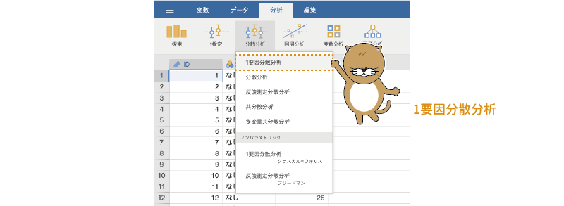
```

1要因分散分析の設定画面は次のようになっています（図\@ref(fig:ANOVA-oneway-settings)）。詳細については，後ほど個別に見ていくとして，ここではまず，大きな部分の構成だけを見ておきましょう。

```{r ANOVA-oneway-settings, fig.cap='1要因分散分析の設定画面', echo=FALSE}

```

:::{.jmvsettings data-latex=""}
+ Dependent Variables（従属変数）　分析対象の測定値が入力されている変数を指定します。
+ Grouping Variable（グループ変数）　グループの値が入力されている変数を指定します。
+ **Variances**（分散）　分析における分散の扱い方について設定します。
+ **Missing Values**（欠損値）　欠損値の処理方法について設定します。
+ **Additional Statistics**（追加の統計量）　記述統計量の算出と表示に関する設定を行います。
+ **Assumption Checks**（前提チェック）　分散分析の前提が満たされているかどうかを確かめます。
+ `r groupbar('Post Hoc Tests')`（事後検定）　分散分析の事後検定に関する設定を行います。
:::

1要因分散分析の基本設定は，対応なしt検定の場合とよく似ています。分析対象の測定値が入った変数を「Dependent Variables（従属変数）」の欄に，グループの別が入力されている変数を「Grouping Variable（グループ変数）」の欄に移動すれば，基本的な分析は終了です（図\@ref(fig:ANOVA-oneway-setvar)）。

```{r ANOVA-oneway-setvar, fig.cap='1要因分散分析の分析設定', echo=FALSE}

```


すると，図\@ref(fig:ANOVA-oneway-results)のような形で分析結果が表示されます。

```{r ANOVA-oneway-results, fig.cap='1要因分散分析の結果', echo=FALSE}

```

分散分析では，F分布と呼ばれる確率分布を利用して検定を行います。このFは，2つの分散の比に関する分布です。分散分析では，各条件の平均値の差（これを*主効果*といいます）の分散が誤差の分散の何倍の大きさかという形で検定統計量Fを算出します。そのため，主効果の分散の自由度（**df1**）と誤差の分散の自由度（**df2**）という，2種類の自由度が結果に表示されるのです。

表の右端の「**p**」は，このFの値についての有意確率です。このpの値が有意水準よりも小さければ条件間の平均値の分散が誤差の分散よりも有意に大きい（条件間で平均値に差がある）とみなします。

この分析結果では，有意確率は「p<.001」ですので，検定結果は有意です。つまり，実験条件によって課題成績の平均値に差があるというのが分析結果です。

### 分析の詳細設定{#sub:ANOVA-oneway-details}

対応なしt検定の場合と同様に，1要因分散分析も基本的な分析方法は非常に簡単なのですが，適切な結果を得るためには，この分析においてどのような設定が可能であるのかを知っておく必要があるでしょう。ここでは，1要因分散分析における分析設定の詳細について見ておくことにします。

#### Variances：分散{-}

分析設定画面の「**Variances**（分散）」には，次の2つの項目が含まれています。

:::{.jmvsettings data-latex=""}
- Don'tassume equal (Welch's)　各グループの分散が等しいと想定しない形で分析を行います（ウェルチの検定）
- Assume equal (Fisher's)　各グループで分散が等しいという仮定の元に分析を行います（フィッシャーの検定）
:::

この設定項目は，分析において各条件の分散をどう扱うかについての設定です。

対応なしt検定でも，2群で分散が等しいという仮定をおくか（*スチューデントの検定*），そのような仮定をおかないか（*ウェルチの検定*）という選択肢がありましたが，これは分散分析においても同様です。分散分析はイギリスの統計学者フィッシャーによって開発された手法ですが，この方法は各条件で分散が等しいことを前提としています。一般的な心理統計法の教科書で説明される分散分析はこちらの方法です。これに対し，ウェルチによる修正法ではそのような前提は必要としません。jamoviでは，この2つの方法のどちらを用いるかを選択することができます。

##### Don't assume equal (Welch's)：ウェルチの検定{-}

この設定項目で「Don'tassume equal (Welch's)（等分散を仮定しない：ウェルチの検定）」にチェックを入れると，各条件で分散が等しいという前提をおかない形で分析を行った結果が表示されます。jamoviの分散分析では初期設定値ではこちらの方法が選択されていますので，先ほど見た結果の表にも「One Way ANOVA (Welch's)」というように，ウェルチの方法を用いて分析したことが示されていました。

##### Assume equal (Fisher's)：フィッシャーの検定{-}

もう一方の「Assume equal (Fisher's)（等分散を仮定：フィッシャーの検定）」にチェックが入っている場合は，各条件の分散が等しいという前提のもとで分散分析を行った結果が表示されます。

この2つの方法で分析結果を比較して見てみると，検定統計量Fの値や誤差の自由度の値がかなり異なっているのがわかります（図\@ref(fig:ANOVA-oneway-fisher-results)）。

```{r ANOVA-oneway-fisher-results, fig.cap='1要因分散分析の結果', echo=FALSE}

```

適切な分析結果を得るためには，この2つの方法のどちらを用いるべきかをしっかり見極めなくてはなりません。

#### Missing Values：欠損値{-}

設定画面の「**Missing Values（欠損値）**」には，次の2つの項目が含まれています。

:::{.jmvsettings data-latex=""}
+ Exclude cases analysis by analysis（分析ごとに除外）
+ Exclude cases listwise（行全体を除外）
:::

これらはいずれも対応なしt検定のところで説明したものと同じですので，ここでは説明を省略します。詳細については対応なしt検定（第\@ref(ch:ttests)章）の「[Missing values（欠損値）](#subsub:ttest-missing-values)」のところを参照してください。

#### Additional Statistics：追加の統計量{-}

この「**Additional Statistics**（追加の統計量）」では，各条件の記述統計量を表に示すか，図に示すかを設定することができます。

:::{.jmvsettings data-latex=""}
+ Descriptives table（記述統計量の表）
+ Descriptives plots（記述統計量の図）
:::

ここで「Descriptives table（記述統計量の表）」にチェックを入れると記述統計量が表に，「Descriptives plots（記述統計量の図）」にチェックを入れると記述統計量が図に示されます（図\@ref(fig:ANOVA-oneway-additional-statistics)）。

```{r ANOVA-oneway-additional-statistics, fig.cap='追加の統計量の設定', echo=FALSE}
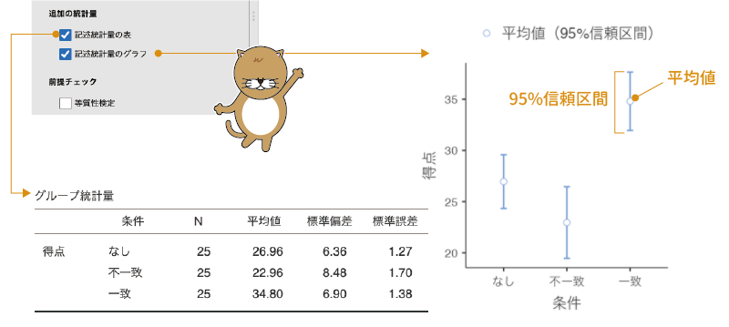
```

この設定で作成される記述統計量の表には，各条件の標本サイズ，平均値，標準偏差と平均値の標準誤差が示されます。また，記述統計量の図には，各条件の平均値と95%信頼区間が示されます。

#### Assumption Checks：前提チェック {-}

設定画面の「**Assumption Checks（前提チェック）**」には，次の3つの項目が含まれています。

:::{.jmvsettings data-latex=""}
+ Homogeniety test（等質性検定）　分散の等質性についての検定を行います。
+ Normality test（正規性検定）　データの正規性についての検定を行います。
+ Q-Q Plot（Q-Qプロット）　正規Q-Qプロットを作成します。
:::

```{r ANOVA-oneway-assumption-checks, fig.cap='前提チェック', echo=FALSE}

```

##### Homogeneity test：等質性検定{-}

先ほど「**Variances**（分散）」の設定のところでも触れたように，フィッシャーの方法による分散分析では，各条件で分散が等しいことが前提条件の1つとなっています。そこで「Homogeniety test（等質性検定）」では，ルビーン検定を用いて分散の等質性についての検定を行います。この検定では，「分散が等しい」ことを帰無仮説としているので，p値が有意水準を下回る場合には，分散が有意に異なるという結論になります（図\@ref(fig:ANOVA-oneway-assumption-checks)）。分散が有意に異なる場合には，フィッシャーの方法による分散分析では適切な結果が得られない可能性が高くなります。

##### Normlity test：正規性検定{-}

また，分散分析においても，t検定と同様にデータが正規分布にそっていることが前提となっています。この前提を満たしているかどうかを確認する方法として，jamoviではシャピロ=ウィルク検定とQ-Qプロットの2とおりが提供されています。シャピロ=ウィルク検定については記述統計やt検定のところで説明しているのでここでは詳しく触れませんが，この検定結果の有意確率pが有意水準を下回っている場合には，データの分布が正規分布からかけ離れていることが示唆されます。

##### Q-Q Plot：Q-Qプロット{-}

正規Q-Qプロットについても，これまで記述統計やt検定のところで説明してきているのでここでは詳しく触れません。この図のデータ点が右肩上がりの直線上に並んでいる場合にはデータが正規分布からかけ離れていないことが，そうでない場合には正規分布からかけ離れていることが示唆されます。これらの分析の結果，データが正規分布からかけ離れていることが示唆される場合には，ノンパラメトリック検定の使用を検討したほうがよいでしょう。


### Post-Hoc Tests：事後検定{#sub:ANOVA-oneway-posthoc}

分散分析では，条件の違いによって生じる平均値のばらつきが誤差による測定値のばらつきよりも大きいかどうかを検定しています。そのため，分散分析の結果が有意であった場合，条件によって平均値が異なる場合があるということはわかっても，どの条件とどの条件の間に差があるのかまではわかりません。

そこで，分散分析の結果が有意であった場合には，どの条件間に差があるのかを確かめるために*多重比較*と呼ばれる方法がとられるのが一般的です。多重比較では，3つあるいはそれ以上の条件の中から2つずつのペアを形成し，それぞれのペアについてt検定を行うという形で分析が行われます。ただし，そのままt検定を繰り返すと，検定全体での有意水準が設定した値（一般にはα=0.05）を大きく超えてしまうため，そうならないように調整を行った方法で比較が行われます。このようにして，分散分析の実施後に行われる詳細についての分析は，*事後検定*とも呼ばれます。

1要因分散分析の`r groupbar('Post-Hoc Tests')`（事後検定）には，次の設定項目が含まれています。

:::{.jmvsettings data-latex=""}
+ **Post-Hoc Test**（事後検定）　事後検定についての設定を行います。
  - None（なし）　事後検定を行いません。
  - Games-Howell (unequal variances)　ゲームス=ハウエル法による多重比較を行います。この方法では分散の等質性を仮定しません。
  - Tukey (equal variances)　テューキー法による多重比較を行います。この方法では各条件の分散が等質であることが前提となります。
+ **Statistics**（統計量）　事後検定の統計量に関する設定を行います。
  - Mean difference（平均値の差）　条件間の平均値の差を算出します。
  - Report significance（有意確率の報告）　検定統計量の有意確率（p値）を表示します。
  - Test results (t and df)（検定結果：tと自由度）　検定統計量と自由度を表示します。
  - Flag significant comparisons（差が有意なペアにマーク）　差が有意であったペアに「\*」などの印をつけて示します。
:::

#### Post-Hoc Test：事後検定{-}

まず，事後検定の方法（**Post-Hoc Test**：事後検定）について見てみましょう。jamoviの1要因分散分析では，多重比較の方法として*ゲームス=ハウエル法*と呼ばれる手法と*テューキー法*と呼ばれる手法の2とおりを使用することができます。

###### Games-Howell (unequal variances)：ゲームス=ハウエル法{-}

ゲームス=ハウエル法は，ペアとなる条件の分散が等しいという前提をおかない検定手法です。そのため，分散分析にウェルチの検定を用いた場合には，こちらの方法を用いるのが適切です。

ゲームス=ハウエル法の結果は，図\@ref(fig:ANOVA-oneway-posthoc-games)のような形で示されます。

```{r ANOVA-oneway-posthoc-games, fig.cap='ゲームス=ハウエル法による多重比較の結果', echo=FALSE}

```

###### Tukey (equal variances)：テューキー法{-}

もう1つのテューキー法は，ペアとなる2つの条件で分散が等しいことを前提とした多重比較の方法です。そのため，分散分析にフィッシャーの検定を用いた場合には，こちらの方法を用いるのが適切といえます。

テューキー法による多重比較の結果も，表示され方はゲームス=ハウエル法の場合と同じです。この2つでは，p値が異なる場合があるだけです（図\@ref(fig:ANOVA-oneway-posthoc-tukey)）。


```{r ANOVA-oneway-posthoc-tukey, fig.cap='テューキー法による多重比較の結果', echo=FALSE}

```

この多重比較の結果から，今回のサンプルデータでは一致条件と文字なし条件，一致条件と不一致条件の間で平均値の差が有意であることがわかります。

#### Statistics：統計量{-}

最後に，「**Statistics**（統計量）」の部分を見ておきましょう。ここに含まれる項目は，多重比較結果の表示方法について設定するものです。

##### Mean difference：平均値の差 {-}
まず，「Mean difference（平均値の差）」の項目では，条件間の平均値の差の表示・非表示を設定します。

##### Report significance：有意確率の報告 {-}
次に，「Report significance（有意確率の報告）」では，検定統計量の有意確率（p値）の表示・非表示を設定します。jamoviの初期設定値では，この2つがオンになっています。


##### Test results (t and df)：検定結果（tと自由度）
その次の「Test results (t and df)（検定結果：tと自由度）」の項目にチェックを入れると，それぞれの多重比較の際に算出された検定統計量tとその自由度の情報が表示されます。

##### Flag significant compariso：差が有意なペアにマーク {-}
最後の「Flag significant comparisons（差が有意なペアにマーク）」の項目にチェックを入れると，差が有意であった部分に「\*」などの印が表示されます。これらの設定項目のすべてにチェックを入れると，結果の表示は図\@ref(fig:ANOVA-oneway-posthoc-statistics)のようになります。

```{r ANOVA-oneway-posthoc-statistics, fig.cap='多重比較における検定統計量の表示設定', echo=FALSE}

```


## ANOVA：分散分析{#sec:ANOVA-anova}

```{r,echo=FALSE,message=FALSE,warning=FALSE}
data02<-read.csv('data/anova_data02.csv')

# ID
attributes(data02$ID)$`jmv-id`<-TRUE

# 課題成績
attributes(data02$得点)$measureType<-c('Continuous')

# 呈示条件
data02$条件<-factor(data02$条件)
attributes(data02$条件)$levels<-c('なし','不一致','一致')
attributes(data02$条件)$values<-c(1,2,3)
attributes(data02$条件)$measureType<-c('Nominal')

# 課題
data02$課題<-factor(data02$課題)
attributes(data02$課題)$levels<-c('文字','写真')
attributes(data02$課題)$values<-c(1,2)
attributes(data02$課題)$measureType<-c('Nominal')

out<-jmvReadWrite::jmvWrite(data02,'data/omv/anova_data02.omv')
```

先ほど見たように，分散分析は1つの要因に3つ以上のグループ（水準）がある場合の平均値の検定として使用される分析方法です。しかし，分散分析は単に3つ以上の平均値の間に差があるかどうかを見ることができるだけではありません。測定値に影響すると考えられる要因が複数ある場合に，それらの影響を同時に分析することもできるのです。むしろ，そうした複数要因の分析こそが，分散分析が本領発揮できる場面だといえるかもしれません。


### 考え方 {#sub:ANOVA-anova-basics}

分散分析の基本的な考え方については，すでに先ほどの1要因分散分析のところで説明しましたが，複数の要因による影響を分析する場合には，複数の要因それぞれによる単独の影響（*主効果*）の他に，それらの要因による組み合わせ効果である*交互作用*についても検討する必要があります。

交互作用は複数要因の組み合わせ効果のことをいうわけですが，ではその「組み合わせ効果」とは具体的にどのようなもののことをいうのでしょうか。ここでは，次のサンプルデータ（[anova_data02.omv](https://github.com/sbtseiji/jmv_compguide/raw/main/data/omv/anova_data02.omv)）を用いて交互作用がどのようなものであるのかを簡単に見ておくことにしましょう（図\@ref(fig:ANOVA-data02)）。

```{r ANOVA-data02, fig.cap='サンプルデータ', echo=FALSE}

```

:::{.jmvvar data-latex=""}
+ `ID`　実験参加者のID
+ `条件`　呈示条件（なし，不一致，一致）
+ `課題`　実験課題（文字，写真）
+ `得点`　課題成績（最低0&ndash;最高50）
:::

このデータは，1要因分散分析で使用したものとよく似ているのですが，このファイルには，画面の左右に表示された情報のうち，ネコの「写真」のほうのボタンを押してもらうという課題と，ネコという「文字」のほうのボタンを押してもらうという課題の2種類の課題を実施した結果が含まれています。この実験は，参加者を2つの課題&times;3つの刺激条件の組み合わせによる6つのグループに分けて実施しました。

なお，この実験ではそれぞれの条件に25人ずつの参加者を割りあてていたのですが，実験機器の不具合で，「写真・なし」の条件で参加者2人のデータが記録できていませんでした。そのため，このファイルに入力されているデータは，「写真・なし」条件のみ23人，残りの条件ではいずれも25人分です。

まずは，それぞれの条件における平均値を見てみましょう。Analysesタブの「`r infig('analysis-descriptives')` Exploration」から「Descriptives（記述統計）」を選択して実行し，「Variables（変数）」欄に「得点」を，「Split by（グループ変数）」に「条件」と「課題」を指定してください。そして，`r groupbar('Statistics')`（統計量）の部分で平均値（Mean）のチェックだけをオンにすると，結果は図\@ref(fig:ANOVA-anova-descriptives)のようになります。

```{r ANOVA-anova-descriptives, fig.cap='各条件の平均値を算出', echo=FALSE}

```

また，「Split by」に「条件」のみを入れた場合，「課題」のみを入れた場合についても平均値を求めましょう。そしてこれらの平均値を1つにまとめたのが表\@ref(tab:ANOVA-anova-marginal-means)です。

```{r,ANOVA-anova-marginal-means, echo=FALSE,message=FALSE}

data02.m<-jmv::descriptives(data02,vars(得点),splitBy = vars(条件,課題))
data02.mCOND<-jmv::descriptives(data02,vars(得点),splitBy = vars(条件))
data02.mKADAI<-jmv::descriptives(data02,vars(得点),splitBy = vars(課題))
data02.mALL<-jmv::descriptives(data02,vars(得点))

kadai.nashi.mean<-c(data02.m$descriptives$asDF$`得点[meanなし文字]`,
                    data02.m$descriptives$asDF$`得点[meanなし写真]`,
                    data02.mCOND$descriptives$asDF$`得点[meanなし]`)

kadai.hantai.mean<-c(data02.m$descriptives$asDF$`得点[mean不一致文字]`,
                    data02.m$descriptives$asDF$`得点[mean不一致写真]`,
                    data02.mCOND$descriptives$asDF$`得点[mean不一致]`)

kadai.onaji.mean<-c(data02.m$descriptives$asDF$`得点[mean一致文字]`,
                    data02.m$descriptives$asDF$`得点[mean一致写真]`,
                    data02.mCOND$descriptives$asDF$`得点[mean一致]`)

katai.total.mean<-c(data02.mKADAI$descriptives$asDF$`得点[mean文字]`,
                    data02.mKADAI$descriptives$asDF$`得点[mean写真]`,
                    data02.mALL$descriptives$asDF$`得点[mean]`)

x<-data.frame('なし'=kadai.nashi.mean,
              '不一致'=kadai.hantai.mean,
              '一致'=kadai.onaji.mean,
              '全体'=katai.total.mean)

rownames(x)<-c('文字','写真','全体')

x %>% kable(
  booktabs = TRUE,digits=c(2,2,2,2),
  caption = '各条件の平均値のまとめ'
)%>%
  kable_styling(latex_options = "HOLD_position")
```

```{r}
文字.dev<-round(x$全体[1],2) - round(x$全体[2],2)
写真.dev<-round(x$全体[2],2) - round(x$全体[3],2)
不一致.dev<-  round(x$不一致[3],2) -round(x$全体[3],2)
一致.dev<-  round(x$一致[3],2) -round(x$全体[3],2)
```

交互作用の説明に入る前に，まずは呈示条件と課題のそれぞれの主効果について考えます。この場合，たとえば呈示条件の主効果というのは，2つの課題の違いを考えないで，呈示条件の違いのみに注目した場合の平均値，先ほどの表でいうと，一番下の「全体」行にある`r round(x$なし[3],2)`，`r round(x$不一致[3],2)`，`r round(x$一致[3],2)`の違いということになります。同様にして，課題の主効果は表の右端にある`r round(x$全体[1],2)`と`r round(x$全体[2],2)`の2つの平均値の違いです。

このとき，たとえば不一致条件全体の平均値（`r round(x$不一致[3],2)`）は，呈示条件の違いを考えない参加者全員分の平均値（`r round(x$全体[3],2)`）より`r abs(不一致.dev)`だけ値が小さく，そして一致条件全体の平均値（`r round(x$一致[3],2)`）は全員の平均値より`r 一致.dev`だけ値が大きくなっています。これが呈示条件の違いによる主効果なわけです。


同様に，文字課題の平均値（`r round(x$全体[1],2)`）は全員の平均値（`r round(x$全体[3],2)`）より`r abs(文字.dev)`小さく，そして写真課題の平均値は全員の平均値より`r 写真.dev`大きくなっていて，これが課題の主効果です。

では，いよいよ交互作用です。交互作用の影響は，この平均値の表のどの部分にどのように表れているのでしょうか。ここで，文字課題の不一致条件の平均値に注目してください。先ほど文字課題の主効果について説明した際，文字課題の平均値は全員の平均値から\(-\textsf{`r abs(文字.dev)`}\)した値で，これが主効果だといいました。また，不一致課題の平均値は全員の平均値に比べて\(-\textsf{`r abs(不一致.dev)`}\)で，これが不一致条件の主効果です。

さて，もし呈示条件と課題の間に交互作用，つまり組み合わせによる効果がまったくなかったとしたら，文字・不一致条件の平均値はどのような値になると考えられるでしょうか。文字課題だと全体から\(-\textsf{`r abs(文字.dev)`}\)，不一致課題だと全体から\(-\textsf{`r abs(不一致.dev)`}\)なのですから，組み合わせによって効果が変わるようなことがなければ，文字・不一致条件の平均値は「全体（`r round(x$全体[3],2)`） + 文字課題（\(-\textsf{`r abs(文字.dev)`}\)）+ 不一致課題（\(-\textsf{`r abs(不一致.dev)`}\)）= `r (交互作用 <-round(x$全体[1],2) + round(x$不一致[3],2) - round(x$全体[3],2))`」で `r 交互作用`になるはずです^[人数が異なる条件が混じっているのでこのような計算では正確な値は得られませんが，人数の違いはわずかですのでここではこのように単純化して計算します。]。

ところが，実際の文字・不一致条件の平均値は（`r round(x$不一致[1],2)`）で，2つの主効果の影響を単純合計して求めた値からさらに2点ほど小さな値になっています。そしてこのずれの大きさが交互作用による影響です。文字・不一致条件の平均値が，文字条件の場合の影響と不一致条件の場合の影響から計算した値よりも小さいということは，文字条件と不一致条件という2つが組み合わさることによって，それらの効果を単純に合計するよりも，さらに平均値値を下げるような力が働いているということになるわけです。

そして分析においては，これらの交互作用の影響による分散が，主効果と同様に誤差の分散に比べて大きいといえるかどうかを確かめていくことになります。


### 分析手順{#sub:ANOVA-anova-procedure}

それでは分析手順を見てみましょう。分析の実行には，Analysesタブの「`r infig('analysis-anova')` ANOVA」から「ANOVA（分散分析）」を選択します（図\@ref(fig:ANOVA-anova-menu)）。

```{r ANOVA-anova-menu, fig.cap='分散分析の実行', echo=FALSE}
knitr::include_graphics("images/ANOVA/anova-menu.png")
```

すると，図\@ref(fig:ANOVA-anova-settings)のように1要因分散分析のときとは少し違った設定画面が表示されます。


```{r ANOVA-anova-settings, fig.cap='分散分析の設定画面', echo=FALSE}

```

:::{.jmvsettings data-latex=""}
+ Dependent Variables（従属変数）　分析対象の測定値が入力されている変数を指定します。
+ Fixed Factors（固定要因）　分析の独立変数（実験条件など）を指定します。
+ **Model Fit**（モデル適合度）　モデルの適合度について検定を行います。
+ **Effect Size**（効果量）　主効果および交互作用の効果量を算出します。
+ `r groupbar('Model')`（モデル）　分析モデルに関する設定を行います。
+ `r groupbar('Assumption Checks')`（前提チェック）　分析の前提が満たされているかどうかを確認します。
+ `r groupbar('Contrasts')`（対比）　
+ `r groupbar('Post Hoc Tests')`（事後検定）　分散分析の事後検定に関する設定を行います。
+ `r groupbar('Estimated Marginal Means')`（推定周辺平均）　分析モデルに基づく各条件の平均値の推定値（推定周辺平均）を算出します。
+ `r groupbar('Save')`（保存）　分散分析モデルの誤差（残差）を変数として保存します。
:::

1要因分散分析の場合と同様に，ここでもまずは基本設定での分析結果を見てみることにしましょう。設定画面の「Dependent Variables（従属変数）」の部分に「得点」を，そして「Fixed Factors（固定要因）」の部分には2種類の条件（「条件」と「課題」）を設定します。「*固定要因*」というのは，実験条件など，実験者によって値が固定されている変数のことです。


```{r ANOVA-anova-setvar, fig.cap='分散分析の分析設定', echo=FALSE}
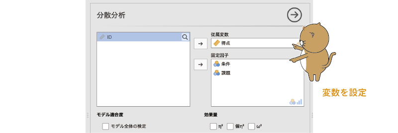
```


なお，この「ANOVA」のツールでは，1要因の分散分析も可能です。先ほどの「One-Way ANOVA（1要因分散分析）」は1要因分散分析に特化することで設定項目を簡素化していますが，その分，分析結果も最低限のものしか表示されません。分析データが1要因しかない場合であっても，より詳細な結果を知りたい場合には，こちらを使って分析するとよいでしょう。ただし，グループ間で分散が異なる場合のウェルチの検定を利用可能なのは「One-Way ANOVA」のみです。

さて，これで基本的な分析の設定は終わりです。分析結果を見てみましょう。

### 分析結果{#sub:ANOVA-anova-results}

分散分析の結果は，図\@ref(fig:ANOVA-anova-results)のような形で示されます。

```{r ANOVA-anova-results, fig.cap='分散分析の結果', echo=FALSE}

```

1要因分散分析の場合に比べ，表示される項目も多くなっています。まず，表の一番左の部分は分析に使用した変数めいで，ここには「条件＊課題」のように交互作用も含まれています。また，その列の一番下にあるのは，分散分析のモデルでは説明しきれないデータのばらつき（*残差*）で，これは誤差に相当する部分です。

変数名の隣には，「**Sum of Squares**（*2乗和*，*平方和*）」という値が示されています。これは，それぞれの条件における測定値と平均値のずれ（偏差）を2乗した値の合計値です。その1つ隣の「**df**」は自由度，そしてその隣の「**Mean Square**（*2乗平均*，*平方平均*）」は，先ほどの2乗和の値を自由度で割って求められる値で，これは主効果や交互作用の「分散」に相当する値です。

そしてその隣の「**F**」が検定統計量で，これはそれぞれの主効果や交互作用の2乗平均を残差の2乗平均で割って求められます。分散分析では，このFの値が，主効果または交互作用の自由度と誤差の自由度という2つの自由度を持つF分布において極端といえるほど大きなものであるかどうかを確かめます。

それぞれのF値が，対応するF分布においてどの程度の確率で生じうるかを示した値がその隣の有意確率pで，このpの値が有意水準を下回る場合に，その主効果または交互作用が有意と判断されます。今回の分析結果では，2種類の実験条件の主効果（呈示条件はF(2,142)=9.62でp &lt;.001，課題はF(1,142)=16.71でp &lt;.001）と，その2つの条件の組み合わせ効果である交互作用（F(2,142)=3.27でp=0.041）がいずれも有意となりました。つまり，これらの結果が意味することは，ネコという文字に対して反応するかネコ写真に対して反応するかで課題成績が異なり，また文字・写真とセットにして表示する情報の間に不一致があるかないかによっても課題成績が有意に異なるということ，そして課題，呈示条件の効果の大きさは，2つの条件の組み合わせ方によっても有意に異なるということです。

### 分析の詳細設定 {#sub:ANOVA-anova-details}

「ANOVA（分散分析）」の分析設定は，「One-Way ANOVA」に比べて複雑ですので，1つ1つ順番に確認していきましょう。まずは，変数設定欄のすぐ下にある項目からです。

#### Model Fit：モデル適合度{-}

この部分には，「Overall model test（モデル全体の検定）」の1項目だけが含まれています。この項目にチェックを入れると，*帰無モデル*（独立変数を1つも使用しないモデル）に比べて，分析モデルのデータへの適合度が有意に高いといえるかどうか（モデル全体の説明力が0でないかどうか）についての検定結果が表示されます（図\@ref(fig:ANOVA-anova-overalltest)）。


```{r ANOVA-anova-overalltest, fig.cap='モデル全体の検定', echo=FALSE}

```


この検定は，第\@ref(ch:regression)章の*線形回帰*におけるモデル全体の適合度の検定と同じものです。この検定の結果における有意確率pが有意水準より小さい場合，モデルは有意（説明力が0でない）と判断されます。


#### Effect Size：効果量{-}

検定統計量というのは，帰無仮説が正しい場合にこのデータのような値が得られる確率がどれくらいかを見るための値であって，差の大きさや効果の大きさを示す値ではありません。そのため，標本サイズが大きなデータの場合，ごくわずかな平均値の違いであっても，分散分析の結果が有意になる場合があります。そこで，主効果や交互作用の大きさについて評価する際には，標本サイズによる影響を受けくにい指標として*効果量*が用いられます。

jamoviでは，分散分析の効果量として$\eta^2$（*イータ2乗*），偏$\eta^2$（*偏イータ2乗*，$\eta^2_p$），$\omega^2$（*オメガ2乗*）という3種類の値を算出することができます（図\@ref(fig:ANOVA-anova-es)）。

```{r ANOVA-anova-es, fig.cap='分散分析の効果量', echo=FALSE}

```


まず，$\eta^2$ですが，これは主効果や交互作用の偏差の2乗和をデータ全体の偏差2乗和で割った値です。つまり，その主効果あるいは交互作用の影響が，データ全体のばらつきに比べてどの程度大きいかを示します。この$\eta^2$の大きさの解釈の目安は表\@ref(tab:ANOVA-anova-eta-interpretation)のとおりです。


```{r ANOVA-anova-eta-interpretation}
eta.es %>% 
  kable(align="cc", caption = "$\\eta^2$の解釈の目安",booktabs=T,escape=F)%>%
  kable_styling(latex_options = "HOLD_position")
```


ただ，このようにして効果量を算出する場合，分析モデルにたくさんの主効果や交互作用が含まれていると，必然的に1つ1つの主効果や交互作用の全体に占める影響力は小さくなってしまいます。そこで，主効果または交互作用の偏差2乗和を，その主効果・交互作用の偏差2乗和と誤差（残差）の偏差2乗和の合計で割って求めた値が偏イータ2乗（$\eta^2_p$）です。

なお，1要因分散分析の場合，この$\eta^2_p$と$\eta^2$の値は同じになりますので，解釈の際にはそれを目安にすることができます。ですが，2要因以上ある場合には，$\eta^2_p$の値の大きさを解釈する際の目安となるような基準はありません。また，別の要因による主効果が大きい場合には，それによって分析モデルの残差は小さくなり，結果としてこの要因の効果量も大きくなってしまうというように，偏$\eta^2$の値では効果が過大視されやすい傾向にあります。

そこで，そうした影響を取り除くために，これら以外にもさまざまな効果量が考案されているのですが，その1つが$\omega^2$（オメガ2乗）です。$\omega^2$は，$\eta^2$と同様に主効果または交互作用の偏差2乗和をデータ全体の偏差2乗和で割って算出される値です。ただしその際，実験デザインなどが原因で効果量が小さくなりすぎたり大きくなりすぎたりすることがないように，分母と分子の値を主効果の自由度と残差の2乗平均で調整して計算を行います。この値の解釈の目安は，基本的には$\eta^2$と同じです。

どの値にも一長一短があり，これらの効果量のうちどれを使うかは判断がなかなか難しいところですが，現在のところもっとも一般的なのは$\eta^2_p$の値です。

### Model：モデル{#sub:ANOVA-anova-model}

分散分析の設定画面にある`r groupbar('Model')`（モデル）を展開すると，図\@ref(fig:ANOVA-anova-model)のような画面が表示されます。この画面では，分散分析の分析モデルについての設定を行います。


```{r ANOVA-anova-model, fig.cap='分析モデルの設定', echo=FALSE}

```

#### Model Terms：モデル項{-}

今回のサンプルデータのように複数の要因（呈示条件と課題）を用いた分散分析を行う場合，基本設定では各要因の主効果と，それらの主効果によるすべての交互作用が分析に含まれます。この設定画面では，「Model Terms（モデル項）」の欄に呈示条件の主効果（「条件」），課題の主効果（「課題」），そして条件&times;課題の交互作用（「条件＊課題」）が入っているのがわかると思います。なお，このように，分析モデルに含める主効果や交互作用は*項*と呼ばれます。

さて，多くの場合はこれで問題ないのですが，分析に使用する要因が3つあるいは4つというように多くなると，分析モデルが非常に複雑になってしまいます。たとえば，A，B，Cという3つの要因を用いた場合には，A，B，Cのそれぞれの主効果，A&times;B，A&times;C，B&times;Cの交互作用，そしてA&times;B&times;Cの交互作用という，全部で7種類もの影響について見ることになるのです。

要因が3つの場合でこれですから，要因が4つ以上になれば交互作用の数が膨大になり，結果の解釈が困難になるのは容易に想像できます。そこで，そのような場合には，分析モデルを単純化するために，結果に直接影響しない要因，あるいは研究仮説において関心の対象とならない要因を分析から除外することがあります。

今回の分析ではとくに必要ないのですが，せっかくですのでこの画面における設定方法を見ておきましょう。この段階では，すでに分析に含めることのできる要素がすべて含まれていますので，一旦，これらすべてを分析モデルから削除します。「Model Terms」に含まれる項目を選択すると画面中央の「`r infig('action-forward')`」の向きが「`r infig('action-back')`」に変わりますので，それをクリックすると選択した項目がモデルから除外されます（図\@ref(fig:ANOVA-anova-model-2)）。


```{r ANOVA-anova-model-2, fig.cap='分析モデルから項目を除外', echo=FALSE}

```

「Model Terms」が空っぽになったら，画面左側の「Components（要因）」にある「条件」と「課題」を選択し，今度は真ん中に2つあるボタンのうち下のほうのボタンをクリックしてください。すると，次の項目を含むポップアップが表示されます（図\@ref(fig:ANOVA-anova-model-popup)）。

```{r ANOVA-anova-model-popup, fig.cap='項目追加用のポップアップメニュー', echo=FALSE}

```

:::{.jmvsettings data-latex=""}
+ Interaction（交互作用）　選択項目で構成される交互作用をモデルに投入します。
+ Main Effects（主効果）　選択した項目の主効果をモデルに投入します。
+ All 2 way（2要因の交互作用すべて）　選択項目のうち2つで構成される交互作用をすべてモデルに投入します。
+ All 3 way（3要因の交互作用すべて）　選択項目のうち3つで構成される交互作用をすべてモデルに投入します。
+ All 4 way（4要因の交互作用すべて）　選択項目のうち4つで構成される交互作用をすべてモデルに投入します。
+ All 5 way（5要因の交互作用すべて）　選択項目のうち5つで構成される交互作用をすべてモデルに投入します。
:::

試しに「Main Effects」を選択してみてください。すると，「条件」と「課題」という2つの主効果だけがモデルに投入されます。ここで「Interation」や「All 2 way」を選択した場合には，交互作用のみがモデルに投入されます。

なお，今回のデータでは要因は2つしかありませんので，「Interation」と「All 2 way」で動作は同じになります。しかし，分析に使用する要因が3つある場合には，「Components」で3つの要因すべてを選択して「Interaction（交互作用）」をクリックすると，その3つの要因で構成されるすべての交互作用が，「All 2 way」をクリックすると，そのうちの2つの要因で構成される交互作用の全組み合わせがモデルに投入されます。

分析に使用する要因が多い場合には，このようにして必要な要素だけをモデルに投入し，できるだけ単純なモデルにしたうえで分析結果を見ていくことになります。

#### Sum of squares：2乗和のタイプ{-}

複数の要因を用いた分散分析の場合，分析の際に注意すべき点が1つあります。それは，各条件の中に標本サイズ（測定値の個数）の異なるものが混じっている場合，主効果や交互作用の大きさを計算する方法が複数とおりあり，そのうちのどれを用いるかによって分析結果が異なるということです。

今回のサンプルデータでは，ちょっとしたアクシデントのために「写真・なし」条件の測定値が他の条件に比べて2人分少なくなっています。このような，条件間の標本サイズが均等でないデータの場合には，各測定条件で測定値の偏差2乗を求めて合計するという方法ではなく，帰無仮説となるモデルと分析モデルの間で残差の大きさを比較することによって，主効果や交互作用が有意かどうかを判断するという方法が取られます。そして，この際の比較の仕方に複数とおりの方法があるのです。

一般に，これらの方法の違いは「*タイプ1の2乗和*（*タイプ1 SS*）」や「*タイプ2の2乗和*」（*タイプ2 SS*）などのように，「タイプ○の2乗和」という名前で区別されています。その方法は全部で4つから5つほどあるのですが，そのうち統計ソフトなどで一般によく用いられているのは，タイプ1とタイプ3の方法です。なお，jamoviではこのタイプ1とタイプ3の2つに加え，タイプ2の方法を用いて結果を算出することもできます。

###### Type 1：タイプ1{-} 
さて，これらの「タイプ」は何が違うのでしょうか。まず，「タイプ1」と呼ばれる方法について見てみましょう。この方法では，次のような考え方で主効果と交互作用の影響について検定していきます。ここでは，サンプルデータの場合（2要因分散分析）を例に説明します。

1. まず，主効果や交互作用を1つも含まないモデル（帰無モデル）と「条件」の主効果を含む分析モデルの間でモデルの残差を比較します。帰無モデルの残差と分析モデルの残差の差が，「条件」の主効果です。

2. 次に，「条件」の主効果を含むモデルと，そこに「課題」の主効果を加えたモデルの間で比較を行います。最初のモデル（「条件」のみ）と新たなモデル（「条件」と「課題」）の残差の差が「課題」の主効果です。

3. 最後に，主効果のみを含むモデルと，そこに交互作用を加えたモデルの間で比較を行います。主効果のみのモデルと交互作用を含むモデルの残差の差が「条件＊課題」の交互作用です。

このようにして主効果や交互作用の値を求める場合，主効果や交互作用をどのような順番で分析モデルに投入したかが分析結果に大きく影響します。最初にモデルに投入した主効果の影響が大きいと，その主効果によって大部分の残差が説明されてしまうため，あとからモデルに投入する主効果の影響が，計算上は小さなものになってしまうのです。

主効果をモデルに投入する順番によって計算結果が異なるというのは，jamoviで簡単に確かめることができます。この設定画面の左下に「Sum of squares（2乗和）」という設定項目があるので，そこを「Type 1」に設定してください。このように設定すると，タイプ1の方法を用いた分散分析の結果が表示されます。

そしてその状態で，「Model Terms」の「条件」と「課題」の順番をマウスでドラッグして入れ替えてみてください。すると，「条件」を上にした場合と「課題」を上にした場合で，結果の「Sum of Squares」の値が変わるのがわかります（図\@ref(fig:ANOVA-anova-model-type1)）。統計検定量のFの値はこの2乗和をもとに算出されますので，当然ながらそれらの値も変わってきます。

```{r ANOVA-anova-model-type1, fig.cap='タイプ1の方法を用いた分析結果', echo=FALSE}
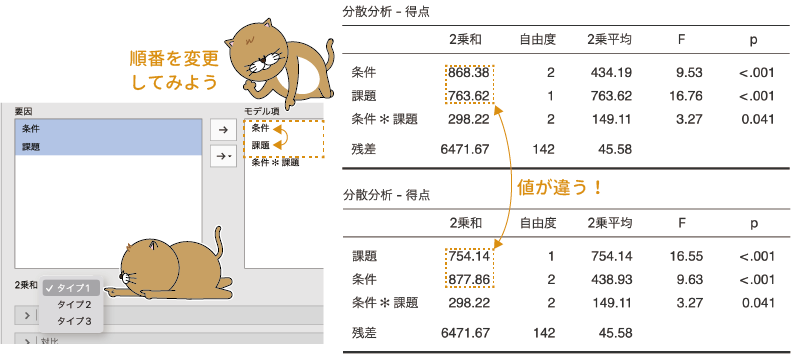
```

今回のデータでは，順番を入れ替えることによる違いはそれほど大きくなく，最終的な分析結果への影響はありませんが，分析データによっては，こうした順番の影響によって，主効果が有意になったりならなかったりする場合があるのです。そのため，このタイプ1の方法は，主効果の投入順序について何らかの強い仮説があるような場合を除き，実際の分析場面で用いられることはほとんどありません。

###### Type 3：タイプ3{-} 

順番が前後しますが，先にタイプ3の方法について見ておきましょう。タイプ3の方法では，次のようにして主効果や交互作用の影響を算出します。ここでも，サンプルデータの場合を例に説明します。

1. まず，検討対象の主効果と交互作用をすべて含む分析モデル（完全モデル）を作成します。

2. 次に，そのモデルから「条件」の主効果を削除したモデルを作成し，すべての項目を含む完全モデルと呈示条件抜きのモデルで比較を行います。2つのモデルの残差の差が「条件」の主効果です。

3. 今度は，最初の完全モデルから「課題」のみを削除したモデルを作成し，このモデルと完全モデルの間で比較を行います。この2つのモデルの差が，「課題」の主効果です。

4. 最後に，最初の完全モデルから，交互作用を削除したモデルを作成し，このモデルと完全モデルの間で比較を行います。この結果が交互作用の値です。

このように，タイプ3はタイプ1とは逆で，すべての項目を含むモデルと，そこから特定の交互作用や主効果を取り除いたモデルとの間で比較を行います。このタイプ3の方法では，どのような順番で主効果をモデルに投入しても計算結果が同じになります。そのため，条件間で標本サイズが異なるデータの場合には，このタイプ3の方法が用いられるのが一般的です。

###### Type 2：タイプ2{-} 

最後に，タイプ2の方法についても見ておきましょう。タイプ2では，次のようにして主効果と交互作用の値を算出します。

1. まず，検討対象の主効果と交互作用をすべて含む分析モデル（完全モデル）を作成します。

2. 次に，そこから「条件」の影響を取り除いたモデルを作成します。このとき，「条件」の主効果だけでなく，「条件」が関係している交互作用（「条件＊課題」）についても分析モデルから除外します。そして，そのモデルと完全モデルの間で比較を行います。その結果が呈示条件の主効果です。

3. 今度は，最初の完全モデルから「課題」の影響をすべて取り除いたモデルを作成します。このときも，やはり主効果だけでなく交互作用についても削除します。そして，そのモデルと完全モデルの間で比較した結果が「課題」の主効果です。

4. 最後に，最初の完全モデルから，交互作用を削除したモデルを作成し，このモデルと完全モデルの間で比較を行います。この結果が交互作用の値です。

このタイプ2とタイプ3の違いは，各要因の主効果の影響を取り除く際に，その要因が関与している交互作用についても分析モデルから取り除くかどうかという部分です。タイプ2の方法でも，主効果の分析の順序によって結果が変わるようなことはありません。

タイプ2の方法では，たとえば「課題」の主効果の影響を削除する場合には，「課題」が関係する交互作用もモデルから削除します。この場合，残ったモデルには「課題」の影響は含まれていません。しかし，タイプ3の方法では，「課題」の主効果の影響を削除したモデルを作成する際も，交互作用についてはそのままですので，モデルの中には「課題」の影響が一部残ったままになっています。

これは考えてみるとちょっとおかしな状況で，実際，jamoviでは，交互作用を残したままで主効果だけを取り除いたモデルというのは作成できません。「Model Terms」から「課題」あるいは「条件」のいずれかの要因を選択し，その項目をモデルから除外してみてください。するとその要因が関係する交互作用も同時にモデルから外されるはずです。

このように，タイプ3の方法には少し奇妙な部分があり，その点ではタイプ2の方がスマートな方法のように思えるのですが，タイプ2の方法では要因数が増えると比較するモデルを作成するのが複雑になるためか，一般にはあまり用いられていません。

### Assumption Checks：前提チェック{#sub:ANOVA-anova-assumption-checks}

`r groupbar('Assumption Checks')`（前提チェック）には，次の項目が含まれています（図\@ref(fig:ANOVA-anova-assumption-checks)）。

```{r ANOVA-anova-assumption-checks, fig.cap='前提チェックの項目', echo=FALSE}

```

:::{.jmvsettings data-latex=""}
+ Homogeneity test（等質性検定）　分散の等質性の検定を行います。
+ Normality test（正規性検定）　分布の正規性についての検定を行います。
+ Q-Q Plot（Q-Qプロット）　正規Q-Qプロットを作成します。
:::

これらの設定については，「One-Way ANOVA」と同じですので，ここでの説明は省略します。

### Contrasts：対比{#sub:ANOVA-anova-contrasts}

前提チェックの下にある`r groupbar('Contrasts')`（コントラスト）を展開すると，次のような画面が表示されます。この画面では，各主効果の*対比*の設定を行うことができます（図\@ref(fig:ANOVA-anova-contrasts)）。

```{r ANOVA-anova-contrasts, fig.cap='対比の設定項目', echo=FALSE}

```

さて，「対比」とは一体何なのでしょうか。

今回のサンプルデータでは，「課題」の要因には「文字」と「写真」の2つの水準しかありませんので，課題の主効果が有意であるということは，文字課題と写真課題で課題成績の平均値が異なるということだとわかります。しかし，「条件」には「なし」，「不一致」，「一致」の3つの水準が含まれていて，分散分析で主効果が有意であったという結果だけでは，これら3つの水準間のどこに差があるのかまではわかりません。その場合，「なし」と「不一致」，「なし」と「一致」，「不一致」と「一致」というように，3つ水準から2つずつを取り出して各水準間の平均値の差について検討する*多重比較*が行われるのが一般的です。

しかし，研究の目的によっては，このように2つずつ取り出して比較するのではなく，別の形で水準間の差を検討したい場合があります。たとえば，ある病気に対する新しい治療薬の効果を確かめるために，代表的な既存の治療薬2種との比較を行ったとします。この場合，知りたいのは新薬の効果が既存薬より優れているかどうかなので，既存薬同士の効果の比較にはほとんど意味がありません。この場合には，既存薬1と新薬，既存薬2と新薬の比較という形で新薬の効果について検討する方が目的にそっているといえるでしょう。このように，単純な多重比較を行うのではなく，研究目的にそった形で各水準の比較を行いたい場合に使用されるのが*対比*（*コントラスト*）です。

`r groupbar('Contrasts')`の画面には，分析に用いた2つの変数（「条件」と「課題」）が表示されており，その右側に「none」という表示のメニュー項目があります。そしてこの部分をクリックすると，「none（なし）」の他に選択肢として6つの対比が表示されます（図\@ref(fig:ANOVA-anova-contrasts-popup)）。

```{r ANOVA-anova-contrasts-popup, fig.cap='対比のメニュー', echo=FALSE}

```

:::{.jmvsettings data-latex=""}
+ deviation（偏差対比）　
+ simple（単純対比）
+ difference（差分対比）
+ helmert（ヘルマート対比）
+ repeated（反復対比）
+ polynomial（多項式対比）
:::

この6つの対比について，それぞれ簡単に見ておきましょう。

###### deviation（偏差対比）{-}

「条件」の対比を「none」から「deviation」に変更すると，図\@ref(fig:ANOVA-anova-contrast-deviation)のような結果が表示されます。

```{r ANOVA-anova-contrast-deviation, fig.cap='偏差対比', echo=FALSE}

```

この表の「**Estimate**（推定値）」の部分はそれぞれの対比における差の値，その隣が差の標準誤差，そして表の右側2つはその差が有意といえるかどうかについての検定結果です。そしてこの有意確率pの値が有意水準を下回る場合に差が有意であると判断します。この結果では，どちらの差も有意です。なお，この欄の名前が「推定値」になっているのは，これらの平均値の差には，この分散分析のモデルから算出された値（*推定周辺平均*）が用いられているからです。

この*偏差対比*と呼ばれる方法は，各水準の平均値が全体に比べて高い（低い）といえるかどうか（ある条件が他から突出しているかどうか）に関心がある場合の対比方法です。この方法では，基準レベルを除く各水準の平均値と，全体の平均値の間で比較を行います。

「基準レベル」というのは，その要因の主効果の大きさを評価する際に基準として用いられる水準のことです。jamoviの「ANOVA」では，それぞれの主効果については各要因の最初の水準値を基準にして主効果の大きさを計算します。今回のサンプルデータ場合，課題では「文字」条件が，呈示条件では「なし」条件が，それぞれ主効果の大きさを計算する場合の基準として用いられているのです。

そのため，この偏差対比の結果の「**Estimate**（推定値）」の部分には，「なし」条件以外の各水準，つまり「不一致条件」と「一致条件」のそれぞれの平均値について，全体の平均値と比較した場合の差が示されています。この偏差対比で「なし条件」と全体の比較の値が欲しい場合，単に差を知りたいだけであれば後に説明する推定周辺平均の値を利用して自分で算出することもできますが，そうでなければ分析の際に基準レベルとして使用される水準を変更しなければなりません。

残念ながら，今のところ「ANOVA」の設定画面では各主効果の基準レベルを変更することができないため，これを変更したい場合には，変数そのものの設定で水準の順序を変更する必要があります。ここで，その方法についても見ておくことにしましょう。設定画面右上の`r infig('action-back-circle')`をクリックして，「ANOVA」の設定画面をいったん閉じてください。

スプレッドシート画面に戻ったら，「`r infig('variable-nominal')` 条件」の列名の部分をダブルクリックして，変数の設定画面を表示させます。そしてその画面の「Levels（水準）」の部分で，「なし」をクリックして選択した後に，「`r infig('action-down')`」をクリックして「なし」の順番を上から2番目に変更します（図\@ref(fig:ANOVA-anova-contrast-level-edit)）。


```{r ANOVA-anova-contrast-level-edit, fig.cap='水準の基準レベルを変更', echo=FALSE}
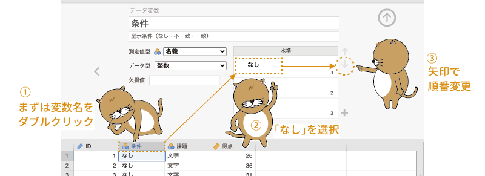
```

すると，分散分析結果の対比の表の部分にその変更が反映されて，「なし」の平均値と全体の平均値との対比の結果が表示されます。差の値を確認できたら，水準の順番は元に戻しておきましょう。

###### simple（単純対比）{-}

2つ目の*単純対比*は，それぞれの要因における基準レベルの平均値と，それ以外の水準の平均値との比較です。この対比は，各実験群の平均値が統制群と比べて高い（低い）といえるかどうかに関心がある場合などに使用される方法です（図\@ref(fig:ANOVA-anova-contrast-simple)）。

```{r ANOVA-anova-contrast-simple, fig.cap='単純対比の結果', echo=FALSE}
knitr::include_graphics("images/ANOVA/anova-contrast-simple.png")
```

今回の分散分析では「なし」条件が基準レベルとして用いられているので，この結果の表でも，「不一致」と「なし」の差，「一致」と「なし」の差が示されています。この結果では，「不一致」と「なし」の間に有意な差（p=0.002）が見られています。

###### difference（差分対比）{-}

3つ目の*差分対比*は，基準レベル（1番目）の水準と2番目の水準について比較を行った後に，1番目と2番目の水準を平均した値と3番目の水準の比較，そしてその後に1〜3番目の水準の平均と4番目の水準というようにして水準間の対比を行う方法です。この方法は，その主効果の要因が順序型変数の場合で，その要因の値の変化とともに平均値が増大（減少）するような影響があるかどうかを見たい場合に使用されます（図\@ref(fig:ANOVA-anova-contrast-difference)）。


```{r ANOVA-anova-contrast-difference, fig.cap='差分対比の結果', echo=FALSE}

```


なお，この対比を用いる場合には，その主効果の各水準が適切な順序に並べられている必要があります。その変数の設定画面で，「levels（水準）」の部分が正しい順序になっているか確認しておきましょう。

###### helmert（ヘルマート対比）{-}

4つ目の*ヘルマート対比*は，各水準とそれ以降の水準の平均値で比較する方法です。まず基準レベル（1番目）と2番目以降の水準の平均値を比較し，次に2番目の水準と3番目以降の水準の平均値を比較するという形で水準間の対比を行います（図\@ref(fig:ANOVA-anova-contrast-helmert)）。対比の方法としては，ちょうど差分対比の逆の方法です。差分対比の場合と同様に，この方法でもその要因の各水準が適切な順序に並べられている必要があります。

```{r ANOVA-anova-contrast-helmert, fig.cap='ヘルマート対比の結果', echo=FALSE}

```

###### repeated（反復対比）{-}

5つ目の*反復対比*は，各水準の平均値と，その直後の水準の平均値で比較する方法です。「repated（反復された）」とあるように，この方法はその要因の各水準の値を1回目，2回目，3回目，というように繰り返し測定した場合などに用いられます（図\@ref(fig:ANOVA-anova-contrast-repeated)）。この対比でも，各水準の順序が適切に設定されていなければなりません。

```{r ANOVA-anova-contrast-repeated, fig.cap='差分対比の結果', echo=FALSE}

```


###### polynomial（多項式対比）{-}

6つ目の*多項式対比*は，他の対比とは少し異なる対比方法です。この対比では，それぞれの水準の平均値を他の水準の平均値と比較するのではなく，その要因の各水準の平均値の変化に1次式や2次式などによって表せる傾向があるかどうかを検討します。その要因に含まれる水準が3つの場合には1次式（linear）と2次式（quadratic）に対するあてはめが，水準数が4の場合には1次から3次（cubic），5の場合には1次から4次（quartic）というように，その水準数\(-\textsf{1}\)の次数までの多項式に対するあてはめが行われます（図\@ref(fig:ANOVA-anova-contrast-polynomial)）。なお，この対比では，対比に用いる要因の各水準に決まった順序があるだけでなく，それらの水準が互いに等間隔であることが前提となります。

```{r ANOVA-anova-contrast-polynomial, fig.cap='多項式対比の結果', echo=FALSE}

```

この対比では，有意性検定の結果の見方に注意が必要です。他の対比では，帰無仮説は「平均値の差は0である」ですので，検定が有意であった場合には，その対比において「平均値に差がある」という結論になります。ところが多項式対比では，「すべての条件で平均値が同じであるとするモデル（何も説明していないモデル）」と「多項式で各条件の平均値を説明しようとするモデル」の間で「説明力の差が0である」というのが帰無仮説になっています。そのため，この対比の検定で検定結果が有意であった場合には，「何も説明していないモデルよりも説明力が高い」ということであり，その多項式がうまくあてはまっているという意味になるのです。

今回のサンプルデータでは「条件」の各水準に順序関係はないため，この対比の結果に意味はありませんが，仮にこれらの水準に明確な順序性があり，そしてそれらが等間隔になっていたとしましょう。すると，この結果では1次（linear）は有意でなく，2次（quadratic）が有意になっていますので，各条件の平均値は直線的に変化するのではなく，2次関数的に変化する傾向を持っているということになります。このデータの各水準の平均値に1次の対比と2次の対比をあてはめた場合を図にすると図\@ref(fig:ANOVA-anova-contrast-polynomial-plot)のようになり，確かに2次の対比の方が各条件の平均値のばらつきをうまく説明できることがわかります。

```{r ANOVA-anova-contrast-polynomial-plot, fig.cap='各条件の平均値と多項式対比', echo=FALSE}
knitr::include_graphics("images/ANOVA/anova-contrast-polynomial-plot.png")
```


### Post Hoc Tests（事後検定）{#sub:ANOVA-anova-posthoc}

各水準間の平均値の差について何らかの仮説がある場合には，適切な対比を用いてそれらの差について見ていくことになりますが，そうではなく，総あたり式に各水準間の平均値の差を見たい場合には，事後検定として*多重比較*を用いることになります。

「ANOVA」の設定画面にある`r groupbar('Post Hoc Tests')`（事後検定）を展開すると，図\@ref(fig:ANOVA-anova-posthoc)のような画面が表示されます。「One-Way ANOVA」にも同名の設定項目グループがありますが，ここで表示される内容は，それとはかなり異なったものになっています。

```{r ANOVA-anova-posthoc, fig.cap='事後検定の設定項目', echo=FALSE}
knitr::include_graphics("images/ANOVA/anova-posthoc.png")
```

:::{.jmvsettings data-latex=""}
+ **Correction**（修正）　多重比較における検定統計量や有意水準の修正について設定します。
  + No correction（修正なし）　検定統計量や有意水準を修正せずに多重比較を実施します。
  + Tukey（テューキー）　テューキー法を用いて検定統計量の修正を行います。
  + Scheffe（シェフェ）　シェフェ法を用いて検定統計量の修正を行います。
  + Bonferroni（ボンフェロニ）　ボンフェロニ法を用いて有意水準の修正を行います。
  + Holm（ホルム）　ホルム法を用いて有意水準の修正を行います。
+ **Effect Size**（効果量）　多重比較における効果量の算出について設定します。
  + Cohen's d（コーエンのd）　コーエンのdを算出します。
    + Confidence interval（信頼区間）　効果量dの信頼区間を算出します。
:::

この画面左側の主効果・交互作用の一覧から，多重比較を行いたい主効果や交互作用を選択して画面右側の欄に移動すると，その項目についての多重比較結果が表示されます。ここでは，「条件」と「条件＊課題（条件&times;課題の交互作用）」について多重比較を行うことにしましょう。

なお，今回の分析では，「条件」と「課題」のそれぞれの主効果と，「条件&times;課題」の交互作用のすべてが有意でしたが，「課題」の主効果については事後検定の必要はありません。なぜなら，「課題」の要因には「文字」と「写真」の2水準しかないため，主効果が有意であれば，この2つの間に差があるということが明らかだからです。

「条件」と「条件＊課題」の2つを画面右側に移動すると，図\@ref(fig:ANOVA-anova-posthoc-results)のような形で主効果についての多重比較の結果と交互作用についての多重比較の結果が表示されます。

```{r ANOVA-anova-posthoc-results, fig.cap='多重比較の結果', echo=FALSE}
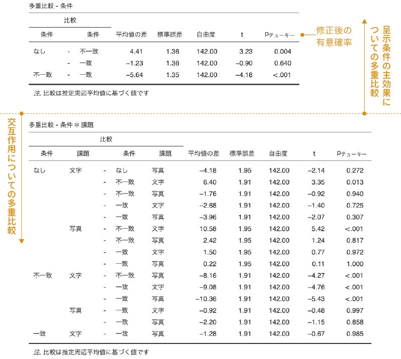
```

交互作用の多重比較については組み合わせが多くなるので，どうしても大きな表になってしまいますが，表に含まれている項目は主効果の多重比較の場合と同じです。ここでは，主効果についての多重比較結果の表を中心に，結果の見方を見ておきましょう。

「ANOVA」の多重比較では，それぞれの比較結果が1行ずつ表示されていて，「One-Way ANOVA」の場合とは違った形になっています。この表の一番左には，比較したペアが示されています。同じ項目が連続する場合，繰り返しの部分は省略された形で表示されますのでその点に注意してください。たとえば，「条件」の主効果の結果では，「なし - 不一致」の次の行には「 - 一致」としか書いてありませんが，これは「なし」が1行目の繰り返しであるために省略されているのです。

表の左から2列目（**Mean Difference**：平均値の差）には，その比較における平均値の差が示されています。ただし，各水準でサンプルサイズが異なる場合には，この「平均値の差」は，実際の各条件の平均値の差とは完全には一致しません。平均値の差を算出する際に，分散分析の分析モデルから算出される各条件の平均値（推定周辺平均）が用いられているためです。

その隣の「**SE**（標準誤差）」は，この平均値の差の標準誤差です。それより右側には，平均値の差の検定における自由度（**df**），検定統計量（**t**）と，修正後の有意確率（**p**）が示されています。なお，最後の有意確率については，これがテューキー法による修正後の有意確率であることを示すために，「p」の部分に「tukey」という表示が加えられています。この表に示された結果から，呈示条件の各水準間では，「なし」と「不一致」の間，「不一致」と「一致」の間に有意な差があるということがわかります。

交互作用の部分の結果についても，表のサイズは大きいですが中身は主効果についての多重比較と同じです。なお，交互作用についての多重比較では1つ注意しておくべき点があります。それは，ここでの多重比較はすべての組み合わせについて総あたり式に行われているため，この表の中には解釈が不能なペアについての結果も含まれているという点です。

たとえば，交互作用についての表の上から3番目には，「なし 文字」の平均値と「不一致  写真」の平均値の差の検定結果が示されていますが，これは呈示条件と課題の両方が異なる組み合わせでの比較ですので，ここに有意な差があったとしても，それが呈示条件の違いによるものなのか，課題の違いによるものなのかが区別できません。交互作用についての多重比較結果を見る際には，このような解釈不能な比較の結果に惑わされないようにしてください。


#### Correction：修正{-}

結局のところ，多重比較というのは3つ以上ある水準の中から2つずつを取り出して，それぞれについてt検定を繰り返し行っているようなものです。そのため，そのままでは検定全体での*第1種の誤り率*（帰無仮説を誤って棄却してしまう確率：*危険率*）が，設定された有意水準を大幅に上回ってしまいます^[1/3が「あたり」のくじを何度も繰り返し引いたとき，1回ごとの「あたり」確率は1/3であっても，繰り返し全体での「あたり」確率は1/3を上回ります。たとえば，このくじを2回引いた場合，2回のうち少なくとも1回で「あたり」が出る確率は，2回とも「はずれ」である場合の確率を1（100%）から引いたもの（$1-2/3\times2/3=0.555\dots$）ですので，1/3を大きく上回ります。]。そこで多重比較においては，繰り返し検定を行った場合にも検定全体の危険率が有意水準未満になるように，さまざまな修正が加えられます。

多重比較における修正方法にはじつにさまざまなものがあるのですが，それらは検定全体での危険率を有意水準（5%など）未満に抑えるために検定統計量に修正を加える方法と，それぞれの比較における有意水準を修正して検定全体での危険率が有意水準を超えないようにする方法の2つに大別できます。

なお，多重比較にどの方法を用いるのが適切かについては，非常に難しい問題ですのでここでは触れません。これについては統計法のテキストなどを参考にしてください。

それでは，jamoviで使用できる修正方法について簡単に見ておきましょう。jamoviでは次の方法を使用できます。

:::{.jmvsettings data-latex=""}
+ No correction（修正なし）　検定統計量や有意水準を修正せずに多重比較を実施します。
+ Tukey（テューキー）　テューキー法を用いて検定統計量の修正を行います。
+ Scheffe（シェフェ）　シェフェ法を用いて検定統計量の修正を行います。
+ Bonferroni（ボンフェロニ）　ボンフェロニ法を用いて有意水準の修正を行います。
+ Holm（ホルム）　ホルム法を用いて有意水準の修正を行います。
:::

##### No correction：修正なし{-}

1つ目の「No correction」は，まったく修正を行わずに，そのままt検定を繰り返す方法です。先ほど説明したとおり，この方法では繰り返しの数が多くなるほど検定全体での危険率が高くなります。そのため，実際の分析場面でこの方法を用いて多重比較を行うことはほとんどないでしょう。この選択項目を使用する場合があるとしたら，指定した修正法による効果を見るために，修正前のp値が知りたいというような場面くらいではないでしょうか。

##### Tukey：テューキー法{-}

2つ目の「Tukey」は，一般に*テューキーのHSD法*や*テューキー=クレイマー法*^[テューキー=クレイマー法はテューキーの方法に対して各水準間の標本サイズが異なっていても使用可能なように拡張を加えたものです。]と呼ばれる手法による修正を行います。この方法は，検定統計量に修正を加えるタイプの方法です。この方法は，「One-Way ANOVA」の`r groupbar('Post Hoc Tests')`（事後検定）にある「Tukey」と同じものです。jamoviの初期設定ではこの方法が選択されていることからも想像できるように，この方法は分散分析後の多重比較においてもっとも一般的に用いられている方法です。

##### Scheffe：シェフェ法{-}

3つ目の「Scheffe」は，分散分析における検定統計量Fを利用して，水準間の平均値の差が有意といえるかどうかを判断する方法です。他の方法で多重比較を行う場合，分散分析で主効果が有意であったのに，多重比較ではどのペアも差が有意でなかったといったことが起こりがちです。それは，分散分析と多重比較はそれぞれ別の考え方に基づく検定方法だからです。

しかし，シェフェ法ではそうしたことがなく，分散分析の結果と一貫したものになることが知られています。また，この方法では各水準のペアについて検定するだけでなく，ある水準と他の複数の水準のグループとの間で比較することも可能なのですが，jamoviではその方法には対応していません。

##### Bonferroni：ボンフェロニ法{-#subsub:ANOVA-anova-posthoc-bonferroni}

4つ目の「Bonferroni」は，1つ1つの検定の有意水準を修正することによって多重比較全体での危険率を有意水準未満に抑えようとする方法です。たとえば，サンプルデータの呈示条件のように3つの水準が含まれる要因の主効果が有意になった場合，この3つの水準から2つの水準を取り出す組み合わせは3とおりですので，多重比較は3回行うことになります。ボンフェロニ法の考え方は非常に単純で，このような場合には検定1回あたりの有意水準を全体の水準の1/3にして検定します。つまり，全体の有意水準を5%に保ちたければ，多重比較における1つ1つの検定の有意水準を5%/3=1.67%に設定するのです。

ただし，p値を用いて判断する場合には，0.05を3で割った値を基準とするよりも，算出されたp値を3倍し，その値が0.05未満かどうかという形で判断する方がわかりやすいでしょう。実際，統計ソフトで表示されるボンフェロニ修正後のp値は，元のp値に検定回数を掛けた値として算出されています。その場合には，修正後のp値が0.05未満であれば5%水準で有意という結論になります。

この方法は非常にシンプルでわかりやすく，また応用範囲も広いため，分散分析後の多重比較だけでなく，さまざまな場面で使用されています。

##### Holm：ホルム法{-#subsub:ANOVA-anova-posthoc-holm}

最後の「Holm」は，ボンフェロニ法と同じく検定1回あたりの有意水準に修正を加える方法です。ボンフェロニ法はシンプルでわかりやすい反面，比較する組み合わせの数が多くなると基準が厳しくなりすぎてしまうという問題があります。たとえば，水準数が5である要因の主効果についての多重比較では，5つの水準から2つずつのペアを作る組み合わせは全部で10とおりになります。すると，その場合のボンフェロニ法修正後のp値は元の値の10倍ということになって，ほとんどの場合に差が有意でなくなります。検定の基準は厳しい方がよい思う人もいるかもしれませんが，重要な差が検出されずに見過ごされてしまうというのは，それはそれで困るのです。


そこでホルム法では，多重比較におけるすべての検定で同じ有意水準を用いるのではなく，検定1回あたりの有意水準の値を段階的に変化させることでこの問題に対処しています。たとえば，多重比較において全部で6回の検定を行い，そして全体の有意水準を5%に抑えたいとします。

その場合，ホルム法ではまず，すべての多重比較で得られたp値を値の小さい順に並べます。そのうえで，一番小さなp値については，ボンフェロニ法と同じくp値に全体の検定回数を掛けた値が0.05未満かどうかで検定を行います。そして2番目に小さなp値については，p値に残りの検定回数（5）を掛けた値を求めます。このとき，計算結果が1回目の検定のp値より小さくなった場合には，1回目の検定のp値をそのまま使用します。


そして，3番目のp値についても残りの検定回数4を掛けた値，4番目のp値については3，5番目のp値には2を掛けた値，という形でp値を修正し，そしてその修正値とその1つ前のp値の大きいほうの値を用いて検定を行うのです。


```{r}
p.holm<-sort(c(0.032,0.009,0.012,0.001,0.086,0.026))

```

たとえば，多重比較で得られたp値を小さい順に並べたとき，その値が「`r paste(p.holm,sep='，')`」というものだったとしましょう。この6つのp値をホルム法とボンフェロニ法で検定した場合の結果を比較する形で示すと表\@ref(tab:ANOVA-anova-posthoc-compare)のようになります。

```{r,ANOVA-anova-posthoc-compare}
p.bonferroni.corrected<-p.holm*6

p.holm.corrected<-p.holm*c(6:1)

res.bonferroni<-ifelse(p.bonferroni.corrected<.05,'p<.05','n.s.')
p.holm.crit<-p.holm.corrected
for (i in 2:6){
  if (p.holm.crit[i]<p.holm.crit[i-1]){p.holm.crit[i]<-p.holm.crit[i-1]}
}
res.holm<-ifelse(p.holm.crit<.05,'p<.05','n.s.')
p.space<-rep(' ',6)
p.bon.calc<-paste(p.holm,'×',rep(6,6),' = ',p.bonferroni.corrected,sep='')
p.holm.calc<-paste(p.holm,'×',c(6:1),' = ',p.holm.corrected,sep='')

p.compare<-data.frame(
  p.orig<-p.holm, 
  p.bon.calc,
  res.bonferroni,
  p.space,
  p.holm.calc,
  p.holm.crit,
  res.holm)

names(p.compare)<-c('p値','修正p値','判定',' ','p値×検定回数','修正p値','判定')

p.compare %>%kable(
  booktabs = TRUE,
  align='ccccccc',
  linesep = "",
  caption = 'ボンフェロニ法とホルム法の比較'
) %>%
  add_header_above(header = c(' '=1,'ボンフェロニ法'=2,' '=1,'ホルム法'=3)) %>%
  add_footnote(label = "p<.05：5％水準で有意　n.s.：有意でない", threeparttable=FALSE)%>%
  kable_styling(latex_options = "HOLD_position")
```

ボンフェロニ法では1番小さなp値だけが有意という結果になるのに対し，ホルム法では3番目のp値までが有意となって，検定結果がかなり異なるのがわかりますね。なお，ホルム法による修正p値の5つ目（下から2つ目）の値は，掛け算の結果では`r p.holm.corrected[5]`なのですが，この値はその直前の検定で用いられた修正p値より小さな値であるため，5つ目の検定における修正p値は，4番目のものと同じく`r p.holm.corrected[4]`になります。

#### Effect Size：効果量{-}

「ANOVA」の事後検定では，多重比較についての効果量を算出することもできます。この場合，算出されるのはt検定の場合と同じ*コーエンのd*（Cohen's d）の値です。また，効果量については「Confidence Interval（信頼区間）」のチェックをオンにすることで信頼区間を算出することもできます。

### Estimated Marginal Means：推定周辺平均{#sub:ANOVA-anova-emm}

設定画面の`r groupbar('Estimated Marginal Means')`（推定周辺平均）には，次の項目が含まれています（図\@ref(fig:ANOVA-anova-emm)）。

```{r ANOVA-anova-emm, fig.cap='推定周辺平均の設定', echo=FALSE}
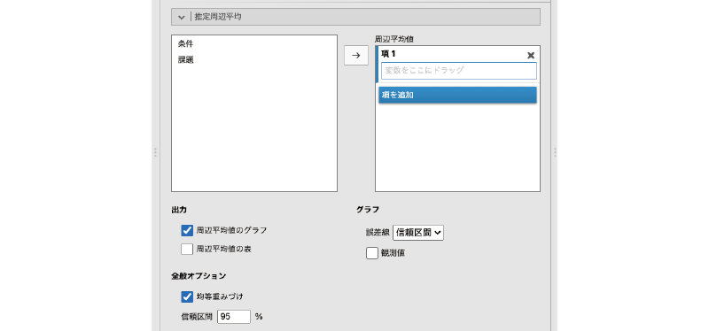
```

:::{.jmvsettings data-latex=""}
+ Marginal Means（周辺平均値）　周辺平均値の算出対象を指定します。
+ **Output**（出力）
  - Marginal means plots（周辺平均値のグラフ）
  - Marginal means tables（周辺平均値の表）
+ **General Options**（全般オプション）
  - Equal cell weights（均等重みづけ）
  - Confidence interval（信頼区間）　周辺平均値の信頼区間を算出します。
+ **Plot**（作図）
  - Error bars（誤差線）
  - Observed scores（観測値）
:::

この設定項目では，*推定周辺平均値*についての設定を行います。「推定周辺平均値」とは，分散分析で使用した分析モデルに基づいて算出された，各条件の平均値のことです。

この推定周辺平均の設定では，各要因の主効果を「**Term**（項）」として指定します。このとき，「**Term**」に指定されている要因が1つだけの場合にはその要因の各水準の平均値が，1つの「**Term**」に複数の要因が指定されている場合には，それらの要因の交互作用について平均値が算出されます。

今回のサンプルデータの場合，「条件」と「課題」の2つの要因がありますが，それぞれの主効果について水準ごとの周辺平均値を算出したい場合には，`r blueback('+Add New Term')`をクリックして「**Term**」を増やしたうえで，各「**Term**」に「条件」と「課題」を1つずつ設定するようにします。

また，交互作用の周辺平均値のグラフでは，グラフの横軸には最初に指定した要因の水準値が用いられます（図\@ref(fig:ANOVA-anova-emm-plots)）。平均値のグラフが思ったとおりの形で表示されない場合には，要因の指定順序を変更してみてください。

```{r ANOVA-anova-emm-plots, fig.cap='推定周辺平均値のプロット', echo=FALSE}
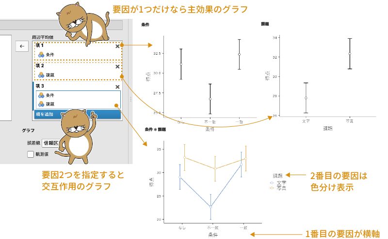
```

#### Output：出力{-}

この推定周辺平均値は，図または表，あるいはその両方で示すことができ，「**Output**（出力）」の「Marginal means plots（周辺平均値のグラフ）」にチェックを入れればグラフが，「Marginal means tables（周辺平均値の表）」にチェックを入れれば表が示されます（図\@ref(fig:ANOVA-anova-emm-table)）。

```{r ANOVA-anova-emm-table, fig.cap='推定周辺平均値の表', echo=FALSE}
knitr::include_graphics("images/ANOVA/anova-emm-table.png")
```

#### General Options：全般オプション{-}

その下の「**General Options**（全般オプション）」では，周辺平均値を算出する際に，標本サイズが小さい水準の値を他の水準と同等に扱うかどうかを設定することができます。

##### Equal cell weights：均等重みづけ{-}

たとえば，今回のサンプルデータでは「なし・写真」条件の参加者数が他より2人少なくなっています。もし，データそのものから各水準の平均値を求めたとしたら，付加情報「なし」条件の平均値や「写真」課題の平均値は，こうした人数のばらつきによる影響を受けてしまうことになります。

しかし，「推定周辺平均値」は分析モデルに基づいて算出される値ですので，すべての条件で参加者数が等しい場合を想定して各条件の平均値を算出することもできるのです。そのようにして平均値を算出したい場合には，「Equal cell weights（均等重みづけ）」にチェックを入れます。ほとんどの場合，ここはチェックしたままでよいでしょう。

##### Confidence interval：信頼区間{-}

その下にある「Confidence interval（信頼区間）」の数値入力欄では，推定周辺平均値について算出する信頼区間の幅を変更することができます。

#### Plot：作図{-}

設定画面右側の「**Plot**（作図）」では，推定周辺平均値の図示の方法について設定することができます。

##### Error bars：誤差線{-}

まず，「Error bars（誤差線）」の部分では，グラフに示す*誤差線*にどの値を用いるかを設定します（図\@ref(fig:ANOVA-anova-emm-plot-error-bar)）。


```{r ANOVA-anova-emm-plot-error-bar, fig.cap='誤差線の設定', echo=FALSE}

```


「Error bars」の横のプルダウンメニューで「None（なし）」を選択すると，グラフには平均値の点だけが表示されます。この項目で「Confidence interval（信頼区間）」を選択すれば，「**General Options**」のところで指定した幅の信頼区間が誤差線として示されます。ここで「Standard Error」を選択した場合には，図に示される誤差線の値には標準誤差が使用されます。

##### Observed scores：観測値{-}

また，その下の「Observed scores（観測値）」にチェックを入れると，推定周辺平均値のグラフに実際のデータを重ねて示すことができます（図\@ref(fig:ANOVA-anova-emm-observed)）。

```{r ANOVA-anova-emm-observed, fig.cap='グラフに実際のデータを重ねて表示', echo=FALSE}
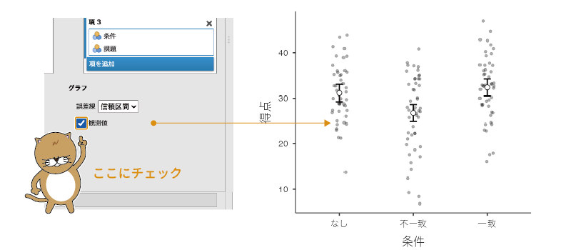
```

### Save：保存 {#sub:ANOVA-anova-save}

設定画面の一番下にある`r groupbar('Save')`（保存）では，分析結果を新たな変数として保存する方法について設定をすることができます。「ANOVA」では，分析データのうち分析モデルで説明しきれなかった部分（残差）を新たな変数として保存することが可能です。分散分析の残差を変数として保存したい場合には，`r groupbar('Save')`にある「Residuals（残差）」にチェックを入れてください。


## Repeated Measures ANOVA：反復測定分散分析 {#sec:ANOVA-rm}

```{r}
data03<-read.csv('data/anova_data03.csv')

# ID
attributes(data03$ID)$`jmv-id`<-TRUE

# タイプ
data03$タイプ<-factor(data03$タイプ)
attributes(data03$タイプ)$levels<-c('ネコ派','イヌ派')
attributes(data03$タイプ)$values<-c(1,2)
attributes(data03$タイプ)$measureType<-c('Nominal')

# 反応時間
attributes(data03$なし)$measureType<-c('Continuous')
attributes(data03$否定)$measureType<-c('Continuous')
attributes(data03$肯定)$measureType<-c('Continuous')

out<-jmvReadWrite::jmvWrite(data03,'data/omv/anova_data03.omv')
```

ここまでに見てきた分析例は，いずれも「対応なし」の場合のものでした。t検定と同様に，分散分析の場合にも対応なしの場合と対応ありの場合の分析方法があります。分散分析においては，対応ありのデータは「反復測定データ」や「繰り返しありのデータ」と呼ばれることが多いようです。

ところで，t検定では対応ありの方が対応なしの場合よりも単純でしたが，分散分析ではそうではありません。t検定の場合には比較する条件は2つだけですから，その2つの条件の測定値がそれぞれ別の対象者から得られたもの（対応なし）か，同じ対象者から得られたものか（対応あり）というような区別だけで済むでしょう。

しかし，分散分析の場合には，比較する条件（水準）が3つ以上である場合があります。その場合，前半5分，中盤5分，後半5分というように繰り返しの順序に意味があるような場合（*時系列データ*）と，単に3つの異なる条件（順不同）を同一参加者に対して実施した場合とでは「繰り返し」の意味が異なります。

また，2要因以上の分散分析では，分析に用いるすべての要因が繰り返しありの要因である場合と，そのうちの一部のみが繰り返しありの要因である場合とがあり得ます。このように，繰り返しあり（対応あり）のデータに対する分散分析は，「対応あり」と一言で済ませられないほどにさまざまなタイプのデータを扱うことになり，対応ありt検定の場合よりもずっと分析が複雑になるのです。

繰り返しありのデータ（反復測定データ）の分析方法は1つではなく，いくつかの方法があるのですが，jamoviには標準で「Repeated Measures ANOVA（反復測定分散分析）」という分析ツールが用意されていますので，ここではこの分析ツールを用いた場合の分析方法について見ていくことにします^[jamoviに拡張モジュール「GAMLj」を追加すると，これ以外の方法で分析することも可能になります。]。

### 考え方 {#sub:ANOVA-rm-basics}

先ほども説明したように，分散分析が扱う「繰り返しあり」データには非常にさまざまなタイプのものがありますので，それらのすべてについて説明しようとすると，それだけでも1冊の本になってしまうほどです。ですので，ここでは比較的シンプルな次のデータ（[anova_data03.omv](https://github.com/sbtseiji/jmv_compguide/raw/main/data/omv/anova_data03.omv)）の場合について考えることにしましょう（図\@ref(fig:ANOVA-data03)）。

```{r ANOVA-data03, fig.cap='サンプルデータ', echo=FALSE}

```

:::{.jmvvar data-latex=""}
+ `ID`　実験参加者のID
+ `タイプ`　参加者のタイプ（ネコ派，イヌ派）
+ `なし`　評価語を呈示しない場合の反応時間（単位：ms）
+ `否定`　「ネコ」と否定語をセットで呈示した場合の反応時間（単位：ms）
+ `肯定`　「ネコ」と肯定語をセットで呈示した場合の反応時間（単位：ms）
:::

これは，ネコ派（ネコが大好きでイヌは好きでない）とイヌ派（イヌが大好きでネコは好きでない）各30名の参加者を対象に行った実験のデータです。この実験では，画面の中央にイヌまたはネコの画像を，画面上部の左右に「ネコ」や「イヌ」などの文字を呈示して，画像と一致するほうの文字を選択してもらうという課題を行いました。この際，「ネコ」と「イヌ」の左右の位置は試行ごとにランダムとしました。

実験条件としては，画面に「ネコ・イヌ」という反応語を呈示する際に「かわいい・ぶさいく」，「よい・わるい」，「ふわふわ・ごわごわ」など，よい印象を含む語と悪い印象を含む語（評価語）をセットにする場合と，「ネコ・イヌ」の反応語のみを呈示する場合を用いました。また，反応語と評価語をセットにする条件では，「ネコ」と「ごわごわ」などの否定的な印象の評価語をセットにした場合（否定条件）と，「ネコ」と「ふわふわ」などの肯定的な印象の評価語をセットにした場合（肯定条件）で測定を行いました（図\@ref(fig:ANOVA-rm-experiment)）。

```{r ANOVA-rm-experiment, fig.cap='実験における刺激呈示の例', echo=FALSE}

```

また，この実験では1人の参加者について，評価語なしの条件（なし条件）と肯定条件，否定条件の3つの条件すべてを実施し，これら3つの条件は順序をランダムにして複数回繰り返しました。データファイルに入力されている各参加者の測定値は，それぞれの条件における複数回の測定における反応時間の平均値をミリ秒（ms）で記録したものです。

実験についての説明が長くなりましたが，このデータから参加者のタイプ（ネコ派・イヌ派）によって各実験条件における反応時間に違いが見られるかどうかを知りたいとしましょう。この場合，ネコ派の参加者とイヌ派の参加者はそれぞれ別の人々で構成されていますので，参加者の「タイプ」の要因は繰り返しなし（対応なし）ということになりますが，各評価語条件（なし・否定・肯定）については1人の参加者で繰り返し測定を行っているので，これは繰り返しあり（対応あり）の要因です。

繰り返しのあり・なしは，データファイルではそれらが同じ行に入力されているか，それとも別の行に入力されているかという形で区別されます。繰り返し要因の測定値は，このサンプルデータファイルのように1人分の測定値が1行に入力された形になっている必要がありますので，その点は注意してください。このように，1人分のデータを1行に横並びに入力した形式のデータのことをとくに*ワイド形式*のデータと呼ぶことがあります。

これに対し，1人分のデータを条件ごとに複数行に分けて入力されたデータは*ロング形式*と呼ばれます。残念ながら，jamoviにはロング形式をワイド形式に変換する機能はありませんので，データがワイド形式になっていない場合には，ExcelやRなど，他のソフトで変換してから分析する必要があります。


さて，今回のデータでは，すべての参加者が評価語の3つの水準（なし・否定・肯定）すべてについて測定値を持っているため，この評価語の主効果を考える際には，各水準の平均値だけでなく，各参加者における3水準の平均値を求めることもできます。説明のために，今回のデータの最初の3行だけを使って表を作成すると表\@ref(tab:ANOVA-anova-first-three-lines)のようになります。

```{r, ANOVA-anova-first-three-lines}
data03.extract<-data03[1:3,3:5]
data03.extract$ave<-apply(data03.extract,1,mean)
data03.extract<-rbind(data03.extract,apply(data03.extract,2,mean))
names(data03.extract)<-c('なし','否定','肯定','平均値')
row.names(data03.extract)<-c('参加者1','参加者2','参加者3','平均値')

data03.extract %>% kable(
  booktabs = TRUE,align='ccc',
  digits=c(1,1,1,1),
  caption = '各条件の平均値のまとめ'
)%>%
  kable_styling(latex_options = "HOLD_position")
```

この「各参加者における3水準の平均値」というのが重要な部分です。このようにして評価語3水準の平均値と参加者ごとの平均値を算出できるのであれば，「評価語」間，「参加者」間での平均値のばらつきを求めることもできるようになります。すると，これを「評価語」と「参加者」の2要因分散分析とみなして，ここから「評価語&times;参加者」の交互作用を算出できるのです。そしてこの「評価語&times;参加者」の交互作用は，評価語の影響（つまり評価語の主効果）が各参加者で異なる程度（個人差）を数値化したものです。つまりこれは，「評価語の主効果」における「個人差」の大きさを表します。

すると，評価語の主効果の検定では，主効果による平均値のばらつきと，この主効果の個人差によるばらつきの値が得られることになります。そして主効果の大きさと，その個人差の大きさがわかるのであれば，主効果の検定においては，「主効果の個人差」を誤差とみなす形で主効果の大きさを評価できるようになるというわけです。

これと同じことが参加者の「タイプ（ネコ派・イヌ派）&times;評価語」の交互作用においてもあてはまります。参加者ごとに交互作用の大きさを求めることができれば，その交互作用の個人差を算出することが可能になります。すると，交互作用の検定では，その交互作用の個人差を誤差とみなして交互作用の大きさを評価することができるのです。

```{=latex}
\clearpage
```

### 分析手順{#sub:ANOVA-rep-procedure}

それでは分析手順を見てみましょう。分析の実行には，Analysesタブの「`r infig('analysis-anova')` ANOVA」から「Repeated Measures ANOVA（反復測定分散分析）」を選択します（図\@ref(fig:ANOVA-rm-menu)）。

```{r ANOVA-rm-menu, fig.cap='反復測定分散分析の実行', echo=FALSE}

```

すると，図\@ref(fig:ANOVA-rm-setting)のようにたくさんの項目が含まれた設定画面が表示されます。

```{r ANOVA-rm-setting, fig.cap='反復測定分散分析の設定画面', echo=FALSE}
knitr::include_graphics("images/ANOVA/rm-setting.png")
```

ここではまず，分析の基本設定について見ていきましょう。反復測定分散分析では，繰り返しのある要因とそうでない要因の区別が重要です。設定画面右側の一番上にある「Repeated Measures Factors（反復測定要因）」には，繰り返しありの要因がいくつあり，そしてそれぞれの要因の中に水準がいくつ含まれているかを指定します（図\@ref(fig:ANOVA-rm-rmfactor)）。

<!-- -->
```{r ANOVA-rm-rmfactor, fig.cap='繰り返し要因の設定欄', echo=FALSE}
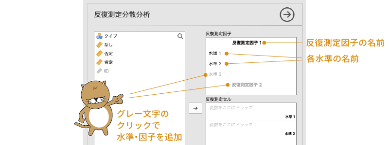
```


まず，太字の「**RM Factor 1**」の部分は繰り返し要因の名前で，これをクリックすると要因の名前を設定することができます。名前を設定しなくても計算上は問題ありませんが，そのままだと結果を見たときにそれが何の要因かがわかりにくいので，わかりやすい名前をつけておくのがよいでしょう。今回のサンプルデータでは，繰り返し要因は「評価語」ですので，名前を「評価語」に設定します。

その下にある「Level 1」や「Level 2」では，この繰り返し要因に含まれている水準についての設定を行います。この「Level 1」や「Level 2」も，「**RM Factor 1**」の部分と同じくクリックすると名前を変えられるので，データに合わせてわかりやすい名前に設定しておきましょう。

今回の実験では，刺激条件の1つ目の水準は評価語が「なし」の条件なので，「Level 1」の部分を「なし」に，2つ目の水準は「否定語」がセットになっている条件なので「否定」と設定します。

1つの要因に3つ以上の水準が含まれる場合には，グレーの文字の部分をクリックすることで新たな水準を追加することができます。
今回のデータでは，評価語の条件として「なし・否定・肯定」の3つの水準がありますので，グレーの文字になっている「Level 3」の部分をクリックして，そこに3つ目の水準の名前として「肯定」と入力しましょう。これで，1つ目の繰り返し要因に3つの水準を設定することができました。なお，この3つ目以降の水準については，その水準名の右側に表示される「**×**」の部分をクリックすることで削除することができます（図\@ref(fig:ANOVA-rm-rmfactor2)）。

<!-- -->
```{r ANOVA-rm-rmfactor2, fig.cap='繰り返し要因の設定', echo=FALSE}
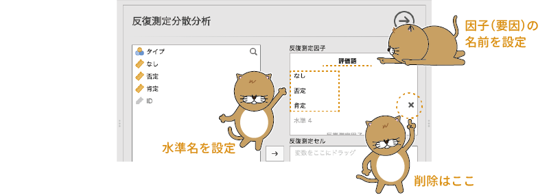
```


また，今回の分析では繰り返しありの要因は1つしかありませんが，繰り返し要因が複数ある場合には，その下のグレーの文字で書かれた「**RM FACTOR 2**」の部分をクリックして要因名を設定すると，繰り返し要因を追加することができます。

繰り返し要因の個数やその水準数についての設定が終わったら，次に「Repeated Measures Cells（反復測定セル）」の欄で，それぞれの水準の測定値が入力されている変数を指定します。

今回の分析では繰り返し要因は1つしかありませんので，この部分の設定は単純です。「**なし**」の「drag variable here（ここに変数をドラッグ）」欄に「なし」を，「**否定**」の行に「否定」を，「**肯定**」の行に「肯定」をドラッグして移動します（図\@ref(fig:ANOVA-rm-rmcells)）。

<!--  -->
```{r ANOVA-rm-rmcells, fig.cap='繰り返し要因の各水準に変数を設定', echo=FALSE}

```

そして最後に繰り返しなし要因の設定です。ネコ派・イヌ派の「タイプ」の変数を，先ほどの「Repeated Measures Cells」の下にある「Between Subject Factors（参加者間要因）」へ移動します（図\@ref(fig:ANOVA-rm-between-subject-factors)）。これで分析の基本設定はおしまいです。

<!--  -->
```{r ANOVA-rm-between-subject-factors, fig.cap='繰り返しなし要因を設定', echo=FALSE}

```

なお，その下にもう1つ「Covariates（共変量）」という欄がありますが，今回の分析ではここは使用しません。これは分析に*共変量*を用いる場合の設定項目です。共変量については，この次の「[ANCOVA（共分散分析）](#sec:ANOVA-ancova)」のところで説明します。


### 分析結果{#sub:ANOVA-rm-results}

それでは結果を見てみましょう。反復測定分散分析では，結果は図\@ref(fig:ANOVA-rm-results)のような形で表示されます。

```{r ANOVA-rm-results, fig.cap='反復測定分散分析の結果', echo=FALSE}
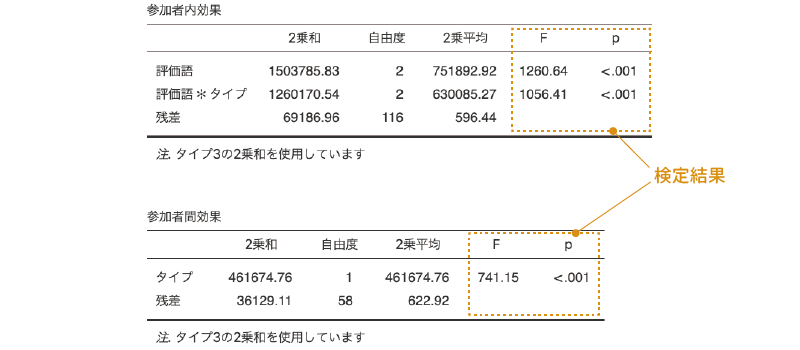
```

分析結果には，まず繰り返しありの要因が関係する主効果や交互作用についての表（Whithin Subjects Effects：参加者内効果）が，その下に繰り返しなしの要因の主効果や交互作用についての結果の表（Between Subjects Effects：参加者間効果）が示されます。

結果の表の見方は基本的には「ANOVA」の場合と同じなのですが，上の表と下の表のそれぞれに「Residual（残差）」があるのがわかるでしょうか。上の表の残差は，「評価語」の主効果についての個人差や「評価語&times;タイプ」の交互作用における個人差を集約した値で，繰り返し要因である「評価語」が関係する主効果や交互作用は，この残差を基準に検定が行われます。この場合，論文などで分析結果を報告するとしたら，統計値の部分は「F(2, 116) = 1260.64」のようになります。この場合の残差（誤差）の自由度は，参加者内効果の「Residual」のものを使用します。

なお，ここでは上の表には「Residual」は1つしかありませんが，繰り返し要因が2つ以上ある場合には，それぞれの繰り返し要因の主効果における個人差，そしてそれら繰り返し要因同士の交互作用における個人差が算出されますので，1つの表に「Residual（残差）」が複数表示されることになります。その場合，それぞれの主効果や交互作用のすぐ下にある「Residual」の値がそれらの主効果や交互作用の検定で用いられる残差（誤差）になります。


また，下の表の「Residual」は，「評価語」全体（3水準の平均値）における各参加者のばらつきを集約した値で，これは実験条件とは無関係な個人間のばらつきです。繰り返しなしの要因のみで構成される主効果や交互作用の場合には，こちらの残差を基準に検定が行われます。こちらの検定結果を論文などで示す場合には，統計値の部分は「F(1, 58) = 741.15」となります。この検定での誤差（残差）の自由度は，この参加者間効果の表にある値を使用してください。

この分析の結果，「評価語」，「タイプ」の主効果と，「評価語&times;タイプ」の交互作用のいずれも有意確率「p&lt;.001」で有意であることが示されました。

### 分析の詳細設定{#sub:ANOVA-rm-details}

ここからは，反復分散分析における設定項目について説明します。まず，設定画面の変数一覧の下にある項目から見ていきましょう（図\@ref(fig:ANOVA-rm-effect-size)）。

```{r ANOVA-rm-effect-size, fig.cap='反復測定分散分析の詳細設定項目', echo=FALSE}

```


#### Effect Size：効果量 {-}

設定画面の**Effect Size**では，効果量について設定します。反復測定分散分析では，効果量として「Generalised $\eta^2$（*一般化イータ2乗*，$\eta^2_G$）」，「$\eta^2$（*イータ2乗*）」，「Partial $\eta^2$（*偏イータ2乗*，$\eta^2_p$）」の3種類を算出できます。

##### η²：イータ2乗{-}

順番が前後しますが，まずは$\eta^2$（イータ2乗）から見ていきましょう。$\eta^2$の値は「ANOVA」の場合と同じで，これは各主効果，交互作用の2乗和をデータ全体の2乗和で割った値，つまり，そのデータ全体に占める各主効果，交互作用の比率です。

##### Partial η²：偏イータ2乗{-}

$\eta^2_p$（偏イータ2乗）の値も基本的に「ANOVA」での値と同じで，主効果，交互作用の2乗和をそれ自体と残差の2乗和の合計で割った値です。ただし，反復測定分散分析では複数種類の残差が算出されるため，$\eta^2_p$はそれぞれの主効果，交互作用と，それに関係する残差の2乗和を用いて算出されます。

##### Generalised η²：一般化イータ2乗{-}

ただ，その場合，$\eta^2_p$では繰り返しなしの要因と繰り返しありの要因で効果量の算出基準が異なることになるため，効果の大きさを比較することが困難になります。そこで，そのような問題を解決するために考案された指標が$\eta^2_G$（一般化イータ2乗）です。この値は，繰り返しありの要因となしの要因の両方の残差を用いて各主効果や交互作用の効果量を算出します。

なお，この$\eta^2_G$を算出する場合には，それぞれの要因が*操作要因*であるのか*測定要因*であるのかを区別する必要があります。操作要因とは，実験者が設定した実験条件などが含まれる要因を指し，測定要因は参加者が持っている特性（性別，年齢など）によって分類される要因を指します。たとえば，今回の例における評価語要因（なし・否定・肯定）は，実験者が操作して設定したものですから「操作要因」ということになります。なお，繰り返し要因は実験者が操作して設定するものなので，つねに操作要因として扱われます。

それに対し，参加者のタイプ（ネコ派・イヌ派）は実験者が操作したものではなく，これはそれぞれの参加者が持っている特性です。ですので，この要因は「測定要因」ということになります。また，測定要因との交互作用は，すべて測定要因とみなされます。このようにして考えると，今回のサンプルデータでは，評価語の要因が操作要因，タイプの主効果と評価語&times;タイプの交互作用が測定要因ということになります。

このように，操作要因と測定要因の区別はその内容によって判断されるので，これは統計ソフトが自動で判断できるようなものではなく，分析者が自分判断して指定しなければなりません。しかし，少なくとも現時点において，jamoviにはこれらの区別を指定する設定項目がなく，この設定項目における$\eta^2_G$の値は，すべての要因を操作要因とみなして算出されたものになっています。そのため，ここで算出される$\eta^2_G$は，操作要因（今回の場合は評価語の主効果）については適切な値といえるのですが，測定要因（タイプの主効果，評価語&times;タイプの交互作用）にはついて適切な値ではありません。その点には注意が必要です。

#### Dependent Variable Label：従属変数ラベル{-}

反復測定分散分析の設定画面にある「**Dependent Variable Label**（従属変数ラベル）」は，推定周辺平均値をグラフに示す際に使用する従属変数名を設定します。繰り返しなしの場合，分析に使用される従属変数はデータファイルでも1列に入力されているため，その変数の名前をそのまま従属変数の名前としてグラフの縦軸に使用することができます。しかし反復測定分散分析の場合，従属変数が複数列に入力されているために，単純に分析に使用されている変数の名前を用いるといったことができません。

そこで，jamoviでは，この**Dependent Variable Label**に入力された名前をグラフの縦軸ラベルとして使用します。この設定部分は分析結果には影響しませんからそのままでもよいですが，今回の分析の場合は「反応時間 (ms)」としておくのがわかりやすいでしょう（図\@ref(fig:ANOVA-rm-dv-label)）。

<!-- -->
```{r ANOVA-rm-dv-label, fig.cap='グラフ用の縦軸ラベルの設定', echo=FALSE}

```


### Model：モデル {#sub:ANOVA-rm-model}

`r groupbar('Model')`（モデル）の部分は，繰り返しありの要因とそうでない要因で設定欄が分かれているのが異なるくらいで「ANOVA」の場合と基本的な設定方法は同じですので，ここでは説明を省略します（図\@ref(fig:ANOVA-rm-model)）。

<!-- -->
```{r ANOVA-rm-model, fig.cap='分析モデルの設定', echo=FALSE}
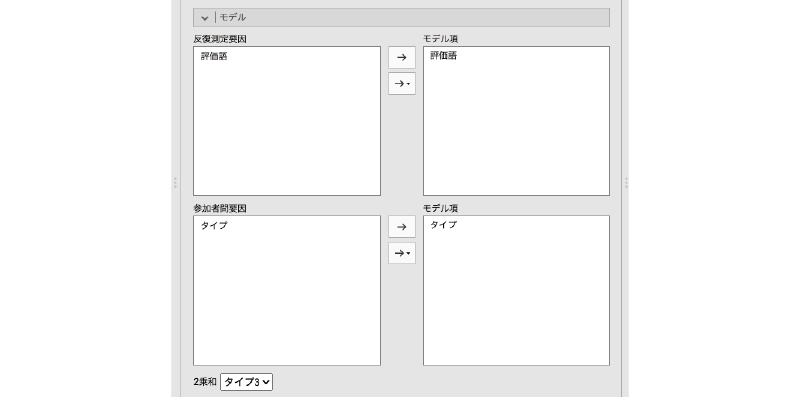
```

なお，「ANOVA」では「Sum of squares（2乗和）」の部分でタイプ1からタイプ3までの方法を選択することができましたが，反復測定分散分析の場合には，分析に使用できるのはタイプ2と3のみです。

### Assumption Checks：前提チェック {#sub:ANOVA-rm-assumption}

反復測定分散分析の`r groupbar('Assumption Checks')`（前提チェック）には次の項目が含まれています（図\@ref(fig:ANOVA-rm-assumptions)）。

<!-- -->

```{r ANOVA-rm-assumptions, fig.cap='反復測定分散分析の前提チェック', echo=FALSE}

```

:::{.jmvsettings data-latex=""}
+ Sphericity tests（球面性検定）　球面性検定を行います。
+ **Sphericity corrections**（球面性補正）　球面性の前提が満たされない場合における補正方法を指定します。
  - None（なし）　補正は行いません
  - Greenhouse-Geisser（グリーンハウス=ガイザー推定）　グリーンハウス=ガイザー推定による補正を行います。
  - Huynh-Feldt（ヒューン=フェルト推定）　ヒューン=フェルト推定による補正を行います。
+ Homogeneity test（等質性検定）　分散の等質性の検定を行います。
+ Q-Q Plot（Q-Qプロット）　正規Q-Qプロットを作成します。
:::

「ANOVA」の設定画面にはなかった項目がいくつかありますので，これらについて簡単に見ておきましょう。

##### Sphericity tests：球面性検定{-}

繰り返しなしの分散分析で各水準の分散が等質であることが分析の前提としてあったように，反復測定分散分析では繰り返し要因の各水準間で「差の分散が等しい」ことが必要とされます。このような前提は*球面性の仮定*と呼ばれ，*球面性検定*ではこの前提が満たされているといえるかどうかについて検定します。球面性検定は，*モークリー検定*とも呼ばれます。

この項目にチェックを入れると，図\@ref(fig:ANOVA-rm-sphericity-tests)のような形で検定結果が表示されます。

<!-- -->

```{r ANOVA-rm-sphericity-tests, fig.cap='球面性検定の結果', echo=FALSE}

```


結果の表の1番左にある「**Mauchly's W**（モークリーのW）」が球面性仮説の検定における統計量で，その隣のpの値が有意確率です。このpの値が有意水準を下回る場合には，球面性の前提が満たされていないと判断され，これを修正するための補正が行われます。また，pの隣にある「Greenhouse-Geisser $\varepsilon$（グリーンハウス=ガイザーの$\varepsilon$）」と「Huynh-Feldt $\varepsilon$（ヒューン=フェルトの$\varepsilon$）」は，球面性の前提が満たされない場合の修正に使用される値です。

今回の分析結果では，p=0.589で検定結果は有意ではありませんので，球面性仮説に関する補正を行う必要はありません。

#### Sphericity corrections：球面性補正{-}

今回の分析結果のように球面性検定の結果が有意でない場合には，繰り返し要因についての分析結果をそのまま採用することができるのですが，球面性検定の結果が有意だった場合には，球面性検定の結果の表にある$\varepsilon$（イプシロン）という値を用いて自由度を修正し，p値を算出するという方法がとられます。

$\varepsilon$の算出の仕方にはいくつかの方法がありますが，jamoviでは以下の方法を利用することができます。

##### None（なし）{-}

この項目がオンになっている場合には，球面性補正なしのp値が算出されます。反復測定分散分析の初期設定では，この項目がオンになっています。球面性の前提が満たされている場合など，球面性に関する補正が必要ない場合にはこの値を使用します。

##### Greenhouse-Geisser（グリーンハウス=ガイザー補正）{-}

この項目にチェックを入れると，グリーンハウス=ガイザーの$\varepsilon$を用いて修正した自由度と，それを元にした2乗平均やF，p値などが算出されます（図\@ref(fig:ANOVA-rm-greenhouse)）。

<!-- -->
```{r ANOVA-rm-greenhouse, fig.cap='球面性補正後の結果', echo=FALSE}

```


このグリーンハウス=ガイザーの$\varepsilon$による修正は，球面性の前提が満たされない場合の補正方法としてもっとも一般的なものです。

##### Huynh-Feldt（ヒューン=フェルト補正）{-}

球面性の補正方法としてはグリーンハウス=ガイザーの$\varepsilon$を用いるのが一般的だといいましたが，この方法は，$\varepsilon$の値が大きい場合（球面性からのずれが小さい場合）には調整が強くなりすぎるといわれています。そしてその問題を修正したものがヒューン=フェルトの$\varepsilon$です。ヒューン=フェルトの$\varepsilon$は，グリーンハウス=ガイザーの$\varepsilon$に対して修正を加えることによって得られる値です。

この項目にチェックを入れると，ヒューン=フェルトの$\varepsilon$で修正した自由度に基づく検定結果が表示されます。なお，今回の分析結果ではヒューン=フェルトの$\varepsilon$は1.00ですので，表示される結果は補正を行わない場合と同じになります。

##### Homogeneity test（等質性検定）{-}

この「Homogeneity test（等質性検定）」の項目にチェックを入れると，繰り返しなしの要因に関する分散の等質性の検定結果（ルビーン検定の結果）が表示されます（図\@ref(fig:ANOVA-rm-homogeneity)）。

<!-- -->

```{r ANOVA-rm-homogeneity, fig.cap='分散の等質性検定の結果', echo=FALSE}
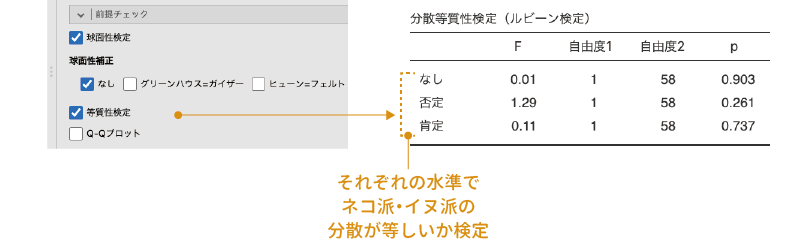
```

結果の表を見ると「なし」や「否定」など，繰り返し要因である評価語の各水準名が並んでいますが，これは評価語の要因について分散の等質性の検定をしているのではなく，評価語の各水準において，繰り返しなし要因である「タイプ（ネコ派・イヌ派）」について，分散の等質性の検定を行った結果が表示されているのです。

分析に含まれている要因に繰り返しなしの要因が1つもない場合には，この項目にチェックを入れても結果は「NaN」となって数値は表示されません。

今回の分析結果では，どの水準においても参加者のタイプで有意に分散が異なるということはありませんでした。

##### Q-Q Plot：Q-Qプロット{-}

「Q-Q Plot（Q-Qプロット）」の項目にチェックを入れると，分析モデルの残差について正規Q-Qプロットが作成されます。Q-Qプロットの見方については，記述統計やt検定における説明を参照してください^[なお，jamovi 1.8.0.0では，このQ-Qプロットの縦軸の縮尺がおかしくなっています。そのため，本来斜め45度に表示されるはずの直線の傾きがそうなっていませんが，データ点自体は正しく表示されているので，データ点が45度の傾きで直線上に並んでいれば，正規性の前提が満たされていると考えて問題ありません。]。

### Post Hoc Tests：事後検定{#sub:ANOVA-rm-posthoc}
この`r groupbar('Post Hoc Tests')`（事後検定）の設定項目は「ANOVA」の場合とまったく同じですので，ここでは説明を省略します。詳細については「ANOVA」の「[Post Hoc Tests：事後検定](#sub:ANOVA-anova-posthoc)」の部分を見てください。

### Estimated Marginal Means：推定周辺平均{#sub:ANOVA-rm-marginal}

この`r groupbar('Estimated Marginal Means')`（推定周辺平均）の項目も，設定項目自体は「ANOVA」の場合と同じです。ただし，推定周辺平均のグラフを作成した場合には，縦軸（数値軸）のラベルとして「**Dependent Variable Label**（従属変数ラベル）」に設定した名前が使用されます（図\@ref(fig:ANOVA-rm-emm-plot)）。

```{r ANOVA-rm-emm-plot, fig.cap='推定周辺平均のグラフと縦軸ラベル', echo=FALSE}
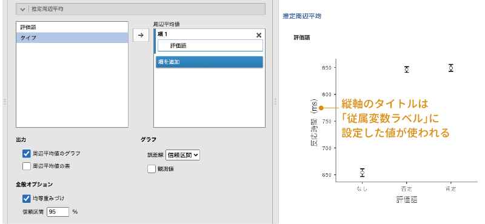
```


### Options：オプション{#sub:ANOVA-rm-options}

設定画面の一番下にある`r groupbar('Options')`には「Group summary（グループの要約）」という設定項目が含まれています。この項目にチェックを入れると，繰り返しなし要因の各水準における標本サイズや分析から除外された測定値の個数などの情報が表示されます（図\@ref(fig:ANOVA-rm-options)）。

<!-- -->
```{r ANOVA-rm-options, fig.cap='グループの要約', echo=FALSE}

```


## ANCOVA：共分散分析{#sec:ANOVA-ancova}

```{r,echo=FALSE,message=FALSE,warning=FALSE}
data04<-read.csv('data/anova_data04.csv')

# ID
attributes(data04$ID)$`jmv-id`<-TRUE

# 連続量
attributes(data04$再生数)$measureType<-c('Continuous')
attributes(data04$作業記憶)$measureType<-c('Continuous')

# 要因
data04$BGM<-factor(data04$BGM)
attributes(data04$BGM)$levels<-c('なし','音楽のみ','歌詞あり')
attributes(data04$BGM)$values<-c(1,2,3)
attributes(data04$BGM)$measureType<-c('Nominal')

out<-jmvReadWrite::jmvWrite(data04,'data/omv/anova_data04.omv')
```

たとえば記憶課題を用いた実験を行う場合，その記憶課題の成績は，実験で操作される条件以外に各参加者の記憶力の違いによっても影響を受けるかもしれません。あるいは，食行動に関する研究では，観察対象である食行動がそれぞれの参加者の体格によって異なるかもしれません。一般に，このような場合には，実験の各条件で参加者の特性に偏りが生じないように，あらかじめ測定した記憶力や，体格指標などにもとづいて参加者を各条件に振り分けるといった方法が用いられます。

ただ，たとえばもともと記憶力のいい人ほど課題成績がよく，そうでない人ほど課題成績が低いというような関係があった場合，それぞれの条件に参加者を均等に振り分けるというような方法では，参加者個人の記憶力の差や体格の差を十分にコントロールすることはできません。そのままでは，参加者個人の記憶力の違いによって，各実験条件における課題成績のばらつきが大きくなり，実際には実験条件の効果があるにもかかわらず，それを検出できないということが起こり得ます。

*共分散分析*（*ANCOVA*）は，この各参加者の記憶力の違いのように，本来測定したい値に対して系統的に影響を与えるような変数がある場合に，その変数の影響を取り除いたうえで，実験要因の影響について検討したい場合に用いられる分析手法です。

### 考え方{#sub:ANOVA-ancova-basics}

ここでは次の実験データについて考えてみましょう。勉強中のBGMが勉強効率にどのように影響するのかを調べるため，参加者75名をBGMなし，音楽のみのBGM，歌詞ありのBGMの3つの条件に25名ずつに振り分けて記憶課題を実施しました。記憶課題は，無意味つづり30個が記載されたリストを記憶し，その後，それらの無意味つづりを再生するというものです。なお，参加者を3つの条件に振り分ける際には，作業記憶容量の測定課題を実施し，各条件でその点数ができるだけ均等になるようにしました。次のサンプルデータ（[anova_data04.omv](https://github.com/sbtseiji/jmv_compguide/raw/main/data/omv/anova_data04.omv)）には，この実験の結果が入力されています（図\@ref(fig:ANOVA-data04)）。

<!-- -->
```{r ANOVA-data04, fig.cap='サンプルデータ', echo=FALSE}

```

:::{.jmvvar data-latex=""}
+ `ID`　参加者のID 
+ `作業記憶`　参加者の作業記憶の容量 
+ `BGM`　学習時のBGM（なし，音楽のみ，歌詞あり） 
+ `再生数`　無意味つづりの再生数
:::

まず，3つの条件で参加者の作業記憶の容量に偏りがないかどうかを確認してみましょう。Analysesタブの「`r infig('analysis-descriptives')` Exploration（探索）」から「Descriptives（記述統計）」を選択し，「作業記憶」のBGM条件ごとの平均値と標準偏差を算出してみます。

```{r ANOVA-ancova-descriptives, fig.cap='作業記憶容量の記述統計', echo=FALSE}
knitr::include_graphics("images/ANOVA/ancova-descriptives.png")
```

すると，図\@ref(fig:ANOVA-ancova-means)のような結果になりました。

```{r ANOVA-ancova-means, fig.cap='作業記憶容量の平均値と標準偏差', echo=FALSE}

```

どの条件も作業記憶容量の平均値は約7.0，標準偏差は1.7から1.8で，だいたい同じような値になっています。各条件への参加者の振り分けは，狙いどおりに均等になっているようです。

次に，作業記憶の容量と記憶課題における再生数の間に相関関係があるかどうかを見てみましょう。ここで両者に相関がないようであれば，共分散分析を用いても意味がありません。

「`r infig('analysis-regression')` Regression（回帰）」から「Correlation Matrix（相関行列）」を選択し，「作業記憶」と「再生数」の2つを指定してこの2つの間の相関係数を算出します（図\@ref(fig:ANOVA-ancova-correlation)）。「`r infig('analysis-regression')` Regression（回帰）」ツールや相関係数の算出方法についての詳細は，第\@ref(ch:regression)章の「[回帰分析](#ch:regression)」を参照してください。

```{r ANOVA-ancova-correlation, fig.cap='相関係数の算出', echo=FALSE}
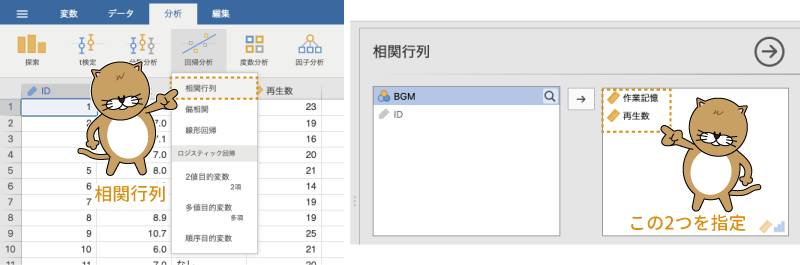
```

結果を見てみると，「作業記憶」と「再生数」の間の相関係数は0.62で，やや強めの正の相関があります（図\@ref(fig:ANOVA-ancova-cor-results)）。つまりこれは，作業記憶の容量が多い人ほど，再生数が多いという関係があるということです。このように，分析における従属変数（再生数）に対して系統的な影響を与える変数（作業記憶の容量）のことを*共変量*と呼びます。


```{r ANOVA-ancova-cor-results, fig.cap='「作業記憶」と「再生数」の相関係数', echo=FALSE}

```

さて，作業記憶の容量が無意味つづりの再生数に影響するということは，各条件における無意味つづりの再生数には作業記憶容量の個人差によるばらつきが生じるということになります。参加者個人の特性の違いによって測定値にばらつきが生じるのはどんな実験の場合でも同じでしょうが，今回の実験ではそのばらつきの主な原因である作業記憶の容量についての測定値がありますので，これを利用しない手はありません。

このとき，共分散分析では，まず「[線形回帰](#sec:regression-LR)（第\@ref(ch:regression)章）」を用いて，共変量（作業記憶容量）から従属変数（再生数）のばらつきを説明するモデルを作成します。そして，このモデルによる予測値とのずれ（*残差*）を用いて分散分析を行うのです。このようにすると，「作業記憶」と「再生数」の相関関係による影響を取り除いた形で分析を行うことができます。

この考え方を図で示すと図\@ref(fig:ANOVA-ancova-residual-plot)のようになります。

```{r ANOVA-ancova-residual-plot, fig.cap='「作業記憶」による「再生数」への影響の除去', echo=FALSE}

```

図\@ref(fig:ANOVA-ancova-residual-plot)の左側の図は，作業記憶の容量を横軸に，再生数を縦軸にとって作成した散布図です。この散布図では，全体が右肩上がりになっており，正の相関があるということが視覚的にもよくわかります。そして，この散布図の中央にある斜めの線が，作業記憶の容量と再生数の関係を表したモデルです。

これに対し，右側の図は横軸に作業記憶の容量を，縦軸には左の図に直線で示したモデルからのずれ（残差）をとって作成した散布図です。こちらの図では，モデルで示される関係が水平な直線になっていることからもわかるように，作業記憶の容量と残差の間に相関関係は見られません。

このように，実験条件以外で従属変数に影響を与えていると考えられる共変量がある場合，その共変量で従属変数を説明するモデルを作成し，そこからのずれを求めるという方法をとると，その共変量による従属変数への影響を取り去ることができるのです。共分散分析では，このようにして従属変数の値から共変量による影響を取り除き，そのうえで実験条件の主効果や交互作用があるといえるかどうかについて検定を行うのです。

### 分析手順 {#sub:ANOVA-ancova-procedure}

共分散分析は，Analysesタブの「`r infig('analysis-anova')` ANOVA」から「ANCOVA（共分散分析）」を選択して実施します（図\@ref(fig:ANOVA-ancova-menu)）。

```{r ANOVA-ancova-menu, fig.cap='共分散分析の実行', echo=FALSE}
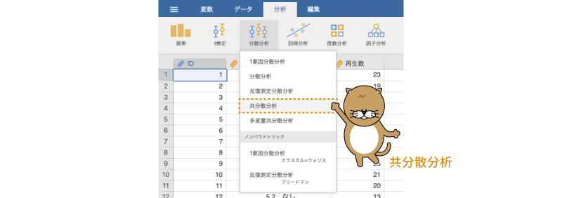
```

すると，次のように「ANOVA」と非常によく似た設定画面が表示されます（図\@ref(fig:ANOVA-ancova-settings)）。

```{r ANOVA-ancova-settings, fig.cap='共分散分析の設定画面', echo=FALSE}
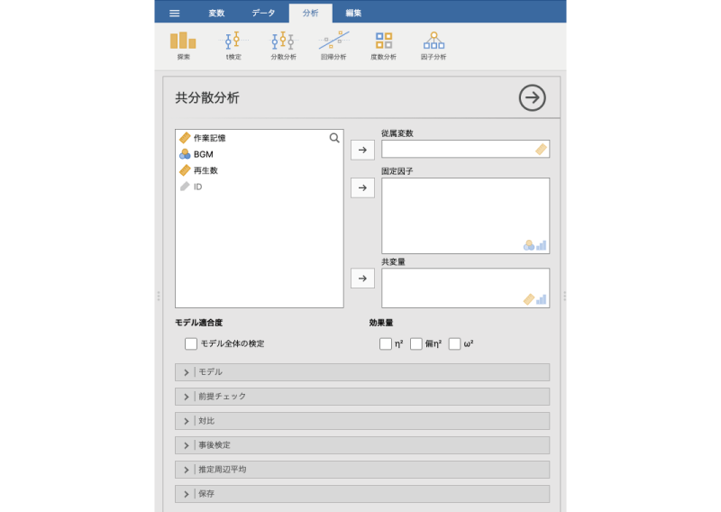
```

実際，「ANOVA」の設定画面との違いは，「Fixed Factors（固定要因）」の下に「Covariates（共変量）」の指定欄があるかどうかだけです。

そして，分析手順もほぼ「ANOVA」と同じです。「Dependent Variable（従属変数）」に「再生数」を，「Fixed Factors（固定要因）」に「BGM」を入れます。ここまでは「ANOVA」の場合と同じです。違うのは，「Covariates（共変量）」に「作業記憶」を指定することだけです（図\@ref(fig:ANOVA-ancova-set-var1)）。

```{r ANOVA-ancova-set-var1, fig.cap='共分散分析の分析設定', echo=FALSE}
knitr::include_graphics("images/ANOVA/ancova-set-var1.png")
```

これで基本の分析設定はおしまいです。

### 分析結果 {#sub:ANOVA-ancova-results}

共分散分析の結果は，図\@ref(fig:ANOVA-ancova-results)のような形で表示されます。

```{r ANOVA-ancova-results, fig.cap='共分散分析の結果', echo=FALSE}

```

分析方法だけでなく，結果の表示も「ANOVA」の場合とほとんど同じです。この結果の表の「BGM」の行がBGMの主効果についての検定結果です。この分析結果ではp=0.017ですので，5%水準の検定であればBGMの主効果は有意ということになります。

結果の表の2行目にある「作業記憶」の部分は，作業記憶の容量という共変量による再生数への影響についての検定結果です。この検定結果では，作業記憶の容量による影響も有意になっています。では，もし今回のデータで共変量を用いずに分析した場合，結果はどのようになるのでしょうか。

それを確かめるために，設定画面で「Covariates（共変量）」から「作業記憶」を外してみてください。すると，結果は図\@ref(fig:ANOVA-ancova-result2)のようになります。

```{r ANOVA-ancova-result2, fig.cap='共変量を用いない場合の分析結果', echo=FALSE}

```

「BGM」の有意確率がp=0.088となり，主効果が有意でなくなりました。なお，この結果は，共変量を用いない共分散分析，つまり分散分析の結果と同じです。実際，この結果は，「ANOVA」で「再生数」を従属変数，「BGM」を固定要因に設定して分析した場合と同一です。

つまり，今回の実験の場合，もし参加者の作業記憶の容量が測定されておらず，BGMの違いだけを用いて分析していたとしたら，BGMの違いによる記憶再生量への影響は見過ごされてしまっていた可能性があるのです。


さて，先ほどから何度も繰り返しているように，この「ANCOVA」の設定項目は，共変量の設定欄がある以外は「ANOVA」のものと同一です。そのため，`r groupbar('Model')`や`r groupbar('Assumption Checks')`などの設定についての個別の説明はここでは省略します。それらについては「[ANOVA](#sec:ANOVA-anova)」の該当箇所を参照してください。

なお，「[Repeated Measures ANOVA](#sec:ANOVA-rm)（反復測定分散分析）」の分析設定画面にも「Covariates（共変量）」という設定欄があったのを覚えているでしょうか。じつは，「Repeated Measures ANOVA」では共変量を用いた分析も可能で，その際の共変量についての考え方は，この共分散分析の場合と同じなのです。つまり，「Repeated Measures ANOVA」のメニューでは，反復測定分散分析と反復測定共分散分析の両方が可能ということです。

最後に，せっかくですのでBGMの主効果について多重比較と推定周辺平均の算出を行っておきましょう。図\@ref(fig:ANOVA-ancova-tukey)は，`r groupbar('Post Hoc Tests')`（事後検定）で「BGM」の各水準間の差について「Tukey」法による多重比較を行った結果です。

```{r ANOVA-ancova-tukey, fig.cap='BGMの主効果についての多重比較', echo=FALSE}
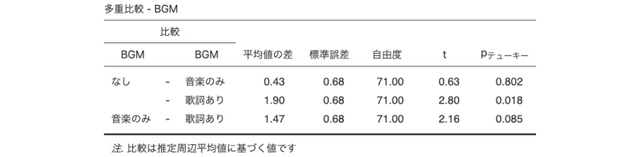
```

多重比較の結果では，いずれの水準間にも有意な差は認められませんでした。主効果は有意ではあったものの，水準間の差はあまり明確ではないようです。また，BGM要因の各水準における推定周辺平均値をグラフに示したものが図\@ref(fig:ANOVA-ancova-emm)です。この図を作成するには，`r groupbar('Estimated Marginal Means')`（推定周辺平均）で「BGM」を「Term（項）」に設定してください。

```{=latex}
\clearpage
```
多重比較では統計的に有意な差は見られませんでしたが，この図を見る限りでは，「歌詞あり」のBGMを聴きながら記憶した条件では，テストにおける再生数が他の2条件に比べてやや低いようです。

```{r ANOVA-ancova-emm, fig.cap='BGMの各水準における推定周辺平均値と95％信頼区間', echo=FALSE}

```

## MANCOVA：多変量共分散分析 {#sec:ANOVA-macnova}

```{r}
data05<-read.csv('data/anova_data05.csv')

# ID
attributes(data05$ID)$`jmv-id`<-TRUE

# 連続変数
attributes(data05$満足度)$measureType<-c('Continuous')
attributes(data05$理解度)$measureType<-c('Continuous')

# 呈示条件
data05$タイプ<-factor(data05$タイプ)
attributes(data05$タイプ)$levels<-c('教室','ライブ','オンデマンド')
attributes(data05$タイプ)$values<-c(1,2,3)
attributes(data05$タイプ)$measureType<-c('Nominal')

out<-jmvReadWrite::jmvWrite(data05,'data/omv/anova_data05.omv')

```

たとえばストレスの測定などにおいては，血圧と筋電図など，同時に複数の指標を用いることがあります。それらの指標に対し，実験条件の主効果や交互作用があるといえるかどうかを確かめたい場合，分散分析では一度に1つの指標しか分析に用いることができません。

この場合，それぞれの指標が互いにまったく無関係（独立）なものであれば，それぞれの指標について個別に分散分析を行うといった方法でよいでしょう。しかし，それら複数の指標の間に関連性があり，そしてそれらをひとまとまりとして分析したい場合には，分散分析は使えません。

そのような場合の分析手法の1つとして，分散分析を多変量に拡張した*多変量分散分析*（*MANOVA*）があります。通常の分散分析が従属変数を1つしか扱えないのに対し，多変量分散分析では複数の従属変数を一度に分析することが可能です。また，共変量の影響を取り除いたうえで主効果や交互作用について分析する分散分析は*共分散分析*と呼ばれますが，多変量分散分析でもこれと同様のことが可能です。多変量分散分析で共変量を用いる場合の分析は，*多変量分散分析*（*MANOVA*）と呼ばれます。

ここでは，この多変量（共）分散分析の考え方について簡単に見ておくことにしましょう。なお，多変量共分散分析でも交互作用の分析は可能ですが，話が複雑になるのでここでは主効果のみを考えることにします。

### 考え方 {#sub:ANOVA-mancova-basics}

履修者数が100人を超えるような大規模な講義科目において，通常の教室での講義とオンラインでの講義の間で学生の満足度や理解度に違いがあるかどうかを調べたいとします。そこで，教室で実施されている授業とオンラインでリアルタイムに実施するライブ形式の授業，オンデマンドで動画配信を行う形式の授業のそれぞれから無作為に30科目を選び，それらの科目で満足度と理解度を測定しました。その結果がこのサンプルデータ（[anova-data05.omv](https://github.com/sbtseiji/jmv_compguide/raw/main/data/omv/anova_data05.omv)）です（図\@ref(fig:ANOVA-data05)）。


```{r ANOVA-data05, fig.cap='サンプルデータ', echo=FALSE}
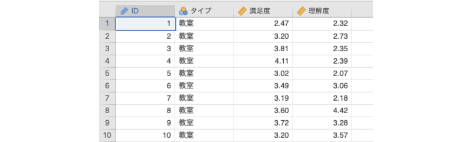
```

:::{.jmvvar data-latex=""}
+ `ID`　授業のID
+ `タイプ`　授業のタイプ（教室，ライブ，オンデマンド）
+ `満足度`　その授業に対する受講生の満足度評価（1〜5）の平均値
+ `理解度`　その授業に対する受講生の理解度（1〜5）の平均値
:::

このデータでは，各授業について満足度と理解度の2種類の測定値（いずれもその授業の受講者による評価の平均値）があります。そして，この2種類の測定値が，授業のタイプ（教室，ライブ，オンデマンド）によって異なるかどうかを知りたいわけです。この場合，授業の満足度と理解度の評価がまったく無関係ということはおそらくないでしょう。

ですので，できれば満足度と理解度で別々に分析するのではなく，これら2つの評価値をひとまとめにして，3つの授業タイプの間に全体的な違いがあるかどうかを見たいと思います。さて，その場合にはどうすればよいのでしょうか。

これについて，まずはもっと単純化した形で考えてみましょう。正規分布した母集団が1つあるとします。その母集団の分布を，横軸に変数値，縦軸に度数をとって表すと，図\@ref(fig:ANOVA-mancova-normdist)のようなおなじみの形になります。

```{r ANOVA-mancova-normdist, fig.cap='正規分布の母集団', echo=FALSE}
knitr::include_graphics("images/ANOVA/mancova-normdist.png")
```

今度は，相関関係がある2つの母集団の分布を見てみましょう。正規分布する2つの母集団の間に明確な正の相関があるとき，1つ目の変数値を横軸，2つ目の変数値を縦軸にとって散布図の形に示すと図\@ref(fig:ANOVA-mancova-correlation)のようになります。これもおなじみの形です。

```{r ANOVA-mancova-correlation, fig.cap='相関のある母集団の散布図', echo=FALSE}

```

さて，この散布図には，それぞれの値の度数は示されていません。そこで，このように相関がある母集団の分布について，度数を高さとする形で図示してみます。すると，その形は図\@ref(fig:ANOVA-mancova-multivariate)のようになります。先ほどの散布図は，この立体的な山を真上から眺めたものといえます。また，このような正規分布する複数の変数で構成された分布は*多変量正規分布*と呼ばれます。

```{r ANOVA-mancova-multivariate, fig.cap='相関関係のある母集団の度数の分布', echo=FALSE}
knitr::include_graphics("images/ANOVA/mancova-multivariate.png")
```

ここで，サンプルデータのように2つの変数で構成される多変量正規分布が3つあったとしましょう。そして，それらを1つの散布図に示したところ，図\@ref(fig:ANOVA-mancova-multivariate2)のようになったとします。

```{r ANOVA-mancova-multivariate2, fig.cap='3つの多変量正規分布の散布図', echo=FALSE}

```

この3つの分布の山を，変数1，変数2の軸からそれぞれ眺めた場合，その分布の形は図\@ref(fig:ANOVA-mancova-multivariate3)のようになります。このように，同じ分布であっても，それらをどの方向から見るかによって，その見え方が大きく異なるのがわかります。


```{r ANOVA-mancova-multivariate3, fig.cap='3つの多変量正規分布の視点による違い', echo=FALSE}

```

この変数1から見た場合の分布は，3つの母集団における変数1の分布と同じものです。たとえばこのデータで，変数1の平均値に3つの母集団で差があるといえるかどうかを分散分析で確かめたとすると，この図におけるA，B，Cそれぞれの平均値のばらつきが主効果，それぞれの母集団の中での値のばらつきを総合したものが残差（誤差）ということになります。

先ほどの変数1からの視点，変数2からの視点の分布をもう一度よく見てみると，変数1の視点では，Aの分布がBとCに比べてやや離れているように見えますが，変数2の分布では，A，Bの分布とCの分布の間に差がありそうに見えます。また，変数2の分布はそれぞれの母集団内でのばらつきの幅が小さい（山の幅が狭い）のに対し，変数1の分布では，変数2に比べてそれぞれの母集団におけるばらつきの幅が少し広くなっています。このように，同じ3つの分布であっても，見る視点が異なれば，その平均値やばらつきの幅の見え方は異なってくるのです。

母集団A，B，Cの違いの見え方がその分布を眺める角度によって異なるのであれば，この3つの分布の違いがわかりやすくなるような視点があるかもしれません。たとえば，図\@ref(fig:ANOVA-mancova-multivariate4)のような斜めの視点からこれらの分布を眺めてみるとどうでしょう。すると，A，B，Cの3つでそれぞれに平均値（山の頂上）の位置が異なり，また，各分布における値のばらつき幅は非常に狭くなっていて，この3つの分布の違いがとてもよくわかるようになりました。

```{r ANOVA-mancova-multivariate4, fig.cap='3つの分布を別の視点から眺めた場合', echo=FALSE}

```


このようにして，多変量（共）分散分析では，分布の違いがもっとも明確になる視点からこれら多変量の分布を眺め，そしてその視点における各条件の平均値のばらつき（主効果）と，それぞれの分布内での値のばらつき（残差）を算出します。あとは分散分析の考え方と同じで，主効果のばらつきが残差（誤差）のばらつきに比べてどの程度大きいかをもとに，帰無仮説（すべての条件で分布は同じ）を棄却すべきかどうかについて判断します。

### 分析手順 {#sub:ANOVA-mancova-procedure}

多変量（共）分散分析は，Analysesタブの「`r infig('analysis-anova')` ANOVA」から「MANCOVA（多変量共分散分析）」を選択して実施します（図\@ref(fig:ANOVA-mancova-menu)）。

```{r ANOVA-mancova-menu, fig.cap='多変量共分散分析の実行', echo=FALSE}

```

すると，図\@ref(fig:ANOVA-mancova-settings)のような設定画面が表示されます。「ANOVA」などに比べると，かなりシンプルな設定画面です。

```{r ANOVA-mancova-settings, fig.cap='多変量共分散分析の設定画面', echo=FALSE}
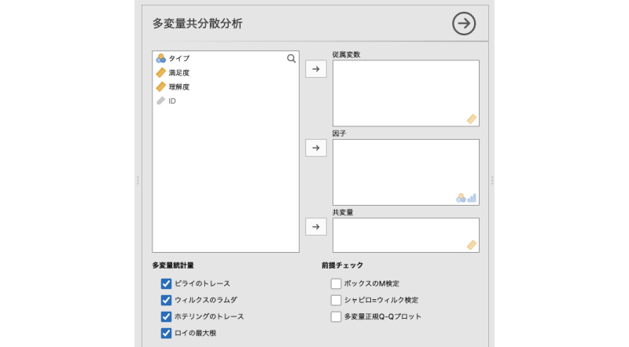
```

ここで，「満足度」と「理解度」の2つの従属変数を「Dependent Variables（従属変数）」に，授業の「タイプ」を「Factors（要因）」に移動します。今回の分析では「Factors」として用いるのは授業タイプの1つのみですが，複数の要因を用いた分析の場合には，それらをすべてここに移動します（図\@ref(fig:ANOVA-mancova-set-var)）。

```{r ANOVA-mancova-set-var, fig.cap='多変量分散分析の分析設定', echo=FALSE}

```


また，今回のデータには共変量は含まれていませんので，「Covariates（共変量）」の部分は空欄のままです。つまりこのデータの場合の分析は，多変量共分散分析の「共」がないタイプ，すなわち多変量分散分析ということになります。

分析の基本設定はこれだけで，これで分析の結果が出力されます。


### 分析結果 {#sub:ANOVA-mancova-results}

多変量分散分析の結果は，図\@ref(fig:ANOVA-mancova-results)のような形で表示されます。

```{r ANOVA-mancova-results, fig.cap='多変量分散分析の分析結果', echo=FALSE}
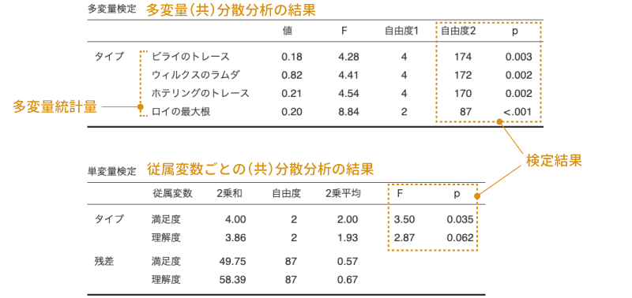
```

結果の1つ目の表が，多変量分散分析の結果です。表には，多変量統計量の値（**value**）とそれらの値を元に算出した「**F**」，主効果と残差それぞれの自由度（**df1**，**df2**），そして有意確率（**p**）が示されています。主効果は1つなのに4つもpの値が表示されていますが，これは多変量分散分析における統計量の算出方法に複数の考え方があるためです。

これら4つの値のうち，一般には「Wilks' Lambda（ウィルクスのラムダ）」と呼ばれる値に基づく結果で判断することが多いようですので，ここでもそうすることにしましょう。すると，統計量Fの値は4.41で，このFの有意確率はp=0.002ですので主効果は有意です。つまり，授業タイプによって，満足度や理解度に違いがあるということになります。

結果の2つ目の表は，それぞれの従属変数ごとに分散分析を実施した結果が示されています。多変量（共）分散分析の場合，複数の従属変数を総合した形で分析しているので，そこで主効果が有意であったとしても，それがどのような差を表しているのかがわかりません。そこで，一般的には，多変量（共）分散分析が有意であった場合には，その次の段階として，複数の従属変数のそれぞれについて，個別に分析を行うという方法がとられます。

なお，多変量で主効果結果が有意でなくても，単変量（個別の分析）の分析結果に主効果が有意なものが含まれている場合があるかもしれませんが，多変量での検定結果が有意でない場合には，それらの個別の分析結果は使用しません。これは，分散分析で主効果が有意でない場合には多重比較を行わないのと同じ理由です。

この単変量の分散分析結果からは，3つの授業タイプの間では，理解度と満足度のうち，満足度の方に何か違いがありそうだということがわかります。

### 分析の詳細設定 {#sub:ANOVA-mancova-details}

jamoviの「MANCOVA」で提供されている機能はごく基本的もののみなので，設定できる項目は多くありません。設定可能なのは，算出される多変量統計量の種類の選択と，分析の前提に関するチェックのみです。

#### Multivariate Statistics：多変量統計量 {-}

設定画面の**Multivariate Statistics**（多変量統計量）には，次の4つの項目が含まれています。

:::{.jmvsettings data-latex=""}
+ Pillai's Trace（ピライのトレース）
+ Wilks's Lambda（ウィルクスのラムダ）
+ Hotelling's Trace（ホテリングのトレース）
+ Roy's Largest Root（ロイの最大根）
:::

多変量（共）分散分析でも，分散分析の場合と同様に，主効果のばらつきが残差のばらつきに比べてどの程度大きいかを元に結果の判断を行うのですが，分散分析における主効果や残差の値は，多変量の分析ではすべて*行列*^[行列は*線形代数*と呼ばれる数学領域で用いられるもので，関連のある複数の値を「行（各参加者など）」と「列（各変数など）」に並べてひとまとめにしたものです。線形代数では，この行列をを用いてさまざまな計算を行います。こうして複数の値を1まとめにすることによって複雑な計算を大幅に簡素化できるため，多変量解析において行列は不可欠といえるものです。ただ，その説明のためにはかなりのページが必要になるので，ここでは行列については詳しく触れません。詳しくは線形代数の教科書や参考書などを参照してください。]の形で扱われます。その場合，主効果が残差に比べてどれだけ大きいかを評価する方法には複数の考え方があり，その代表的なものがこれら4つの値なのです。

なお，多変量（共）分散分析では，これらの統計量を分散分析で使用する統計量Fに近似したうえで検定を行うのが一般的です。そのため，jamoviの分析結果でも，それぞれの値をFに変換したものが結果の表に記載されています。

##### Pillai's Trace：ピライのトレース{-}

*ピライのトレース*は，主効果の2乗和の行列にデータ全体の（偏差の）2乗和の行列の逆行列を掛け合わせた結果に基づく統計量です。「逆行列」というのは，ある数値（x）に対する逆数（1/x）に相当するもので，逆行列を掛けるということは，通常の計算における割り算のような処理を行っていることになります。つまり，非常におおざっぱにいえば，この処理は主効果の2乗和をデータ全体の偏差2乗和で割っているようなものといえます。

ピライのトレースの「トレース」とは，行列における対角成分（相関行列だとつねに1.00になる部分）の値のことです。ピライのトレースは，先ほど述べたような形で計算した結果行列の対角成分に含まれる値を合計した値です。この値は0から1までの範囲をとり，値が1に近いほど主効果が残差に比べて大きいことを意味します。

##### Wilks's Lambda：ウィルクスのラムダ{-}

*ウィルクスのラムダ*（$\Lambda$）は，多変量（共）分散分析においてもっとも一般的に用いられる統計量です。この値は，残差2乗和行列の行列式^[行数と列数が同じ行列において算出される，その行列における固有の値です。その行列を用いて空間座標の変換を行った場合に，変換後の空間が元の空間の何倍の大きさになるかを示す値というような形で説明されます。非常におおざっぱにいえば，その行列が持つ影響力の大きさのようなものです。]をデータ全体の偏差2乗和の行列の行列式で割って算出されます。ピライのトレースでは主効果を全体で割るような形で計算するのに対し，ウィルクスのラムダは残差を全体で割るような形での計算が行われます。そのため，このウィルクスのラムダの値は0に近いほど残差が少ない，つまり主効果が残差に比べて大きいことを意味します。

なお，jamoviでは多変量（共）分散分析で効果量を算出できませんが，多変量（共）分散分析において一般的に用いられる効果量である「*多変量イータ2乗*（多変量$\eta^2$）」は，「1 &minus; ウィルクスのラムダ」という計算によって簡単に算出することができます。

##### Hotelling's Trace：ホテリングのトレース{-}
*ホテリングのトレース*も，ピライのトレースと同様に，計算の結果得られた行列のトレース（対角成分の合計）を用いて主効果の大きさを評価します。ホテリングのトレースでは，主効果の2乗和の行列に残差2乗和行列の逆行列を掛け合わせる形で計算を行います。つまり，主効果の2乗和を残差の2乗和で割るような形で主効果の大きさを評価するわけです。そのため，この値が大きいほど主効果が残差に比べて大きいということになります。なお，ピライのトレースやウィルクスのラムダは0から1の範囲の値になるのに対し，ホテリングのトレースの値は1より大きくなる場合もあります。

##### Roy's Largest Root：ロイの最大根{-}
*ロイの最大根*と呼ばれる統計量の計算手順は，結果の行列を算出するところまではホテリングのトレースと同じで，主効果の2乗和行列に残差2乗和行列の逆行列を掛ける形で計算を行います。そしてロイの最大根では，その行列の*固有値*を計算し，その固有値の中で最大の値を統計量として用います^[「固有値」というのは主成分分析や因子分析でも頻繁に出てくる言葉ですが，行列についてのある程度の知識がないと説明が難しい概念です。非常におおざっぱにいえば，行列式と同様に，この値もその行列が持つ影響力の大きさを表しているといえます。ただし，行列式とは異なり，固有値は列数と同じ個数だけ算出されます。]。

#### Assumption Checks：前提チェック{-}
「MANCOVA」の**Assumption Checks**（前提チェック）には，次の3つの項目が含まれています。

:::{.jmvsettings data-latex=""}
+ Box's M test（ボックスのM検定）
+ Shapiro-Wilk test（シャピロ=ウィルク検定）
+ Q-Q plot of multivariate normality（多変量正規Q-Qプロット）
:::

##### Box's M test：ボックスのM検定{-}

*ボックスのM検定*は，「すべてのグループにおいて分散共分散行列が等しい」という帰無仮説について検定を行います。この検定は，通常の分散分析における分散の等質性検定に相当するものです。多変量（共）分散分析の場合には，このようにグループ（水準）間で分散共分散行列が等質であるということが前提条件の1つになります。

「Box's M test」のチェックをオンにすると，図\@ref(fig:ANOVA-mancova-box)のような形で検定結果が表示されます。

```{r ANOVA-mancova-box, fig.cap='ボックスのM検定の結果', echo=FALSE}

```

結果の表には，$\chi^2$（カイ二乗）統計量と自由度，そして有意確率pが示されています。この検定では「すべてのグループで分散共分散行列が同じ」が帰無仮説ですので，この検定の結果が有意である場合には，分析のための前提が満たされていないということになります。今回のこの結果では，ボックスのM検定の結果は有意ではありませんので，前提が満たされていないということはなさそうです。

##### Shapiro-Wilk test：シャピロ=ウィルク検定{-}

このシャピロ=ウィルク検定は，多変量に拡張されている以外はANOVAの場合のものと基本的に同じです。この検定では，「データが多変量正規分布である」が帰無仮説なので，この検定結果が有意な場合には，データが多変量正規分布でない，つまり分析のための前提が満たされていないことを意味します。

##### Q-Q plot of multivariate normality：多変量正規Q-Qプロット{-}

この多変量正規Q-Qプロットも，通常の正規Q-Qプロットを多変量に拡張したもので，その使い方については基本的に正規Q-Qプロットと同じです。このプロットでデータ点が直線上に並んでいれば，そのデータは多変量正規分布であると見なすことができます。

### 多変量の多重比較 {#sub:ANOVA-mancova-posthoc}

「MANCOVA」の設定項目はこれですべてですが，最後に多変量（共）分散分析で主効果が有意であった場合の事後検定について少しだけ見ておきましょう。jamoviの「MANOVA」では，多変量（共）分散分析の結果と合わせて単変量，つまり各従属変数ごとの（共）分散分析の結果が表示されます。これはこれでよいのでしょうが，研究の目的によっては，従属変数ごとに個別に分析するのではなく，多変量のままで多重比較を行いたい場合もあるでしょう。そこで，そのような場合を想定した分析方法をここで見ておこうと思います。

jamoviの「MANCOVA」のメニューには多変量の多重比較の設定項目はありませんが，これはjamoviが標準で備えている「フィルタ」機能を用いることで実現可能です。それでは，今回のデータで多変量の多重比較を行ってみましょう。

まず，分析の設定画面を閉じ，Dataタブから「Filters（フィルタ）」を選択します（図\@ref(fig:ANOVA-mancova-posthoc)）。

```{r ANOVA-mancova-posthoc, fig.cap='フィルタを選択', echo=FALSE}

```

ここで多重比較のためのフィルタ作成します。まずは「教室」の授業と「ライブ」授業の組み合わせについてのフィルタを作成しましょう。「Filter 1」の条件式の部分に，次のとおりに入力します。

:::{.jmvformula data-latex=""}
= タイプ == 1 or タイプ == 2
:::

式の途中の「イコール」は，「`=`」でなく「`==`」と2つ続ける必要があるので注意してください。また，変数名は，関数ボタン（`r infig('filters-formula')`）を使って入力するのが確実ですが，キーボードから入力しても問題ありません。

なお，ここでは授業のタイプをデータ値（1，2，3）で指定しましたが，これをラベル（教室，ライブ，オンデマンド）で指定したい場合や，あるいは変数値が文字で入力されている場合には，「"教室"」や「'ライブ'」のように，それらの値を引用符（"または'）で囲む必要がありますので，この点にも注意してください。

それから，後でこれが何のためのものかわからなくならないように，「Description（説明）」の部分には「教室 - ライブの比較」のようにして説明を記入しておくとよいでしょう（図\@ref(fig:ANOVA-mancova-filters1)）。

```{r ANOVA-mancova-filters1, fig.cap='フィルタの設定', echo=FALSE}

```

```{=latex}
\clearpage
```

これでこのペアについての比較は可能ですが，ついでなので他の組み合わせについてもここでフィルタを作成しておきます。「教室」と「オンデマンド」の比較用フィルタを作成するには，「`r infig('filters-visible')`」の上にあるほうの「`r infig('filters-add')`」をクリックしてください（図\@ref(fig:ANOVA-mancova-filters2)）。

```{r ANOVA-mancova-filters2, fig.cap='フィルタの追加', echo=FALSE}
knitr::include_graphics("images/ANOVA/mancova-filters2.png")
```


そして，条件式に次の内容を入力します（図\@ref(fig:ANOVA-mancova-filters3)）。

:::{.jmvformula data-latex=""}
= タイプ == 1 or タイプ == 3
:::

```{r ANOVA-mancova-filters3, fig.cap='「教室」と「オンデマンド」の比較用フィルタ', echo=FALSE}

```

```{=latex}
\clearpage
```

同様にして，「ライブ（2）」と「オンデマンド（3）」の比較用のフィルタも作成しましょう（図\@ref(fig:ANOVA-mancova-filters4)）。

<!-- -->

```{r ANOVA-mancova-filters4, fig.cap='「ライブ」と「オンデマンド」の比較用フィルタ', echo=FALSE}

```

3つのフィルタが完成したら，そのうちの1つのみを「active（オン）」にして，残りは「inactive（オフ）」にします。ここではまず，1つ目のフィルタのみを「active」に，それ以外を「inactive」にします（図\@ref(fig:ANOVA-mancova-filters5)）。

```{r ANOVA-mancova-filters5, fig.cap='1つ目のフィルタだけを「オン」に設定', echo=FALSE}

```

ここまでの設定が終わったら，フィルタの設定画面を閉じて，先ほどの「MANCOVA」の結果のうち，多変量の検定の部分を見てください。今，ここに表示されているのは授業のタイプが「教室」と「ライブ」の場合のデータのみを用いて行った多変量分散分析の結果です（図\@ref(fig:ANOVA-mancova-posthoc-results)）。

```{r ANOVA-mancova-posthoc-results, fig.cap='「教室」と「ライブ」の比較', echo=FALSE}
knitr::include_graphics("images/ANOVA/mancova-posthoc-results.png")
```

この分析結果では，どの多変量統計量を用いた場合もFの値は同じになり，そして検定結果も同じになります。そして，この検定の有意確率はp=0.536ですので，この水準間では学生の評価の間に有意な差はないということになります。

今度は「教室」授業と「オンデマンド」授業で比較してみます。フィルタの設定で「Filter 1」は「inactive（オフ）」に，「Filter 2」を「active（オン）」にして，再度先ほどの結果を見てみると，今度は「教室」と「オンデマンド」のデータのみを用いた計算結果が表示されています（図\@ref(fig:ANOVA-mancova-posthoc-results2)）。この結果から，「教室」と「オンデマンド」授業の間では有意確率はp=0.004であることがわかります。


```{r ANOVA-mancova-posthoc-results2, fig.cap='「教室」と「オンデマンド」の比較', echo=FALSE}
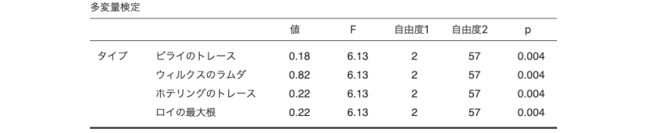
```

なお，結果を慎重に判断するためには，[ボンフェロニ法](#subsub:ANOVA-anova-posthoc-bonferroni)あるいは[ホルム法](#subsub:ANOVA-anova-posthoc-holm)によって，この有意確率を修正したほうがよいでしょう。今回は全部で3回の多重比較を行うので，ボンフェロニ法であれば，このp=0.004を3倍して判断することになります。すると，p=0.004&times;3=0.012で，この水準間の差は有意ということになります。

最後に，「ライブ」と「オンデマンド」の比較です。「Filter 3」を「active（オン）」にして，それ以外は「inactive（オフ）」にしましょう（図\@ref(fig:ANOVA-mancova-posthoc-results3)）。

```{r ANOVA-mancova-posthoc-results3, fig.cap='「ライブ」と「オンデマンド」の比較', echo=FALSE}

```

この結果から，「ライブ」と「オンデマンド」の比較ではp=0.002です。このp値をボンフェロニ法で修正すると，p=0.002&times;3=0.006となり，この差についても結果は有意です。

これらの結果から，多変量での多重比較の結果，「教室」と「ライブ」の授業の間には有意な差は見られず，「オンデマンド」授業だけが他の2つと異なる傾向を持っているということがわかります。

## One-Way ANOVA [Kruskal-Wallis]：クラスカル=ウォリス検定{#sec:ANOVA-kw}

ここからはノンパラメトリックな分析について見ていきましょう。分散分析はt検定と同様にデータが正規分布であることが前提となるため，正規分布からかけ離れたデータには適用できません。その場合に用いられる方法の1つが*ノンパラメトリック検定*ですが，ノンパラメトリック検定にも分散分析に相当する分析手法があります。

そのうち，繰り返しなしの1要因分散分析に相当するのが*クラスカル=ウォリス検定*です。

### 考え方 {#sub:ANOVA-kw-basics}

ここでは，[1要因分散分析](#sec:ANOVA-oneway)で用いたのと同じデータ（[anova_data01.omv](https://github.com/sbtseiji/jmv_compguide/raw/main/data/omv/anova_data01.omv)）を用いてクラスカル=ウォリス検定の考え方について見ていくことにしましょう（図\@ref(fig:ANOVA-data01-kw)）。

```{r ANOVA-data01-kw, fig.cap='サンプルデータ', echo=FALSE}

```

:::{.jmvvar data-latex=""}
+ `ID`　実験参加者のID
+ `条件`　文字条件（なし，不一致，一致）
+ `得点`　課題の成績（最低0&ndash;最高50）
:::

クラスカル=ウォリス検定の考え方は1要因分散分析とよく似ており，主効果（「条件」の違い）によるばらつきの大きさを，基準となるばらつきの大きさと比較する形で検定を行います。ただし，主効果のばらつきや基準となるばらつきの大きさを，測定値の「順位」をもとに算出する点が異なります。

1要因分散分析では，各条件の平均値と全体平均値の差の2乗和を主効果の2乗和として求め，ここから主効果の分散（2乗平均）を算出しました。クラスカル=ウォリス検定では，各条件に含まれる測定値の順位の平均値と全体の順位平均値の差の2乗和を主効果の2乗和として算出します。

今回のデータを例に考えてみましょう。このデータには，各条件に25人分の測定値が含まれていますので，これらの測定値に小さい順に順位をつけると，その値は1から75の範囲になります^[同順位（タイ）のものが含まれている場合は話が少し複雑になるので，ここでは同順位の測定値は考えないことにします。]。すると，このデータ全体での順位の平均値は，1から75までの数値の合計を75で割って38と求まります。これが，1要因分散分析におけるデータ全体の平均値に相当します。

そして，このデータ全体における各測定値の順位を3つの条件それぞれで求めると，「なし」条件では34.38，「不一致」条件では25.14，「一致」条件では54.48というように，各条件の順位の平均値にばらつきがあるのがわかります。この各条件の平均値と，先ほどのデータ全体の順位平均値の差の2乗和が，クラスカル＝ウォリス検定における主効果の2乗和になるのです。

なお，1要因分散分析では，主効果（条件の違い）で説明しきれない部分（残差）を基準にして主効果が有意といえるかどうかを判断しますが，クラスカル=ウォリス検定では，全体の順位平均値と各測定値の順位の差の2乗和を基準にして判断を行います。このように，クラスカル=ウォリス検定では，とにかく各測定値の「順位」の情報を利用しながら，条件間に差があるといえるかどうかを判断していくのです。

### 分析手順 {#sub:ANOVA-kw-procedure}

では早速，分析してみましょう。クラスカル=ウォリス検定の実行には，Analysesタブの「`r infig('analysis-anova')` ANOVA」で，「Non-Parametric（ノンパラメトリック検定）」の下にある「One-Way ANOVA [Kruskal-Wallis]（クラスカル=ウォリス検定）」を選択します。分析メニューに「One-Way ANOVA」とあるのは，この分析が1要因分散分析のノンパラメトリック版に相当するものだからです図\@ref(fig:ANOVA-kw-menu)。

```{r ANOVA-kw-menu, fig.cap='クラスカル=ウォリス検定の実行', echo=FALSE}
knitr::include_graphics("images/ANOVA/kw-menu.png")
```

すると，図\@ref(fig:ANOVA-kw-settings)のようなシンプルな画面が表示されます。

```{r ANOVA-kw-settings, fig.cap='クラスカル=ウォリス検定の設定画面', echo=FALSE}
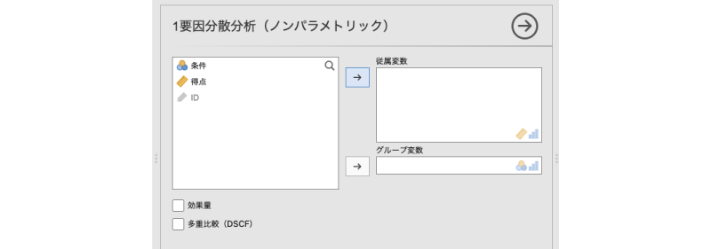
```

この画面で，「得点」を「Dependent Variables（従属変数）」に，「条件」を「Grouping Variable（グループ変数）」に指定すれば，これで分析終了です（図\@ref(fig:ANOVA-kw-set-var)）。

```{r ANOVA-kw-set-var, fig.cap='クラスカル=ウォリス検定の分析設定', echo=FALSE}

```

### 分析結果 {#sub:ANOVA-kw-results}

それでは結果を見てみましょう。クラスカル=ウォリス検定の結果は図\@ref(fig:ANOVA-kw-results)のような形で表示されます。

```{r ANOVA-kw-results, fig.cap='クラスカル=ウォリス検定の結果', echo=FALSE}

```

クラスカル=ウォリス検定では，検定統計量として$\chi^2$の近似値が算出されるため，結果の表には$\chi^2$（カイ2乗）の値と自由度，そして有意確率が示されています。この検定の帰無仮説は「すべての条件で分布が同じ」であるため，この検定結果におけるpの値が有意水準を下回る場合に，条件間で分布が異なる（差がある）ということになります。そして今回の分析では，検定結果は有意でした。つまり，実験条件によって得点が異なるということです。

### 効果量と多重比較 {#sub:ANOVA-kw-others}

クラスカル＝ウォリス検定では，基本の分析以外の設定項目は効果量と多重比較の2つだけです。

##### Effect size：効果量 {-}

まず効果量についてですが，設定画面の「Effect size」にチェックを入れると，図\@ref(fig:ANOVA-kw-es)のように結果の表の右端に効果量$\varepsilon^2$（イプシロン2乗）の値が表示されます。

```{r ANOVA-kw-es, fig.cap='クラスカル=ウォリス検定の効果量', echo=FALSE}
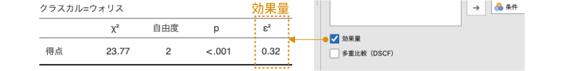
```

この$\varepsilon^2$の値は，各条件の順位の差の2乗和（主効果の2乗和）の値を全体の2乗和で割ったもので，1要因分散分析の場合の$\eta^2$（イータ2乗）と同じ考え方で算出される値です。そして，この$\varepsilon^2$の大きさの目安は，$\eta^2$の場合と同様です（表\@ref(tab:ANOVA-kw-epsilon)）。ですので，今回の分析結果から，条件の違いによる主効果はかなり大きなものだといえます。

```{r, ANOVA-kw-epsilon}
epsilon.es %>% 
  kable(align="cc", caption = "$\\varepsilon^2$の解釈の目安",booktabs=T,escape=F)%>%
  kable_styling(latex_options = "HOLD_position")
```

##### DSCF pairwise comparisons：多重比較 {-}

設定画面の「DSCF pairwise comparisons」にチェックを入れると，すべての条件間での多重比較の結果が表示されます（図\@ref(fig:ANOVA-kw-pairwise)）。

```{r ANOVA-kw-pairwise, fig.cap='ノンパラメトリックな多重比較', echo=FALSE}

```

その際に使用される検定方法は*ドゥワス=スティール=クリッチロウ=フリグナー法*（*DSCF法*）と呼ばれるもので，これはテューキー法による多重比較のノンパラメトリック版です。クラスカル＝ウォリス検定と同じく，この方法でも測定値の順位に基づく検定が行われます。また，この方法では，テューキー法による多重比較の場合と同様に調整済みの検定統計量が算出されますので，結果のp値を調整する必要はありません。


図\@ref(fig:ANOVA-kw-pairwise)の結果の表にはWという値が示されていますが，これがこの検定の検定統計量です。そしてこの多重比較の結果から，「なし」条件と「一致」条件，「不一致」条件と「一致」条件の間に有意な差があることがわかります。

## Repeated Measures ANOVA [Friedman]：フリードマン検定 {#sec:ANOVA-friedman}

```{r}
data06<-read.csv('data/anova_data06.csv')

# ID
attributes(data06$ID)$`jmv-id`<-TRUE

# 連続変数
attributes(data06$模型)$measureType<-c('Continuous')
attributes(data06$VR)$measureType<-c('Continuous')
attributes(data06$動画)$measureType<-c('Continuous')


out<-jmvReadWrite::jmvWrite(data06,'data/omv/anova_data06.omv')

```

繰り返しなし（対応なし）の場合の1要因分散分析に対応するノンパラメトリック検定としてはクラスカル=ウォリス検定がありますが，1要因の反復測定分散分析に対応するノンパラメトリック検定には*フリードマン検定*があります。

### 考え方{#sub:ANOVA-friedman-basics}

ここでは，次のサンプルデータ（[anova_data06.omv](https://github.com/sbtseiji/jmv_compguide/raw/main/data/omv/anova_data06.omv)）を用いて，フリードマン検定の基本的な考え方を見ておきましょう。このデータには，空間についての記憶実験の成績が記録されています。この実験では，模型の観察（模型条件），VRによるインタラクティブな空間体験（VR条件），あらかじめ録画された動画視聴による空間体験（動画条件）の3つの条件それぞれで架空の都市空間を体験してもらい，その後，その空間にあった建物の位置や形などについての記憶テストを行いました（図\@ref(fig:ANOVA-data06)）。記憶課題の成績は，数値が大きいほど好成績であることを意味します。

```{r ANOVA-data06, fig.cap='サンプルデータ', echo=FALSE}

```

:::{.jmvvar data-latex=""}
+ `ID`　実験参加者のID
+ `模型`　模型観察条件の課題成績
+ `VR`　VR条件の課題成績
+ `動画`　動画条件の課題成績
:::


フリードマン検定では，クラスカル=ウォリス検定の場合と同様に，測定値の順位を利用して条件間に差があるかどうかを検定します。ただし，クラスカル=ウォリス検定では各測定値にデータ全体での順位をつけ，それを各条件で平均するという方法を取りましたが，フリードマン検定の場合には，参加者ごとに各条件の測定値の順位づけを行います。

```{r}
seiseki.rank<-c(data06$模型[1],data06$VR[1],data06$動画[1])
seiseki.rank<-rank(seiseki.rank)
```

たとえば，今回のデータでは，1人目の参加者の課題成績は，「模型」条件が「`r data06$模型[1]`」，「VR」条件が「`r data06$VR[1]`」，「動画」条件が「`r data06$動画[1]`」ですので，この3つで順位をつけると，「模型：`r seiseki.rank[1]`，VR：`r seiseki.rank[2]`，動画：`r seiseki.rank[3]`」となります。このような形での順位づけをすべての参加者に対して行ったとき，3つの条件の間に明確な差がある（明確な順序がある）のであれば，この順位づけの値はどの参加者でも同じになるはずです。そしてもし，そのように参加者間で順位が一致しているのであれば，3つの条件それぞれで全参加者の順位づけの値を合計したとき，その合計値は3つの条件で大きく異なる値になるでしょう。

しかし，この3つの条件に差がなく，順序がはっきりしなければ，それぞれの参加者における順位づけの値は，参加者ごとにまちまちになります。すると，3つの条件それぞれで全参加者の順位づけの値を合計したとき，3つの条件の順位の合計値に違いは見られなくなります。

このような考え方から，フリードマン検定では，各参加者における測定値の順位を測定条件ごとに集計することで，各参加者の測定値の順位が一致している程度を調べ，その情報をもとに，条件間に差があるかどうかの判断を行います。

### 分析手順{#sub:ANOVA-friedman-procedure}

フリードマン検定の実行には，Analysesタブの「`r infig('analysis-anova')` ANOVA」で，「Non-Parametric（ノンパラメトリック検定）」の部分にある「Repeated Measures ANOVA [Friedman]（フリードマン検定）」を選択します（図\@ref(fig:ANOVA-friedman-menu)）。分析メニューに「Repeated Measures ANOVA」とあるのは，この分析が反復測定1要因分散分析のノンパラメトリック版に相当するものだからです。

```{r ANOVA-friedman-menu, fig.cap='フリードマン検定の実行', echo=FALSE}

```

このメニューを選択して実行すると，図\@ref(fig:ANOVA-friedman-settings)のような設定画面が表示されます。こちらも非常にシンプルなものです。

```{r ANOVA-friedman-settings, fig.cap='フリードマン検定の設定画面', echo=FALSE}

```

フリードマン検定の基本設定は，この設定画面で分析対象の変数すべてを「Measures（測定値）」のところへ移動するだけで完了です（図\@ref(fig:ANOVA-friedman-set-var)）。

```{r ANOVA-friedman-set-var, fig.cap='フリードマン検定の分析設定', echo=FALSE}
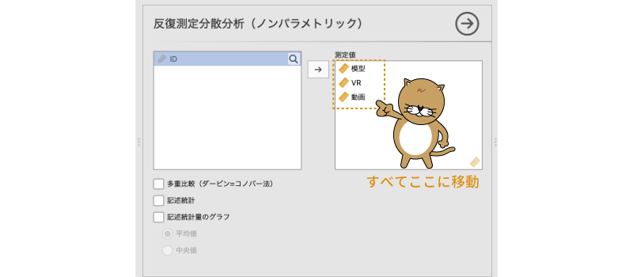
```

### 分析結果{#sub:ANOVA-friedman-results}

それでは結果を見てみましょう。フリードマン検定の結果は図\@ref(fig:ANOVA-friedman-results)のような形で表示されます。

```{r ANOVA-friedman-results, fig.cap='フリードマン検定の結果', echo=FALSE}

```

結果の表に表示される項目はクラスカル=ウォリス検定の場合と同じで，$\chi^2$統計量と自由度，そしてp値です。この検定でも$\chi^2$の値を用いて検定を行います。この検定の帰無仮説は「すべての条件で分布が同じ」なので，この検定結果の有意確率が有意水準を下回る場合に「すべての条件で分布が同じでない（分布に差がある）」ということになります。今回の分析結果ではp=0.001なので，条件間の差は有意です。

### 多重比較と記述統計量{#sub:ANOVA-friedman-pairwise}

フリードマン検定では，基本設定以外の設定項目は多重比較と記述統計量の算出に関するものだけです。

##### Pairwise comparisons (Durbin-Conover)：多重比較 {-}

jamoviのフリードマン検定には，多重比較の方法として*ダービン=コノバー法*と呼ばれる手法が用意されています。設定画面の「Pairwise comparisons (Durbin-Conover)」にチェックを入れると，図\@ref(fig:ANOVA-friedman-pairwise)のような形で多重比較の結果が表示されます。

```{r ANOVA-friedman-pairwise, fig.cap='フリードマン検定後の多重比較', echo=FALSE}

```


結果の表には「**Statistic**（統計量）」としか書かれていませんが，この値はスチューデントのtの推定値で，その隣の「**p**」の欄はこのtの有意確率です。なお，DSCF法の場合とは異なり，このp値には多重比較の際の調整が加えられていませんので，実際の検定場面では，このp値を[ボンフェロニ法](#subsub:ANOVA-anova-posthoc-bonferroni)や[ホルム法](#subsub:ANOVA-anova-posthoc-holm)で修正してから判断したほうがよいでしょう。

この結果のp値をボンフェロニ法で修正する場合，今回は多重比較を全部で3回行っていますので，p値をすべて3倍して判断することになります。すると，「模型」条件と「動画」条件（p&lt;.001 &times; 3 &lt;0.003），「VR」条件と「動画」条件（p=0.004 &times; 3 =0.012）の間の差が有意ということになります。

##### Descriptives：記述統計量{-}

2つ目の「Descriptives」の項目は，その名のとおり各条件における記述統計量を算出するための設定項目です。ここにチェックを入れると，各条件における測定値の平均値と中央値が表示されます（図\@ref(fig:ANOVA-friedman-descriptives)）。

```{r ANOVA-friedman-descriptives, fig.cap='各条件の平均値と中央値', echo=FALSE}

```

##### Descriptive plot：記述統計量のグラフ{-}

3つ目の「Descriptive plot」にチェックを入れると，各条件の記述統計量をグラフに示すことができます。その際，下のラジオボタンで「Means（平均値）」を選択すると平均値のグラフが，「Medians（中央値）」を選択すると中央値のグラフが作成されます（図\@ref(fig:ANOVA-friedman-descriptive-plot)）。

```{r ANOVA-friedman-descriptive-plot, fig.cap='記述統計量のグラフ', echo=FALSE}
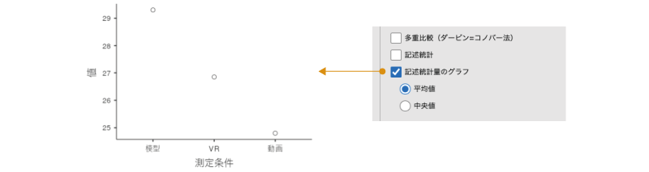
```


