```{r, echo = F, message = FALSE}
source("rscripts/_utility.R")
```

# 回帰分析 {#ch-regression}

この章では「`r infig("analysis-regression")` 回帰分析」ツールについて見ていきます。jamoviの基本構成では，ここには次の分析メニューが含まれています（図\@ref(fig:regression-menu)）。

```{r regression-menu, fig.cap = "回帰分析のメニュー", echo = FALSE}

```

:::{.jmvmenu data-latex=""}
+ 相関行列　変数間の相関係数を算出します。
+ 偏相関　変数間の偏相関・部分相関係数を算出します。
+ 線形回帰　線形回帰分析を行います。
+ **ロジスティック回帰**
  - 2値従属変数［2項］　従属変数が2値変数である場合の回帰分析を行います。
  - 多値従属変数［多項］ 　従属変数が複数カテゴリーの名義尺度変数である場合の回帰分析を行います。
  - 順序従属変数 　従属変数が順序尺度変数である場合の回帰分析を行います。
:::

たくさんの分析メニューが含まれていますが，これらは大きく*相関分析*と*回帰分析*の2つに分けることができます。最初の2つ「相関行列」と「偏相関」が相関分析で，それ以外が回帰分析です。

## 相関行列{#sec-regression-cormat}

「相関行列」の分析メニューでは，変数間の*相関係数*を算出することができます。相関係数は，2つの変数の間の関係を\(-\textsf{1}\)〜1の間で数値化した値です。2つの変数のうち一方の値が大きいほどもう一方の変数値も大きくなるというように，2つの変数の間に似た関係がある場合を*正の相関*といい，このような関係が強く見られるほど相関係数は1に近づきます。

これに対し，一方の変数の値が大きくなるほどもう一方の変数の値は小さくなるというような反対の関係が見られる場合を*負の相関*と呼び，このような関係が強く見られるほど相関係数は\(-\textsf{1}\)に近づきます。

また，2つの変数の間に正の相関も負相関も見られない場合には，相関係数は0になります。つまり相関係数は，数値の符号（\(+\cdot -\)）で変数間の関係の向き（正・負）を，絶対値で関係の強度を示すのです（図\@ref(fig:regression-cor-fig)）。

```{r regression-cor-fig, fig.cap = "相関係数", echo = FALSE}
knitr::include_graphics("images/regression/cor-fig.png")
```


相関係数の大きさについての解釈の目安としては，一般には表\@ref(tab:regression-correlation-pearson)のような基準がよく示されていますが，これらはあくまでも目安であり，相関係数がどの程度であれば相関が強いといえるかは研究対象などによっても異なります。

```{r, regression-correlation-pearson}
r.pearson %>%
 kable(align = "cc", caption = "相関係数の解釈の目安", booktabs = T) %>%
 kable_styling(latex_options = "HOLD_position")
```


なお，この分析メニューの名前にある*相関行列*というのは，さまざまな変数ペアについて算出した相関係数を1つの表にまとめたもののことです。


### 分析手順 {#sub:regression-correlation-analysis}

ここではまず，次のサンプルデータ（[regression_data01.omv](https://github.com/sbtseiji/jmv_compguide/raw/main/data/omv/regression_data01.omv)）を用いて相関分析の方法について見ていきましょう。このデータファイルには，100家族分の父親・母親・娘の身長データが格納されています（図\@ref(fig:regression-data01)）。

```{r}
data01 <- read.csv("data/regression_data01.csv")

# ID
attributes(data01$ID)$`jmv-id` <- TRUE

# 連続変数
attributes(data01$父身長)$measureType <- c("Continuous")
attributes(data01$母身長)$measureType <- c("Continuous")
attributes(data01$娘身長)$measureType <- c("Continuous")

# 説明
attributes(data01$父身長)$description <- "父親の身長（単位：cm）"
attributes(data01$母身長)$description <- "母親の身長（単位：cm）"
attributes(data01$娘身長)$description <- "娘の身長（単位：cm）"

out <- jmvReadWrite::write_omv(data01, "data/omv/regression_data01.omv", frcWrt = TRUE)

```


```{r regression-data01, fig.cap = "サンプルデータ", echo = FALSE}

```

:::{.jmvvar data-latex=""}
* `ID`　対象家族のID
* `父身長`　父親の身長（単位：cm）
* `母身長`　母親の身長（単位：cm）
* `娘身長`　娘の身長（単位：cm）
:::

まずは基本的な分析手順からです。分析タブの「`r infig("analysis-regression")` 回帰分析」から「相関行列」を選択してください（図\@ref(fig:regression-correlation-menu)）。

```{r regression-correlation-menu, fig.cap = "相関係数の算出", echo = FALSE}
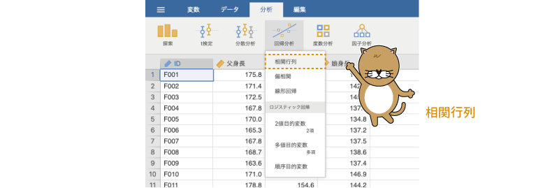
```

すると，図\@ref(fig:regression-correlation)のような画面が表示されます。ここでは，大まかな項目について見ておきましょう。

```{r regression-correlation, fig.cap = "相関行列の設定画面", echo = FALSE}

```

:::{.jmvsettings data-latex=""}
+ **相関係数**　算出する相関係数の種類を指定します。
+ **仮説**　有意性検定における仮説を指定します。
+ **追加オプション**　結果の表示方法についてのオプション設定です。
+ **グラフ**　結果の図を作成します。
:::

相関係数を算出するには，分析対象の変数を設定画面右側の欄に指定するだけです。ここでは，「ID」以外の3つの変数すべてを設定画面右側に移動してください（図\@ref(fig:regression-correlation-var)）。

```{r regression-correlation-var, fig.cap = "分析対象の変数を指定", echo = FALSE}

```


すると，図\@ref(fig:regression-cormat)のような形で結果が表示されます。とくに設定しない限り，相関係数として*ピアソンの相関係数*（*ピアソンの積率相関係数*，r）が算出されます（図\@ref(fig:regression-cormat)）。


```{r regression-cormat, fig.cap = "相関係数の算出結果", echo = FALSE}

```

この表の「ピアソンの相関係数」という行に書かれている数値が相関係数です。ここでは，「父身長」と「母身長」の相関係数，「父身長」と「娘身長」の相関係数，「母身長」と「娘身長」の相関係数の3つの相関係数が1つの表にまとめられています。このように，複数の相関係数を1つの表にまとめたものが*相関行列*です。

なお，とくに分析設定を変更しないで相関係数を算出した場合，相関係数の下にその相関係数についての有意性検定の結果が示されます。このp値が有意水準より小さい場合に相関係数が統計的に有意であるとみなします。

### 分析設定{#sub:regression-correlation-setting}

相関係数の算出は上記の手順だけで十分なことがほとんどでしょうが，ピアソンの相関係数以外の相関係数を算出したい場合や，結果の表示方法を変更したい場合などもあるでしょう。そこで，相関分析の各設定項目についても簡単に見ておくことにします。

#### 相関係数{-}

「**相関係数**」には次の項目が含まれています（図\@ref(fig:regression-cor-coeff)）。

```{r regression-cor-coeff, fig.cap = "相関係数の設定項目", echo = FALSE}

```

:::{.jmvsettings data-latex=""}
+ ピアソンの相関係数　ピアソンの積率相関係数を算出します。
+ スピアマンの順位相関係数　スピアマンの順位相関係数を算出します。
+ ケンドールの順位相関係数　ケンドールの順位相関係数（τ-b）を算出します。
:::

ピアソンの積率相関係数についてはすでに説明しましたので，ここでは残りの2つについて簡単に説明しておきます。

##### スピアマンの順位相関係数 {-}

ピアソンの相関係数は，正規分布する連続変数でないと適切な値が算出できません。そのような前提を満たさないデータで相関係数を求めたい場合，ピアソンの相関係数の代わりに*順位相関係数*と呼ばれる値が用いられることがあります。

*スピアマンの順位相関係数*はそうした順位相関係数の1つで，各変数値の順位情報を用いて相関係数を算出します。このスピアマンの順位相関係数では，ペアになる値の順位が完全に一致する場合に1，完全に逆になる場合に\(-\textsf{1}\)になります。相関係数の大きさの目安は，基本的にピアソンの相関係数の場合と同じです。

##### ケンドールの順位相関係数 {-}

*ケンドールの順位相関係数*（τ-b）は，スピアマンの順位相関係数とは異なる考え方で，2つの変数の間の順序の類似度を算出します。スピアマンの順位相関係数ではペアになる値の順位の差をもとに相関係数の算出が行われるのですが，ケンドールの順位相関係数では，ペアになる値の大小関係のみを用いて相関係数を算出します。なお，ケンドールの順位相関係数も，値のとりうる範囲は\(-\textsf{1}\)から1までで，ピアソンの相関係数やスピアマンの相関係数と同じです。


#### 仮説{-}

「**仮説**」には次の項目が含まれています（図\@ref(fig:regression-cor-hypothesis)）。

```{r regression-cor-hypothesis, fig.cap = "有意性検定の設定項目", echo = FALSE}

```

:::{.jmvsettings data-latex=""}
+ 相関あり　相関係数が0でない場合に検定結果が有意になります（両側検定）
+ 正の相関あり　相関係数が0より大きい場合に検定結果が有意になります（片側検定）
+ 負の相関あり　相関係数が0より小さい場合に検定結果が有意になります（片側検定）
:::

ここでは，相関係数の有意性検定において，両側検定を用いるか片側検定を用いるかの設定を行います。

#### 追加オプション{-}

「**追加オプション**」には次の項目が含まれています（図\@ref(fig:regression-cor-option)）。

```{r regression-cor-option, fig.cap = "追加オプションの設定", echo = FALSE}

```

:::{.jmvsettings data-latex=""}
+ 有意性を報告　相関係数の下に，「p-value（有意性検定のp値）」を表示します。
+ 有意な相関に印　統計的に有意な相関係数の右肩に「\*」などの印をつけて示します。
+ N　相関係数の算出対象となった標本サイズ（データペアの数）を示します。
+ 信頼区間　相関係数の信頼区間を算出して示します。
:::

##### 有意性を報告 {-}

この項目のチェックがオンになっていると，相関係数の下に「相関係数が0である」という帰無仮説についての検定結果（p値）が表示されます。jamoviの初期設定では，この項目のチェックはオンになっています。

##### 有意な相関に印{-}

研究論文で相関行列を示す際には，すべての相関係数について有意性検定のp値を示すのではなく，5%や1%などの有意水準で統計的に有意な相関に「\*」や「\*\*」などの印をつけて示すのが一般的です。

このような，論文スタイルの相関行列を作成したい場合には，「有意性を報告」のチェックを外し，代わりに「有意な相関に印」にチェックを入れるとよいでしょう。すると，相関行列は図\@ref(fig:regression-paper-cormat)のように論文でよく見かけるスタイルになります。

```{r regression-paper-cormat, fig.cap = "相関行列の見た目の変更", echo = FALSE}

```

##### N（標本サイズ）{-}

「N」にチェックを入れると，相関係数を算出する際に使用した標本サイズが相関行列に表示されます。欠損値を含むデータで，変数ペアごとに標本サイズが異なるような場合には，相関行列に標本サイズの情報を含めたほうがよいでしょう。

##### 信頼区間{-}

「信頼区間」は，ピアソンの相関係数について信頼区間を出力するオプションです。スピアマンの順位相関係数やケンドールの順位相関係数では，このオプションの設定は無視されます。

信頼区間の幅は，その下の「区間幅［　］%」の数値で設定します。初期値では，95%信頼区間を算出するように設定されています。

#### グラフ{-}

「**グラフ**」には次の項目が含まれています（図\@ref(fig:regression-cor-plot)）。

```{r regression-cor-plot, fig.cap = "作図設定", echo = FALSE}

```

:::{.jmvsettings data-latex=""}
+ 相関行列　変数ペアごとの散布図を作成します。
  - 変数の密度曲線　各変数について密度曲線（第\@ref(ch-exploration)章の[ヒストグラム](#subsubsub:exp-plots-histograms)を参照）を作成します。
  - 統計量　図の中に相関係数の値を示します。
:::

##### 相関行列 {-}

ここで「相関行列」のチェックをオンにすると，各変数ペアの散布図が表示されます。この散布図には，*回帰直線*（「[回帰分析](sec-linear)」の項を参照）とその*標準誤差*も合わせて示されます。

##### 変数の密度曲線{-}

さらに，「変数の密度曲線」の項目にチェックを入れると，それぞれの変数について密度曲線が作成されます。

##### 統計量{-}

最後の「統計量」は，図の中に相関係数を表示させるオプションです。このとき，図の中に示される相関係数は1種類のみで，複数の相関係数を算出するオプションが選択されている場合には，**相関係数**の設定項目で上にある相関係数が優先されます。

サンプルデータでピアソンの相関係数を算出し，作図のオプションをすべてオンにすると，結果は図\@ref(fig:regression-cor-plot-sample)のようになります。

```{r regression-cor-plot-sample, fig.cap = "作図の例", echo = FALSE}

```

## 偏相関{#sec-regression-partial}

相関行列に示されているそれぞれの相関係数は，あくまでも特定の2つの変数間での関係の強さを示す値で，他の変数による影響は一切考慮していません。たとえば，相関行列のところで使用したサンプルデータの相関行列（ピアソンの相関係数）をもう一度見てみましょう（図\@ref(fig:regression-partial-cormat)）。

```{r regression-partial-cormat, fig.cap = "父，母，娘の身長の相関行列", echo = FALSE}

```

この結果では，父-娘の身長の相関係数は0.56，母-娘の身長の相関係数は0.48で，娘の身長は父親の身長とも母親の身長とも正の相関関係にあります。この結果ではまた，父親の身長と母親の身長の間にも有意な正の相関（0.31）があります。つまり，父親の身長が高い場合，母親の身長も高い傾向にあるわけで，そうなると，たとえば母-娘の身長の相関係数には，父-娘の相関係数による影響も混じってしまっていることになるのです（図\@ref(fig:regression-partial-basic)）。

```{r regression-partial-basic, fig.cap = "父，母，娘の身長の関係と相関係数，部分相関係数，偏相関係数", echo = FALSE}

```

このように，お互いに相関がある複数の変数間で関係の強さを見る場合，通常の相関係数では他の変数による影響が混在した形になるため，ときとして変数間の関係の解釈が困難になってしまうことがあります。そのような場合，関連する他の変数の影響を取り除いた後の，より純粋な変数間関係を捉えるための指標として，*部分相関係数*や*偏相関係数*が用いられます。

*部分相関係数*とは，たとえば父親の身長データと，母-娘間の相関の影響を取り除いた後の娘の身長データの間で算出した相関係数のことをいいます。これに対し，*偏相関係数*は，父と娘の身長データの両方から母親の身長による影響を取り除き，そのうえで父-娘間の身長の相関を算出した値です。

部分相関係数は，*重回帰分析*においてその変数を分析モデルに含めるべきかどうかを判断する際などに，偏相関係数は他の変数の影響を取り除いた後の2変数間の関係について知りたい場合などに用いられます。

### 分析手順 {#sub:regression-partial-analysis}

ここでは，相関行列のところで用いたのと同じサンプルデータ（[regression_data01.omv](https://github.com/sbtseiji/jmv_compguide/raw/main/data/omv/regression_data01.omv)）を用いて，部分相関係数・偏相関係数を算出してみましょう。部分相関係数や偏相関係数の算出には，分析タブの「`r infig("analysis-regression")` 回帰分析」から「偏相関」を選択します（図\@ref(fig:regression-partial-menu)）。

```{r regression-partial-menu, fig.cap = "部分相関係数・偏相関係数の算出", echo = FALSE}
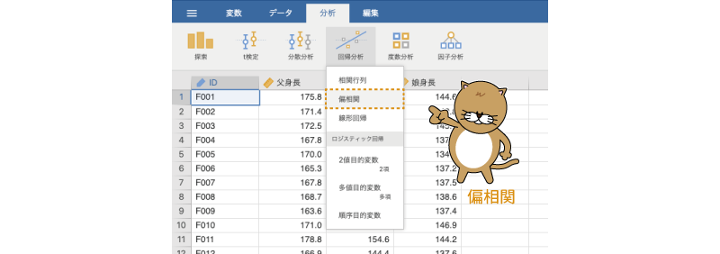
```

すると，図\@ref(fig:regression-partial-setting)のような設定画面が表示されます。

```{r regression-partial-setting, fig.cap = "部分相関係数・偏相関係数の設定画面", echo = FALSE}

```

:::{.jmvsettings data-latex=""}
+ 変数　相関係数を算出したい変数を指定します。
+ 統制変数　相関係数から影響を取り除きたい変数を指定します。
+ **相関係数**　算出する相関係数の種類を指定します。
+ **仮説**　有意性検定における仮説を指定します。
+ **相関のタイプ**　部分相関係数・偏相関係数の指定を行います。
  - 偏相関　偏相関係数を算出します。
  - 部分相関　部分相関係数を算出します。
+ **追加オプション**　結果の表示方法についてのオプション設定です。
:::

画面構成は相関行列の設定画面とよく似ていますが，設定画面右側の部分が2段に分かれているところ，「**相関のタイプ**」という設定項目があるところが異なります。また，追加オプションには，信頼区間に関する設定がありません。さらに，この分析メニューには「**グラフ**」機能はありません。

なお，「**仮説**」や「**追加オプション**」などの設定項目の動作は「相関行列」と同じですので，ここでは説明を省略します。

#### 相関のタイプ {-}

「**相関のタイプ**」では，偏相関係数を算出するか，部分相関係数を算出するかを設定します。

###### 偏相関 {-}

ここでは，母親の身長と娘の身長について，父親の身長の影響を取り除いた偏相関係数を算出することにしましょう。

その場合，まず「母身長」と「娘身長」を「変数」欄に移動します（図\@ref(fig:regression-partial-variables)）。

<!-- -->
```{r regression-partial-variables, fig.cap = "分析対象の変数を設定", echo = FALSE}
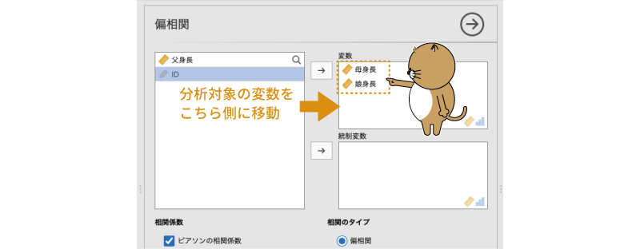
```

次に，影響を取り除きたい変数（ここでは「父身長」）を「統制変数」欄に移動します（図\@ref(fig:regression-partial-control)）。

<!-- -->
```{r regression-partial-control, fig.cap = "統制変数を設定", echo = FALSE}
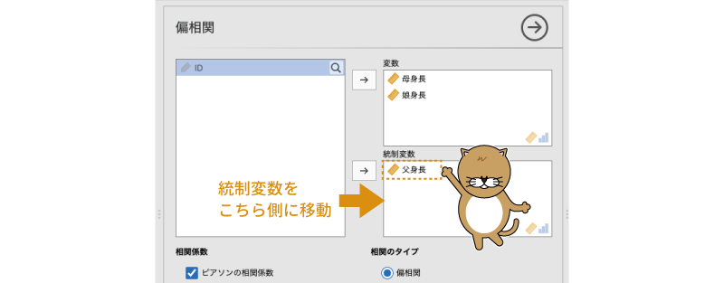
```

このとき，「**相関のタイプ**」で「偏相関」が選択されていることを確認してください。すると，図\@ref(fig:regression-partial-results)のような結果が表示されます。

<!-- -->
```{r regression-partial-results, fig.cap = "偏相関係数の結果", echo = FALSE}

```


結果の表の下の部分に「統制変数：'父身長'」という注釈がついていますね。これは「父身長」の影響を取り除いているという意味です。最初の相関行列では母親と娘の相関係数は0.48でしたが，このように父親の影響を取り除いた母-娘の身長の偏相関係数は0.38とやや値が小さくなります。

###### 部分相関 {-}

今度は母親の身長と娘の身長について，父親の身長の影響を取り除いた部分相関係数を算出してみましょう。

先ほどと同様に，「母身長」と「娘身長」を「変数」欄に，「父身長」を「統制変数」欄に移動したら，「**相関のタイプ**」で「部分相関」を選択します（図\@ref(fig:regression-semipartial-setting)）。


<!-- -->
```{r regression-semipartial-setting, fig.cap = "部分関係数の算出", echo = FALSE}
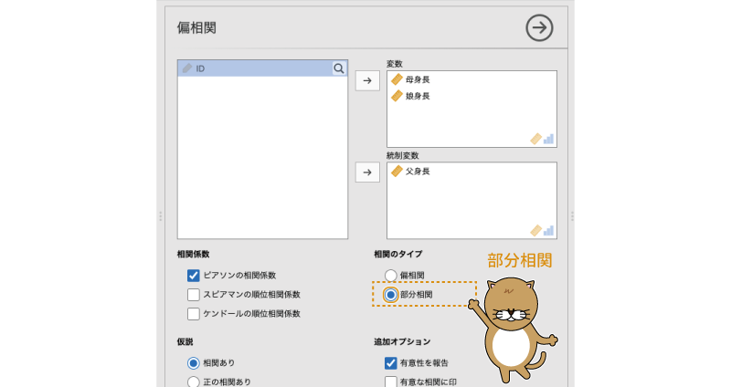
```

すると，図\@ref(fig:regression-semipartial-results)のような結果が得られます。

<!-- -->
```{r regression-semipartial-results, fig.cap = "部分相関係数の結果", echo = FALSE}

```


偏相関係数の場合と違い，係数が2つ表示されています。偏相関係数の場合，母親の身長と娘の身長の両方から父親の身長の影響を取り除いて相関係数を求めますが，部分相関係数の場合には，父親の身長の影響を取り除くのは母親の身長と娘の身長のどちらか一方だけであるため，母・娘のどちらの身長から父親の身長の影響を取り除いたかによって値が異なるためです。

表の注釈にあるように，この結果では統制変数（「父身長」）の影響は「列」にある変数からのみ取り除かれています。つまり，右上の0.32という値は母身長から「父身長」の影響を取り除いたものと「娘身長」の部分相関係数，左下の0.36という値は娘身長から「父身長」の影響を取り除いたものと「母身長」の部分相関係数です。

## 線形回帰{#sec-regression-LR}

相関係数というのは，ペアになる2つの変数のうち，一方の値が大きくなればもう一方の値も大きくなるといった，変数間の関係についての指標です。変数間にこうした関係が見られるのであれば，一方の値からもう一方の値の大きさについて，ある程度の推測ができるはずです。このような考え方に基づいて，関心のある変数を他の変数からどの程度推測（説明）できるかを見るのが*回帰分析*です。

### 考え方 {#sub:regression-LR-basic}

まず，回帰分析の基本的な考え方を見ておきましょう。

次の例について考えてみてください。

> Ａさんは，健康上の理由からダイエットを始めました。ダイエットのためにＡさんがしていることは運動（ウォーキング）です。ダイエット開始前のＡさんの体重は80kgでした。

この場合，運動量と体重の間には「運動量が増えるほど体重が減る」という関係があることでしょう。これは*負の相関*です。このような関係がある場合，次のようにして1日あたりの運動量からAさんの1か月後の体重を大まかに予想することが可能になります。

まず，ウォーキングによる消費カロリーは1時間で「250kcal」程度になるそうです。ここで，今後1か月間に毎日1時間のウォーキングを行ったとしましょう。その場合，1か月間のウォーキングによる「250 &times; 30 = 7500kcal」を追加で消費することになります。また，人間の脂肪「1kg」のエネルギー量はだいたい「7200kcal」に相当するのだそうで，ということは，毎日1時間のウォーキングを1か月間続けた場合の消費カロリーは，「7500 &divide; 7200 = 1.04...」でおおよそ脂肪1.04kg分ということになります。

もちろん，実際には食事量などの影響もありますのでここまで単純ではありませんが，上記のような関係があるのであれば，毎日1時間のウォーキングを1か月続けると1か月後には体重が1.04kg減，毎日2時間のウォーキングなら体重が2.08kg減になると予測できます。

このことをごく単純な関係式の形で表すと，次のような形になります。

\begin{align*}
\text{1か月後の体重} & = \text{現在の体重} - \text{運動で消費される脂肪の量} \\
& = 80\text{kg} - 1.04 \times \text{毎日のウォーキング時間}
\end{align*}

この式が「毎日のウォーキング時間」から「1か月後の体重」を予測（説明）する形になっているのがわかるでしょうか。つまり，「現在の体重」に加えて「毎日のウォーキング時間」さえわかれば，1か月後の体重をおおよそ知ることができるようになるわけです。このような，ある変数（1か月後の体重）の値を別の変数から予測（説明）する式のことを*回帰式*や*回帰モデル*と呼びます。

この式において，式の左辺にある変数（1か月後の体重）は*従属変数*や*目的変数*この従属変数を予測，説明するために用いられる変数（毎日のウォーキング時間）は*予測変数*や*説明変数*などと呼ばれます。回帰分析においては，説明される側の変数（従属変数）は1つ，説明する側の変数（予測変数）は1つまたは複数です。予測変数が1つの場合を*単回帰分析*，複数ある場合を*重回帰分析*と呼んで区別することもあります。

なお，先ほどの回帰モデルは，一見すると予測変数が2つあって重回帰分析のモデルのように見えるかもしれません。しかし，この式で毎日のウォーキング時間を長くしたり短くしたりしてその影響を見た場合，ウォーキング時間はそのつど値が変化しますが，現在（ダイエット開始時）の体重はすでに決まっていて変わることがありません（*定数*）。そのため，このモデルの予測変数は「毎日のウォーキング時間」のみであり，これは単回帰分析のモデルということになるのです。

この回帰式を，もう少し一般化した形で書くと次のようになります。

\[
従属変数 = b_0 + b_1 \times 予測変数
\]

この\(b_0\)の部分は*切片*，\(b_1\)の部分は*回帰係数*と呼ばれます。先ほどの式の「現在の体重」は，この切片に相当する部分です。回帰分析でとくに重要なのは「回帰係数」で，これが従属変数に対する予測変数の影響力の強さや向きを表します。

また，予測変数が複数ある重回帰分析の場合には，回帰式は次のような形になります。

$$
従属変数 = b_0 + b_1 \times 予測変数_{1} + b_2 \times 予測変数_{2}+ \cdots + b_n \times 予測変数_{n}
$$

この式の場合，\(b_1\)から\(b_n\)の部分はとくに*偏回帰係数*と呼ばれます。これらの値は[偏相関係数](#sec-regression-partial)と同様に他の変数の影響を除外して算出されており，それぞれの予測変数が単独で持っている影響力の強さや向きを示しています。

なお，回帰分析にはいくつかの手法があり，従属変数と予測変数の間にピアソンの相関係数で捉えることができるような直線的な関係（*線形関係*）があることを想定したものをとくに*線形回帰*と呼びます。

### 基本手順 {#sub:regression-LR-howto}

それでは回帰分析の手順を見ておきましょう。ここでも，サンプルデータは[相関行列](#sec-regression-cormat)のところで用いたのと同じデータ（[regression_data01.omv](https://github.com/sbtseiji/jmv_compguide/raw/main/data/omv/regression_data01.omv)）を用います。（線形）回帰分析を実行するには，分析タブの「`r infig("analysis-regression")` 回帰分析」から「線形回帰」を選択してください（図\@ref(fig:regression-LR-menu)）^[Windows版のjamoviでは，変数名に日本語が含まれている際に正しく分析できません。以下の内容は，サンプルデータの変数名を英数字に変更したうえで実行してください。]。

```{r regression-LR-menu, fig.cap = "線形回帰", echo = FALSE}
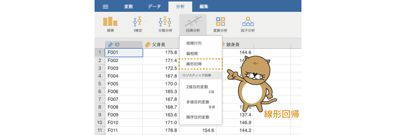
```

すると，図\@ref(fig:regression-LR-menu)のような画面が表示されます。非常にたくさんの項目がありますので，まずは大まかな項目について見ておきましょう。

```{r regression-LR, fig.cap = "線形回帰の設定画面", echo = FALSE}

```

:::{.jmvsettings data-latex=""}
+ 従属変数　回帰分析に使用する従属変数を指定します。
+ 共変量　回帰分析に使用する予測変数のうち，連続型のものを指定します。
+ 因子　回帰分析に使用する予測変数のうち，名義型のものを指定します。
+ 重みづけ（オプション）　線形回帰で重みづけを行う場合に使用します。
+ `r groupbar("モデルビルダー")`　交互作用を含むモデルの作成や複数モデルの比較を行います。
+ `r groupbar("基準レベル")`　比較基準として用いる水準値を指定します。
+ `r groupbar("前提チェック")`　正規性の検定など，分析の前提条件をチェックします。
+ `r groupbar("モデル適合度")`　モデル適合度に関する設定を行います。
+ `r groupbar("モデル係数")`　モデル係数に関する設定を行います。
+ `r groupbar("推定周辺平均")`　各主効果の周辺平均値（回帰モデルによる推定値）に関する設定を行います。
+ `r groupbar("保存")`　モデル予測値や残差などを新たな変数として保存します。
:::

#### 単回帰 {-#lr-uni}

ここでは，「父身長」から「娘身長」をどの程度説明できるのかについて分析してみます。その場合，分析の「従属変数」は「娘身長」，「予測変数」は「父身長」です。線形回帰分析では，分析の従属変数にあたる変数を「従属変数」に，そして予測変数として用いる変数は「共変量」または「因子」に設定します。

「共変量」と「因子」の違いは，その予測変数が「連続型（`r infig("variable-continuous")`）」の変数であるか，「名義型（`r infig("variable-nominal")`）」の変数であるかです。そのことは，変数指定欄の右下のアイコンからもわかります。回帰分析に用いる予測変数は連続型（比率尺度や間隔尺度）である場合が一般的ですが，性別などの名義変数を予測変数として用いることもできるのです。


今回の分析では予測変数は父親の身長で，これは連続型変数ですから，「父身長」は「共変量」の欄に移動します（図\@ref(fig:regression-LR-analysis)）。


```{r regression-LR-analysis, fig.cap = "線形回帰の分析設定", echo = FALSE}

```

なお，その下にある「重みづけ（オプション）」の欄は，**重みつき回帰**や**重みつき最小2乗法**と呼ばれる方法で回帰分析を実施する場合に使用します。重みつき回帰については本書では扱いませんが，これは回帰モデルの残差が予測値にかかわらず一定であるという回帰分析の前提（「[前提チェック](#sub:regression-LR-assumption)」を参照）が満たされない場合などに，残差に適切な重みづけを行って線形回帰を行う手法です。重みづけの値が入力された変数がある場合には，その変数をこの「重みづけ（オプション）」の欄に指定しますが，「オプション」とあるように，ここは通常は空欄のままで構いません。

これで基本的な分析は終了です。出力ウィンドウの結果は図\@ref(fig:regression-LR-results)のようになっているはずです。


```{r regression-LR-results, fig.cap = "線形回帰の分析結果", echo = FALSE}

```

結果の表のうち，最初の「モデル適合度指標」の部分には，分析に使用した回帰モデルが従属変数をどの程度うまく説明できているかについての情報が示されています。「モデル」の部分の数値（「1」）はモデルの番号です。複数のモデルを作成して比較する場合にはそれぞれのモデルを区別するために番号が用いられますが，ここではモデルを1つしか用いませんので，この数字は無視して構いません。

この表の「R」の部分は，このモデルによる予測値と実際の測定値（「娘身長」）の間の相関係数で，これは*重相関係数*と呼ばれています。今回の分析モデルのように，予測変数が1つしかない場合には，この重相関係数は「娘身長」と「父身長」の相関係数に一致します。その右の「R²」は*決定係数*と呼ばれ，これは0から1までの値をとります。この値は，「娘身長」の分散のうち，この回帰モデルで説明可能なものの割合，つまりこのモデルの「娘身長」に対する*説明率*を示しており，R²が0.31であるということは，このモデルで「娘身長」の分散の31%を説明できるということを意味しています。当然ながら，この値はできるだけ大きいことが望まれます。

この決定係数（R²）の値は，一般には次の式によって算出されます。

\[
R^2 = \displaystyle\frac{\text{予測値の平方和}}{\text{従属変数の平方和}}
\]

このようにして算出する場合，決定係数の値は重回帰係数を2乗した値に一致します。

2つ目の表には，切片や予測変数に関する情報が示されています。この表の「推定値」の列が切片の値と予測変数の回帰係数の値です。この分析結果から，切片の値は44.71，「父身長」の回帰係数は0.56であることがわかります。これを回帰式の形にすると，次のようになります。

\[
\text{娘身長} = 44.71 + 0.56 \times \text{父身長}
\]

この回帰係数の値は，父親の身長が1cm変化した場合に娘の身長がどの程度変化するかを意味します。つまり，この分析結果から，父親の身長が1cm高くなれば，娘の身長は0.56cm高くなるということがいえます。

その右隣の「標準誤差」の列には，これらの推定値の*標準誤差*が示されています。先ほどの切片の値や回帰係数はあくまでも推定値ですから，そこにはある程度の誤差のあることが考えられます。そしてその誤差の大きさについての指標がこの標準誤差です。さらに，この標準誤差に基づいて，それぞれの値が実際には0である可能性がないかどうかを検定した結果が「t」および「p」の部分です。この表の「t」の部分には，「母集団における実際の値は0である」という帰無仮説に対する検定統計量tの値が示されています。そして，このtの値に対する有意確率pがその隣の「p」の欄です。このpの値が有意水準を下回る場合に，回帰係数が有意である（0でない）と判断します。

なお，この場合の回帰モデルにおいては，切片の値は帳尻合わせのような役目しかありませんので，この値が0であるかどうかは分析の関心とはなりません。この場合，重要なのは父親の身長による影響力の部分です。この分析結果では，「父身長」の回帰係数についての検定結果は「p&lt;.001」ですので，娘の身長に対する父親の身長の影響力は有意であるといえます。ただし，この検定はあくまでも回帰係数が「0でない」かどうかについてのものですので，この検定結果が有意であったからといって，「影響力が大きい」というわけではないという点には注意してください。影響力の大きさは，回帰係数の推定値で判断する必要があります。

#### 重回帰 {-#lr-multi}

今度は父親の身長だけでなく，父親と母親の両方の身長による影響について見てみましょう。分析手順は，基本的に先ほどの場合と同じです。分析タブの「`r infig("analysis-regression")` 回帰分析」から「線形回帰」を選択し，表示された設定画面の「従属変数」に「娘身長」，「共変量」に「父身長」と「母身長」を指定します（図\@ref(fig:regression-lr-multireg-analysis)）。


```{r regression-lr-multireg-analysis, fig.cap = "複数の予測変数を用いた分析", echo = FALSE}
knitr::include_graphics("images/regression/lr-multireg-analysis.png")
```


すると，「父身長」と「母身長」のそれぞれについて回帰係数が算出されます（図\@ref(fig:regression-lr-multireg-results)）。

```{r regression-lr-multireg-results, fig.cap = "重回帰分析の分析結果", echo = FALSE}
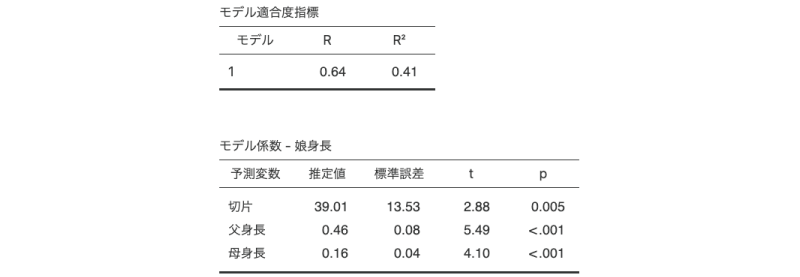
```

先ほどの「父身長」のみを予測変数とする単回帰分析の結果に比べ，決定係数（R²）は0.41と若干ですが大きくなっています。複数の予測変数を用いたことでモデルの複雑性が増し，「娘身長」の分散をより多く説明できるようになったのです。

重回帰分析における各予測変数の回帰係数は，とくに*偏回帰係数*と呼ばれます。この分析結果では，「父身長」の回帰係数は0.46で，単回帰の場合の回帰係数の0.56よりも少し小さくなっています。この場合の「父身長」の回帰係数は偏回帰係数で，これは「父身長」以外（ここでは「母身長」）の値を固定した場合の「父身長」の影響力を表しています。つまり，母親の身長が同じ家族の中では，父親の身長が1cm高くなると娘の身長が0.46cm高くなるということです。「母身長」の回帰係数についても同じで，父親の身長が同じ家族だけをみた場合に，母親の身長が1cm高くなれば，娘の身長は0.16cmだけ高くなるということになります。

### モデルビルダー{#sub:regression-LR-modelbuilder}

一般に，予測変数が複数ある重回帰モデルは，予測変数が1つしかない単回帰モデルに比べ，従属変数の分散についてより多くを説明することができます。しかし，それなら予測変数を増やせるだけ増やしたほうがいいかというと，そうではありません。予測変数が多くなればなるほどモデルは複雑化し，変数間の影響関係を理解することが困難になってしまうからです。つまり，重回帰分析を行う場合には，できるだけ予測変数が少なくシンプルで，かつ従属変数の分散をできるだけ多く説明できるモデルが好ましいのです。

先ほどの分析では，「母身長」の回帰係数は「父身長」の回帰係数に比べて小さな値でした。ということは，もしかしたら娘の身長を説明するには父親の身長がわかっていれば十分で，母親の身長を予測変数として用いる必要はなかったかもしれません。だとすると，父親と母親の両方の身長を予測変数として用いた回帰モデルは不必要に複雑なものだということになってしまいます。

ではこの場合，父親の身長のみを用いたモデルと，父親と母親の身長の両方を用いたモデルのどちらを採用するのがよいのでしょうか。jamoviに搭載されている「モデルビルダー」は，そうした判断を行う場合に便利な機能です。モデルビルダーでは，複数のモデルの間で比較を行い，モデルに使用する予測変数の選択を行うことができます。

それでは，モデルビルダーを用い，父親の身長のみの回帰モデルと父親と母親の身長を用いた回帰モデルの間で比較を行ってみましょう。先ほどの「父身長」と「母身長」を予測変数として用いた回帰分析の結果をクリックし，分析設定画面を再度開いてください。そして，その設定画面の`r groupbar("モデルビルダー")`の部分を展開すると，次のような画面が現れます（図\@ref(fig:regression-lr-model-builder)）。

```{r regression-lr-model-builder, fig.cap = "モデルビルダー", echo = FALSE}
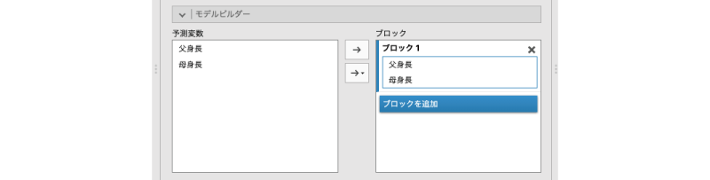
```

画面左側の「予測変数」には，この回帰分析で用いられている予測変数の一覧が表示されています。そして右側の「ブロック」の部分にも，先ほど分析に使用した予測変数が表示されています。


ここでまず，「**ブロック1**」のところにある「母身長」を選択し，「`r infig("action-back")`」をクリックして「ブロック1」の部分から「母身長」を削除します（図\@ref(fig:regression-lr-model-builder-mother)）。

```{r regression-lr-model-builder-mother, fig.cap = "「母身長」をブロック1から削除", echo = FALSE}

```


<!-- -->

次に，`r blueback("ブロックを追加")`をクリックして，新たなブロックを作成します（図\@ref(fig:regression-lr-model-builder-newblock)）。

<!-- -->
```{r regression-lr-model-builder-newblock, fig.cap = "新たなブロックを作成", echo = FALSE}
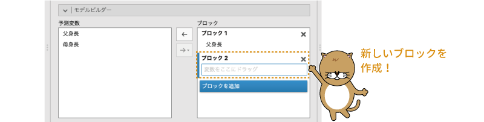
```


そして，先ほどブロック1から削除した「母身長」を，新しく作成した「**ブロック2**」にマウスでドラッグして移動します（図\@ref(fig:regression-lr-model-builder-add-mother)）。

<!-- -->
```{r regression-lr-model-builder-add-mother, fig.cap = "「母身長」をブロック2に追加", echo = FALSE}

```

ここまでの設定を行ったら，分析結果を見てみましょう。分析結果は図\@ref(fig:regression-lr-model-builder-results)のようになっているはずです。


```{r regression-lr-model-builder-results, fig.cap = "モデルビルダーの出力結果", echo = FALSE}
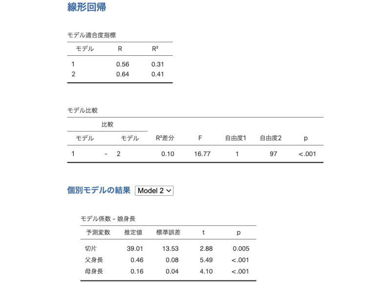
```

<!-- -->

1つ目の「モデル適合度指標」の表には，モデルビルダーの「ブロック1」に指定した予測変数のみを用いたモデル（モデル1）の適合度（重相関係数Rおよび決定係数R²）と，そこに「ブロック2」に指定した予測変数を加えた場合（モデル2）の適合度が示されています。つまり，このモデル1は「父身長」のみを予測変数とする回帰モデル，モデル2は「父身長」と「母身長」を予測変数とする回帰モデルの分析結果です。

ですから，これらの数値はそれぞれ，「父身長」のみを予測変数として行った単回帰分析の結果（[単回帰](#lr-uni)参照）や，「父身長」と「母身長」を予測変数として行った重回帰分析の結果（[重回帰](#lr-multi)参照）と同じ値です。

2つ目の「モデル比較」の表は，この2つの回帰モデルの精度を比較した結果です。この表の「比較」の部分には，比較対象となっているモデル（ここではモデル1とモデル2）が，「R²差分」の部分には2つのモデルで決定係数がどれだけ異なるかが示されています。そしてこの結果から，予測変数が「父身長」のみのモデル1に比べ，予測変数として「父身長」と「父身長」の2つを用いたモデルのほうが，決定係数が0.10だけ大きいということがわかります。

その横の「F」から「p」までの部分は，この決定係数の増加分が「0でない」かどうかについての検定結果です。表の中のFの値は，モデル1では説明しきれずモデル2によって新たに説明される部分の分散を，モデル2の残差の分散で割って求められます。「自由度1」はモデル2とモデル1の予測変数の個数の差，「自由度2」はモデル2の残差自由度です。

そして，表の一番右端の有意確率pの値が有意水準を下回っている場合には，モデル1とモデル2の説明率の差が0ではない（「母身長」を予測変数に追加することが無駄ではない）ということになります。この分析結果では有意確率はp&lt;.001ですので，「母身長」を予測変数に加えることによって回帰モデルの説明率が有意に向上したということができます。


この表の下の「**個別モデルの結果**」の部分にある表は，比較したモデルのうちの1つについての分析結果です。このタイトル部分の横にあるプルダウンメニューで，どのモデルの結果を表示させるかを選択することができます。この画面では「モデル2」の結果，つまり「父身長」と「母身長」の両方を予測変数とする重回帰分析の結果が表示されています。


#### 交互作用を用いた回帰分析 {-}

重回帰分析では，それぞれの変数を個別に予測変数として用いるだけでなく，分散分析の場合と同様に，いくつかの予測変数間の交互作用を予測変数として用いることもできます。複数の予測変数による交互作用を回帰モデルに含める場合には，モデルビルダーで設定を行います。

先ほどの回帰モデルに，さらに「父身長」と「母身長」の交互作用を追加してみましょう。分析結果をクリックし，`r groupbar("モデルビルダー")`の「ブロック」に3つ目のブロックを追加してください（図\@ref(fig:regression-lr-model-builder-interaction)）。

```{r regression-lr-model-builder-interaction, fig.cap = "モデルビルダーで3つ目のブロックを作成", echo = FALSE}

```


そして，画面左側の「予測変数」の部分で「父身長」と「母身長」の2つを選択します^[複数の変数を同時に選択するには，いずれかの変数をクリックして選択したのち，「SHIFT(⇧)」キーを押しながらもう一方の変数名をクリックしてください。]。そして「予測変数」と「ブロック」の間にある2つの「`r infig("action-forward")`」ボタンのうち，下にあるほうをクリックすると，図\@ref(fig:regression-lr-model-builder-interaction-add)のように選択メニューが表示されますので，そこから「交互作用」を選択してください。


```{r regression-lr-model-builder-interaction-add, fig.cap = "モデルビルダーで3つ目のブロックを作成", echo = FALSE}
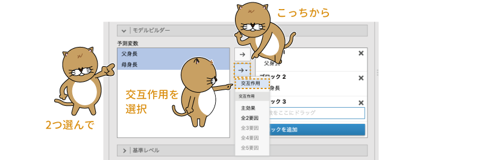
```


すると，次のように「ブロック3」の部分に「父身長＊母身長」という項目が追加されます（図\@ref(fig:regression-lr-model-builder-interaction-setting2)）。これが交互作用項です。

```{r regression-lr-model-builder-interaction-setting2, fig.cap = "3つ目のブロックに交互作用を設定", echo = FALSE}
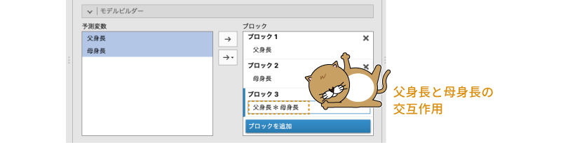
```

なお，「予測変数」と「ブロック」の間に似たような「`r infig("action-forward")`」ボタンが上下に2つ並んでいますが，下にあるほう（右側に小さな三角があるもの）は，このように選択した変数の主効果（つまり交互作用なし）や交互作用を個別に指定してモデルに追加するためのボタンです。これに対し，上にあるほうの「`r infig("action-forward")`」ボタン（小さな三角がないもの）は，選択された変数の主効果とすべての交互作用の組み合わせをモデルに追加します（図\@ref(fig:regression-lr-model-builder-arrow-buttons)）。

```{r regression-lr-model-builder-arrow-buttons, fig.cap = "ボタンの役割の違い", echo = FALSE}

```


<!-- -->
ただし，すでに先のブロックでモデルに追加されている変数や交互作用項を後のブロックで重ねて追加することはできませんので，そのような変数や交互作用がある場合には，それらは新しいブロックには追加されません。


では結果を見てみましょう。基本的な結果の見方は先ほどと同じですので，ここではとくに，2つ目の表（モデル比較）に注目して見ておきます（図\@ref(fig:regression-lr-model-builder-result2)）。

<!-- -->
```{r regression-lr-model-builder-result2, fig.cap = "モデルの比較", echo = FALSE}
knitr::include_graphics("images/regression/lr-model-builder-result2.png")
```


この表には，モデル1とモデル2の比較，そしてモデル2とモデル3の比較が示されています。この分析結果では，モデル1とモデル2の説明率の差は有意，つまり予測変数が「父身長」のみのモデルに「母身長」を加えればモデルが有意に向上しますが，モデル2とモデル3の間では差は有意ではありません。ということは，モデル2にさらに「父身長」と「母身長」の交互作用を加えてもモデルの説明率は有意には向上しない，つまり「娘身長」の値を説明する上で，「父身長」と「母身長」の交互作用は必要ないということになるのです。このようにして，関心のある変数や交互作用項を段階的に回帰分析モデルに投入していき，モデルの説明率が有意に増加するかどうかを確認して最適なモデルを選択する方法は，*階層的重回帰分析*とも呼ばれます。

なお，先ほどの分析結果では「父身長＊母身長」は有意ではありませんでしたが，もしこの交互作用の回帰係数が\(-\textsf{2.15}\)のような値で有意になっていたとすると，それは「父親の身長が高ければ高いほど（低ければ低いほど），娘の身長に対する母親の身長の影響力が小さくなる（大きくなる）」という関係があることを意味します。

このような2変数間の交互作用であれば解釈可能かもしれませんが，これが3変数間，4変数間の交互作用になったらどうでしょうか。おそらくほとんど解釈できなくなってしまうでしょう。交互作用を解釈できなければ，当然ながら交互作用が有意であった場合の分析結果を理解することもできません。このように，回帰分析における交互作用項は一般に解釈が困難になりがちですので，回帰モデルに交互作用を含めるかどうかはよく考えてから判断するようにしましょう。

### 基準レベル{#sub:regression-LR-reflevels}

今度は別のデータで回帰分析を行ってみましょう。次のサンプルデータ（[regression_data02.omv](https://github.com/sbtseiji/jmv_compguide/raw/main/data/omv/regression_data02.omv)）をダウンロードして開いてください。このデータファイルは，先ほどと同じく100家族分の身長データなのですが，父母の身長と子供の身長，そしてその子供の性別が記録されています（図\@ref(fig:regression-data02)）。

```{r}
data02 <- read.csv("data/regression_data02.csv")

# ID
attributes(data02$ID)$`jmv-id` <- TRUE

# 連続変数
attributes(data02$父身長)$measureType <- c("Continuous")
attributes(data02$母身長)$measureType <- c("Continuous")
attributes(data02$子身長)$measureType <- c("Continuous")

# 名義変数
data02$性別 <- factor(data02$性別)
attributes(data02$性別)$levels <- c("男", "女")
attributes(data02$性別)$values <- c(1, 2)
attributes(data02$性別)$measureType <- c("Nominal")

# 説明
attributes(data02$父身長)$description <- "父親の身長（単位：cm）"
attributes(data02$母身長)$description <- "母親の身長（単位：cm）"
attributes(data02$子身長)$description <- "子供の身長（単位：cm）"
attributes(data02$性別)$description <- "子供の性別（男，女）"

out <- jmvReadWrite::write_omv(data02, "data/omv/regression_data02.omv", frcWrt = TRUE)

```


```{r regression-data02, fig.cap = "サンプルデータ2", echo = FALSE}

```

:::{.jmvvar data-latex=""}
* `ID`　対象家族のID
* `父身長`　父親の身長（単位：cm）
* `母身長`　母親の身長（単位：cm）
* `子身長`　子供の身長（単位：cm）
* `性別`　子供の性別（男，女）
:::

このデータを用いて，子供の身長が父親・母親の身長と子供の性別という3つの変数からどのように説明できるかを見てみたいと思います。

まず，分析タブの「`r infig("analysis-regression")` 回帰分析」から「線形回帰」を選択し，表示された設定画面の「従属変数」に「子身長」，「共変量」に「父身長」と「母身長」を指定します（図\@ref(fig:regression-lr-reference01)）。ここまでは，従属変数の名前が違うこと以外は，先ほどの分析とまったく同じです。

```{r regression-lr-reference01, fig.cap = "連続型予測変数の設定", echo = FALSE}

```


次に，「性別」変数ですが，この変数は名義尺度変数ですので，これは「因子」へ移動します（図\@ref(fig:regression-lr-reference02)）。


```{r regression-lr-reference02, fig.cap = "名義型予測変数の設定", echo = FALSE}

```

すると，図\@ref(fig:regression-lr-reference-results)のような結果が得られます。


```{r regression-lr-reference-results, fig.cap = "名義型予測変数を含む回帰分析の結果", echo = FALSE}

```

この結果は基本的にはこれまでの重回帰分析のものと同じなのですが，最後の「性別」の行が少し特殊な形になっています。この「性別：女 - 男」の行は，子供の性別が「女」の場合に身長が平均的にどの程度変化するかを示しています。つまり，子供が女の子の場合には，平均して男の子よりも身長が0.96cm高くなるということなのです。

このような名義型の予測変数の場合には，男の子の身長を基準にするか，女の子の身長を基準にするかによって，表現の仕方が異なってきます。男の子の身長を基準に考えれば，女の子のほうが0.96cm背が「高い」ということになりますが，女の子の身長を基準に考えると，男の子のほうが女の子より0.96cm背が「低い」ということになるからです。

今回の分析ではどちらの表現であっても構わないと思いますが，もし「男の子の身長」のほうに関心があって，それに対する予測変数の影響を知りたい場合には，この結果のような「女の子の場合，男の子に比べて身長が平均で0.96cm高くなる」という形よりも，「男の子の場合，女の子に比べて……」という表現のほうがわかりやすいでしょう。そのような場合には，分析設定画面の`r groupbar("基準レベル")`の項目で，基準となる変数値を指定することができます。

先ほどの回帰分析の結果をクリックし，分析設定画面を再度開いてください。そして，その設定画面の`r groupbar("基準レベル")`を展開すると，図\@ref(fig:regression-lr-reference-levels-setting)のような画面が現れます。

```{r regression-lr-reference-levels-setting, fig.cap = "名義型予測変数の基準レベルの設定", echo = FALSE}
knitr::include_graphics("images/regression/lr-reference-levels-setting.png")
```

:::{.jmvsettings data-latex=""}
+ **変数**　名義型予測変数の一覧です。
+ **基準レベル**　回帰係数を算出する際の基準レベルを指定します。
+ **切片**　切片の計算方法を指定します。
  - 基準レベル（ダミーコード）　基準レベルを0，それ以外を1の形に数値化します。
  - 全体平均（シンプルコード）　変数値の平均が0になるように数値化します。
:::


この画面の「Variable（変数）」欄には，この分析に用いられている名義型の予測変数が一覧表示されます。そして，その右側の「Reference Level（基準レベル）」で，それぞれの名義型変数について，どの値を基準に値を算出するかを指定することができます。

ここでは「男」が基準となっていますが，ここを「女」に変更すると，女児の身長が比較の基準となり，結果の表示は「男の子の場合，女の子に比べて……」という形になります。「基準レベル」の部分を「女」に設定してみましょう。すると，結果は図\@ref(fig:regression-lr-reference-levels-F)のようになります。


<!-- -->


```{r regression-lr-reference-levels-F, fig.cap = "女児の身長を基準とした回帰分析の結果", echo = FALSE}

```


「性別」の回帰係数の符号（\(+/-\)）が逆になっているのがわかるでしょうか。この場合，「女の子の身長」という基準に対し，「男の子の身長」はそれよりも平均して0.96cmだけ低くなるという意味になります。

#### 切片 {-}

なお，`r groupbar("基準レベル")`の下のほうにある「**切片**」の部分では，名義型変数を回帰分析に用いる際の処理方法についての設定が可能です。，一般に，回帰モデルの予測変数に「性別」のような名義型の変数が含まれている場合には，基準とする値を「0」，比較する側の値を「1」に置き換える*ダミーコード化*（*ダミーコーディング*）という方法がとられます。たとえば，係数を算出する際の基準が「男」であれば，性別の値が「男」の場合を「0」，「女」の場合を「1」と置き換えたうえで計算を行うのです^[3種類以上の値が含まれる名義型変数の場合には少し複雑になりますが，基本的な考え方はこれと同じです。]。

###### 基準レベル（ダミーコード）{-}

この「**切片**」が「基準レベル（ダミーコード）」に設定されている場合には，基準となる値を「0」，それと比較する側の値を「1」として回帰係数の算出を行います。この方法では，どちらを基準とするかによって，名義型変数に対する回帰係数の符号が変わるだけでなく，切片の値も変化します。先ほどの分析結果で，「男」を基準にした場合と「女」を基準にした場合の結果を見比べてみてください。「女」を基準とした場合のほうが，切片の値が0.96だけ大きくなっているはずです。

###### 全体平均（シンプルコード）{-}

これに対し，「**切片**」が「全体平均（シンプルコード）」に設定されている場合には，基準となる値を「\(-\textsf{0.5}\)」，それと比較する側の値を「0.5」などとして，2つの変数値の平均値が0になるように数値化したうえで回帰係数の算出を行います。この方法では，どちらを基準にした場合にも切片の値は変化しません。変わるのは，名義型変数に対する回帰係数の符号だけです。なお，この場合の切片の値は，ダミーコード化して算出される2種類の切片の平均値と同じ値になります。

先ほどの分析結果の表の下に「ª 基準レベルの値を示しています」や「ª 全体平均の値を示しています」という注釈があったのはこのためです。予測変数に名義型変数が含まれる回帰分析では，このように計算方法によって切片の値が異なってきますので，その点には注意してください。

### 前提チェック{#sub:regression-LR-assumption}

t検定や分散分析のように，回帰分析にも分析における前提条件がいくつかあります。それらの前提条件が満たされているかどうかは，分析設定画面の`r groupbar("前提チェック")`の部分にある項目を用いて確認できます（図\@ref(fig:regression-lr-assumption)）。


```{r regression-lr-assumption, fig.cap = "回帰分析の前提チェック", echo = FALSE}

```

:::{.jmvsettings data-latex=""}
+ **前提チェック**　回帰分析の前提条件が満たされているかどうかをチェックするための項目です。
  - 自己相関検定　自己相関の有無について検定します。
  - 共線性統計量　多重共線性の問題が生じていないかどうかを確かめます。
  - 正規性検定　残差の正規性について検定を行います。
  - 残差Q-Qプロット　残差のQ-Qプロットを作成します。
  - 残差プロット　残差のプロットを作成します。
+ **データ要約**
  - クックの距離　各測定値についてクックの距離を算出します。
:::

t検定や分散分析では，分析の前提条件として，分析対象となる従属変数の分布が正規分布からかけ離れていないか，グループ間で分散が極端に異なっていないかなどが問題となりました。回帰分析の場合，回帰モデルによる予測値と従属変数の間の「残差」や，分析に使用する予測変数について，いくつかの前提条件が存在します。

##### 自己相関検定 {-}

回帰分析には，「残差が互いに独立である」という前提があります。「残差が独立」であるとは，各測定値の残差が不規則な値をとっており，そこに特定のパターンが見られないということです。そして，この残差の分布の仕方に特定のパターンが見られないかどうかを確認する方法の1つに，残差の*自己相関検定*があります。

たとえば時系列データ^[一定間隔ごとに測定された値など，時間的な順序が意味をもつデータのことです。]の場合，ある時点における測定値は，その直前・直後の測定値と似通った値になりがちです。このように，変数値のならびによって測定値間に相互に関連が見られるような状態を*自己相関*あるいは*系列相関*といいます。残差に自己相関が見られる場合，決定係数R²が実際より大きな値になってしまうといった問題が生じます。

残差の間に自己相関が見られないかどうかを確かめる方法としてよく用いられるのが*ダービン・ワトソン検定*です。回帰分析の前提チェックで「自己相関検定」のチェックをオンにすると，自己相関の検定としてこのダービン・ワトソン検定の結果が表示されます（図\@ref(fig:regression-lr-assumption-dw)）。

<!-- durbin-watson test -->


```{r regression-lr-assumption-dw, fig.cap = "自己相関検定の結果", echo = FALSE}

```


結果の表の「自己相関」の部分が自己相関係数，「DW統計量」の部分が*ダービン・ワトソン比*（DW比）と呼ばれる値です。この値が2に近づくほど自己相関が弱く，2より大きい，あるいは小さいほど自己相関が強いことを意味します。表の一番右端のpは，このダービン・ワトソン比についての有意確率で，この値が有意水準より小さい場合に残差に自己相関があると判断されます。

##### 共線性統計量 {-}

重回帰分析に用いられる予測変数は，多くの場合，お互いにある程度の相関関係にあるものです。しかし，その関係が強すぎる場合，つまり分析に使用される予測変数の中に強い相関関係にある変数が含まれている場合には，回帰係数が本来の関係とは逆の符号になってしまったり，決定係数の値が適切に算出できなくなったりなど，回帰分析の結果が不安定になることが知られています。このような，複数の予測変数の間に強い相関関係がある状態を*多重共線性*といい，多重共線性の問題がある場合には，回帰分析の結果は信頼できないものになってしまうのです。

こうした問題が生じていないかどうかを確かめるには，回帰分析の前提チェックで「共線性統計量」のチェックをオンにします。すると，図\@ref(fig:regression-lr-assumption-colin)のような形で多重共線性の指標が表示されます。

```{r regression-lr-assumption-colin, fig.cap = "分散拡大係数とトレランス", echo = FALSE}

```


<!-- multico -->

この表の「VIF」の値は，*分散拡大係数*と呼ばれるもので，多重共線性の強さを示す指標としてよく用いられています。このVIFの値が大きいほど多重共線性が強く見られることを意味しており，この値が5を超えるような予測変数^[VIFの値が10以上の場合に問題があるとする考え方もあります。]は，分析から除外するなどの何らかの対策をとる必要があります。

また，その隣の「*トレランス*」は，VIFの逆数（1/VIF）です。トレランスは，小さければ小さいほどその予測変数の多重共線性が強いことを意味します。


##### 正規性検定 {-}

回帰分析における主要な前提条件の1つに，残差が正規分布であることというものがあります。回帰分析の残差は単に独立であるだけでなく，正規分布に近いものでなければならないのです。

回帰分析において残差の正規性を確認するための方法にはいくつかのものがありますが，そのうちの1つが*シャピロ=ウィルク検定*です。回帰分析の前提チェックで「正規性検定」のチェックをオンにすると，回帰モデルの残差についてのシャピロ=ウィルク検定の結果が表示されます（図\@ref(fig:regression-lr-assumption-sw)）。

<!-- shapiro-wilk -->
```{r regression-lr-assumption-sw, fig.cap = "シャピロ=ウィルク検定", echo = FALSE}
knitr::include_graphics("images/regression/lr-assumption-sw.png")
```


シャピロ=ウィルク検定の値の見方は第\@ref(ch-exploration)章で見たのと同じです。検定統計量が1に近いほど正規分布からのずれが小さく，0に近いほど正規分布からのずれが大きいことを意味します。表の右側に示されている有意確率pの値が有意水準を下回る場合に残差が正規分布していないと判断されます。

##### 残差Q-Qプロット{-}

残差の正規性については，グラフを用いて視覚的に判断する方法もあります。回帰分析の前提チェックで「残差Q-Qプロット」にチェックを入れると，出力ウィンドウに残差の*Q-Qプロット*が表示されます（図\@ref(fig:regression-lr-assumption-qq)）。こちらも第\@ref(ch-exploration)章で説明したように，各データ点が直線上に並んでいれば残差が正規分布しており，そうでなければ正規分布でないと判断されます。


```{r regression-lr-assumption-qq, fig.cap = "残差Q-Qプロット", echo = FALSE}

```


##### 残差プロット {-}

回帰分析の残差は，互いに独立であること，正規分布からかけ離れていないことの他に，その分布の幅が予測値にかかわらず一定であることが必要とされます。残差の分布に何らかの特徴的な傾向が見られる場合，回帰分析の結果が妥当でない可能性があります（図\@ref(fig:regression-lr-assumption-residual)）。

```{r regression-lr-assumption-residual, fig.cap = "残差の傾向の有無", echo = FALSE}

```


残差に何らかのこうした特徴的な傾向が存在しないかどうかを確認するためには，回帰分析の前提チェックで「残差プロット」のチェックをオンにします。こうすることで，残差のばらつきをさまざまな形で視覚化して確認することができます。

この残差プロットで図\@ref(fig:regression-lr-assumption-residual)の右の図ように残差の分布に特徴的な傾向が見られる場合，対処方法の1つとして，線形回帰の「重みづけ（オプション）」の欄に適切な重みづけ変数を設定して「重みつき回帰」を行うことが考えられます。

この残差プロットの1つ目のグラフ（図\@ref(fig:regression-lr-assumption-resplot1)）は，回帰モデルによる予測値と残差の関係を示したものです。このグラフ上の点が，グラフの左側から右側まで，縦軸の0の値を中心に同じような幅で上下に散らばっていれば，予測値に関係なく残差の分散に偏りはないといえます。グラフを見る限り，予測値と残差の間に特別な関係はなさそうです。

<!-- 残差プロット1 -->

```{r regression-lr-assumption-resplot1, fig.cap = "予測値と残差の散布図", echo = FALSE}
knitr::include_graphics("images/regression/lr-assumption-resplot1.png")
```

残差プロットの2つ目のグラフ（図\@ref(fig:regression-lr-assumption-resplot2)）は，回帰モデルの従属変数と残差の関係を示したものです。このグラフ上の点が全体に円状に散らばっていれば，従属変数と残差の間に特定の関係は見られないといえます。なお，このグラフでは従属変数と残差の間にはっきりとした正の相関関係が見られますが，モデルの決定係数が0.9を超えるようなものでもない限り，従属変数と残差の間にこうした相関関係が見られるのは問題ではありません。

<!-- 残差プロット2 -->
```{r regression-lr-assumption-resplot2, fig.cap = "従属変数と残差の散布図", echo = FALSE}

```

残差プロットの3つ目以降のグラフ（図\@ref(fig:regression-lr-assumption-resplot3)）は，各予測変数と残差の関係を示したものです。このグラフ上の点が全体に円状に散らばっていれば，それらの予測変数と残差の間に特別な関係は見られないということがいえます。このグラフを見る限り，これらの予測変数と残差の間には特別な関係は見られません。


<!-- 残差プロット3 -->
```{r regression-lr-assumption-resplot3, fig.cap = "各予測変数と残差の散布図", echo = FALSE}

```


#### データ要約 {-}

ピアソンの相関係数が*外れ値*の存在によって影響を受けやすいのと同様に，回帰分析においても外れ値による影響によって結果が歪められてしまう場合があります。回帰分析において外れ値による影響が見られないかどうかを確認する方法は，1つには先ほどのように残差プロットを作成し，残差のグラフの中に他からかけ離れた点がないかどうかを視覚的に確認することです。

##### クックの距離{-}

回帰分析の結果を歪めるような外れ値の存在を視覚的にではなく数量的に確かめたい場合には，*クックの距離*と呼ばれるものがよく用いられます。クックの距離は，データ全体を用いた回帰分析の結果と，そのデータの中から特定の測定値を除外して行った回帰分析結果の間のずれを数値化したもので，クックの距離が大きい測定値がデータに含まれている場合には，その測定値が回帰分析の結果を歪めてしまっている可能性があります。一般に，クックの距離が0.5を超えるような値は影響が「大きい」とみなされ，この値が1を超えるような場合には，その影響が「とくに大きい」とみなされます。

クックの距離を算出するには，回帰分析の前提チェックで「**データ要約**」の部分にある「クックの距離」にチェックを入れます。すると，図\@ref(fig:regression-lr-assumption-cook)のような形で結果が表示されます。

<!-- クックの距離 -->
```{r regression-lr-assumption-cook, fig.cap = "クックの距離", echo = FALSE}

```


表として結果に示されるのは，各測定値についてのクックの距離の記述統計量（平均値，中央値と標準偏差，および最小値・最大値）のみですが，この後に触れる「[保存](#sub:regression-LR-save)」で設定を行うことによって，各測定値についてのクックの距離を新たな変数として保存することができます。クックの距離を新たな変数として保存すれば，分析結果に悪影響を及ぼしているデータ行がどれであるかを特定することもできるようになります。


### モデル適合度{#sub:regression-LR-modelfit}

作成した回帰モデルの精度に関する指標としては「重相関係数（R）」や「決定係数（R²）」がよく用いられていますが，回帰モデルの精度（データへの適合度）に関する指標はこれ以外にも複数存在します。

回帰分析の設定画面で`r groupbar("モデル適合度")`の部分を展開すると図\@ref(fig:regression-lr-modelfit)のような画面が表示され，適合度に関する指標の設定を行うことができます。

```{r regression-lr-modelfit, fig.cap = "モデル適合度", echo = FALSE}

```

:::{.jmvsettings data-latex=""}
+ **Fit Measures**　モデル適合度の指標を指定します。
  - R　重相関係数（R）を算出します。
  - R²　決定係数（R²）を算出します。
  - 調整済R²　調整済み決定係数（R²）を算出します。
  - AIC　赤池情報量規準（AIC）を算出します。
  - BIC　ベイズ情報量規準（BIC）を算出します。
  - RMSE　誤差2乗平均平方根（RMSE）を算出します。

+ **モデル全体の検定**　全体的なモデル適合度についての検定を行います。
  - F検定　予測変数を含まない帰無モデルと分析モデルに有意な差があるといえるかどうかについて検定を行います。
:::


このモデル適合度の項目は，適合度指標に関する設定と，適合度の検定に関する設定の大きく2つの内容で構成されています。

#### 適合度指標 {-}

回帰係数の適合度指標の1つである決定係数（R²）は，作成した回帰モデルによって従属変数の分散をどれだけ説明できるかを比率で表したものと解釈できます。つまり，決定係数が0.60であれば，その回帰モデルで従属変数の分散のうちの60%を説明できるということです。そのため，決定係数が高ければ，それだけ説明力のある，よいモデルということになります。また，重相関係数はモデルによる予測値と従属変数の実測値との間の相関係数であり，この重相関係数が1に近いほど，モデルが従属変数をよく説明できているということになります。また，一般に重相関係数を2乗した値は決定係数に一致します。

このように重相関係数や決定係数は非常に解釈の容易な指標なのですが，重回帰分析の場合，予測変数の個数が多くなるほど決定係数も大きくなる傾向にあるのです。そのため，これらの指標だけでモデルの良し悪しを判断すると，たくさんの予測変数が用いられた複雑なモデルのほうがよいモデルと判断されてしまうことになってしまいます。

しかし，これでは困ります。多変量解析を行うのは，多数の変数間の関係をできるだけ単純な形にしてわかりやすくすることが目的なわけですから，予測変数の個数が多く複雑なモデルほどよいということにはならないのです。回帰分析に求められているのは，できるだけシンプルで，かつ，できるだけ多くの情報を説明できるモデルだからです。

##### 調整済R²{-}

そこで重回帰分析の場合，モデルの良し悪しを判断する材料として，決定係数の大きさを予測変数の個数で調節した*調節済決定係数*（調整済みR²）あるいは*自由度調整済決定係数*と呼ばれる値がよく用いられています（図\@ref(fig:regression-lr-modelfit-adjrsq)）。この値は，予測変数の個数が多くなるほど決定係数に対して「ペナルティ」を与え，決定係数が大きくなりすぎないようにします。こうすることによって，不必要に多くの予測変数を含んだモデルのほうが適合度が高くなるということを防いでいるのです。心理学の研究論文では，重回帰分析の結果の報告の際には決定係数の代わりに調整済決定係数を用いることが多いようです。


```{r regression-lr-modelfit-adjrsq, fig.cap = "調整済決定係数", echo = FALSE}

```

調整済決定係数は予測変数の個数によって調整された値であるため，調整されていない決定係数よりもわずかに小さな値になります。もし，調整されていない決定係数と調整済決定係数の値が大幅に異なるようであれば，不必要な予測変数がモデルに多数含まれている可能性が考えられます。

また，調整済決定係数では「従属変数の分散を○○%説明できる」というような解釈はできません。そうした解釈を行う場合には，調整されていないほうの決定係数を見る必要があります。

##### AIC，BIC，RMSE：モデル選択の指標 {-#subsub:regression-modelselection}

モデルの適合度を相対的に評価するための指標としてしばしば用いられるものに，*赤池情報量規準*（AIC）や*ベイズ情報量規準*（BIC），があります。これらの値の算出方法についてはここでは触れませんが，これらの値は良好なモデル（少ない変数で多くを説明できる）ほど小さくなる性質があるため，複数モデルの中から良好なモデルを選択したい場合には，これらの指標が最小になるモデルを選択するようにします。


また，*誤差2乗平均平方根*（RMSE）も同様の指標で，この値は予測値と実測値の偏差2乗の平均値（つまり残差の分散）の平方根（つまり「残差の標準偏差」）です。モデルの予測精度が高いということは，それだけモデルの残差は小さくなるはずですから，この値が小さいほど，モデルの精度がよいということになります。なお，AICとBICは予測変数の個数を考慮して算出された値になっていますが，RMSEはそうでない点には注意が必要です。

なお，これらは相対的な比較のための指標であり，それ単独ではモデルの適合度がどの程度高いのかということまではわかりません。そのため，実際の分析場面では，これらの指標はモデルビルダーと組み合わせて使用するか，個別に作成したモデルの間で値の大小を比較したり変化量を見たりするかといった使い方が主になるでしょう（図\@ref(fig:regression-lr-modelfit-aic)）。

```{r regression-lr-modelfit-aic, fig.cap = "モデル選択の指標", echo = FALSE}
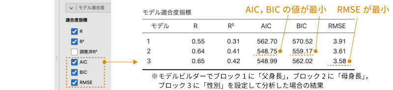
```


これらの適合度指標は，同じデータについて作成した複数のモデル間で適合度を比較することはできても，異なるデータについて作成されたモデル間で比較することはできません。また，AICやBIC，RMSEは，いずれか1つのみを用いることもありますが，複数の指標を用いて総合的にモデル評価を行うこともあります。

<!-- -->


#### モデル全体の検定 {-}

モデルの適合度について，指標という形ではなく，十分適合しているといえるかどうかという形で判断したい場合もあるでしょう。その場合は，「**モデル全体の検定**」のところにある「F検定」のチェックをオンにします。


すると，図\@ref(fig:regression-lr-modelfit-anova)のような結果がモデル適合度指標の横に表示されます。

```{r regression-lr-modelfit-anova, fig.cap = "モデル適合度の検定", echo = FALSE}
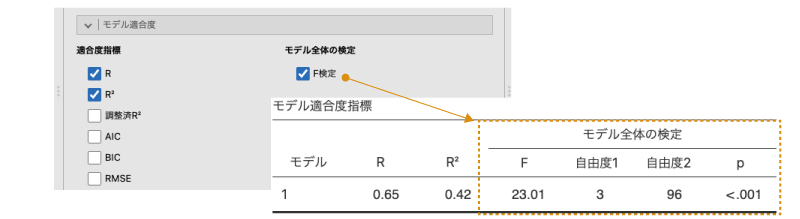
```

モデルビルダーでは予測変数を追加することによる説明率の変化について検定を行いますが，ここでは切片のみのモデルと分析モデルの間で説明率が有意に向上したといえるかどうかについての検定を行います。したがって，表中のFの値は，切片だけでは説明しきれず，予測変数を用いることによって説明されるようになる分散を，分析モデルの残差の分散で割って求めた値です。「自由度1」は分析モデルにおける予測変数の個数（交互作用項を含むモデルの場合，交互作用項も含みます），「自由度2」は分析モデルの残差の自由度です。

この結果の有意確率pの値が有意水準を下回る場合にモデルの適合度が有意と判断されますが，この検定結果が有意であっても，それは「切片のみのモデルよりはましである」という意味でしかない点には注意が必要です。

### モデル係数{#sub:regression-LR-modelcoeff}

回帰分析の`r groupbar("モデル係数")`には次の項目が含まれています。ここでは，各予測変数の係数に関する設定を行います（図\@ref(fig:regression-lr-model-coeff)）。

```{r regression-lr-model-coeff, fig.cap = "モデル係数の設定", echo = FALSE}

```

:::{.jmvsettings data-latex=""}
+ **オムニバス検定**　各予測変数についてオムニバス検定を行います。
  - ANOVA検定　各予測変数の説明力が0でないかどうかを検定します。
+ **推定値**　回帰係数の推定に関する設定を行います。
  - 信頼区間　回帰係数の信頼区間を算出します。
+ **標準化推定値**　回帰係数の標準化に関する設定を行います。
  - 標準化推定値　標準化回帰係数を算出します。
  - 信頼区間　標準化回帰係数の信頼区間を算出します。
:::


#### オムニバス検定 {-}

「**オムニバス検定**」では，各予測変数の説明力が0でないかどうかについての検定を行うことができます。*オムニバス検定*というのは，分散分析のように「他と値の異なるものが少なくとも1つ含まれていることはわかっても，具体的にそれがどの値かまではわからない」タイプの検定のことです。

この「ANOVA検定」の部分にチェックを入れると，分析モデルから各予測変数を除外した場合とそうでない場合で，モデルの説明力に有意な差があるといえるかどうかについての検定結果が出力されます（図\@ref(fig:regression-lr-model-coeff-anova)）。
<!-- -->

```{r regression-lr-model-coeff-anova, fig.cap = "オムニバス検定の結果", echo = FALSE}

```

この検定の結果が有意でない予測変数は，従属変数の説明に貢献していないということですので分析から除外したほうがいいかもしれません。今回の分析では，「性別」の検定結果が有意ではありませんでした。

なお，回帰分析結果の「モデル係数」の表にも各係数についてのt検定の結果が出力されますが，これは「係数が0でない」，つまり影響力が0かどうかについての検定結果です。これに対し，このANOVA検定の結果は「その予測変数によって説明される分散が0でない」，つまりこの予測変数を用いる意味があるかどうかについての検定結果です。両者で検定仮説が異なる点に注意してください。

#### 推定値 {-}

分析結果の表にもそう書かれているように，回帰分析で算出される回帰係数はあくまでも「推定値」であり，それが実際の関係を正確に示しているというわけではありません。そのため，回帰係数についても信頼区間を算出して検討することがあります。「**推定値**」にある「信頼区間」にチェックを入れると，回帰係数について指定した幅で信頼区間の上限と下限を算出することができます（図\@ref(fig:regression-lr-model-coeff-ci)）。

```{r regression-lr-model-coeff-ci, fig.cap = "回帰係数の信頼区間", echo = FALSE}
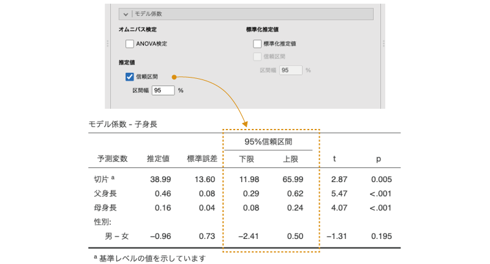
```


#### 標準化推定値 {-}

重回帰分析における偏回帰係数の大きさは，予測変数の測定単位や大きさによる影響を受けます。たとえば，課題作業にかかった時間を分の単位で記録したもの（1.5分，0.75分など）を予測変数として用いた場合と，秒の単位で記録したもの（90秒，45秒など）を予測変数として用いた場合とでは，偏回帰係数の大きさが異なるのです。また，予測変数に「秒」を単位とする測定値と「mm」を単位とする測定値が含まれていた場合，それらの偏回帰係数の大きさを直接比較することはできません。1.2秒と0.7mmのどちらが大きいかというような判断はできないからです。

また，予測変数の単位がすべて同じである場合も，分散が大きな予測変数と小さな変数とでは，「1」のもつ意味合いが異なってきます。たとえば，長距離走のタイムにおける「1秒」の違いはごくわずかといえても50m走では「1秒」の差は非常に大きいといえるでしょう。これは，長距離走では分単位で測定値がばらつくのに対し，短距離走では測定値のばらつきの幅が数秒しかないためです。このように，測定値の分散の違いによって測定値における「1」の差の意味が大きく異なる場合もあります。

このような場合，偏回帰係数の大きさを見るだけでは，従属変数に対してどの予測変数がより強い影響を与えているのかを解釈することが困難です。そこでこのような場合には，各予測変数間の相対的な影響力を比較判断しやすくするために，それぞれの予測変数の値を*標準化*した場合の回帰係数を求めるという方法がとられます。このような，予測変数の値を標準化した場合の回帰係数のことを*標準化回帰係数*あるいは*標準化偏回帰係数*と呼びます。

jamoviで標準化回帰係数を算出する場合，`r groupbar("モデル係数")`の画面の右側にある「標準化推定値」のところにチェックを入れます。また，標準化回帰係数についても信頼区間を算出することができます。標準化回帰係数の信頼区間を算出するには，その下にある「信頼区間」にチェックを入れます（図\@ref(fig:regression-lr-model-coeff-stb)）。

<!-- -->
```{r regression-lr-model-coeff-stb, fig.cap = "標準化回帰係数とその信頼区間", echo = FALSE}

```


なお，各予測変数の値を標準化した場合，回帰式の切片の値はつねに0になります。そのため，jamoviでは切片の標準化推定値は空欄で表示されます。


### 推定周辺平均{#sub:regression-LR-marginalmeans}

`r groupbar("推定周辺平均")`（推定周辺平均）の設定項目では，*推定周辺平均値*の算出や表示に関する設定を行います（図\@ref(fig:regression-lr-emm)）。

```{r regression-lr-emm, fig.cap = "推定周辺平均", echo = FALSE}
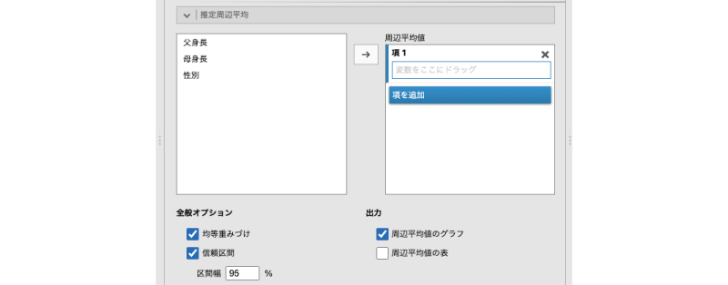
```

:::{.jmvsettings data-latex=""}
+ 周辺平均値　周辺平均値の算出対象を指定します。
+ **全般オプション**
  - 均等重みづけ
  - 信頼区間　周辺平均値の信頼区間を算出します。
+ **出力**
  - 周辺平均値のグラフ
  - 周辺平均値の表
:::

推定周辺平均値とは，回帰モデルに基づく予測値のことです。ここで簡単にその考え方を見ておくことにしましょう。たとえば次の回帰モデルを用い，子供の身長の推定周辺平均値を算出してみます。なお，「性別」は男児が「1」，女児が「2」と入力されているものとします。

\[
\text{子身長} = 38.03 + 0.48 \times \text{父身長} + 0.16 \times \text{母身長} + 0.96 \times \text{性別}
\]

この場合，回帰式の「母身長」の値には，母親の身長の平均値（148.12）を代入します。また，「性別」の値はここでは「1」と「2」の中間である「1.5」を代入することにしましょう。すると，この回帰式は次のようになります。


\begin{eqnarray*}
\text{子身長} & = & 38.03 + 0.48 \times \text{父身長} + 0.16 \times 148.12 + 0.96 \times 1.5 \\
            & = & 38.03 + 0.48 \times \text{父身長} + 23.6992 + 1.44 \\
            & = & 62.4792 + 0.48 \times \text{父身長}
\end{eqnarray*}

すると，たとえば父親の身長が170cmであった場合，子供の身長は次のようになります。

\begin{eqnarray*}
\text{子身長} & = & 62.4792 + 0.48 \times 170 \\
            & = & 144.0792
\end{eqnarray*}

このような考え方で算出されたものが推定周辺平均値です。


この推定周辺平均の設定では，従属変数との関係を示す予測変数を「項」として指定します。このとき，「項」に指定されている変数が1つだけの場合にはその変数の主効果（その変数との単純な影響関係）について，複数ある場合にはそこに指定された変数間の交互作用についての推定周辺平均値が算出されます。


#### 全般オプション{-}

「**全般オプション**」では，推定周辺平均値の算出方法と，信頼区間についての設定が可能です。

##### 均等重みづけ{-}

先ほどの計算例では，「性別」の値は「1」と「2」の中間の値をとって「1.5」で計算しました。男女の人数が同じ場合，この変数の平均値は1.5になりますが，そうでない場合には1.5からは少しずれた値になります。この場合，単純に男女（1と2）の中間点の値（1.5）を用いるか，それとも男女の人数を考慮した中間点（平均値）を用いるかによって結果が異なってきますので，どちらを用いて計算を行うかについては「均等重みづけ」の部分で設定します。

ここにチェックが入っている場合は単純な中間点の値を用いた結果が，そうでない場合には両群の度数を考慮した中間点を用いて計算が行われます。なお，両群で度数が同じ場合や，名義尺度変数を予測変数に含まない場合には，このチェックのオン・オフは結果に影響しません。

##### 信頼区間{-}

「信頼区間」のチェックをオンにすると，推定周辺平均値を図示する際に，その信頼区間についても合わせて示すことができます。


#### 出力{-}

推定周辺平均値は，図または表，あるいはその両方で示すことができます。「**出力**」のところで「周辺平均値のグラフ」にチェックを入れればグラフが，「周辺平均値の表」にチェックを入れれば表が示されます（図\@ref(fig:regression-lr-emm-plots)）。表の場合，その予測変数が平均値の場合と，平均値±1SDの場合のそれぞれの推定周辺平均値が表示されます。

```{r regression-lr-emm-plots, fig.cap = "推定周辺平均のプロットの例", echo = FALSE}

```


### 保存{#sub:regression-LR-save}

分析で算出した各種の値を新たな変数として保存することもできます。回帰分析の「**保存**」には，次の項目が含まれています（図\@ref(fig:regression-lr-save)）。


```{r regression-lr-save, fig.cap = "算出結果の保存", echo = FALSE}

```

:::{.jmvsettings data-latex=""}
+ 予測値　回帰モデルによる予測値を変数として保存します。
+ 残差　回帰モデルの残差を変数として保存します。
+ クックの距離　クックの距離を変数として保存します。
:::

このように，jamoviの「線形回帰」では，回帰モデルの予測値，残差，そして各測定値についてのクックの距離を新たな変数として保存することができます。変数として使用したい項目にチェックを入れて設定画面を閉じ，スプレッドシートを見てみると，データの一番最後の列にこれらの値が新たな変数として格納されているのがわかります。このようにして残差やクックの距離を新たな変数として保存することで，これらの値についてさらに詳しい分析を行ったり，これらの値を別の分析に用いたりすることができるようになります（図\@ref(fig:regression-lr-save-residuals)）。

```{r regression-lr-save-residuals, fig.cap = "回帰分析の残差を保存した場合の例", echo = FALSE}

```

なお，残念ながら，このようにして保存された変数（結果変数）に対してはフィルタ（第\@ref(ch-basics)章の\@ref(sec-data-filter)を参照）を適用することができません。フィルタによって表示されるデータ行が変わると，それによって分析結果も変化してしまい，そしてこれらの変数の値も変化してしまうからです。

そのため，たとえばクックの距離が5を超えるデータ行を特定したいというような場合には，データファイルを表計算ソフトなどに書き出して処理をするか，その変数の値を別のデータ変数に貼り付けてからデータフィルタを適用するといった工夫が必要になります。

## 2値従属変数［2項］{#sec-regression-binomial}

ある症状の有無に喫煙や飲酒といった生活習慣がどの程度影響を与えているのか，ある課題の成功・失敗に対象児の月齢や発達指数がどのように影響しているか，災害に対して備えをする・しないを規定する要因にはどのようなものがあるのか，など，何らかの出来事の「成功・失敗」や「あり・なし」と，その影響要因について検討したいということもあるでしょう。

その場合，関心対象となる出来事の有無（成功・失敗）を「1・0」などとダミーコード化して従属変数とし，原因として考えうる要因を予測変数とした回帰分析を行えばよさそうに思えます。しかし，一般的な線形回帰分析では，「1・0」のような*2値変数*を従属変数として用いることはできません。線形回帰分析では，回帰モデルの残差が正規分布であることが前提となっていますが，従属変数の値が1と0の2種類しかない場合，残差が正規分布であるということがまず考えられないからです。

そこでこのような場合には，*ロジスティック回帰分析*と呼ばれる手法がよく用いられます。この手法は，従属変数が名義型や順序型の変数である場合にも適切な結果が得られるように，線形回帰分析の考え方を拡張したものです。ロジスティック回帰分析には，従属変数が2値変数の場合に用いられる*2項ロジスティック回帰分析*，従属変数が複数のカテゴリーをもつ名義型変数である場合に用いられる*多項ロジスティック回帰分析*，従属変数が順序型変数である場合に用いられる*順序ロジスティック回帰分析*など，いくつかの種類が存在します。

ここではまず，次のサンプルデータ（[regression_data03.omv](https://github.com/sbtseiji/jmv_compguide/raw/main/data/omv/regression_data03.omv)）を用いて，2項ロジスティック回帰分析についての基本的な考え方と分析方法を見ていくことにしましょう。

このデータファイルには，ある災害を体験した成人100名について，PTSD（心的外傷後ストレス障害）の有無とその人の性別と年齢，神経症傾向の強さ，そして体験した出来事の主観的強度が記録されています（図\@ref(fig:regression-data03)）。

```{r}
data03 <- read.csv("data/regression_data03.csv")

# ID
attributes(data03$ID)$`jmv-id` <- TRUE

# 連続変数
attributes(data03$年齢)$measureType <- c("Continuous")
attributes(data03$神経症傾向)$measureType <- c("Continuous")
attributes(data03$主観的強度)$measureType <- c("Continuous")

# 名義変数
data03$PTSD <- factor(data03$PTSD)
attributes(data03$PTSD)$levels <- c("なし", "あり")
attributes(data03$PTSD)$values <- c(0, 1)
attributes(data03$PTSD)$measureType <- c("Nominal")

data03$性別 <- factor(data03$性別)
attributes(data03$性別)$levels <- c("女", "男")
attributes(data03$性別)$values <- c(1, 2)
attributes(data03$性別)$measureType <- c("Nominal")

# 説明
attributes(data03$ID)$description <- "対象者のID"
attributes(data03$年齢)$description <- "対象者の年齢"
attributes(data03$神経症傾向)$description <- "対象者の神経症傾向の強さ（5〜65点）"
attributes(data03$主観的強度)$description <- "体験の主観的強度（1〜10点）"
attributes(data03$PTSD)$description <- "PTSDの有無（あり，なし）"
attributes(data03$性別)$description <- "対象者の性別（男，女）"


out <- jmvReadWrite::write_omv(data03, "data/omv/regression_data03.omv", frcWrt = TRUE)

```

```{r regression-data03, fig.cap = "サンプルデータ", echo = FALSE}

```

:::{.jmvvar data-latex=""}
* `ID`　対象者のID
* `PTSD`　PTSDの有無（あり，なし）
* `性別`　対象者の性別（男，女）
* `年齢`　対象者の年齢
* `神経症傾向`　対象者の神経症傾向の強さ（5〜65点）
* `主観的強度`　体験の主観的強度（1〜10点）
:::

このデータを用いて，PTSDの有無にどの要因がどのような影響を与えているのかを分析することにしましょう。


### 考え方 {#sub:regression-binomial}

PTSDの有無に性別や年齢などがどのように影響を与えているかを見たい場合，その分析モデルを回帰式の形で表すと次のようになります。なお，分析においてはPTSDの有無は「あり」を「1」，「なし」を「0」としてダミーコード化するものとします。また，予測変数に含まれる性別についてもダミーコード化されているものとします。


\[
\text{PTSDの有無} = b_0 + b_1 \times \text{性別} + b_2 \times \text{年齢}+ b_3 \times \text{神経症傾向}+ b_4 \times \text{体験強度}
\]


通常の回帰分析では，従属変数は連続型変数である必要がありますが，このモデルでは従属変数に相当する「PTSD」には「`1`（あり）」か「`0`（なし）」かのいずれかの値しかありません。そのため，適切な分析結果を得るには，従属変数である「PTSDの有無」を何らかの形で連続的な数値に変換する必要があります。

ではたとえば，従属変数にPTSDの有無そのものではなく，PTSDが「あり」である確率を用いたらどうでしょうか。これならば，従属変数の値は0から1までの連続的な値をとり得ますし，そして算出された確率値が0.5以上なら「あり」，そうでなければ「なし」のように判断すれば，従属変数が2値データであってもうまく扱えそうです（図\@ref(fig:regression-binomial-probability)）。

<!-- 2値と確率 -->

```{r regression-binomial-probability, fig.cap = "2値データと確率", echo = FALSE}

```


一見するとこれで問題が解決したかのように見えるのですが，残念ながらこれでもまだ不十分です。というのも，確率の値がとるのは0から1までの範囲に限られていて，回帰式ではそのような範囲を限定した予測はできないからです。そのため，回帰式による予測値がマイナスの値になったり1を超えるような値になったりした場合には，その結果を解釈することができなくなってしまいます。

そこでその対策として，まず従属変数の値を確率から*オッズ*へと変換します。オッズというのは，ある出来事が起きる場合と起きない場合のそれぞれの確率の比のことで，たとえば「PTSDあり」の場合のオッズは次のようにして求められます。

\[
\text{PTSDありのオッズ} = \frac{\text{PTSDありの確率}}{\text{PTSDなしの確率}} = \frac{\text{PTSDありの確率}}{1-\text{PTSDありの確率}}
\]

もし「PTSDあり」が20人に1人の割合だったとすると，無作為に選ばれたある個人が「PTSDあり」である確率は「1/20 = 0.05」ですから，この場合の「PTSDあり」のオッズは次のようになります。

\[
\text{PTSDありのオッズ} = \frac{0.05}{1-0.05} = 0.0526\dots
\]

また，「PTSDなし」であるオッズを算出したいなら次のようになります。

\begin{eqnarray*}
\textsf{PTSDなしのオッズ} & = & \frac{\text{PTSDなしの確率}}{\text{PTSDありの確率}} = \frac{\text{PTSDなしの確率}}{1-\text{PTSDなしの確率}}\\
 & = & \frac{0.95}{1-0.95} = 19
\end{eqnarray*}


このようにして確率をオッズに変換することにより，従属変数の値は0から無限大の範囲をとることができるようになります。

ただし，PTSDありの確率がPTSDなしの確率よりも低い場合，PTSDありのオッズは0〜1の値しかとらないのに対し，PTSDなしのオッズは1から無限大となって，PTSDありの場合となしの場合で数値のとりうる幅が大きく異なってしまいます。また，もし回帰分析の予測値がマイナスの値になってしまう場合には，確率を用いる場合と同様に，結果を解釈できなくなってしまいます。

そこで，このオッズの値をさらに*対数変換*します。この「オッズの対数」のことを*対数オッズ*あるいは*ロジット*といい，「PTSDあり」の確率をpとしたときに，この確率pを次のようにして対数変換する式のことを*ロジット関数*と呼びます。

\[
\text{PTSDあり（}p\text{）のロジット} = \log \left( \frac{p}{1-p}\right)
\]

先ほどのPTSDありとなしの場合のそれぞれのオッズを対数変換すると，次のようになります。なお，この場合の対数には，一般に*ネイピア数e*^[ネイピア数eは円周率πなどと同じ数学定数の1つで，その値はおおよそ2.72です。]を底とする*自然対数*が用いられます。

\begin{eqnarray*}
\text{PTSDありのロジット} & = & \log \left( \frac{0.05}{1-0.05}\right) = -2.944\dots\\
\text{PTSDなしのロジット} & = & \log \left( \frac{0.95}{1-0.95}\right) = 2.944\dots
\end{eqnarray*}

対数変換前のオッズの値では，同じ1/20の確率の現象について「あり」のほうに注目した場合と「なし」のほうに注目した場合とでまったく異なる値になりましたが，ロジットに変換すると，このように「あり」の場合と「なし」の場合で数値の符号が逆になるだけで絶対値は同じ，つまり，どちらの場合も値の幅は同じになるのです。

確率をオッズに，そしてオッズをロジットに変換することで，これでようやくPTSDの有無という2値変数を回帰分析の従属変数として用いることができるようになりました。ここから先は，通常の回帰分析の場合と同様です。予測変数から従属変数をできるだけうまく説明できるようにして，切片や回帰係数の値を算出します。

このように，2項ロジスティック回帰では，関心とする事象が生起する確率についてのロジットを従属変数に使用します。このことは結果の解釈においても重要な意味を持ちますが，それについては分析結果の見方のところで説明します。

### 分析手順{#sub:regression-binomial-analysis}

それではサンプルデータをロジスティック回帰で分析してみましょう。2項ロジスティック回帰を実行するには，分析タブの「`r infig("analysis-regression")` 回帰分析」から「ロジスティック回帰」の下にある「2値従属変数［2項］」を選択します（図\@ref(fig:regression-binomial-menu)）。

```{r regression-binomial-menu, fig.cap = "2項ロジスティック回帰の実行", echo = FALSE}

```

すると，線形回帰分析の場合とよく似た設定画面が表示されます。最後から2つ目に`r groupbar("予測")`という項目がある以外は線形回帰分析の設定画面と同じです（図\@ref(fig:regression-binomial-setting)）。

```{r regression-binomial-setting, fig.cap = "2項ロジスティック回帰の設定画面", echo = FALSE}
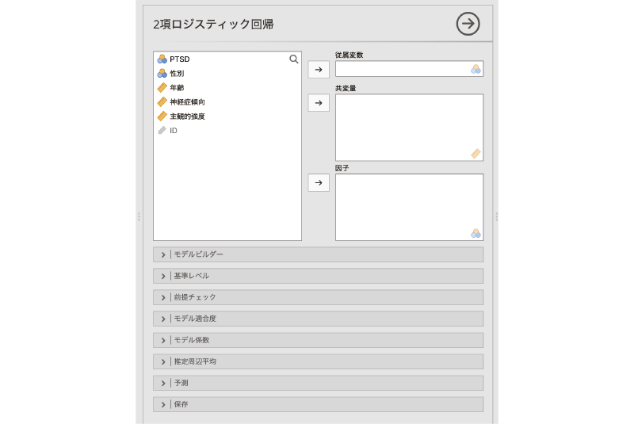
```

表示された設定画面の「従属変数」に「PTSD」を，「共変量」に「年齢」，「神経症傾向」，「主観的強度」を，「因子」に「性別」を指定します（図\@ref(fig:regression-binomial-variable-settings)）。予測変数のうち連続型のものを「共変量」に，名義型のものを「因子」に設定するなど，変数の指定方法も線形回帰分析の場合と基本的に同じです。違うのは，従属変数（従属変数）に名義型変数（`r infig("variable-nominal")`）しか指定できないという点だけです。

```{r regression-binomial-variable-settings, fig.cap = "従属変数と予測変数の設定", echo = FALSE}
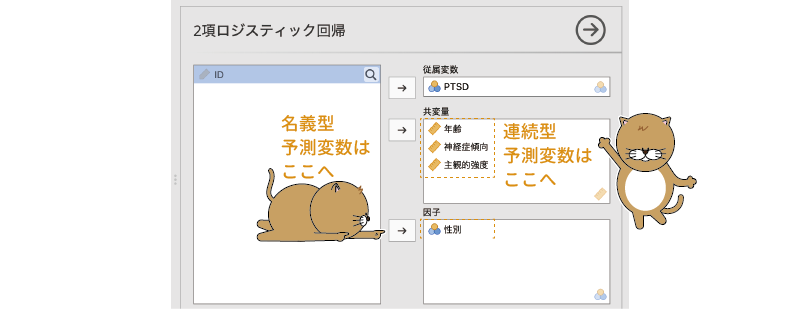
```

これで基本的な設定は終わりですが，結果を見る前に1つだけ確認しておいたほうがよい部分があります。それは``r groupbar("基準レベル")`の部分です（図\@ref(fig:regression-binomial-reference-levels)）。2項ロジスティック回帰では従属変数は「あり・なし」や「はい・いいえ」などの2値変数ですので，分析ではそれらのうちいずれか一方の値を基準とした結果が算出されます。2つの値のうちどちらが基準になっているのかによって結果の意味が逆になりますので，ここは必ず確認しておくようにしましょう。

```{r regression-binomial-reference-levels, fig.cap = "基準レベルの設定", echo = FALSE}

```

またこのとき，2つの値のうちのどちらを基準として設定するかによって，結果のわかりやすさが大きく変わってきますので，その点にも注意してください。もし，分析によって各予測変数がPTSDの「なりやすさ」にどのような影響を与えているかを見たいのであれば，基準レベルには「なし」の値を設定するようにします。基準レベルが「あり」になっていると，分析結果にはPTSDの「なりにくさ」についての値が表示されてしまい，解釈が困難になってしまいます。

これは，予測変数に含まれる名義型変数についても同様です。線形回帰分析の場合，2つの値のどちらを基準にするかは，回帰係数の符号が逆になる程度でそれほど大きな違いはありません。しかし2項ロジスティック回帰では，従属変数の値は実際の測定値ではなく「はい」または「いいえ」が生じる確率の「ロジット」ですので，回帰係数の符号が逆になると解釈が非常に困難になってしまうのです。ですので，たとえば「『男性に比べて』女性のほうがどの程度PTSDになりやすいか」を見たいのであれば，性別の予測変数については「男性」を基準に，「『女性に比べて』男性がどの程度PTSDになりやすいか」を見たいのであれば，性別の予測変数は「女性」に設定しておいたほうがよいのです。ここでは，従属変数（PTSD）については「なし」を基準に，性別については「男性」を基準とした結果を算出することにします。

ここまでの設定が終わったら，分析結果を見てみましょう。図\@ref(fig:regression-binomial-results)のような結果が表示されているはずです。

### 分析結果{#sub:regression-binomial-results}


```{r regression-binomial-results, fig.cap = "分析結果", echo = FALSE}
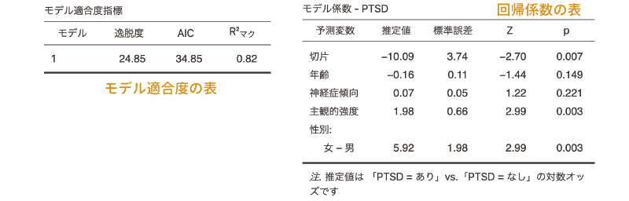
```

1つ目（図\@ref(fig:regression-binomial-results)の左側）の表は，この回帰モデルの適合度指標に関する情報です。2項ロジスティック回帰では，初期設定では適合度の指標として*逸脱度*，AIC，**\(\textsf{R}^{\textsf{2}}_{\textsf{マク}}\)**（マクファデンのR²）の3つの値が表示されます。逸脱度およびAICは小さい値であるほど，R²の値は1に近い値ほど分析モデルのあてはまりがよいことを意味します。これらの適合度指標については，この後の`r groupbar("モデル適合度")`の部分で説明します。


2つ目（図\@ref(fig:regression-binomial-results)の右側）の表は回帰係数に関する結果です。この部分は線形回帰分析の結果と基本的に同じで，「**推定値**」の部分が回帰係数，「標準誤差」が回帰係数の標準誤差です。ただし，2項ロジスティック回帰では，回帰係数の有意性についての検定にはtではなく「Z」が用いられます。そして，Zの隣の「p」の値が有意水準を下回っている場合に，回帰係数が有意である（0でない）と判断します。

この分析結果では，体験の主観的強度と対象者の性別の影響が有意で，それぞれの回帰係数は主観的強度が1.98，性別が5.92といずれもプラスの値です。つまり，体験の主観的強度が大きな値の人のほうが，また，男性よりも女性のほうが「PTSDあり」になりやすいということです。

このように，2項ロジスティック回帰の結果は線形回帰分析の場合と非常によく似ているのですが，注意すべき点が1つあります。それは，2項ロジスティック回帰の回帰式は，従属変数そのものについてではなく，従属変数の「ロジット」について説明する形になっているという点です。つまり，ここに示されている回帰係数は，予測変数の値が1変化した場合の，従属変数のロジットの変化量を表しているのです。

たとえば，この結果では性別（基準レベル = 男性）の回帰係数が5.92ですが，これは女性のほうが男性に比べて5.92倍PTSDになりやすい，あるいは5.92倍オッズが高いという意味ではなく，女性のほうが男性に比べて「PTSDあり」のロジットが5.92だけ増加するという意味になります。

ロジットはオッズを対数変換した値ですので，ロジットに対して対数変換の逆変換，つまり*指数変換*を行うことで，次のようにしてこの変化量をオッズに変換することができます。

\[
 e^{5.92} = 372.4117\dots
\]

この372.41という値は，男性を基準とした場合の女性のオッズの高さ，つまり男性のオッズと女性のオッズの比を表しており，女性の場合，男性に比べて「PTSDあり」であるオッズが372倍になるということを意味します^[これはあくまでも「オッズの倍率」である点に注意してください。女性のPTSD率が男性の372倍になるというわけではありません。]。この「女性のオッズ／男性のオッズ」のような，2つのオッズの比のことを*オッズ比*と呼びます。

先ほどは係数の値を指数変換することでオッズ比を求めましたが，実際にはこのような計算を自分でやる必要はありません。`r groupbar("モデル係数")`の設定画面で「**オッズ比**」の部分にチェックを入れれば，各回帰係数のオッズ比とその信頼区間を算出することができます。

なお，予測変数が連続型変数の場合，たとえばここでの分析結果では「主観的強度」は回帰係数が1.98で，これをオッズ比にすると7.21になります。これは，体験の主観的強度の値が1増えるとPTSDありのオッズが7.21場合になるということですが，ではもし，この体験の強度の値が2増えた場合，オッズ比はどうなるでしょうか。7.21 &times; 2 = 14.42倍でしょうか。そうではなく，この場合には\(7.21^2\) = 51.9841倍になります。

なぜそうなるのでしょうか。他の予測変数の値がすべて同じで，体験強度の値だけ異なる対象者が複数いたとしましょう。そのうちの1人（対象者A）は，体験の主観的強度の値が5で，もう1人（対象者B）は6だったとします。この場合，対象者AとBの体験強度の差は1ですから，先ほど見たように，対象者Bの「PTSDあり」のオッズは対象者Aの7.21倍になります。

さらに，体験強度が7の対象者（対象者C）がいたとしましょう。この対象者Cと先ほどの対象者Bの体験強度の差も1ですから，やはり対象者Cの「PTSDあり」のオッズは対象者Bの7.21倍になります。

するとこの場合，対象者Aと対象者Cの間には，体験の主観的強度の差が2だけあるわけですが，対象者Cは対象者Bの7.21倍のオッズで，そして対象者Bは対象者Aの7.21倍のオッズですから，対象者Cは対象者Aの7.21倍&times;7.21倍で51.9841倍になるのです。

実際の分析場面では，このようにして予測変数の値がいくつ増えたからオッズ比がどう，という形で結果を見ていくことはほとんどないかもしれませんが，結果の見方が線形回帰分析とまったく同じだと考えていると結果の解釈を誤ってしまう可能性もありますので，その点は注意しておきましょう。

少し長くなりましたが，これで結果の見方についての説明はおしまいです。ここからは，ロジスティック回帰分析の設定項目について見ていきましょう。なお，2項ロジスティック回帰の設定は大部分が線形回帰の場合と同じですので，ここでは2項ロジスティック回帰に特有の部分を中心に見ていくことにします。それ以外の部分については，線形回帰についての説明を参照してください。


### 前提チェック {#sub:regression-binomial-assumption}

2項ロジスティック回帰では，前提チェックの項目は「共線性統計量」の1つだけしかありません（図\@ref(fig:regression-binomial-assumption-checks)）。線形回帰分析の場合にはいろいろあったのと対照的です。


```{r regression-binomial-assumption-checks, fig.cap = "前提チェック", echo = FALSE}

```

ただし，では2項ロジスティック回帰は線形回帰よりも手軽に実行できるのかというと，そういうわけでもありません。今回のサンプルデータではそうではありませんが，実際のデータでは，「PTSDあり」の比率が「PTSDなし」に比べて非常に低いという場合もあるでしょう。そのような場合，「PTSDあり」の行がデータに十分に含まれていないと回帰係数をうまく推定できないのです。そのため，2項ロジスティック回帰には，一般に線形回帰分析よりも大きなサイズの標本が必要になります。


### モデル適合度{#sub:regression-binomial-model-fit}

分析結果のモデル適合度（Model Fit Measures）の表にどのような値を表示させるかは，分析設定画面の`r groupbar("モデル適合度")`で設定できます（図\@ref(fig:regression-binomial-model-fit)）。

<!-- 設定画面 -->

```{r regression-binomial-model-fit, fig.cap = "適合度指標の設定", echo = FALSE}
knitr::include_graphics("images/regression/binomial-model-fit.png")
```

:::{.jmvsettings data-latex=""}
+ **適合度指標**
  - 逸脱度　モデルの残差逸脱度を算出します。
  - AIC　赤池情報量規準を算出します。
  - BIC　ベイズ情報量規準を算出します。
  - モデル全体の検定　$\chi^{2}$を用いてモデル全体の有意性検定を行います。
+ **擬似R²**　モデルのあてはまりの程度を標準化した値を算出します。
  - マクファデンのR²　マクファデン（McFadden）の擬似決定係数を算出します。
  - コックス=スネルのR²　コックス＝スネル（Cox-Snell）の擬似決定係数を算出します。
  - ナゲルケルケのR²　ナゲルケルケ（Nagelkerke）の擬似決定係数を算出します。
:::

適合度の指標に関する設定は，大きく「**適合度指標**」と「**擬似R²**」の2つに分かれています。ここでは，これらについて簡単に見ておきましょう。

#### 適合度指標 {-}

「**適合度指標**」はその名のとおり，モデルの適合度（あてはまり）についての指標です。jamoviの2項ロジスティック回帰では，次の適合度指標を算出することができます。

##### 逸脱度{-}
1つ目の「逸脱度」にチェックを入れると，*残差逸脱度*が算出されます。残差逸脱度はモデルの*尤度*に基づいて算出される指標で，これは線形回帰分析における残差の2乗和に相当します。なお，線形回帰分析の係数は残差2乗和が最小になるようにして算出されますが，2項ロジスティック回帰ではこの逸脱度が最小になるようにして係数が算出されます。

なお，「尤度」とは，この分析モデルから手元のデータが得られる確率がどの程度あるか（モデルの尤もらしさ）を示した値です。残差逸脱度は，次のように分析モデルの尤度と完全モデル（実際のデータを完全に説明したモデル）の尤度の比を対数変換する形で求められます。

\[
\text{逸脱度} = -2\times\log \left(\frac{\text{分析モデルの尤度}}{\text{完全モデルの尤度}}\right)
\]

この残差逸脱度の値が小さいほど，モデルと分析データのずれが小さい（モデルのあてはまりがよい）ことを意味します。ただし，逸脱度の大きさは分析に使用するデータによって異なるため，この値がいくつ以下であればよいというような一般的な基準はありません。

##### AIC, BIC{-}

線形回帰分析における（調整されていない）決定係数が複雑なモデルほど大きくなるのと同様に，逸脱度の値は予測変数の数が多くなればなるほど小さくなる性質を持ちます。そこで，残差逸脱度に対し，モデルに含まれる予測変数の個数（交互作用を含むならその個数も含む）による調整を行った値がAICとBICです。このAICとBICは，線形回帰におけるモデル適合度指標のAIC，BICと同じものです。

AICとBICについても値が小さいほどあてはまりがよいことを示しますが，残差逸脱度と同様に，これらがいくつ以下であればよいという一般的な基準はありません。

##### モデル全体の検定 {-}

ここまで見てきたように，逸脱度やAIC，BICといった指標には，モデルがデータに十分あてはまっているといえるのかどうかの明確な基準がありません。そこで，モデルがデータにあてはまっているかどうかについての検定を行うのが「モデル全体の検定」です。

この「モデル全体の検定」にチェックを入れると，$\chi^{2}$（カイ2乗）を用いたモデル適合度の検定を行うことができます（図\@ref(fig:regression-binomial-overall)）。

```{r regression-binomial-overall, fig.cap = "適合度指標とモデル適合度の検定", echo = FALSE}
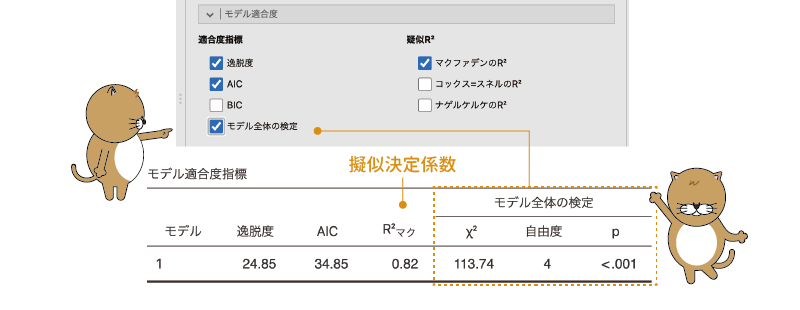
```

線形回帰モデルの場合，モデル全体の適合度の検定にはFが用いられますが，2項ロジスティック回帰ではモデルの逸脱度に基づいて算出された$\chi^{2}$を用いた検定が行われます。この$\chi^{2}$は，切片のみのモデルの残差逸脱度から分析モデルの残差逸脱度を引いた値で，この値が有意である場合（pが有意水準を下回っている場合）は，分析モデルが切片のみのモデルよりもデータをうまく説明できている（残差逸脱度が有意に小さい）ということを意味します。

今回の分析結果ではp&lt;.001で有意ですので，この分析モデルがデータをまったく説明できていないということはなさそうです。ただし，線形回帰モデルのF検定の場合と同様に，この検定が有意であっても，それは説明力0のモデルよりはましであるという意味でしかありませんので，その点には注意が必要です。


#### 擬似R²{-}

逸脱度やAICは，モデルの適合度を相対的に評価するには便利な指標ですが，これらの値だけでは分析モデルがどの程度データをうまく説明できているのかの判断は困難です。そこで，モデルのあてはまりのよさを0から1の範囲の値として示すようにしたものが*擬似決定係数*です。この擬似決定係数の値は，線形回帰分析における決定係数R²に相当するもので，値が1に近いほどデータをうまく説明できていることを意味します。

##### マクファデンのR²{-}

jamoviでは，擬似決定係数として，マクファデン，コックス=スネル，ナゲルケルケの3種類の値を算出することができます。この3つのうち，一般にもっともよく知られているのはマクファデンの擬似決定係数で，これは分析モデルの尤度の対数（*対数尤度*）を切片のみのモデル（帰無モデル）の対数尤度で割り，その値を1から引くことによって求められます。

対数尤度はつねに負の値になり，かつモデルとデータのあてはまりがよいほど0に近い値になるため，このように計算することで，分析モデルのあてはまりがよいほど対数尤度の割り算の部分が0に近い値になり，マクファデンの擬似決定係数は1に近づきます。

##### コックス=スネルのR²{-}

マクファデンの擬似決定係数はモデルのあてはまりの良さを0から1の範囲の数値で示すことができるのですが，この値は線形回帰分析における決定係数よりもかなり小さな値になることが知られています。そこで，その点を修正した値がコックス=スネルの擬似決定係数です。


##### ナゲルケルケのR²{-}

ただし，コックス=スネルの擬似決定係数は，最大値が1にならないことが知られています。そのため，擬似決定係数の最大値が1になるように，コックス=スネルの擬似決定係数にさらに調整を加えたものがナゲルケルケの擬似決定係数です。


<!-- -->


### モデル係数 {#sub:regression-binomial-model-coeff}

ここでは，各予測変数の係数に関する次の項目の設定を行います（図\@ref(fig:regression-binomial-model-coefficients)）。

```{r regression-binomial-model-coefficients, fig.cap = "回帰係数の信頼区間", echo = FALSE}

```


:::{.jmvsettings data-latex=""}
+ **オムニバス検定**　各予測変数についてオムニバス検定を行います。
  - 尤度比検定　各予測変数の説明力が0でないかどうかを検定します。
+ **推定値（対数オッズ比）**　回帰係数の推定に関する設定を行います。
  - 信頼区間　回帰係数の信頼区間を算出します。
+ **オッズ比**　各予測変数のオッズ比に関する設定を行います。
  - オッズ比　オッズ比を算出します。
  - 信頼区間　オッズ比の信頼区間を算出します。
:::


#### オムニバス検定{-}

各予測変数が従属変数の説明において貢献しているといえるかどうかを確かめたい場合には，「**オムニバス検定**」の「尤度比検定」にチェックを入れてください。すると，各説明線変数の有効性についての検定結果が表示されます（図\@ref(fig:regression-binomial-model-coefficients)）。


<!-- 設定画面 -->
```{r regression-binomial-omnibus, fig.cap = "予測変数についての尤度比検定", echo = FALSE}

```

2項ロジスティック回帰の場合には，各予測変数についての検定はANOVA（分散分析）ではなく*尤度比検定*と呼ばれる手法が用いられます。これは，分析に使用したモデルと，そこからその予測変数を除いたモデルの尤度の比率（*尤度比*）に基づく検定で，検定統計量には$\chi^{2}$が用いられます。そして，その隣のp値が有意水準を下回る場合に，「その予測変数の説明力が0でない」とみなされます。

#### 推定値（対数オッズ比）{-}

線形回帰分析の場合と同様に，2項ロジスティック回帰でも各予測変数の回帰係数について信頼区間を算出することができます。回帰係数の信頼区間を算出するには，「**推定値（対数オッズ比）**」の「信頼区間」にチェックを入れてください（図\@ref(fig:regression-binomial-ci)）。


```{r regression-binomial-ci, fig.cap = "回帰係数の信頼区間", echo = FALSE}

```

なお，この設定項目の名前には「*対数オッズ比*」とありますが，これは分析結果のところでも説明したように，2項ロジスティック回帰の回帰係数は*ロジット*の変化量を表しており，そしてそれは*オッズ比*を対数変換したのと同じ値だからです。

#### オッズ比{-}

繰り返しになりますが，2項ロジスティック回帰の回帰係数は，予測変数の値が1変化した場合における従属変数の*ロジット*の変化量を表しています。そしてロジットというのはオッズを対数変換したものなので，2項ロジスティック回帰の回帰係数から予測変数の影響の強さを解釈するのは困難です。そこで多くの場合，回帰係数を*指数変換*してオッズに戻したうえで解釈が行われます。このとき，回帰係数を指数変換した値は，予測変数の値が1増えるとオッズが何倍に変化するかを表す値（*オッズ比*）になります。

ほとんどの統計ソフトでは，2項ロジスティック回帰の回帰係数をオッズ比に変換してくれる機能があります。そして，それはjamoviでも同じです。jamoviでは，「**オッズ比**」の1つ目の項目である「オッズ比」にチェックを入れることで，回帰係数をオッズ比に変換した値が表示されます（図\@ref(fig:regression-binomial-oddsratio)）。


```{r regression-binomial-oddsratio, fig.cap = "オッズ比", echo = FALSE}
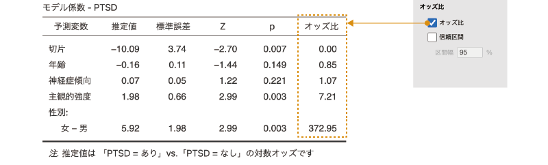
```

また，このオッズ比に対しても信頼区間を算出することができます。オッズ比の信頼区間を算出するには，「**オッズ比**」の2つ目の項目である「信頼区間」にチェックを入れてください。

### 予測 {#sub:regression-binomial-prediction}

2項ロジスティック回帰では，モデルの適合度として逸脱度や擬似決定係数などの値が算出されますが，そうした複雑な数値を使わなくても，もっと単純にモデルの精度を判断する方法があります。それは，このモデルを使って従属変数の値（PTSDあり・なし）を正しく判別できるかどうかを見るという方法です。

2項ロジスティック回帰の場合，従属変数の本来の値は「はい・いいえ」や「あり・なし」のように2種類の値のうちのいずれかしかありません。そのため，モデルよる予測値に基づく判定結果が各対象者の従属変数の値と一致しているかどうかの判断は，線形回帰分析の場合よりもずっと単純だからです。

なお，その際，モデルによる判定結果と実際の従属変数の値の組み合わせのパターンには，表\@ref(tab:regression-binomial-crosstable)に示した4とおりが考えられます。

```{r, regression-binomial-crosstable}
 data <- data.frame(
  Y = c("正解（真陽性）", "誤り（偽陽性）"),
  N = c("誤り（偽陰性）", "正解（真陰性）")
 )
 names(data) <- c("PTSD Y", "PTSD N")
 row.names(data) <- c("PTSD Y", "PTSD N")

 data %>% kable(align = "cc", caption = "判定結果のパターン", booktabs = T) %>%
  add_header_above(header = c(" " = 1, "判定結果" = 2)) %>%
  pack_rows("実際の値", 1, 2) %>%
 kable_styling(latex_options = "HOLD_position")# %>%


```

このとき，実際のデータにおける「PTSD」の値（「あり」または「なし」）と回帰モデルの判定結果が一致する場合を*真陽性*，*真陰性*といい，実際のデータでは「PTSD」の値が「あり」なのに回帰モデルに基づく判定結果が「なし」となってしまうことを*偽陰性*，その逆に，データでは「PTSD」の値が「なし」なのにモデルの判定結果が「あり」になってしまうことを*偽陽性*といいます。

また，「PTSD」の実際の値が「あり」であるデータのうち，回帰モデルによって正しく「あり」と判定された割合を*感度*，PTSDの実際の値が「なし」であるデータのうち，回帰モデルによって正しく「なし」と判定された割合を*特異度*と呼びます。また，データ全体のうちで正しく判断できた割合，つまり全体に占める真陽性と真陰性の合計の割合のことを*精度*と呼びます（図\@ref(fig:regression-binomial-signal)）。

<!-- 感度，特異度，精度 -->

```{r regression-binomial-signal, fig.cap = "感度，特異度と精度", echo = FALSE}
knitr::include_graphics("images/regression/binomial-signal.png")
```


この感度，特異度，精度はすべてで高いことが望ましいわけですが，実際はなかなかそううまくはいきません。多くの場合，感度を高くしようとすると特異度が下がり，特異度を高くしようとすると感度が下がることになるのです。この関係は，感染症の検査を例に考えてみるとわかりやすいでしょう。絶対に感染者を見逃さないようにしようとして検査の感度を上げる（わずかな兆候でも検査が陽性になるようにする）と，実際には感染していない人に対しても検査結果が陽性になってしまう（偽陽性になる）可能性が高くなります。すると，その検査では「病気に感染していない人」を正しく見分けられないということになり，特異度は低くなります。

この逆に，感染していない人に対して検査が陽性になるのを極力避けようと，よほどはっきりした兆候がない限り結果が陽性にならないようにする（特異度を高くする）と，今度は感染しているのに検査が陽性にならない（偽陰性になる）人が出てきてしまいます。このような性質から，実際の検査では，感染の可能性が少しでもありそうな人を選別するスクリーニング検査（感度を高く設定）と，確実に診断を行うための確定診断検査（特異度を高く設定）を用途に応じて使い分けるといったことが行われているのです。


さて，2項ロジスティック回帰での設定に話を戻しましょう。こうした感度，特異度，精度といった視点からモデルの適合度を評価したい場合には，設定画面の`r groupbar("予測")`にある設定項目を使用します。ここには，次の項目が含まれています（図\@ref(fig:regression-binomial-prediction)）。


<!-- -->
```{r regression-binomial-prediction, fig.cap = "予測の設定項目", echo = FALSE}

```

:::{.jmvsettings data-latex=""}
+ **カットオフ**
  - カットオフ・プロット　カットオフ値を変化させた場合の感度と特異値の関係を図示します
  - カットオフ値　カットオフ値を指定します
+ **予測指標**（予測指標）
  - 分類表　回帰モデルによる分類結果をクロス表に示します
  - 精度　モデルの精度を算出します
  - 特異度　モデルの特異度を算出します
  - 感度　モデルの感度を算出します
+ **ROC**
  - ROC曲線　ROC曲線を図示します
  - AUC　ROC曲線の下の面積（AUC）を算出します
:::

#### カットオフ {-}

まず，左側にある「**カットオフ**」の部分では，回帰モデルの*カットオフ値*と，感度，特異値の関係を見ることができます。ここにある「カットオフ・プロット」にチェックを入れると，その回帰モデルのカットオフ値と感度，特異度が図に示されます。なお，カットオフ値というのは，「あり」・「なし」の判定基準となる境目の値のことです。

このカットオフ値は初期設定では0.5（つまりPTSDが「あり」の確率が0.5（50%）以上であれば「あり」と判定）に設定されています。この分析結果では，カットオフ値が0.5の場合，感度に比べて特異度がやや低いことがわかります。もし特異度を上げたければ，このカットオフ値を0.5より大きな値に設定すればよいわけですが，そうすると感度はカットオフ値が0.5の場合よりもやや下がってしまいます（図\@ref(fig:regression-binomial-cutoff)）。

<!-- -->
```{r regression-binomial-cutoff, fig.cap = "カットオフ値と感度・特異度の変化", echo = FALSE}
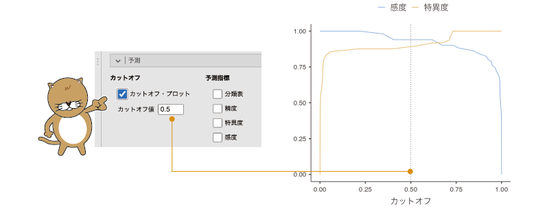
```


このカットオフ値をいくつに設定するかは，最終的には感度と特異度のバランスを見ながら分析者が判断することになります。

#### 予測指標 {-}

その分析モデルにおける実際の判定結果や感度や特異度について詳しく知りたい場合には，**予測指標**の項目を使用します（図\@ref(fig:regression-binomial-predictive)）。

<!---->
<!-- -->
```{r regression-binomial-predictive, fig.cap = "判定結果と予測精度の指標", echo = FALSE}
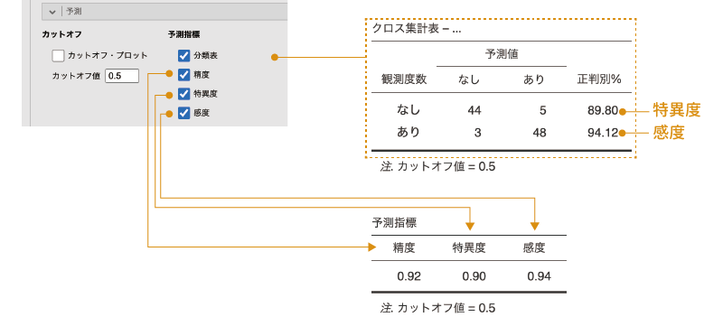
```

##### 分類表{-}
1番上の「分類表」にチェックを入れると，分析データに含まれる各対象者がどのように判定されたのかがクロス表の形で表示されます（図\@ref(fig:regression-binomial-predictive)）。この表の数値は，設定したカットオフ値を用いて判定した結果です。なお，この表の「観測度数」の「N」の行にある「正判別%」の値は，PTSDの値が「なし」の人が「なし」と判定された割合（つまり特異度），「Y」の行にある「正判別%」の値はPTSD「あり」の人が「あり」と判定された割合（つまり感度）を示しています。

##### 精度，特異度，感度{-}

その下にある「精度」，「特異度」，「感度」にチェックを入れると，それぞれ精度，特異度，感度の値が表示されます。

#### ROC {-}

この設定画面の右側にある「**ROC**」では，*ROC曲線*（受信者操作特性曲線）と呼ばれる曲線とその関連指標を用いてモデルの適合度を見ることができます。

##### ROC曲線{-}

ROC曲線は，回帰モデルのカットオフ値をさまざまに変化させた場合の感度と偽陽性率（\(\mathsf 1 -\)特異度）を図示したものです。設定画面の「ROC曲線」にチェックを入れると，この図が表示されます（図\@ref(fig:regression-binomial-auc)）。

```{r regression-binomial-auc, fig.cap = "ROC曲線とAUC", echo = FALSE}

```


このグラフが図の中央にある斜め線より上側にある場合には，そのモデルによってPTSDのあり・なしをある程度うまく判定できることを，斜め線と完全に一致する場合には，そのモデルではPTSDのあり・なしをでたらめにしか判定できないことを意味します。

##### AUC {-}

また，その下にある「AUC」の項目は，このROC曲線の下側の面積（Area Under Curve）がグラフ全体にしめる割合を表したものです。この値は，判定精度の高い回帰モデルほど1に近くなり，まったくでたらめなモデルの場合には0.5になります。このAUC値の解釈については，一般に表\@ref(tab:regression-binomial-auc-interpretation)のような目安が用いられます。

```{r, regression-binomial-auc-interpretation}
auc %>%
 kable(align = "cc", caption = "AUCの解釈の目安", booktabs = T) %>%
 kable_styling(latex_options = "HOLD_position")
```


サンプルデータの分析結果ではAUCは0.99ですので，作成した回帰モデルはPTSDの有無を高精度で判定できていることがわかります。


## 多値従属変数［多項］{#sec-regression-multinomial}


```{r}
data04 <- read.csv("data/regression_data04.csv")

# ID
attributes(data04$ID)$`jmv-id` <- TRUE

# 連続変数
attributes(data04$神経症傾向)$measureType <- c("Continuous")
attributes(data04$外向性)$measureType <- c("Continuous")
attributes(data04$開放性)$measureType <- c("Continuous")
attributes(data04$調和性)$measureType <- c("Continuous")
attributes(data04$誠実性)$measureType <- c("Continuous")

# 名義変数
data04$愛着 <- factor(data04$愛着, levels = c(1, 2, 3))
attributes(data04$愛着)$levels <- c("安定", "不安", "回避")
attributes(data04$愛着)$values <- c(1, 2, 3)
attributes(data04$愛着)$measureType <- c("Nominal")


# 説明
attributes(data04$ID)$description <- "対象家族のID"
attributes(data04$神経症傾向)$description <- "神経症傾向の得点"
attributes(data04$外向性)$description <- "外向性の得点"
attributes(data04$開放性)$description <- "開放性の得点"
attributes(data04$調和性)$description <- "調和性の得点"
attributes(data04$誠実性)$description <- "誠実性の得点"
attributes(data04$愛着)$description <- "愛着スタイル（安定，不安，回避）"

out <- jmvReadWrite::write_omv(data04, "data/omv/regression_data04.omv", frcWrt = TRUE)

```


次のサンプルデータ（[regression_data04.omv](https://github.com/sbtseiji/jmv_compguide/raw/main/data/omv/regression_data04.omv)）を見てください。このデータには，成人200名分の，その人がもつ愛着スタイル（安定型，不安型，回避型）と，性格検査による性格主要5因子の測定値が記録されています（図\@ref(fig:regression-data04)）。

```{r regression-data04, fig.cap = "サンプルデータ", echo = FALSE}

```

:::{.jmvvar data-latex=""}
* `ID`　対象家族のID
* `愛着`　愛着スタイル（安定，不安，回避）
* `神経症傾向`　神経症傾向の得点
* `外向性`　外向性の得点
* `開放性`　開放性の得点
* `調和性`　調和性の得点
* `誠実性`　誠実性の得点
:::

ここで，成人の愛着スタイルに性格の主要5因子（神経症傾向，外向性，開放性，調和性，誠実性）がどのように影響しているかを回帰分析を使って分析したいとしましょう。さて，どのようにすればよいのでしょうか。

この場合，愛着スタイルを従属変数とし，性格の主要5因子を予測変数とする回帰分析を行うことになりますが，この場合の従属変数は，「安定・不安・回避」の3種類の値をもつ名義型変数です。このように，従属変数が名義尺度による測定値で，その値に3つ以上のカテゴリーが含まれる場合には，*多項ロジスティック回帰分析*と呼ばれる分析手法が用いられます。

### 考え方{#sub:regression-multinomial}

多項ロジスティック回帰は，2項ロジスティック回帰を拡張して2値変数以外にも適用できるようにしたもので，その基本的な考え方は2項ロジスティック回帰と同じです。多項ロジスティック回帰では，3種類以上ある従属変数の値のうちの1つを基準としたロジスティック回帰モデルを，従属変数の種類（カテゴリー）より1つ少ない数だけ作成します。

たとえば，今回のサンプルデータの場合，従属変数は「安定」，「不安」，「回避」の3種類ですので，たとえば「安定」を基準として考えた場合，次の2とおりの回帰モデルを作成することになります。

:::{.jmvgray data-latex=""}

従属変数の値が「安定・不安」のロジスティック回帰分析モデル

\[
\log\left(\displaystyle\frac{p(\text{不安})}{p(\text{安定})}\right) = b_{10} + b_{11} \times N+ b_{12} \times E+ b_{13} \times O+ b_{14} \times A+ b_{15} \times C
\]
:::


:::{.jmvgray data-latex=""}
従属変数の値が「安定・回避」のロジスティック回帰分析モデル

\[
\log\left(\displaystyle\frac{p(\text{回避})}{p(\text{安定})}\right) = b_{20} + b_{21} \times N+ b_{22} \times E+ b_{23} \times O+ b_{24} \times A+ b_{25} \times C
\]
:::

そして，これら2つのロジスティック回帰モデルについて同時に係数を推定するのです。

### 分析手順 {#sub:regression-multinomial-analysis}
<!-- -->
基本的な考え方は2項ロジスティック回帰と大きく変わりませんので，まずは分析してみることにしましょう。多項ロジスティック回帰を行うには，分析タブの「`r infig("analysis-regression")` 回帰分析」から「ロジスティック回帰」の下にある「多値従属変数［多項］」を選択します（図\@ref(fig:regression-multinomial-menu)）。


```{r regression-multinomial-menu, fig.cap = "多項ロジスティック回帰分析の実行", echo = FALSE}
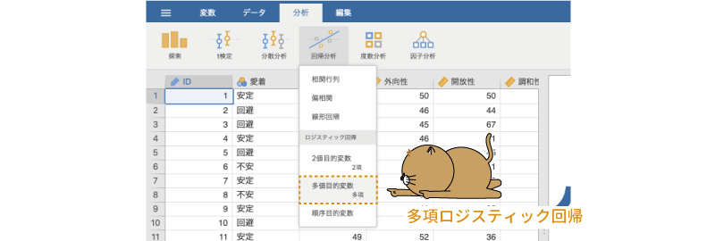
```

すると，図\@ref(fig:regression-multinomial-setting)のような分析設定画面が表示されます。分析設定画面の構成や項目は，ロジスティック回帰分析の場合とほとんど同じです。

```{r regression-multinomial-setting, fig.cap = "多項ロジスティック回帰分析の設定画面", echo = FALSE}

```

まず，「従属変数」に従属変数である「愛着」を，「共変量」に連続型予測変数である性格5因子の得点（「神経症傾向」，「外向性」，「開放性」，「調和性」，「誠実性」）を設定します（図\@ref(fig:regression-multinomial-set-variables)）。今回のサンプルデータにはありませんが，予測変数に名義型変数が含まれている場合には，それらは「因子」に設定してください。

```{r regression-multinomial-set-variables, fig.cap = "多項ロジスティック回帰分析の変数設定", echo = FALSE}
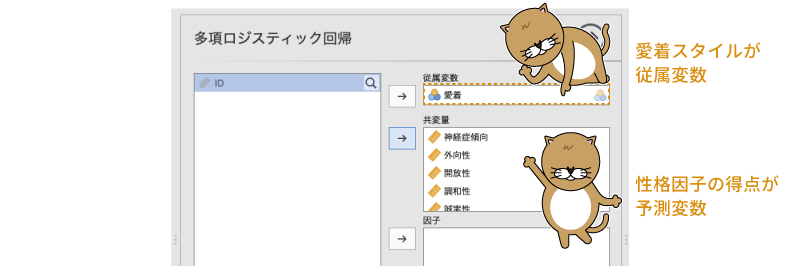
```

これで基本的な分析の設定はおしまいです。ただし，2項ロジスティック回帰の場合と同様に，多項ロジスティック回帰の場合にも従属変数のどの値を基準として結果が計算されているのかによって数値の意味が変わってきますので，`r groupbar("基準レベル")`でそれらを確認しておいたほうがよいでしょう（図\@ref(fig:regression-multinomial-reference-levels)）。


```{r regression-multinomial-reference-levels, fig.cap = "従属変数の基準レベルの確認", echo = FALSE}

```

ここでは「安定」を基準に分析することにします。もし基準レベルが違う値になっていたら，「安定」を選択して設定してください。これで分析はおしまいです。モデルの適合度指標や係数の信頼区間，検定などは2項ロジスティック回帰の場合と同じですので，ここでは説明を省略します。また，多項ロジスティック回帰の場合には，前提条件のチェック，予測，計算結果の保存の設定項目は（今のところ）ありません。

### 分析結果 {#sub:regression-multinomial-results}

結果は図\@ref(fig:regression-multinomial-results)のような形で表示されます。

```{r regression-multinomial-results, fig.cap = "多項ロジスティック分析の結果", echo = FALSE}
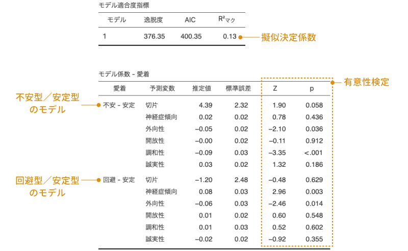
```

モデルの適合度指標として逸脱度やAIC，擬似決定係数などが算出される点は2項ロジスティック回帰の場合と同じです。また，モデル係数の表についても，基本は2項ロジスティック回帰の場合と同じです。ただし，多項ロジスティック回帰では複数のモデルについて同時に係数の推定を行いますので，係数の推定値についてはそれらのモデルごとに表示されるという点が異なります。

分析結果を見てみると，「不安型／安定型」のモデルでは「外向性」と「調和性」がそれぞれ有意に負の影響を持っていることがわかります（外向性の回帰係数は\(-\textsf{0.05}\)，調和性は\(-\textsf{0.09}\)）。このことから，外向性が低い人，調和性が低い人ほど不安型の愛着スタイルである可能性が高いといえそうです。

また，「回避型／安定型」のモデルでは「神経症傾向」と「外向性」の係数が有意で，神経症傾向はプラスの係数（0.08），外向性はマイナスの係数（\(-\textsf{0.06}\)）ですから，神経症傾向が強く外向性が低い人ほど回避型の愛着スタイルになりやすいと考えられます。

なお，この分析では「安定」型の愛着スタイルを基準として計算を行っているため，「不安」型と「回避」型の違いについてはわかりません。その違いを見たい場合には，不安型か回避型のいずれかを基準レベルとして再度分析する必要があります。


## 順序従属変数{#sec-regression-ordinal}

今度は次のサンプルデータ（[regression_data05.omv](https://github.com/sbtseiji/jmv_compguide/raw/main/data/omv/regression_data05.omv)）について考えてみましょう。このデータには，起床時の気分，睡眠時間，日中ストレス，日中の歩数が200件分記録されています（図\@ref(fig:regression-multinomial-results)）。


```{r}
data05 <- read.csv("data/regression_data05.csv")

# ID
attributes(data05$ID)$`jmv-id` <- TRUE

# 連続変数
attributes(data05$睡眠時間)$measureType <- c("Continuous")
attributes(data05$ストレス)$measureType <- c("Continuous")
attributes(data05$歩数)$measureType <- c("Continuous")

# 順序変数
data05$気分 <- factor(data05$気分, levels = c(1, 2, 3))
attributes(data05$気分)$levels <- c("悪い", "普通", "良い")
attributes(data05$気分)$values <- c(1, 2, 3)
attributes(data05$気分)$measureType <- c("Ordinal")

# 説明
attributes(data05$ID)$description <- "対象者ID"
attributes(data05$睡眠時間)$description <- "前日の睡眠時間（単位：時間）"
attributes(data05$ストレス)$description <- "日中ストレス度（1：弱〜10：強）"
attributes(data05$歩数)$description <- "1日の歩数（単位：千歩）"
attributes(data05$気分)$description <- "起床時の気分（悪い，普通，良い）"

out <- jmvReadWrite::write_omv(data05, "data/omv/regression_data05.omv", frcWrt = TRUE)

```


```{r regression-data05, fig.cap = "サンプルデータ", echo = FALSE}

```

:::{.jmvvar data-latex=""}
* `ID`　対象者ID
* `気分`　起床時の気分（悪い，普通，良い）
* `睡眠時間`　前日の睡眠時間（単位：時間）
* `ストレス`　日中ストレス度（1：弱〜10：強）
* `歩数`　1日の歩数（単位：千歩）
:::

このデータから，起床時の気分（目覚めの良さ）に影響する要因について次の回帰モデルで分析したいとしましょう。

\[
\text{気分} = b_0 + b_1 \times \text{睡眠時間} + b_2 \times \text{ストレス} + b_3 \times \text{歩数}
\]

先ほど多項ロジスティック回帰分析で使用したデータと同様に，今回も従属変数である「気分」の値は「悪い」，「普通」，「良い」の3種類です。ですので，先ほどと同様にして多項ロジスティック回帰分析を用いてもよいかもしれません。その場合，分析においては起床時の気分を名義型変数として扱うことになります。ですが，起床時の気分の「悪い」，「普通」，「良い」の3つ値にははっきりした順序性があり，これは順序型変数といえますので，ここではその順序性を損なわいよう，*順序ロジスティック回帰分析*と呼ばれる手法を用いて分析したいと思います。

### 考え方{#sub:regression-ordinal}

多項ロジスティック回帰では，従属変数の値のうち1つを基準レベルとし，それに対して他の値との間でロジスティック回帰モデルを作成して分析を行いました。順序ロジスティック回帰分析もそれとよく似た形で分析を行うのですが，従属変数の値がもつ順序性を考慮して，次のような形でモデルを作成します。

:::{.jmvgray data-latex=""}
従属変数の値が「悪い」または「普通・良い」のロジスティック回帰モデル

\[
\log\left(\displaystyle\frac{p(\text{普通・良い})}{p(\text{悪い})}\right) = b_{10} + b_1 \times \text{睡眠時間} + b_2 \times \text{ストレス} + b_3 \times \text{運動}
\]
:::

:::{.jmvgray data-latex=""}
従属変数の値が「悪い・普通」または「良い」のロジスティック回帰モデル

\[
\log\left(\displaystyle\frac{p(\text{良い})}{p(\text{悪い・普通})}\right) = b_{20} + b_1 \times \text{睡眠時間} + b_2 \times \text{ストレス} + b_3 \times \text{運動}
\]
:::

つまり，「悪い（1）」，「普通（2）」，「良い（3）」の3段階を，「1 vs. 2・3」，「1・2 vs. 3」のように，ある順序未満とそれ以上という形に2分してロジスティック回帰モデルを作成するのです。もし従属変数の値が3段階でなく4段階であれば，その場合のロジスティック回帰モデルは「1 vs. 2・3・4」，「1・2 vs. 3・4」，「1・2・3 vs. 4」というように，3つのロジスティック回帰モデルを用いて分析することになります。

このとき，順序ロジスティックモデルでは，偏回帰係数（\(b_1\)，\(b_2\)，\(b_3\)）はすべてのモデルで同じであり，それぞれのモデルで異なるのは切片（\(b_{10}\)，\(b_{20}\)）と残差のみであるという仮定のもとで回帰係数の算出を行います。このような形で計算を行うロジスティック回帰モデルは*累積ロジスティック回帰モデル*とも呼ばれます。

### 分析手順 {#sub:regression-ordinal-analysis}

順序ロジスティック回帰は，「`r infig("analysis-regression")` 回帰分析」の一番下にある「順序従属変数」を選択して実行します（図\@ref(fig:regression-ordinal-menu)）。


```{r regression-ordinal-menu, fig.cap = "順序ロジスティック回帰分析の実行", echo = FALSE}

```

順序ロジスティック回帰の設定画面は図\@ref(fig:regression-ordinal-setting)のようになっています。

```{r regression-ordinal-setting, fig.cap = "順序ロジスティック回帰分析の設定画面", echo = FALSE}
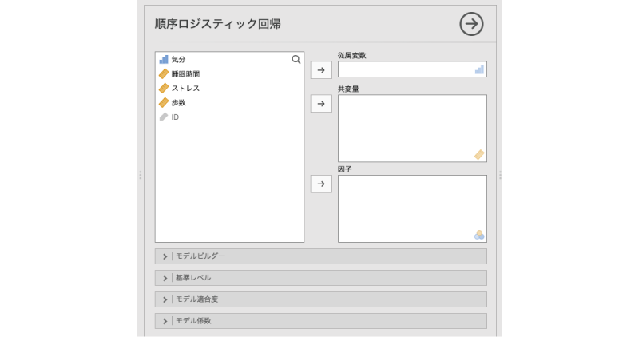
```

見てわかるように，設定画面の構成や項目は他のロジスティック回帰とほとんど同じです。そのため，ここでは順序ロジスティック回帰に固有の部分を中心に説明していくことにします。それ以外の設定項目については，2項ロジスティック回帰や多項ロジスティック回帰のところを参照してください。

設定画面の「従属変数」に従属変数（「気分」）を，「共変量」に連続型の予測変数を設定すれば分析の基本設定は終了です（図\@ref(fig:regression-ordinal-set-vars)）。名義型の予測変数がある場合は，それらは「因子」に設定してください。

```{r regression-ordinal-set-vars, fig.cap = "順序ロジスティック回帰分析の分析設定", echo = FALSE}
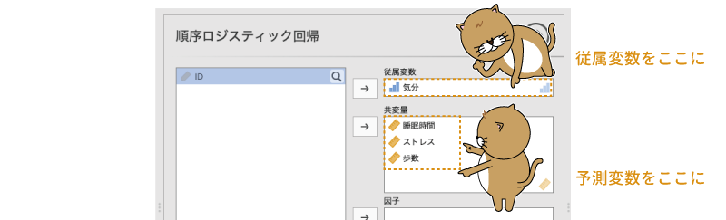
```

### 分析結果 {#sub:regression-ordinal-results}

順序ロジスティック回帰の結果は，図\@ref(fig:regression-ordinal-results)のような形で表示されます。

```{r regression-ordinal-results, fig.cap = "順序ロジスティック回帰分析の結果", echo = FALSE}

```

図\@ref(fig:regression-ordinal-results)を見てわかるように，モデル適合度の表とモデル係数の表の形式や内容も，2項ロジスティック回帰や多項ロジスティック回帰の場合とほぼ同じです。モデル適合度の表には逸脱度や擬似決定係数が，モデル係数の表には各予測変数の回帰係数の推定値や，その係数が0でないかどうかのz検定の結果が示されます。この結果をみると，起床時の気分に有意に影響を与えているのは「歩数」のみです。「歩数」の回帰係数はプラスの値ですので，日中たくさん歩いた場合ほど起床時の気分が良くなるといえそうです。

#### モデルの閾値 {-}

順序ロジスティック回帰では，多項ロジスティック回帰の場合と同様に複数のロジスティック回帰モデルを用いて分析を行っていますが，多項ロジスティック回帰のように複数の回帰係数が表示されることはありません。考え方のところでも説明したように，順序ロジスティック回帰では，すべてのモデルで偏回帰係数が共通であるという前提で分析を行うからです。

また，順序ロジスティック回帰のモデル係数の表には切片の推定値が含まれていません。この分析における切片の推定値を表示させるには，分析設定画面の`r groupbar("モデル係数")`の「**閾値**」ところで「モデルの閾値」にチェックを入れます（図\@ref(fig:regression-ordinal-thresholds)）。

```{r regression-ordinal-thresholds, fig.cap = "モデルの切片を表示させる", echo = FALSE}

```

すると，図\@ref(fig:regression-ordinal-thresholds-table)のように各モデルの切片の値のみをまとめた表が表示されます。

```{r regression-ordinal-thresholds-table, fig.cap = "順序ロジスティック回帰モデルの切片", echo = FALSE}

```

これらの結果を元にして，最初に示した回帰モデルに切片と係数の値を示すと次のようになります。


\begin{eqnarray*}
\small{\log\left(\displaystyle\frac{p(\text{普通・良い})}{p(\text{悪い})}\right)} & = & \small{0.28 + 0.16 \times \text{睡眠時間} + (-0.17) \times \text{ストレス} + 0.21 \times \text{歩数}}\\
\small{\log\left(\displaystyle\frac{p(\text{良い})}{p(\text{悪い・普通})}\right)} & = & \small{2.64 + 0.16 \times \text{睡眠時間} + (-0.17) \times \text{ストレス} + 0.21 \times \text{歩数}}
\end{eqnarray*}


また，各モデルの閾値（切片）の推定値についての検定では，「普通 | 良い」は有意ですが「悪い | 普通」は有意ではありませんでした。これは，「普通 | 良い」つまり「普通以下（悪い・普通）」と「良い」の区別はできていても，「悪い」と「普通以上（普通・良い）」の区別はできていないということです。

これらの結果を総合すると，日中にたくさん歩くことは起床時の気分の良さにつながるけれども，歩かなかったからといって起床時の気分が悪くなるわけではないということになります。
