```{r, echo =F,message=FALSE}
source('rscripts/_utility.R')


DANJO<-factor(rep(c('M','F'),each=3),levels = c('M','F'))
CAKE<-factor(rep(c('SHORT','CHEESE','CHOCO'),2),levels = c('SHORT','CHEESE','CHOCO'))
COUNT<-c(49,37,14,31,48,21)

attributes(DANJO)$measureType<-c('Nominal')
attributes(CAKE)$measureType<-c('Nominal')
attributes(COUNT)$measureType<-c('Continuous')

data03<-data.frame(DANJO,CAKE,COUNT)

out<-jmvReadWrite::jmvWrite(data03,'data/omv/frequencies_data03.omv')

```

# Frequencies：度数分析 {#ch:frequencies}


この章では，「`r infig('analysis-frequencies')` Frequencies（度数分析）」ツールについて見ていきます。jamoviの基本構成では，ここには次の分析メニューが含まれています（図\@ref(fig:frequencies-menu)）。

```{r frequencies-menu, fig.cap='Frequencies（度数分析）のメニュー', echo=FALSE}
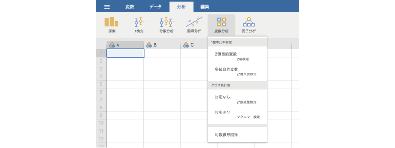
```

:::{.jmvmenu data-latex=""}
+ **One Sample Proportion Tests**（1標本比率検定）
  - 2 Outcomes [Binomial test]（2値：2項検定）
  - N Outcomes [$\chi^{2}$ Goodness of fit]（多値：カイ2乗適合度検定）
+ **Contingency Tables**（分割表）
  - Independent Samples [$\chi^{2}$ test of association]（対応なし標本の独立性検定）
  - Paired Samples [McNemar test]（対応あり標本のマクニマー検定）
+ その他
  - Log-Linear Regression（対数線形回帰）
:::
  
これらの分析メニューは，いずれも観測データの度数や比率について分析を行うものです。分析メニューは，1標本の検定と*クロス集計表*（*分割表*）の検定に分けられています。また，それらとは別に「Log-Linear Regression（対数線形回帰）」のメニューも用意されています。「回帰」という名前がついていますが，これも度数に関する分析手法の1つです。

## 2 Outcomes [Binomial test]：2項検定 {#sec:frequencies-binomial}

とりうる値が「はい・いいえ」のように2種類しか存在しない*2値変数*について，その値の「はい・いいえ」の比率が基準の比率，または想定される比率と同じかどうかを確かめたい場合には，*2項検定*と呼ばれる検定方法が用いられます。

jamoviでは，従来型の一般的な方法による2項検定の他に，ベイズ統計の考え方を用いた検定を実施することも可能です。


### 考え方 {#sub:frequencies-binomial-basics}

次の例について考えてみましょう。同月齢の80人の幼児を対象としてある認知課題を実施しました。この課題は，この月齢の幼児では通過率70%といわれてきたのですが，今回の実施で課題を通過したのは80人中46人（通過率57.5%）でした（表\@ref(tab:frequencies-table-pf)）。この課題の通過率は，本当に70%なのでしょうか。


```{r, frequencies-table-pf}
  data <-data.frame(
    x=c(46,34,46+34),
    y=c(paste(round(46/(46+34)*100,1),'%',sep=''),
          paste(round(34/(46+34)*100,1),'%',sep=''),
                '100%')
  )
  row.names(data)<-c('通過','非通過','計')
  names(data)<-c('人数','%')
  
  data %>% kable(align='ccc', caption = '認知課題の通過率', booktabs=T) %>%
    pack_rows('結果',1,2) %>%
    kable_styling(latex_options = "HOLD_position")
```


この例のように，測定値のとりうる値が「通過」または「非通過」の2とおりしかない場合，そのデータにおける「通過」または「非通過」の比率がどのように分布するかは，*2項分布*と呼ばれる確率分布を用いて確率的に求めることができます。

たとえば，この課題の通過率が実際に70%だったとしたとき，無作為に選んだ80人を対象とした調査で80人のうちの70%，つまり56人が課題に通過する確率は，2項分布を用いて計算すると0.0969...で，約9.7%の確率です^[2項分布の計算式やその具体的な計算方法については本書では省略します。統計法の教科書などを参照してください。]。これは一見すると低いようにも感じられますが，全体（母集団）における比率が70%だからといって，そこから抽出した標本で毎回70%ちょうどになるわけではありません。それより1人少ない55人の場合や1人多い57人の場合を含めて考えてみると，80人中55人が通過する確率は0.093（9.3%），80人中57人なら0.095（9.5%）ですので，課題の通過者が80人中55〜57人になる場合であれば28%程度の確率で生じうるわけです。

先ほどは説明のために70%ちょうどの56人から前後1人の幅で考えましたが，実際の場面ではこれよりもっとばらつくことは普通にあるでしょう。極端な話，80人全員が課題に通過する場合や，その逆に全員が通過できない場合というのも，非常にまれなことには違いないですが，確率的には0ではありません。

そこで，母集団における通過率が70%である場合に，80人の標本で通過者が0人である場合から80人である場合までのすべての場合について確率を算出し，それを図示したのが図\@ref(tab:frequencies-binomial-distribution)です。

```{r frequencies-binomial-distribution, fig.cap='母集団における通過率が70％の場合の確率の分布', echo=FALSE}
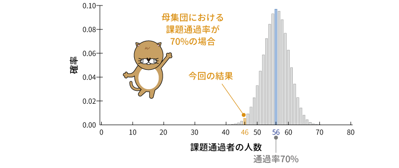
```

さすがに通過者が0人の場合や80人の場合というのは確率的には数値が小さすぎてグラフ上では0になってしまいますが，こうしてみると，母集団における通過率が70%の場合に，今回の結果のように通過者が46人になるというケースはそれなりにありうることだというのがわかります。とはいえ，今回の結果と同じか，あるいはそれよりも極端な結果になる確率というのはかなり小さく，確率的に見てまれな出来事であることには違いありません。

このように，2項検定では想定される比率をもつ母集団から標本データで得られた比率（およびそれより極端な比率）が得られる確率がどの程度であるかを算出します。そして，その確率が有意水準よりも小さい場合に，想定される母集団における比率と標本データの母集団の比率が有意に異なると判断します。

### 分析手順 {#sub:frequencies-binomial-procedure}

分析に入る前に，先ほどの調査結果を次のようにスプレッドシートに入力しましょう（図\@ref(tab:frequencies-data01)）。なお，人数は実際には連続変数ですが，分析の都合上，ここでは「名義型（`r infig('variable-nominal')` Nominal）」として設定してください。

<!-- -->
```{r frequencies-data01, fig.cap='サンプルデータ', echo=FALSE}

```

:::{.jmvvar data-latex=""}
+ `結果`　課題の結果（通過，非通過）
+ `人数`　通過・非通過の人数（通過：46人，非通過：34人）
:::


それでは分析です。2項検定は，Analysesタブの「`r infig('analysis-frequencies')` Frequencies（度数分析）」で「One Sample Proportion Tests（1標本比率検定）」のところにある「2 Outcomes [Binomial test]（2値：2項検定）」を選択して実行します（図\@ref(fig:frequencies-binomial-menu)）。

<!-- -->
```{r frequencies-binomial-menu, fig.cap='2項検定の実行', echo=FALSE, out.extra = ""}
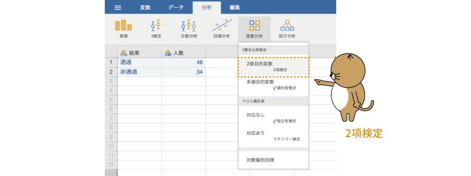
```

すると，図\@ref(fig:frequencies-binomial-setting)のような画面が表示されます。

```{r frequencies-binomial-setting, fig.cap='2項検定の設定画面', echo=FALSE}

```

:::{.jmvsettings data-latex=""}
+ Values are counts（値を度数として処理）　度数が入力されている変数で分析を行う場合に使用します。
+ Test value（検定値）　比較対象に使用する比率を指定します。
+ **Hypothesis**（仮説）　検定の対立仮説に関する設定を行います。
  - ≠ Test value　比率が検定値と異なるかどうかを検定します（両側検定）
  - &gt; Test value　比率が検定値より大きいかどうかを検定します（片側検定）
  - &lt; Test value　比率が検定値より小さいかどうかを検定します（片側検定）
+ **Additinal Statistics**（追加の統計量）　追加の統計量に関する設定を行います。
  - Confidence intervals（信頼区間）　比率の信頼区間を算出します。
+ `r groupbar('Bayesian Statistics')`（ベイズ統計量）　ベイズ統計の手法を用いて検定する場合の設定項目です。
:::


ここで，図\@ref(fig:frequencies-binomial-set-var)のように設定を行います。まず，「人数」を選択して右側に移動してください。下のアイコンを見てもらえばわかるように，この欄には，名義型（`r infig('variable-nominal')`）か順序型（`r infig('variable-ordinal')`）の変数でなければ移動することができません。先ほど「人数」を名義型に設定したのはこのためです。

```{r frequencies-binomial-set-var, fig.cap='2項検定の分析設定', echo=FALSE}

```

また，今回の分析データでは，課題通過者，非通過者の人数（度数）をデータとして入力してありますので，「Values are counts（値を度数として処理）」にチェックを入れます。各対象者の「通過・非通過」の結果が1行ずつ入力されている場合には，このチェックは必要ありません。

それから，今回の仮説では，「この課題の通過率は70%（0.7）である」というのが正しいといえるかどうかを確かめたいので，「Test value（検定値）」の値は「0.7」に設定します。

基本の設定はこれで終了ですが，それ以外の設定項目についてもここで見ておきましょう。

#### Hypothesis：仮説 {-}

「**Hypothesis**（仮説）」では，検定に使用する対立仮説の設定を行います。

:::{.jmvsettings data-latex=""}
+ ≠ Test value　比率が検定値と異なるかどうかを検定します（両側検定）
+ &gt; Test value　比率が検定値より大きいかどうかを検定します（片側検定）
+ &lt; Test value　比率が検定値より小さいかどうかを検定します（片側検定）
:::

今回のデータでは，想定される母集団の比率どおりであれば80&times;0.7 = 56，課題通過者は46人なので，仮説は「&lt; Test value」にすべきではないかと思う人もいるかもしれません。ですが，統計的仮説検定の仮説はデータを見る前に設定するものなので，その場合，観測データで通過率が0.7より高いか低いかは見当がつきません。そこで，ここでの検定における対立仮説は「≠ Test value」で両側検定とします。

#### Additional Statistics：追加の統計量{-}

また，「**Additional Statistics**（追加の統計量）」の部分では，信頼区間を算出するかどうかの設定を行います。今回はこの設定は使用しませんが，信頼区間を算出したい場合は「Confidence intervals（信頼区間）」の部分にチェックを入れてください。

### 分析結果 {#sub:frequencies-binomial-results}

それでは結果を見てみましょう。分析結果は，図\@ref(fig:frequencies-binomial-results)のような形で示されます。

```{r frequencies-binomial-results, fig.cap='2項検定の分析結果', echo=FALSE}

```

課題通過者の人数，非通過者の人数という集計結果をデータとして分析を行った場合，結果にはどちらが「通過」でどちらが「非通過」なのかは示されませんので，結果を見る際には注意してください。結果には，スプレッドシートに入力した順に**Level**（水準）欄に「1」，「2」として表示されます。分析に使用したデータでは1行目に通過者の人数，2行目に非通過者の人数を入力しましたので，この結果では水準が「1」の方が通過者です。

分析結果には，通過者の比率と非通過者の比率のそれぞれについての分析結果が示されますが，ここで見る必要があるのは通過者の比率（**Level**が「1」の行）の結果のみです。

この分析結果ではp=0.020ですので，80人中46人が通過（通過率57.5%）という比率は，想定される通過率70%とは有意に異なるということがいえます。

### ベイズ統計量 {#sub:frequencies-binomial-bayes}

すでに分析結果は得られましたが，jamoviの2項検定では*ベイズ統計*の考え方を用いた検定も可能ですので，その方法についても見ておくことにしましょう。

まず，先ほどの分析結果をクリックして，2項検定の分析設定画面を開いてください。設定画面の`r groupbar('Baysian Statistics')`（ベイズ統計量）を展開すると，以下の設定項目が表示されます（図\@ref(fig:frequencies-binomial-bayes-setting)）。

```{r frequencies-binomial-bayes-setting, fig.cap='ベイズ統計量の設定画面', echo=FALSE}

```

:::{.jmvsettings data-latex=""}
+ **Prior**（事前分布）
  - a parameter（パラメータa）　ベータ分布のaを設定します。
  - b parameter（パラメータb）　ベータ分布のbを設定します。
+ **Plots**（作図）
  - Posterior plot（事後分布プロット）　事後分布を図示します。
+ **Statistics**（統計量）
  - Bayes factor（ベイズ因子）　ベイズ因子を算出します。
  - Credible intervals（信用区間）　ベイズ信用区間（確信区間）を算出します。
:::

#### Prior：事前分布{-#subsub:frequencies-binomial-bayes-prior}

ベイズ統計の詳細についてはベイズ統計の教科書を参照して欲しいと思いますが，ベイズ統計では，分析対象についての確率分布をあらかじめ設定し，その分布に対して観測データを与えて分析結果を得るという手順で分析を実施します。この際，分析対象についてあらかじめ設定する分布のことを*事前分布*と呼びます。`r groupbar('Baysian Statistics')`の「**Prior**（事前分布）」の部分は，この事前分布についての設定です。

jamoviの2項検定では，分析の事前分布として*ベータ分布*と呼ばれる確率分布を使用することができます。このベータ分布は，aとb（またはαとβ）という2つの*パラメータ*^[分布の形状を決める値のことです。2項分布では試行数nと確率pが，正規分布では平均値と分散（または標準偏差）がパラメータとなります。]をもち，この2つの値の設定の仕方によって，じつにさまざまな形状の分布を表現することが可能です。そして，このベータ分布のパラメータaの値を「a parameter」の入力欄に，パラメータbの値を「b parameter」の入力欄に入力します。

しかし，パラメータの値を2つ入力してください，といわれても，どんな値を入力したらよいのか検討もつきませんね。すでに先行研究や予備調査などで分析対象のおおよその分布がわかっている場合には，事前分布がその形状になるようにaとbを設定することになりますが，そうでない場合，一般には特別な情報をもたない分布を事前分布として使用するという方法が用いられます。そしてその場合，もっとも一般に用いられる分布が*一様分布*と呼ばれる分布です。

この一様分布は，「サイコロの1から6の目が出る確率はすべて1/6で等しい」というように，どのような結果になる確率もすべて同率で等しいとする分布です。ベータ分布では，「a = b = 1」の場合にこの一様分布が得られます。jamoviの分析画面では，「a parameter」も「b parameter」も初期設定値は「1」になっていますが，それはこのような理由からです。ここでは「実際の課題通過率」に関して特別な仮説は持ち合わせていませんので，初期設定値どおり，aもbも「1」のままにしておきましょう。

#### Statistics：統計量{-#subsub:frequencies-binomial-bayes-statistics}

次に設定するのは「**Statistics**（統計量）」の部分です。ここの「Bayes factor（ベイズ因子）」の部分にチェックを入れない限り，ベイズ統計による分析結果は表示されません。ですので，「Bayes factor」にチェックを入れておきましょう。

その下の「Credible intervals（信用区間）」は，*ベイズ信用区間*あるいは*確信区間*と呼ばれる，ベイズ統計の考え方にそった区間推定値を算出するための設定です。名前はよく似ていますが，従来型の推測統計における「信頼区間」とは別物ですので注意してください。ここでは，この設定はオフのままにしておきます。

ここまでの設定が終わったところで分析結果を見てみると，先ほどの結果の表の右端に，「**Bayes factor$_{10}$**」という欄が追加されているはずです（図\@ref(fig:frequencies-binomial-bayes-results)）。

```{r frequencies-binomial-bayes-results, fig.cap='ベイズ因子の計算結果', echo=FALSE}
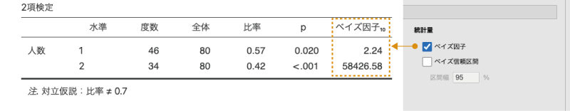
```

ベイズ統計の場合も，分析結果の表で見る必要があるのは課題通過者についての行（**Level**が1の行）だけです。この行のベイズ因子の値は2.24で，これは対立仮説が正しい場合の確率が，帰無仮説が正しい場合の確率に比べて2.24倍大きいということを意味しています。

このベイズ因子の大きさの解釈については，複数の研究者によってさまざまな目安が提供されていますが，そのうちの1つ，[Kass &amp; Raftery (1995)](https://www.tandfonline.com/doi/abs/10.1080/01621459.1995.10476572)^[
Kass, R. E. &amp; Raftery, A. E. (1995). Bayes Factors. <i>Journal of the American Statistical Association, 90</i>, 773&ndash;795. doi:10.1080/01621459.1995.10476572]では，表\@ref(tab:frequencies-binomial-bayes-factor-interpretation)のように示されています。一般には，この値（\(\textsf{Bayes factor}_{10}\)）が3を超える場合に，対立仮説を支持する証拠があるとみなされることが多いようです。


```{r, frequencies-binomial-bayes-factor-interpretation}
bayes.bf10 %>% 
  kable(align="cc", caption = "ベイズ因子の解釈の目安",booktabs=T)%>%
  kable_styling(latex_options = "HOLD_position")
```

今回の分析結果ではベイズ因子は2.24でしたので，対立仮説を支持する証拠としては弱いものです。つまり，この分析結果からは，「課題の通過率は70％ではない」とはまではいえないことになります。

#### Plots：作図{-#subsub:frequencies-binomial-bayes-plots}

最後に，「**Plots**（作図）」の設定についても見ておきましょう。この「Posterior plot（事後分布プロット）」にチェックを入れると，課題通過と非通過のそれぞれについて，事前分布，尤度，事後分布を示したグラフが表示されます（図\@ref(fig:frequencies-binomial-bayes-posterior)）。ここでは，課題通過の場合についてのプロットを見てみましょう。

```{r frequencies-binomial-bayes-posterior, fig.cap='課題通過率についての事前・事後分布のグラフ', echo=FALSE}

```

このグラフの横軸には通過率，縦軸には*確率密度*が示されています。確率密度というのは確率とはまた別物なのですが，ここでは大まかに確率の高さを表していると考えてもらって構いません。少し見づらいですが，グラフ中の青の点線が事前分布（一様分布）で，黄色の曲線が事後分布です。

このグラフを見ると，0.575周辺での確率がもっとも高く，そこから離れるにつれて確率が低くなっていくのがわかります。これは，80人中46人が課題通過というデータが得られた場合に，その母集団における通過率（母比率）は0.575周辺である可能性がもっとも高く，それより離れた値である可能性は低いということを示しているのです。

この事後分布のグラフでは，母集団における通過率が0.7である可能性というのは実際にはかなり低いことがわかります。ただし，先ほど分析結果でみたベイズ因子の値が示す限りでは，この程度であっても「この標本の母集団における通過率は70%ではない」というには証拠としてまだ弱いのです。

## N Outcomes [χ² Goodness of fit]：カイ2乗適合度検定{#sec:frequencies-n-outomes}

変数のとりうる値が「はい・いいえ」や「あり・なし」のような2値でなく，3つ以上ある場合で，各変数値（カテゴリ）の比率について検定したい場合には，*カイ2乗適合度検定*と呼ばれる手法が用いられます。

### 考え方{#sub:frequencies-n-outomes-basics}

次の例について考えてみましょう。

人の学習スタイルを大きく「視覚型（映像やイメージを利用した学習を好むスタイル）」，「聴覚型（音声を利用した学習を好むスタイル）」，「運動感覚型（運動や動作を用いた学習を好むスタイル）」の3とおりに分類したとすると，その一般的な比率は視覚型が65%，聴覚型が30%，運動感覚型が5%程度なのだそうです。

ここで，ある地域で小学生児童150人を無作為に選び，その児童の学習スタイルの判定を行ったところ，表\@ref(tab:frequencies-chisq-table1)の結果が得られました。この地域の小学生における学習スタイルの比率は，一般的な比率とは異なっているのでしょうか。


```{r, frequencies-chisq-table1}
  data.observed <-data.frame(
    '視覚型'=c(89,'59.3%'),
    '聴覚型'=c(48,'32.0%'),
    '運動感覚型'=c(13,'8.7%')
  )
  row.names(data.observed)<-c('人数','%')

  data.observed %>% 
    kable(align='ccc', caption = '学習スタイルの度数分布', booktabs=T) %>%
    add_header_above(header = c(' '=1,'学習スタイル'=3)) %>%
    kable_styling(latex_options = "HOLD_position")
```


まず，この結果が想定される比率と異なるかどうかを見るためには，想定される比率の場合にどのような人数配分になるのかを知る必要があります。そこで，測定結果が想定される比率どおりであった場合に，それぞれのタイプの児童が何人ずつになると考えられるのかを考えてみましょう。一般的な比率が視覚型が65%，聴覚型が30%，運動感覚型が5%であるとした場合，150人の児童をこの比率に割り振ると表\@ref(tab:frequencies-chisq-table2)のようになります。


```{r, frequencies-chisq-table2}
  data.expected <-data.frame(
    '視覚型'=c(97.5,'65%'),
    '聴覚型'=c(45,'30%'),
    '運動感覚型'=c(7.5,'5%')
  )
  row.names(data.expected)<-c('人数','%')

  data.expected %>% 
    kable(align='ccc', caption = '学習スタイルの期待度数', booktabs=T) %>%
    add_header_above(header = c(' '=1,'学習スタイル'=3)) %>%
    kable_styling(latex_options = "HOLD_position")
```


このような，想定される比率どおりに全体の人数を割り振った値は*期待度数*と呼ばれます。人数なのに「97.5人」と小数点を含む値になっているのは変だと思うかもしれませんが，これはあくまでも理論上の数値ですので，これで問題ありません。

そして，この状態と実際の観測データにおける人数（これを*観測度数*といいます）が異なるかどうかを知りたいわけですから，この期待度数と観測度数がどれだけずれているか，両者の差を求めてみます（表\@ref(tab:frequencies-chisq-table3)）。

```{r, frequencies-chisq-table3}
  data.diff <-as.numeric(data.observed[1,])-as.numeric(data.expected[1,])
  data.diff <-rbind(data.observed[1,],data.expected[1,],data.diff)
  row.names(data.diff)<-c('観測度数','期待度数','差：観測 − 期待')

  data.diff %>% 
    kable(align='ccc', caption = '期待度数と観測度数のずれ', booktabs=T) %>%
    add_header_above(header = c(' '=1,'学習スタイル'=3)) %>%
    kable_styling(latex_options = "HOLD_position")
```

こうしてみると，それぞれのスタイルで観測度数と期待度数にずれがあることがわかります。なお，観測度数も期待度数も合計人数は150人で同じですから，期待度数と観測度数のずれがあるということは，この2つの間で3つのスタイルの比率が異なっているということです。

そこで，このようにして求めた各スタイルにおける観測度数と期待度数のずれの大きさを1つの値にまとめ，その値を用いて観察された結果と想定される比率の間に差があるといえるかどうかを判断しようとするのがカイ2乗適合度検定の考え方です。

なお，それぞれのスタイルにおけるずれの大きさを1つの値にまとめる際，「ずれの大きさ」の値がマイナスというのは扱いづらいですので，ずれの値は2乗してマイナスが取り除かれます。また，97.5人いることが期待される視覚型と7.5人しかいないことが期待される運動感覚型とでは「1人のずれ」の大きさがもつ意味合いが同じとはいえません。そこで，これら2乗したずれの値をさらに期待度数の大きさで調整してから合計することによって，全体的なずれの大きさが求められます。このようにして求めた値は，$\chi^2$（カイ2乗）と呼ばれる値の分布に近似的に従うことがわかっています。

そこで，$\chi^2$分布を利用して，帰無仮説（母集団の比率と想定される比率の差は0である）のもとでその大きさのずれが生じる確率を計算します。そして，その確率が有意水準未満であった場合に，「母集団の比率と想定される比率は有意に異なる」と判断するのです。

### 分析手順{#sub:frequencies-n-outcomes-procedure}

2項検定の場合と同様に，まずは分析用のデータを作成しましょう。先ほどの調査結果を，スプレッドシートに次のように入力してください（図\@ref(fig:frequencies-data02)）。


<!-- -->
```{r frequencies-data02, fig.cap='サンプルデータ', echo=FALSE}

```

:::{.jmvvar data-latex=""}
+ `スタイル`　学習スタイル（視覚型：`視覚`，聴覚型：`聴覚`，運動感覚型：`運動`）
+ `人数`　各スタイルの人数（視覚：89，聴覚：48，運動：13）
:::

データの入力が終わったら早速分析しましょう。カイ2乗適合度検定を実施するには，Analysesタブの「`r infig('analysis-frequencies')` Frequencies（度数分析）」で「One Sample Proportion Tests（1標本比率検定）」のところにある「N Outcomes [$\chi^2$ Goodness of fit]（多値：カイ2乗適合度検定）」を選択します（図\@ref(fig:frequencies-n-outcomes-goodness)）。


```{r frequencies-n-outcomes-goodness, fig.cap='適合度検定の実行', echo=FALSE}
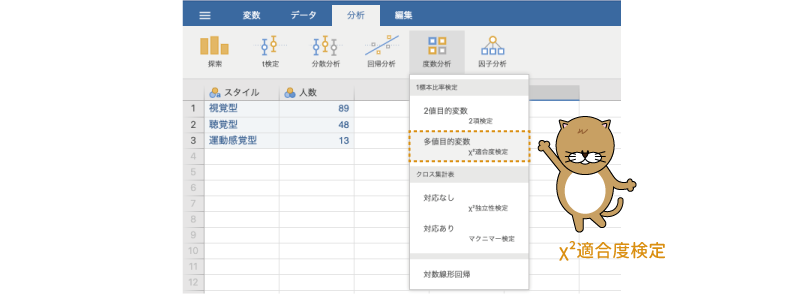
```

すると，図\@ref(fig:frequencies-n-outcomes-goodness-setting)のような設定画面が表示されます。

```{r frequencies-n-outcomes-goodness-setting, fig.cap='適合度検定の設定画面', echo=FALSE}
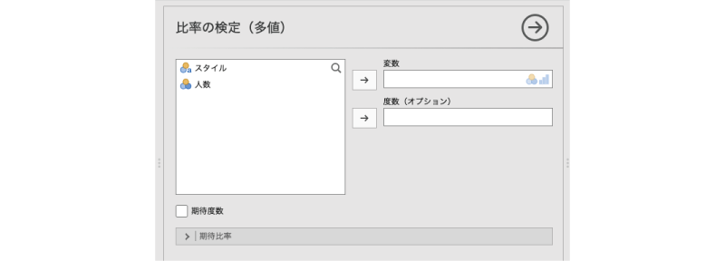
```

:::{.jmvsettings data-latex=""}
+ Variable（変数）　分析対象の変数を設定します。
+ Counts (optional)（度数）　データが度数として入力されている場合に設定します。
+ Expected counts（期待度数）　期待度数を算出します。
+ `r groupbar('Expected Proportions')`（期待比率）　比較対象となる比率を設定します。
:::


この画面で，「スタイル」を「Variable（変数）」に移動します（図\@ref(fig:frequencies-n-outcomes-goodness-set-var)）。

```{r frequencies-n-outcomes-goodness-set-var, fig.cap='分析対象の変数を設定', echo=FALSE}

```

なお今回のデータは，2項検定のサンプルデータと同じく，すでに集計済みの度数が入力されています。「スタイル」には，視覚型，聴覚型，運動感覚型の値は1つずつしか含まれていませんので，このままではうまく分析できません。

そこで，各スタイルの度数が入った変数（「人数」）を「Counts (optional)（度数）」のところへ移動して，jamoviがそれぞれのスタイルの人数を認識できるようにします（図\@ref(fig:frequencies-n-outcomes-goodness-set-count)）。この操作は，集計済みでないデータ（各個人の値が1行ずつ入力されているデータ）の場合には必要ありません。

```{r frequencies-n-outcomes-goodness-set-count, fig.cap='各スタイルの度数を設定', echo=FALSE}

```

これで分析の設定は終わりですといいたいところですが，このままではどのような比率とデータを比較するのかがわかりません。そのままでは適切な分析結果が得られませんので，比較対象となる比率を設定してやる必要があります。


### Expected Proportions：期待比率 {#sub:frequencies-n-outcomes-expected-proportions}

比較対象となる比率を設定するには，`r groupbar('Expected Prportions')`（期待比率）を展開し，各変数値の「Ratio（比）」のところに適切な数値を入力します（図\@ref(fig:frequencies-n-outcomes-goodness-proportion)）。

```{r frequencies-n-outcomes-goodness-set-proportion, fig.cap='各スタイルの度数を設定', echo=FALSE}

```

今回の例では，期待される割合は視覚型が65%，聴覚型が30%，運動型が5%ですので，「視覚」のRatioに「65」，「聴覚」に「30」，「運動」に「5」を入力します。すると，その右の「Proportion（比率）」欄に，それぞれの型の比率が表示されます。入力の際には「Level（水準）」欄をよく確認し，入力する行を間違えないように注意しましょう。

なお，今回は使用しませんが，この設定を行ったあとに，`r groupbar('Expected Prportions')`のすぐ上にある「Expected counts（期待度数）」にチェックを入れると，指定した比率における期待度数を結果に表示させることができます。


これで分析の設定は終了です。

### 分析結果{#sub:frequencies-n-outcomes-results}

カイ2乗適合度検定の結果は次のような形で表示されます（図\@ref(fig:frequencies-n-outcomes-goodness-results)）。

```{r frequencies-n-outcomes-goodness-results, fig.cap='適合度検定の分析結果', echo=FALSE}

```

結果の1つ目の表は，観測データについての度数分布表です。今回は集計された度数をデータとして入力しましたが，1人1人の値が入力されているデータで分析を行う場合には，この度数分布表で各水準（変数値）の度数をよく確認しておきましょう。

その下の2つ目の表が適合度検定の結果です。適合度検定の結果の表には，検定統計量（$\chi^2$）と自由度（**df**），そして有意確率（**p**）の値が示されています。この表のpの値が有意水準を下回る場合に，このデータの母集団の比率が想定される比率と有意に異なると判断します。

今回の分析結果ではp=0.083ですので，このデータ（小学生児童150人）の母集団における比率は，想定されている比率と有意に異なるとはいえません。

## Independent Samples [χ² test of association]：対応なし標本（独立性検定）{#sec:frequencies-chisq}

ここからは**クロス集計表**（分割表）の分析についてみていきましょう。クロス集計表とは，行と列にそれぞれ異なる変数をとり，次のようにして複数の変数の値を組み合わせた形で集計をした表のことをいいます（表\@ref(tab:frequencies-chisq-salad-table)）。

<!-- -->
```{r, frequencies-chisq-salad-table}
  data.salada<-data.frame(
    x= c(70,90,160),
    y= c(30,10,40),
    z= c(100,100,200)
  )
  names(data.salada)<-c('好き','嫌い','計')
  row.names(data.salada)<-c('男','女','計')

  data.salada %>% kable(align='ccc', caption = '性別とサラダの好き嫌いについてのクロス集計表', booktabs=T) %>%
    add_header_above(header = c(' '=1,'サラダ'=2,' '=1)) %>%
    pack_rows('性別',1,2) %>%
    kable_styling(latex_options = "HOLD_position")# %>%

```


このようなクロス集計表を用いた分析では，表の列に位置する変数と行に位置する変数が互いに「独立」であるかどうかを確かめる*独立性検定*がよく用いられます。2つの変数が「互いに独立」であるとは，お互に無関係であるということです。

たとえば，先ほどの表\@ref(tab:frequencies-chisq-salad-table)はサラダの好き嫌いと性別（男女）のクロス集計表ですが，この表を見ると，サラダが嫌いという回答の比率は，女性よりも男性の方が高くなっています。この場合，サラダを嫌いと答えたのは男性で100人中30人，女性では100人中10人というように，性別によってサラダの好き嫌いに違いが見られるので，サラダの好き嫌いと性別には関連があるということになります。

これに対し，次の表\@ref(tab:frequencies-chisq-hamburg-table)では，男性と女性でハンバーグを好きだと答えた人と嫌いだと答えた人の比率は同じです。この場合には，ハンバーグの好き嫌いが性別によって異なるということはなく，ハンバーグの好き嫌いと性別は無関係（独立）であるといえます。

```{r, frequencies-chisq-hamburg-table}
  data.hamburg<-data.frame(
    x= c(95,95,190),
    y= c(5,5,10),
    z= c(100,100,200)
  )
  names(data.salada)<-c('好き','嫌い','計')
  row.names(data.salada)<-c('男','女','計')

  data.salada %>% kable(align='ccc', caption = '性別とハンバーグの好き嫌いについてのクロス集計表', booktabs=T) %>%
    add_header_above(header = c(' '=1,'ハンバーグ'=2,' '=1)) %>%
    pack_rows('性別',1,2) %>%
    kable_styling(latex_options = "HOLD_position")# %>%

```


### 考え方 {#sub:frequencies-chisq-basics}

ここでは，次の例を用いて独立性検定の考え方を見ていきましょう。

成人男女各100人を対象に，「ショートケーキ」，「チーズケーキ」，「チョコレートケーキ」の中でどれが一番好きかを選んでもらいました。その結果をまとめたものがこのサンプルデータ（[frequencies_data03.omv](data/omv/frequencies_data03.omv)）です（図\@ref(fig:frequencies-data03)）。

```{r}
fq.data03<-read.csv('data/frequencies_data03.csv')

# ID
#attributes(data01$ID)$`jmv-id`<-TRUE

# 連続変数
attributes(fq.data03$人数)$measureType<-c('Continuous')

# 名義変数
fq.data03$性別<-factor(fq.data03$性別)
attributes(fq.data03$性別)$measureType<-c('Nominal')
attributes(fq.data03$性別)$levels<-c('男','女')
attributes(fq.data03$性別)$values<-c(1,2)
attributes(fq.data03$性別)$measureType<-c('Nominal')

fq.data03$ケーキ<-factor(fq.data03$ケーキ)
attributes(fq.data03$ケーキ)$measureType<-c('Nominal')
attributes(fq.data03$ケーキ)$levels<-c('ショート','チーズ','チョコ')
attributes(fq.data03$ケーキ)$values<-c(1,2,3)
attributes(fq.data03$ケーキ)$measureType<-c('Nominal')

out<-jmvReadWrite::jmvWrite(fq.data03,'data/omv/frequencies_data03.omv')

```


<!-- -->
```{r frequencies-data03, fig.cap='サンプルデータ', echo=FALSE}

```


:::{.jmvvar data-latex=""}
+ `性別`　性別（男，女）
+ `ケーキ`　ケーキの種類
  - ショートケーキ：`ショート`
  - チーズケーキ：`チーズ`
  - チョコレートケーキ：`チョコ`
+ `人数`　そのケーキを選んだ人数
:::

この結果から，好きなケーキに男女で違いがあるといえるかどうか（独立でないといえるかどうか）を見たいとします。

まず，サンプルデータを選択したケーキと性別のクロス集計表の形にすると表\@ref(tab:frequencies-cake-table1)のようになります。


```{r, frequencies-cake-table1}
  cake.observed<-xtabs(COUNT~DANJO+CAKE,data=data03)
 
  df.cake.observed<-addmargins(ftable(cake.observed))
  colnames(df.cake.observed)<-c('ショートケーキ','チーズケーキ','チョコレートケーキ','計')
  rownames(df.cake.observed)<-c('男','女','計')

  df.cake.observed %>% kable(align='cccc', caption = '性別とケーキの選択についてのクロス集計表', booktabs=T) %>%
    add_header_above(header = c(' '=1,'ケーキの種類'=3,' '=1)) %>%
    pack_rows('性別',1,2)%>%
    kable_styling(latex_options = "HOLD_position")# %>%

```


さて，この結果から，ケーキの好み（どのケーキを選択したか）に男女による違いがあるかどうかをみるにはどうすればよいのでしょうか。統計的仮説検定の常として，そのような場合には，まず男女による違いが「ない」場合にどのようになるかを考えます。

ケーキの好みに男女による違いがない場合というのは，男性も女性も各ケーキの選択率が同じということです。もしそうだったとすると，男女ともに全体におけるケーキの選択率と同じ比率でそれぞれのケーキが選択されるはずです。つまり，表\@ref(tab:frequencies-cake-table2)のような人数配分になるはずです。

```{r,frequencies-cake-table2}
  cake.expected<-chisq.test(cake.observed)$expected

  df.cake.expected<-addmargins(ftable(cake.expected))
  colnames(df.cake.expected)<-c('ショートケーキ','チーズケーキ','チョコレートケーキ','計')
  rownames(df.cake.expected)<-c('男','女','計')

  df.cake.expected %>% kable(align='cccc', caption = '性別とケーキの選択の期待度数', booktabs=T) %>%
    add_header_above(header = c(' '=1,'ケーキの種類'=3,' '=1)) %>%
    pack_rows('性別',1,2)%>%
    kable_styling(latex_options = "HOLD_position")# %>%

```

そしてこれが，ケーキの選択と性別が独立（無関係）である場合の「期待度数」ということになります。

ここから先は，カイ2乗適合度検定の場合と考え方は同じです。この期待度数と，実際の観測データ（観測度数）の間で差を求め，その差の大きさを1つの値にまとめたうえで，そのようなずれの生じる確率がどの程度であるかを算出します。

この場合の帰無仮説は「ケーキの選択と性別は独立である」で，検定結果が有意であった場合には，「ケーキの選択と性別には関連がある（独立でない）」ということになります。

### 分析手順 {#sub:frequencies-chisq-procedure}

独立性検定を実施するには，Analysesタブの「`r infig('analysis-frequencies')` Frequencies（度数分析）」で「Contingency Tables（クロス集計表）」のところにある「Independent Samples [$\chi^2$ test of association]（対応なし標本：カイ2乗独立性検定）」を選択します（図\@ref(fig:frequencies-chisq-menu)）。


```{r frequencies-chisq-menu, fig.cap='独立性検定の実行', echo=FALSE}
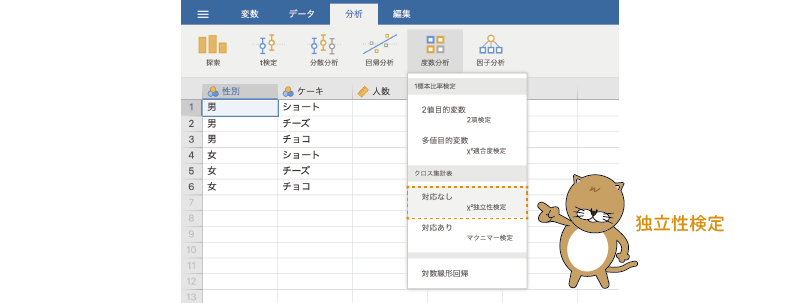
```

すると，図\@ref(fig:frequencies-chisq-setting)のような画面が表示されます。

```{r frequencies-chisq-setting, fig.cap='独立性検定の設定画面', echo=FALSE}

```

:::{.jmvsettings data-latex=""}
+ Rows（行）　クロス集計表の行に配置する変数を指定します。
+ Columns（列）　クロス集計表の列に配置する変数を指定します。
+ Counts (optional)（度数）　度数が含まれている変数を指定します（オプション）
+ Layers（階層）　クロス集計表を分割する変数を指定します。
+ `r groupbar('Statistics')`（統計量）　統計量に関する設定を行います。
+ `r groupbar('Cells')`（セル）　クロス集計表の各セルに関する設定を行います。
+ `r groupbar('Plots')`（作図）　結果をグラフに示します。
:::

たくさんの設定項目があるのですが，基本的な分析はそれらを使用しなくても可能です。

分析では，クロス集計表の行と列に配置する変数を指定します。今回は，行（Rows）に「性別」を，列（Columns）に「ケーキ」を配置することにしましょう。

また，今回のデータもこれまでと同様に度数を集計済みのものですので，度数が入った変数（「人数」）を「Counts (optional)（度数）」のところに指定します。各個人の回答が1行ずつ入力されているデータの場合，この部分の設定は不要です。

設定後の画面は図\@ref(fig:frequencies-chisq-setvar)のようになります。これで基本の分析設定は終了です。

```{r frequencies-chisq-setvar, fig.cap='分析する変数を設定', echo=FALSE}
knitr::include_graphics("images/frequencies/chisq-setvar.png")
```

### 分析結果 {#sub:frequencies-chisq-results}

それでは結果を見てみましょう。分析結果は図\@ref(fig:frequencies-chisq-results)のような形で得られます。

```{r frequencies-chisq-results, fig.cap='独立性検定の分析結果', echo=FALSE}

```

1つ目の表は，観測データについての度数分布表です。行と列が正しく設定されているか確認しましょう。また，集計済みのデータではなく，1人1人の回答が入力されているデータで分析を行う場合には，この度数分布表でそれぞれの度数をよく確認しておきましょう。

その下の2つ目の表が独立性検定の結果です。独立性検定の結果の表には，適合度検定の場合と同じで検定統計量（$\chi^2$）と自由度（**df**），そして有意確率（**p**）の値が示されています。また，独立性検定の場合には，総度数（N）についても示されています。この表のpの値が有意水準を下回る場合に，このデータの母集団の比率が想定される比率と有意に異なると判断します。

今回の分析結果ではp=0.032ですので，ケーキの選択と性別には関連がある（独立でない）ということになります。

### 層別分析 {#sub:frequencies-chisq-layered}

ここで，もう1つ別のデータをみてみましょう。次のサンプルデータ（[frequencies_data04.omv](data/omv/frequencies_data04.omv)）を開いてください。このデータは先ほどのデータとよく似ていますが，これは先ほどのデータに子供を対象に調査した結果を加えたものになっています（図\@ref(fig:frequencies-data04)）。

```{r}
fq.data04<-read.csv('data/frequencies_data04.csv')

# ID
#attributes(data01$ID)$`jmv-id`<-TRUE

# 連続変数
attributes(fq.data04$人数)$measureType<-c('Continuous')

# 名義変数
fq.data04$性別<-factor(fq.data04$性別)
attributes(fq.data04$性別)$measureType<-c('Nominal')
attributes(fq.data04$性別)$levels<-c('男','女')
attributes(fq.data04$性別)$values<-c(1,2)
attributes(fq.data04$性別)$measureType<-c('Nominal')

fq.data04$年齢<-factor(fq.data04$年齢)
attributes(fq.data04$年齢)$measureType<-c('Nominal')
attributes(fq.data04$年齢)$levels<-c('子供','大人')
attributes(fq.data04$年齢)$values<-c(1,2)
attributes(fq.data04$年齢)$measureType<-c('Nominal')

fq.data04$ケーキ<-factor(fq.data04$ケーキ)
attributes(fq.data04$ケーキ)$measureType<-c('Nominal')
attributes(fq.data04$ケーキ)$levels<-c('ショート','チーズ','チョコ')
attributes(fq.data04$ケーキ)$values<-c(1,2,3)
attributes(fq.data04$ケーキ)$measureType<-c('Nominal')

out<-jmvReadWrite::jmvWrite(fq.data04,'data/omv/frequencies_data04.omv')

```

<!-- -->
```{r frequencies-data04, fig.cap='サンプルデータ', echo=FALSE}

```

:::{.jmvvar data-latex=""}
+ `性別`　性別（男，女）
+ `年齢`　年齢（大人，子供）
+ `ケーキ`　ケーキの種類
  - ショートケーキ：`ショート`
  - チーズケーキ：`チーズ`
  - チョコレートケーキ：`チョコ`
+ `人数`　そのケーキを選んだ人数
:::

先ほどと同様に，今回もケーキの選択と性別に関連があるか（独立でないか）について検討したいと思います。ただし，ここで気をつけなくてはならないのが，このデータには大人を対象とした調査結果と子供を対象とした調査結果が混在しているということです。大人と子供でケーキの好みに違いがなければ大人と子供のデータを一まとめにして分析しても良いでしょうが，大人と子供でケーキの好みに大きな違いがあるのであれば，正しい分析結果が得られない可能性が高くなります。

このようなデータの場合，ケーキの選択と性別の関連を適切に把握するために，分析対象のクロス集計表を大人と子供にグループ分けしたうえで分析するという方法がとられます。このようにしてクロス集計表を別のグループ変数で分割して分析する方法は，*層別分析*と呼ばれます。jamoviでは，この層別分析についても簡単に実行できるようになっています。

#### 分析手順 {-#subsub:frequencies-chisq-layer}

層別分析を実施するためには，「`r infig('analysis-frequencies')` Frequencies（度数分析）」から「Independent Samples [$\chi^2$ test of association]（対応なし標本：カイ2乗独立性検定）」を選択し，先ほどと同様に「Rows」に「性別」，「Columns」に「ケーキ」，そして「Counts (optional)」に「人数」を指定します。

```{r frequencies-chisq-layer-set-var1, fig.cap='層別分析の設定（その1）', echo=FALSE}
knitr::include_graphics("images/frequencies/chisq-layer-set-var1.png")
```

なお，「Counts (optional)」の設定は，各個人の回答が1行ずつ入力されているデータの場合には不要です。

そしてそのうえで，グループ変数である「年齢」を，設定画面の「Layers（階層）」に設定します。

<!--  -->
```{r frequencies-chisq-layer-set-var2, fig.cap='層別分析の設定（その2）', echo=FALSE}
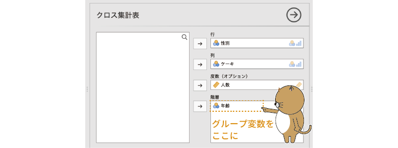
```

層別分析の設定はこれで終わりです。結果を見てみましょう。

#### 分析結果{-#subsub:frequencies-chisq-layer-results}

分析の設定画面でグループ変数を「Layers」に設定すると，分析結果は図\@ref(fig:frequencies-chisq-layer-results)のような形になります。全体としての構成は大きく変わりませんが，度数分布表と独立性検定の結果には，データ全体での結果と，大人と子供というグループごとの結果（層別の分析結果）の両方が含まれています。

<!--  -->
```{r frequencies-chisq-layer-results, fig.cap='層別分析の結果', echo=FALSE}

```

この結果を見ると，大人ではケーキの選択と性別に有意な関連が見られますが，子供では有意な関連は見られません。つまり，大人か子供かによって，ケーキの選択の仕方と性別の関連は異なるということになります。

なお，全体での結果はp=0.048で有意ですが，このデータでは大人は男女各100人であるのに対し，子供は男女各50人ですので，データ全体においては子供よりも大人の結果の影響が強く反映されているためと考えられます。したがって，この場合には全体の検定結果はあまり意味がありません。

```{=latex}
\clearpage
```

### Statistics：統計量{#sub:frequencies-chisq-statistics}

ここからは分析設定の詳細について見ていきましょう。`r groupbar('Statistics')`を展開すると，次の項目が表示されます（図\@ref(fig:frequencies-chisq-statistics)）。

<!-- -->
```{r frequencies-chisq-statistics, fig.cap='統計量の設定', echo=FALSE}
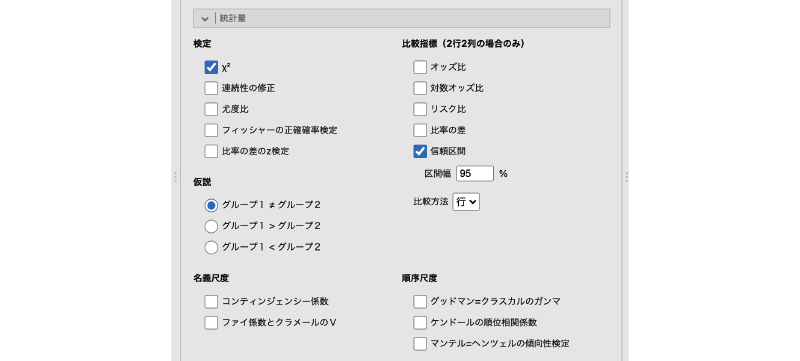
```

:::{.jmvsettings data-latex=""}
+ **Tests**（検定）　検定統計量に関する設定を行います。
+ **Hypothesis**（仮説）　対立仮説に関する設定を行います。
+ **Comparative Measures (2×2 only)**（比較指標：2行2列のみ）
+ **Nominal**（名義尺度）　名義尺度の関連についての指標を設定します。
+ **Ordinal**（順序尺度）　順序尺度の関連についての指標を設定します。
:::

非常にたくさんの項目が含まれていますが，ただ項目が多いだけでなく，この中には2行2列のクロス集計表の場合のみ適用可能な項目や，層別分析の場合のみ適用可能な項目などがあり，少し複雑です。ここでは，これらを1つ1つ順番に見ていくことにしましょう。

#### Tests：検定{-#subsub:frequencies-chisq-statistics-tests}

「**Tests**」の部分では，クロス集計表の検定に用いる検定手法についての設定を行うことができます（図\@ref(fig:frequencies-chisq-statistics-tests)）。


```{r frequencies-chisq-statistics-tests, fig.cap='検定の設定項目', echo=FALSE}

```

:::{.jmvsettings data-latex=""}
  - $\chi^2$　$\chi^2$統計量を算出します。
  - $\chi^2$ continuity correction（連続性の修正）　$\chi^2$値に対して連続性の修正を行います。
  - Likelihood ratio（尤度比）　尤度比カイ2乗検定を行います。
  - Fisher's exact test（フィッシャーの正確確率検定）　フィッシャーの正確確率検定を行います。
  - z test for difference in 2 proportions（比率の差のz検定）　比率の差に対してz検定を実施します。
:::


一番最初の$\chi^2$については説明の必要はないと思いますので，2つ目以降の項目について簡単に見ていきます。

##### $\chi^2$ continuity correction：連続性の修正{-}

独立性の検定や適合度検定に用いられる検定統計量は$\chi^2$と呼ばれますが，実際には$\chi^2$の近似値であって，$\chi^2$の値そのものではありません。そのため，クロス集計表の特徴によっては，この近似の程度が低くなる場合があるのです。そしてそのような場合に，算出した検定統計量を$\chi^2$分布にできるだけ近づけるように，*イェーツの修正*，あるいは*イェーツの連続性の修正*と呼ばれる修正を加えることがあります。このイェーツの修正は，一般にはクロス集計表が2行2列である場合，標本サイズが小さく，クロス集計表に期待度数が5未満のセルが1つ以上ある場合に用いられます。

この「$\chi^2$ continuity correction（連続性の修正）」の項目にチェックを入れると，イェーツの修正を行った後の$\chi^2$の値が算出されます（図\@ref(fig:frequencies-chisq-continuity)）。

<!-- -->
```{r frequencies-chisq-continuity, fig.cap='連続性の修正', echo=FALSE}
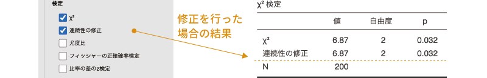
```

この結果は大人のみのデータを使ったクロス集計表の分析結果に連続性の修正を適用したものですが，このデータでは連続性の修正をしてもしなくても同じ結果になっています。

なお，イェーツの修正については，値を「修正しすぎる」傾向があることが知られています。そのため，このような修正を行うべきかどうかについては専門家の間でも意見が分かれるところです。

##### Likelihood ratio：尤度比{-}

「カイ2乗検定」というのは，検定統計量として$\chi^2$を用いるものの総称です。そして，独立性の検定として一般に用いられるカイ2乗検定は，*ピアソンのカイ2乗検定*とも呼ばれます。このように呼ばれるということは，それ以外のカイ2乗検定があるということです。

そして，その1つが*尤度比カイ2乗検定*です。ピアソンのカイ2乗検定では，$\chi^2$の値は期待度数と観測度数の差の2乗を元に算出されますが，尤度比カイ2乗検定では，$\chi^2$の値を期待度数と観測度数の比を用いて算出します。ほとんどの場合，この尤度比カイ2乗検定の結果はピアソンのカイ2乗検定の結果とよく似たものになります。また，結果の見方はピアソンのカイ2乗検定の場合と同じです（図\@ref(fig:frequencies-chisq-lr)）。

<!-- -->
```{r frequencies-chisq-lr, fig.cap='尤度比', echo=FALSE}

```


##### Fisher's exact test：フィッシャーの正確確率検定{-}

カイ2乗検定で算出される検定統計量は近似値であるため，標本サイズが小さいデータでは正確な結果が得られないといわれています。その場合，一般には*正確確率検定*と呼ばれる手法を用いて，今回の観測データと同じ結果になる確率がどの程度あるのかを直接的に計算して検定するという方法がとられます。その正確確率検定の中で，もっとも代表的なのが*フィッシャーの正確確率検定*，あるいは*フィッシャーの直接確率検定*と呼ばれる検定手法です。

この「Fisher's exact test（フィッシャーの正確確率検定）」にチェックを入れると，*フィッシャーの正確確率検定*による検定結果を表示することができます。なお，この方法では直接的に確率を計算するため，検定統計量は算出されません（図\@ref(fig:frequencies-chisq-fisher)）。そのため，結果の表にはpの値だけが表示されます。このpの値が有意水準を下回る場合に，2つの変数の間に関連がある（独立でない）と判断します。

<!-- -->
```{r frequencies-chisq-fisher, fig.cap='フィッシャーの正確確率検定', echo=FALSE}

```


##### z test for difference in 2 proportions：比率の差のz検定{-}

この項目は，クロス集計表が2行2列の場合にのみ適用可能なオプションです。

独立性検定の最初のところで用いたハンバーグへの好みと性別のクロス集計表のように，クロス集計表の行と列に関連がなく，互いに独立である場合には，男女でハンバーグの好き・嫌いの比率は同じになり，また，ハンバーグの好き・嫌いで男女比は同じになります。ということは，このようにして行ごと，列ごとで見た比率が同じでなければ，行に置かれた変数と列に置かれた変数は独立でないということになります。

「z test for difference in 2 proportions（比率の差のz検定）」の項目では，このような考え方から，各行および各列で度数の比率が同じといえるかどうかの検定を行います。度数の比率が等しければ，それは行と列が互いに独立であるということを意味し，そうでなければ行と列には関連があるということを意味するわけです。

たとえば，男女各100人にイヌとネコのどちらが好きかをたずねた結果をまとめたクロス集計表があるとしましょう（表\@ref(tab:frequencies-chisq-cats-and-dogs)）。

```{r, frequencies-chisq-cats-and-dogs}
  data.dog<-data.frame(
    x= c(70,55,125),
    y= c(30,45,75),
    z= c(100,100,200)
  )
  names(data.dog)<-c('イヌ','ネコ','計')
  row.names(data.dog)<-c('男','女','計')

  data.dog %>% kable(align='ccc', caption = '性別とイヌ派・ネコ派についてのクロス集計表', booktabs=T) %>%
    pack_rows('性別',1,2) %>%
    kable_styling(latex_options = "HOLD_position")
    # %>%

```


この表では，自分がイヌ派（ネコよりイヌが好き）と答えたのは男性では100人中70人（比率0.7），女性では100人中55人（比率0.55）ですので，男女の間でイヌ派の比率には0.15の差があります。この検定では，このようにして求めた比率の差を，全体におけるイヌ派の比率と男女それぞれの人数を用いてzに変換し，このzの値を用いて検定を行います。検定の結果が有意であった場合，2つの比率に差があるとみなします（図\@ref(fig:frequencies-chisq-ztest)）。

<!-- -->
```{r frequencies-chisq-ztest, fig.cap='比率の差のz検定', echo=FALSE}

```

イヌ派・ネコ派のデータについて比率の差の検定を行ったところ，p=0.028で検定結果は有意となりました。この結果から，男女でイヌ派・ネコ派の比率に有意な差があるということになります。

#### Hypothesis：仮説{-}

「**Hypothesis（仮説）**」では，「z test for difference in 2 proportions（比率の差のz検定）」における対立仮説を設定します（図\@ref(fig:frequencies-chisq-statistics)）。

```{r frequencies-chisq-statistics-hypothesis, fig.cap='仮説の設定項目', echo=FALSE}

```

:::{.jmvsettings data-latex=""}
- Group 1 ≠ Group 2　グループ1と2で比率が異なるかどうかを検定します（両側検定）
- Group 1 &gt; Group 2　グループ1の比率がグループ2より大きいかどうかを検定します（片側検定）
- Group 1 &lt; Group 2　グループ1の比率がグループ2より小さいかどうかを検定します（片側検定）
:::

この設定項目が結果に影響するのは，「z test for difference in 2 proportions」にチェックが入っている場合のみです。なお，片側検定を使用する際には，結果の「$\chi^2$ Tests（カイ2乗検定）」の表の下にある注釈で，比較の向きが正しいかどうかをよく確認してください。また，この「**Hypothesis**」の右側にある「Compare（比較）」の部分を「rows（行）」に設定すると行ごとの比率の差の検定，「columns（列）」にすると列ごとの比率の差の検定になります。

```{r frequencies-chisq-hypothesis, fig.cap='片側検定の場合は比較の向きに注意', echo=FALSE}

```


#### Comparative Measures：比較指標{-}

ここに含まれている設定項目は，2行2列（2×2）のクロス集計表の場合のみ有効なものです。

```{r frequencies-chisq-comparative, fig.cap='2行2列のクロス集計表における比較指標', echo=FALSE}

```

:::{.jmvsettings data-latex=""}
+ Odds ratio（オッズ比）
+ Log odds ratio（対数オッズ比）
+ Relative risk（リスク比）
+ Difference in proportion（比率の差）
+ Confidence intervals（信頼区間）
+ Compare（比較方法）
:::

ここでは，オッズや比率を2つのグループ間で比較する際に用いられる指標の設定を行いますが，その際，行での比較を行うか，列での比較を行うかは，各指標の下にある「Compare（比較方法）」で設定します。

この「Compare」を「rows（行）」に設定すると，オッズや比率が行ごとに算出され，それらの間で比較が行われます。先ほどのイヌ派とネコ派のクロス集計表でいうと，男性におけるイヌ派の比率と，女性におけるイヌ派の比率の間で比較が行われます（図\@ref(fig:frequencies-chisq-compare-setting)）。

<!-- -->
```{r frequencies-chisq-compare-setting, fig.cap='比較方法の設定', echo=FALSE}
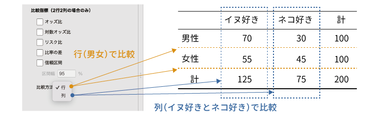
```

これに対して，「Compare」を「columns（列）」に設定すると，ネコ派における男女比と，イヌ派における男女比の間での比較になります。この「Compare」の設定は，「z test for difference in 2 proportions（比率の差のz検定）」にも反映されます。

では，ここで設定できる各種指標について簡単にみておきましょう。

##### Odds ratio：オッズ比{-}

「あり・なし」や「はい・いいえ」などの2値変数において，「あり」である確率と「なし」である確率の比をとったものを*オッズ*と呼びます。先ほどの「イヌ派」と「ネコ派」の例でいえば，「イヌ派率」と「ネコ派率」を「イヌ派率/ネコ派率」の形で表したものが「イヌ派のオッズ」です。

そして，さらにそのオッズ2種類を比の形にして表したものが*オッズ比*です。先ほどの例では，男性ではイヌ派のオッズは「0.7/0.3 = 2.33」，女性ではイヌ派のオッズは「0.55/0.45 = 1.22」ですので，イヌ派についての男女のオッズ比は「2.33/1.22 = 1.91」となります。


##### Log odds ratio：対数オッズ比{-}

2つの確率の比であるオッズは，2つの確率のうちの小さな値を基準（分母）におくか，大きな値を基準におくかで値のとりうる範囲が大きく異なります。たとえば，男性のイヌ派のオッズは「70/30 = 2.33」ですが，これは男性の場合，イヌ派である確率の方がネコ派である確率の2.33倍であることを意味します。このように小さい方の値を基準とした場合には，オッズは1から無限大までの範囲をとりうる値になります。

これに対し，男性のネコ派のオッズは「0.3/0.7 = 0.43」で，これはネコ派の確率がイヌ派の確率の0.43倍であるということになるのですが，このように大きい方の値を基準としてオッズを算出した場合，オッズの値は0から1までの範囲にしかなりません。

また，イヌ派のオッズとネコ派のオッズは，0.7/0.3と0.3/0.7というように分数の上下を入れ替えただけの違いであるのに，その値は2.33と0.43というようにまったく異なる数値になっていて，とくに関連があるようには見えません。

ところが，これらのオッズを対数変換すると，「log(0.7/0.3) = 0.85」，「log(0.3/0.7) = \(-\textsf{0.85}\)」となって，両者が方向を逆転させた関係にあることがわかりやすくなります。また，この場合には，プラスの値は0から無限大まで，マイナスの値もマイナス無限大の値をとることができるようになるのです。このように，オッズを用いる場合には，それを対数変換した方が関係を理解しやすくなることが多いのです。

これはオッズ比の場合も同様で，そしてオッズ比を対数に変換したものが*対数オッズ比*です。先ほどの例の，イヌ派についての男女のオッズ比を対数オッズ比に直すと，「log 1.91 = 0.65」になります。

##### Relative risk：リスク比{-}

オッズ比が2グループのオッズの比であるのに対して，2グループの確率をそのまま比の形で表したものが*リスク比*です。先ほどのイヌ派・ネコ派の例でいうと，イヌ派の割合は男性では0.7（70%），女性では0.55（55％）ですので，「0.7/0.55 = 1.27」というのがイヌ派についての男女のリスク比ということになります。

##### Difference in proportions：比率の差{-}

これは，2つのグループにおける比率の差です。「**Tests**」の設定項目にある「z test for difference in 2 proportions（比率の差のz検定）」は，この2グループの比率の差をzに変換して検定を行っています。

イヌ派・ネコ派の例では，イヌ派の割合は男性で0.7，女性で0.55ですので，比率の差の値は「\(\textsf{0.7}-\textsf{0.55} = \textsf{0.15}\)」になります。

ここまでの指標の関係をまとめると図\@ref(fig:frequencies-chisq-comparative-measures)のようになります。

<!--  -->

```{r frequencies-chisq-comparative-measures, fig.cap='比較指標の関係と一覧', echo=FALSE}
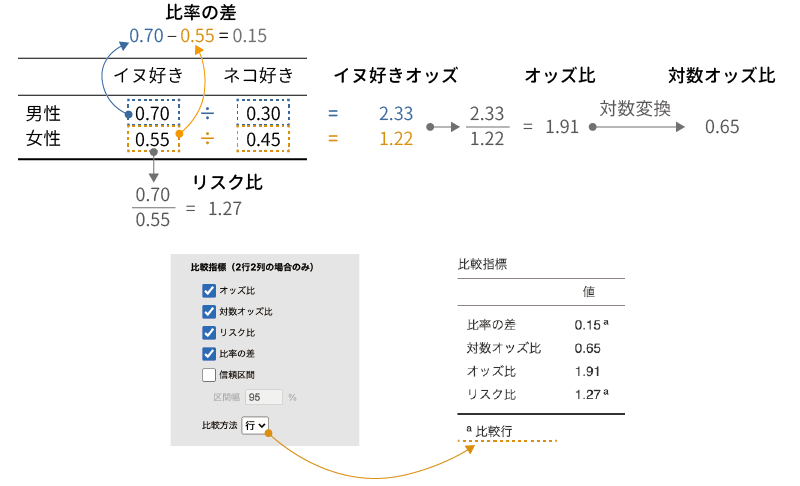
```


##### Confidence intervals：信頼区間{-}

「Confidence intervals」の項目にチェックを入れると，オッズ比や対数オッズ比，リスク比などの各指標について，指定した幅の信頼区間が算出されます。

#### Nominal：名義尺度{-}

「**Nominal**（名義尺度）」では，分析対象のデータが名義型変数（`r infig('variable-nominal')` Nominal）である場合の**連関係数**に関する設定を行います。連関係数とは，クロス集計表における行の要素と列の要素の間の関連の強さを表す指標のことです。

ここには，次の2つの設定項目が含まれています（図\@ref(fig:frequencies-chisq-contingency)）。

```{r frequencies-chisq-contingency, fig.cap='名義尺度の連関係数', echo=FALSE}
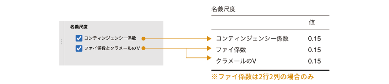
```

:::{.jmvsettings data-latex=""}
+ Contingency coefficient（コンティンジェンシー係数）
+ Phi and Cramer's V（ファイおよびクラメールのV）
:::

##### Contingency coefficient：コンティンジェンシー係数{-}

*コンティンジェンシー係数*は，$\chi^2$の値を「$\chi^2$+総度数」で割った値の平方根で，これはクロス集計表の行要素と列要素の関連の強さを示します。この値は*ピアソンの連関係数C*とも呼ばれます。この値は，行と列の連関が0である（行と列が独立である）場合に0となり，連関が強いほど1に近い値になります。


##### Phi and Cramer's V：ファイとクラメールのV{-}

この項目にチェックを入れると，*ファイ係数*と*クラメールの連関係数V*の2種類の値が算出されます。

ファイ（$\varphi$）係数と呼ばれるものには，$\chi^2$の値を総度数で割ったものの平方根として求められるものと，ピアソンの積率相関係数を2行2列のクロス集計表に適用したもの（これは*四分点相関係数*とも呼ばれます）の2種類が存在しますが，jamoviで算出されるのは後者です。このファイ係数は，2行2列のクロス集計表でのみ算出されます。

もう1つのクラメールの連関係数Vは，$\chi^2$の値を行数と列数の小さい方の値で割って平方根を求めたもので，こちらは2行2列よりも大きなサイズのクロス集計表に対しても算出されます。なお，2行2列のクロス集計表では，ファイ係数とクラメールのVは同じ値になります。

これらの値も，コンティンジェンシー係数と同様に，行と列の連関が0である（行と列が独立である）場合に0となり，連関が強いほど1に近い値になります。


#### Ordinal：順序尺度{-}

「**Ordinal**（順序尺度）」では，分析対象のデータが順序型変数（`r infig('variable-ordinal')` Ordinal）である場合の関連度指標に関する設定を行います。

ここには，次の3つの項目が含まれています（図\@ref(fig:frequencies-chisq-ordinal)）。

```{r frequencies-chisq-ordinal, fig.cap='順序尺度の関連度', echo=FALSE}
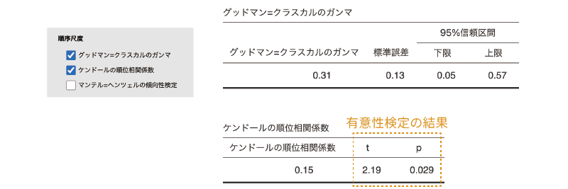
```

:::{.jmvsettings data-latex=""}
+ Gamma（グッドマン=クラスカルのガンマ）
+ Kendall's tau-b（ケンドールの順位相関係数）
+ Mantel-Haenszel（マンテル=ヘンツェルの傾向性検定）
:::

##### Gamma：グッドマン=クラスカルのガンマ{-}

*グッドマン=クラスカルのガンマ*は，順位相関係数の一種です。2行2列のクロス集計表の場合には，このガンマの値は*ユールのQ*と呼ばれることもあります。グッドマン=クラスカルのガンマは，スピアマンの順位相関係数などと同様に\(-\textsf{1}\)から1までの範囲をとります。

この設定は，クロス集計表の行と列の両方が順序型変数である場合に有効です。それ以外の場合にも計算計算は表示されますが，それらの値は適切ではない可能性があります。


##### Kendall's tau-b：ケンドールの順位相関係数{-}

この項目にチェックを入れると，ケンドールの順位相関係数が算出されます。

この設定は，クロス集計表の行と列の両方が順序型変数である場合に有効です。それ以外の場合にも計算計算は表示されますが，それらの値は適切ではない可能性があります。


##### Mantel-Haenszel：マンテル=ヘンツェルの傾向性検定{-}

*マンテル=ヘンツェルの傾向性検定*は，行数または列数が2で，もう一方が順序型変数である場合のクロス集計表に使用可能な検定です。

たとえば表\@ref(tab:frequencies-chisq-feature-table)のようなクロス集計表があったとします。この表には，行方向にはある特徴のあり・なしが，列方向には学年が置かれています。このようなクロス集計表で，その特徴のあり・なしと学年の間に関連が見られるかどうかを確かめるのがマンテル=ヘンツェルの傾向性検定です。よく似た名前をもつ検定にコクラン=マンテル=ヘンツェル検定がありますが，これとは別物ですので注意してください。


```{r, frequencies-chisq-feature-table}
  table.ari<-matrix(c(10,90,20,80,40,60),nrow=2)
  data.ari<-as.data.frame(addmargins(table.ari))
  colnames(data.ari)<-c('低学年','中学年','高学年','計')
  rownames(data.ari)<-c('あり','なし','計')

  data.ari %>% kable(align='cccc', caption = '特徴の有無と学年についてのクロス集計表', booktabs=T) %>%
    pack_rows('特徴',1,2)%>%
    kable_styling(latex_options = "HOLD_position")# %>%

```


この検定では，順序型変数（低学年・中学年・高学年）を「1，2，3」という数値に置き換え，名義型変数（あり・なし）を「1，2」に置き換えて，2つの変数の間のピアソンの積率相関係数を算出します。そしてその相関係数の2乗値に「総度数&minus;1」をかけた値が$\chi^2$として算出されます。この検定の結果，有意確率pの値が有意水準を下回る場合に，2つの変数の間に関連があると判断します。

<!-- -->
```{r frequencies-chisq-mantel, fig.cap='マンテル=ヘンツェルの傾向検定', echo=FALSE}
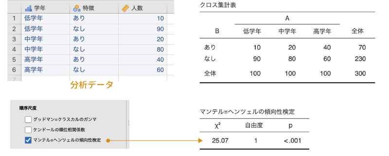
```


### Cells：セル{#sub:frequencies-chisq-cells}

ここでは，クロス集計表のセル（1つ1つのマス目）に表示する値についての設定を行います（図\@ref(fig:frequencies-chisq-cells)）。

```{r frequencies-chisq-cells, fig.cap='セルの設定', echo=FALSE}
knitr::include_graphics("images/frequencies/chisq-cells.png")
```

:::{.jmvsettings data-latex=""}
+ **Counts**（度数）
  - Observed counts（観測度数）　観測度数を表示します。
  - Expected counts（期待度数）　期待度数を表示します。
+ **Percentages**（パーセント）
  - Row（行）　それぞれの行における各セルのパーセントを示します。
  - Column（列）　それぞれの列における各セルのパーセントを示します。
  - Total（全体）　各セルの度数が総度数に占めるパーセントを示します。
:::

「**Counts**（度数）」にある「Observed counts（観測度数）」と「Expected counts（期待度数）」は，それぞれ観測度数と期待度数を表示に関する設定項目です。これらの項目にチェックを入れると，チェックした項目の値がクロス集計表に表示されます（図\@ref(fig:frequencies-chisq-cells-expected)）。


<!-- -->
```{r frequencies-chisq-cells-expected, fig.cap='期待度数の表示', echo=FALSE}
knitr::include_graphics("images/frequencies/chisq-cells-expected.png")
```

また，「**Percentages**（パーセント）」にある設定項目は，各セルのパーセント値の表示・非表示についての設定です。「Row（行）」にチェックを入れると，それぞれの行ごとに各列の値の占める割合がその行の度数の何%であるかが表示されます。同様に，「Column（列）」にチェックを入れると，それぞれの列ごとに各行の値がその列に占める割合が何%であるかが表示されます（図\@ref(fig:frequencies-chisq-cells-percentage)）。


```{r frequencies-chisq-cells-percentage, fig.cap='パーセントの表示', echo=FALSE}
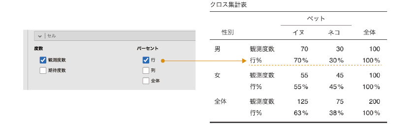
```

「Total（全体）」も同様で，この項目にチェックを入れると各セルの度数が総度数の何%を占めるかがクロス集計表に表示されます。

### Plots：作図{#sub:frequencies-chisq-plots}

ここでは，クロス集計表の値を用いたグラフの作成に関する設定を行います（図\@ref(fig:frequencies-chisq-plots)）。

```{r frequencies-chisq-plots, fig.cap='グラフの設定', echo=FALSE}
knitr::include_graphics("images/frequencies/chisq-plots.png")
```

:::{.jmvsettings data-latex=""}
+ **Plots**（作図）
  - Bar Plot（棒グラフ）　棒グラフを作成します。
+ **Bar Type**（棒グラフのタイプ）
  - Side by side（横並び）　グループ別に，棒を横並びにして表示します。
  - Stacked（積み上げ）　各グループの度数を縦に積み上げて表示します。
+ **Y-Axis**（縦軸）
  - Counts（度数）　グラフの縦軸に度数を示します。
  - Percentages（パーセント）　グラフの縦軸に度数のパーセントを示します。
+ **X-Axis**（横軸）
  - Rows（行）　クロス集計表の行にある変数の値を横軸に配置します。
  - Columns（列）　クロス集計表の列にある変数の値を横軸に配置します。
:::

ここの「**Plots**（作図）」にある「Bar Plot（棒グラフ）」にチェックを入れると，クロス集計表の値を棒グラフとして示すことができます（図\@ref(fig:frequencies-chisq-plots-bar)）。

<!--  -->
```{r frequencies-chisq-plots-bar, fig.cap='棒グラフの表示', echo=FALSE}

```

ここで作成できる棒グラフは，グループ別に値を横に並べて表示するスタイルと，それぞれのグループの度数を縦に積み上げて表示するスタイルの2種類のスタイルを選択することができます。「**Bar Type**（棒グラフのタイプ）」で「Side by side（横並び）」を選択すると，異なるグループの度数が横並びの形で棒グラフに表示されます。これに対し，「Stacked（積み上げ）」を選択すると，異なるグループの度数が縦に積み上げられる形の棒グラフ（積み上げ棒グラフ）が表示されます（図\@ref(fig:frequencies-chisq-plots-bar-stack)）。

<!-- -->

```{r frequencies-chisq-plots-bar-stack, fig.cap='棒グラフのスタイル', echo=FALSE}

```

「**Y-Axis**（縦軸）」に含まれているのは，グラフの縦軸（数値軸）に示す値についての設定項目です。ここで「Counts（度数）」を選択すると，グラフの縦軸には度数が示されます。これに対し，「Percentages（パーセント）」を選択した場合には，グラフの縦軸にはその度数が全体または行・列に占めるパーセントの値が縦軸に示されます（図\@ref(fig:frequencies-chisq-plots-bar-percentage)）。

<!-- -->
```{r frequencies-chisq-plots-bar-percentage, fig.cap='グラフの縦軸の設定', echo=FALSE}
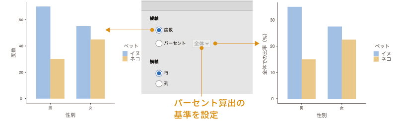
```

また，全体，行，列のいずれに対するパーセント値を表示させるかは，「Percentages」の横のプルダウンメニューから選択して設定します。ここが「of total」になっている場合には全体におけるパーセント，「within rows」になっている場合には各行におけるパーセント，「within columns」になっている場合には各列におけるパーセントになります。

「**X-Axis**（横軸）」に含まれているのは，グラフの横軸（項目軸）に用いる値についての設定項目です。ここで「Rows（行）」を選択すると，グラフの横軸にはクロス集計表の行にある変数の値が用いられます。これに対し，「Columns（列）」を選択した場合には，グラフの横軸にはクロス集計表の列にある変数の値が用いられます（図\@ref(fig:frequencies-chisq-plots-bar-xaxis)）。

```{r frequencies-chisq-plots-bar-xaxis, fig.cap='グラフの横軸の設定', echo=FALSE}

```

## Paired Samples [McNemar test]：対応あり標本（マクニマー検定）{#sec:frequencies-mcnemar}

無作為に選抜した生徒100人を対象に，本試験用の問題と追試験用の問題の両方を解いてもらい，それぞれ何人が合格基準に達するかを調べたところ表\@ref(tab:frequencies-mcnemar-table)の結果が得られたとしましょう。

```{r,frequencies-mcnemar-table}
  data.shiken1<-addmargins(matrix(c(68,32,79,21),nrow=2))
  
  colnames(data.shiken1)<-c('本試験','追試験','計')
  rownames(data.shiken1)<-c('合格','不合格','計')

  data.shiken1 %>% kable(align='cccc', caption = '本試験と追試験での合否の結果', booktabs=T) %>%
    kable_styling(latex_options = "HOLD_position")#%>%
 #   add_header_above(header = c(' '=1,'ケーキの種類'=3,' '=1)) %>%
 #   pack_rows('性別',1,2)# %>%

```


そしてこの結果から，試験問題の違いによって合格・不合格の程度が異ならない（どちらも難易度が同程度になっている）かどうかを確かめたいとします。この場合，どのように分析すれば良いでしょうか。

このデータは，一見すると独立性の検定で分析できそうに見えるのですが，残念ながらそうではありません。なぜなら，このデータでは「本試験」と「追試験」の両方に同じ人のデータが含まれているからです。これはいわゆる「対応あり」のデータで，データ収集方法にそもそも対応があるわけですから，それに対して「独立」かどうかという検定を行っても適切な結果が得られないのです。

このような場合，次にとりあげる*マクニマー検定*と呼ばれる検定が用いられます。

### 考え方{#sub:frequencies-mcnemar-basics}

先ほどのクロス集計表は，残念ながらそのままでは分析ができません。このようなデータの場合には，クロス集計表は本試験の合否を行に，追試験の合否を列に配置するような形で作成する必要があります。

そこで，もう一度全員の結果を調べ直し，分析に適した形でクロス集計表を作成し直したところ，表\@ref(tab:frequencies-mcnemar-table2)のようになったとします。


```{r, frequencies-mcnemar-table2}
  data.shiken<-addmargins(matrix(c(58,21,10,11),nrow=2))
  
  colnames(data.shiken)<-c('合格','不合格','計')
  rownames(data.shiken)<-c('合格','不合格','計')

  data.shiken %>% kable(align='cccc', caption = '本試験と追試験での合否結果のクロス集計表', booktabs=T) %>%
    add_header_above(header = c(' '=1,'追試験'=2,' '=1)) %>%
    pack_rows('本試験',1,2)%>%
    kable_styling(latex_options = "HOLD_position")# 

```


この表は先ほどの表と似ていますが，先ほどの表は総度数が200だったのに対し，この表は総度数が100で，調査対象の人数と同じになっています。つまり，先ほどの表はデータの対応がまったく考慮されていなかったのに対し，こちらはデータの対応をきちんと考慮した形で集計表が作成されているのです。

次に，本試験と追試験で難易度が同じである場合の期待度数について考えてみましょう。ここでは，考え方についてみるために，それぞれのセルの度数をa〜dで表しています（表\@ref(tab:frequencies-mcnemar-table3)）。


```{r,frequencies-mcnemar-table3}
  data.shiken2<-matrix(c('a','b','a+b','c','d','c+d','a+c','b+d',100),nrow=3,byrow=T)
  
  colnames(data.shiken2)<-c('合格','不合格','計')
  rownames(data.shiken2)<-c('合格','不合格','計')

  data.shiken2 %>% kable(align='cccc', caption = '本試験と追試験での合否結果のクロス集計表', booktabs=T) %>%
    add_header_above(header = c(' '=1,'追試験'=2,' '=1)) %>%
    pack_rows('本試験',1,2)%>%
    kable_styling(latex_options = "HOLD_position")# 

```

2つの試験の難易度が同じであれば，本試験で合格できた人は追試験でも合格するはずです。つまり，「a+b」の人数と「a+c」の人数は同じになるはずです。同様に，本試験で合格できなかった人は追試験でも合格できないはずで，その場合には「c+d」と「b+d」の人数も同じになります。

そして，これらの関係を整理すると，合格の度数についての「a+b = a+c」という関係は，結局は「b=c」ということですし，また，不合格の度数についての「c+d = b+d」というのも，結局は「b=c」ということになって，2つの試験で難易度が同じである場合に期待されるのは，「b=c」の状態ということになります。

そこで，マクニマー検定では，観測データにおける右上のセルと左下のセルの値が互いにどれだけずれているかを検定統計量として算出し，そこから2つの試験の難易度に違いがあるといえるかどうかを判断します。

### 分析手順{sub:frequencies-mcnemar-procedure}

ここでは，次のサンプルデータ（[frequencies_data05.omv](data/omv/frequencies_data05.omv)）を用いて分析を行いましょう。このデータファイルには以下の変数が含まれています（図\@ref(fig:frequencies-data05)）。

```{r}
data05<-read.csv('data/frequencies_data05.csv')

# ID
attributes(data05$ID)$`jmv-id`<-TRUE

# 連続変数
#attributes(data05$得点)$measureType<-c('Continuous')

# 名義変数
data05$本試験<-factor(data05$本試験)
attributes(data05$本試験)$levels<-c('不合格','合格')
attributes(data05$本試験)$values<-c(0,1)
attributes(data05$本試験)$measureType<-c('Nominal')

data05$追試験<-factor(data05$追試験)
attributes(data05$追試験)$levels<-c('不合格','合格')
attributes(data05$追試験)$values<-c(0,1)
attributes(data05$追試験)$measureType<-c('Nominal')

out<-jmvReadWrite::jmvWrite(data05,'data/omv/frequencies_data05.omv')

```

```{r frequencies-data05, fig.cap='サンプルデータ', echo=FALSE}

```

:::{.jmvvar data-latex=""}
+ `ID`　生徒のID
+ `本試験`　本試験の合否（合格，不合格）
+ `追試験`　追試験の合否（合格，不合格）
:::

ここでは，各生徒の本試験と追試験の結果が入力されたデータファイルを使用しますが，すでに集計済みのデータで分析を行う場合，スプレッドシートには図\@ref(fig:frequencies-data06)のような形でデータが入力されている必要があります。

```{r frequencies-data06, fig.cap='集計済みデータの入力方法', echo=FALSE}

```


マクニマー検定を実施するには，Analysesタブの「`r infig('analysis-frequencies')` Frequencies（度数分析）」で「Contingency Tables（クロス集計表）」のところにある「Paired Samples [McNemar test]（対応あり標本：マクニマー検定）」を選択します（図\@ref(fig:frequencies-mcnemar-menu)）。


```{r frequencies-mcnemar-menu, fig.cap='マクニマー検定の実行', echo=FALSE}
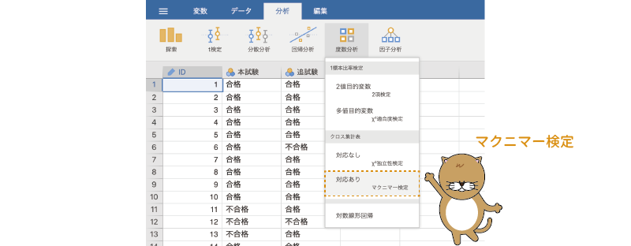
```

すると，図\@ref(fig:frequencies-mcnemar-settings)のような画面が表示されます。

```{r frequencies-mcnemar-settings, fig.cap='マクニマー検定の設定画面', echo=FALSE}
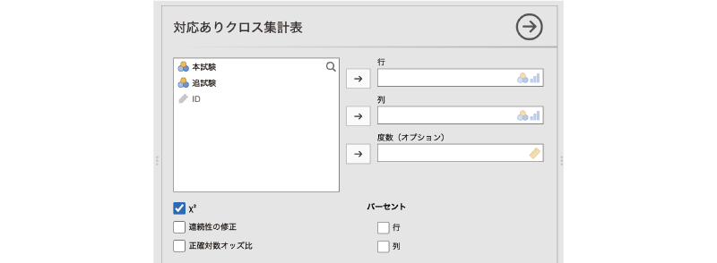
```

:::{.jmvsettings data-latex=""}
+ Rows（行）　クロス集計表の行に配置する変数を指定します。
+ Columns（列）　クロス集計表の列に配置する変数を指定します。
+ Counts (optional)（度数）　度数が含まれている変数を指定します（オプション）
+ $\chi^2$　$\chi^2$値を算出します。
+ $\chi^2$ continuity correction（連続性の修正）　連続性の修正を行った$\chi^2$値を算出します。
+ Log odds ratio exact（対数オッズ比正確確率検定）　対数オッズ比と正確確率検定の結果を表示します。
+ **Percentages**（パーセント）
  - Row（行）　各行におけるパーセント値を算出します。
  - Column（列）　各列におけるパーセント値を算出します。
:::

ここでは，「本試験」を「Rows（行）」に，「追試験」を「Columns（列）」に設定しましょう。このデータファイルには一人一人の結果が入力されているので，分析の基本設定はこれで終わりです。「Counts (optional)（度数）」の設定は必要ありません。集計済みデータで分析をする場合には，度数が入力されている変数を「Counts (optional)」に指定してください（図\@ref(fig:frequencies-mcnemar-set-var)）。

```{r frequencies-mcnemar-set-var, fig.cap='マクニマー検定の分析設定', echo=FALSE}
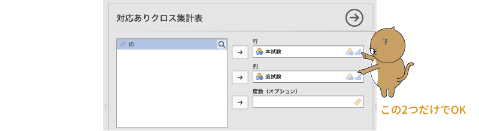
```

### 分析結果{#sub:frequencies-mcnemar-results}

それでは結果を見てみましょう（図\@ref(fig:frequencies-mcnemar-results)）。

```{r frequencies-mcnemar-results, fig.cap='マクニマー検定の結果', echo=FALSE}
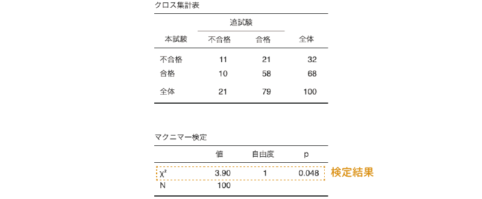
```

結果の表示，および見方は，独立性検定の場合とほぼ同じです。1つ目の表はクロス集計表，2つ目の表が検定結果です。$\chi^2$値の有意確率は5%の有意水準を下回っているので（p=0.048），検定結果は有意です。つまり，本試験と追試験で難易度（合格・不合格の比率）が異なるということになります。

### 分析オプション{#sub:frequencies-mcnemar-options}

マクニマー検定では利用可能な分析オプションは多くありません。分析に関する設定項目は，検定統計量としてイェーツの修正を行った$\chi^2$を算出する項目と，対数オッズ比を算出するための項目だけです。連続性の修正を行った$\chi^2$は，独立性検定の場合と同じですので説明は省略します。

検定オプションの「Log odds ratio exact（対数オッズ比正確確率検定）」は，正確確率を用いた検定結果を表示します（図\@ref(fig:frequencies-mcnemar-logodds)）。この方法を用いて分析した場合に表示される「Log odds ratio exact」の値は，クロス集計表の右上および左下のセルの度数について帰無仮説どおりの場合の比率と観測データにおける比率から算出したオッズ比の対数です。

<!-- --> 

```{r frequencies-mcnemar-logodds, fig.cap='対数オッズ比と正確確率検定の結果', echo=FALSE}

```

マクニマー検定では，右上のセルと左下のセルの度数だけを考え，そしてこの2つのセルの度数は同じというのが帰無仮説ですので，右上のセルの左下のセルに対するオッズは「1/1 = 1」となります。そして，今回のデータでは，右上のセルは31人中10人（10/31 = 0.32），左下のセルは31人中21人（21/31 = 0.68）なので，右上のセルのオッズは「0.32/0.68 = 0.47」となります。

この場合，帰無仮説のオッズを基準（分母）としたオッズ比は「0.47/1 = 0.47」で，これを対数変換すると「log 0.47 = \(-\textsf{0.76}\)」となります。途中で四捨五入しながら計算しているので結果の表に表示されている値と完全には一致しませんが，このように計算するとほぼ同じ値になるのがわかります。

また，マクニマー検定はクロス集計表の右上のセルと左下のセルの度数が同じかどうかを検定していますので，考え方としては，この2つのセルの出現比率が1:1になっているかどうかを2項検定するのと同じことになります。この検定における有意確率pの値は，「31人中10人」という結果について2項検定を行った場合の値に一致します。

設定画面右側の「**Percentages**（パーセント）」の項目は，クロス集計表にパーセントを表示するかどうかの設定です。「Row（行）」をチェックすれば行ごとのパーセント値が，「Column（列）」をチェックすれば列ごとのパーセント値が表示されます。

## Log-Linear Regression：対数線形回帰{#sec:frequencies-loglin}

カイ2乗適合度検定は1つの変数についての比率の分析，カイ2乗独立性検定は2つの変数を組み合わせた場合の比率の分析でした。では，3つ以上の場合はどうすればよいでしょうか。jamoviのカイ2乗独立性検定では，3つ目の変数値をグループ変数として層別分析を行うことも可能ですが，その場合，グループ変数と他の変数との関連については見ることができません。

このような，より複雑なデータの場合に使用可能な分析の1つに*対数線形回帰分析*があります。

### 考え方{#sub:frequencies-loglin-basics}

話を単純にするために，ここでは表\@ref(tab:frequencies-loglin-table1)のクロス集計表を例にこの分析の考え方について見てみましょう。これは，独立性検定のところで用いた性別とイヌ派・ネコ派のクロス集計表です。

```{r,frequencies-loglin-table1}
  data.dog<-data.frame(
    x= c(70,55,125),
    y= c(30,45,75),
    z= c(100,100,200)
  )
  names(data.dog)<-c('イヌ','ネコ','計')
  row.names(data.dog)<-c('男','女','計')

  data.dog %>% kable(align='ccc', caption = '性別とイヌ派・ネコ派についてのクロス集計表', booktabs=T) %>%
    pack_rows('性別',1,2)%>%
    kable_styling(latex_options = "HOLD_position")# %>%

```

このようなクロス集計表では，各セルの期待度数は，行の度数と列の度数，クロス集計表全体の総度数を用いて次のように求めることができます。

\[
 \text{期待度数} = \frac{\text{行の度数}\times\text{列の度数}}{\text{総度数}}
\]

たとえば，男性でイヌ派のセルの期待度数は，「(100&times;125)/200 = 62.5」となります。

このとき，この期待度数の式を対数変換すると，この式は次のように表すことができます^[掛け算の式を対数変換した場合，その式は元の項目の対数同士の足し算として，割り算の式を対数変換した場合，その式は元の項目の対数同士の引き算として表すこができます。多変量解析の中でしばしば対数変換が行われるのは，このように掛け算を足し算に，割り算を引き算にできることで計算が単純になるということが理由の1つにあるのです。]。

\begin{eqnarray*}
 \log(\text{期待度数}) %
 & =& \log\left(\frac{\text{行の度数}\times\text{列の度数}}{\text{総度数}}\right)\\
 &=&  \log(\text{行の度数})+\log(\text{列の度数}) - \log(\text{総度数}) \\
 &=&  - \log(\text{総度数}) + \log(\text{行の度数})+\log(\text{列の度数})
\end{eqnarray*}

各セルの期待度数について考えたとき，この式の「log(行の度数)」と「log(列の度数)」はセルごとに変化しますが，「\(-\log(\textsf{総度数})\)」の部分は，どのセルにおいても共通ですので，これは回帰式における切片のような役割を担っています。このように考えると，この式はさらに次のような回帰式として表せることになります。

\[
\log(\text{期待度数}) = b_0 + b_1\times \text{行の要素} + b_2\times \text{列の要素}
\]

一般に，クロス集計表の検定では，行と列が独立であるかどうかについての検定を行いますが，これは行と列の組み合わせによって比率が異なるかどうかを検定しているのと同じです。先ほどの式には行の影響と列の影響しか含まれていませんが，ここに行と列の組み合わせの影響，つまり交互作用による影響を加えると，この式は次のようになります。

\[
\log(\text{期待度数}) = b_0 + b_1\times \text{行の要素} + b_2\times \text{列の要素} + b_3\times\text{行と列の交互作用}
\]

対数線形回帰分析では，このように対数変換を用いて期待度数（の対数）を目的変数，行・列とその交互作用（の対数）を説明変数とする回帰式を作成し，そしてそれぞれの係数を算出するという形で複雑なクロス集計表についての分析を行います。

### 基本手順{#sub:frequencies-loglin-procedure}

ここでは，独立性検定の層別分析のところで用いたデータ（[frequencies_data04.omv](data/omv/frequencies_data04.omv)）で対数線形回帰分析の実施方法を見ていくことにしましょう。念のため，データファイルに含まれている変数の一覧を示しておきます。

:::{.jmvvar data-latex=""}
+ `性別`　性別（男，女）
+ `年齢`　年齢（大人，子供）
+ `ケーキ`　ケーキの種類
  - ショートケーキ：`ショート`
  - チーズケーキ：`チーズ`
  - チョコレートケーキ：`チョコ`
+ `人数`　そのケーキを選んだ人数
:::

このデータを用いて，ケーキの選択に性別と年齢がどのように影響しているかをこれから分析していきます。

まず，Analysesタブの「`r infig('analysis-frequencies')` Frequencies（度数分析）」から「Log-Linear Regression（対数線形回帰）」を選択してください（図\@ref(fig:frequencies-loglin-menu)）。

```{r frequencies-loglin-menu, fig.cap='対数線形回帰分析の実行', echo=FALSE}
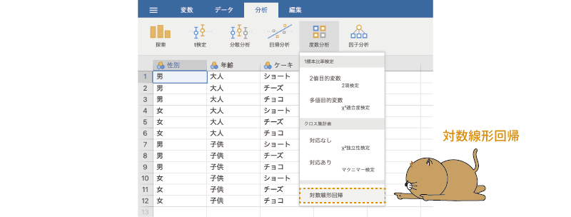
```


すると，図\@ref(fig:frequencies-loglin-settings)のような画面が表示されます。画面の構成は，回帰分析（第\@ref(ch:regression)章）のものとよく似ています。

```{r frequencies-loglin-settings, fig.cap='対数線形回帰分析の設定画面', echo=FALSE}
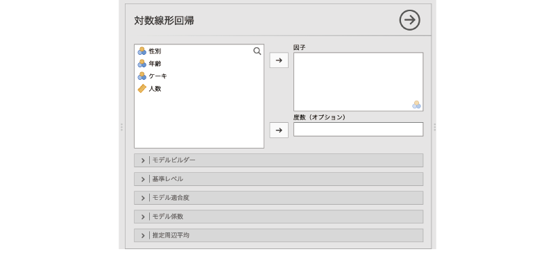
```

:::{.jmvsettings data-latex=""}
+ Factors（要因）　分析に使用する変数を指定します。
+ Counts (optional)（度数）　度数が入力されている変数を指定します（オプション）
+ `r groupbar('Model Builder')`（モデルビルダー）　交互作用を含むモデルの作成や複数モデルの比較を行います。
+ `r groupbar('Reference Levels')`（基準レベル）　比較基準として用いる水準値を指定します。
+ `r groupbar('Model Fit')`（モデル適合度）　モデル適合度に関する設定を行います。
+ `r groupbar('Model Coefficients')`（モデル係数）　モデル係数に関する設定を行います。
+ `r groupbar('Estimated Marginal Means')`（推定周辺平均）　各主効果の周辺平均値（回帰モデルによる推定値）に関する設定を行います。
:::

基本的な分析は，分析に使用する変数をすべて「Factors（要因）」の部分に移動するだけです。また，今回のデータファイルのように度数集計済みのデータで分析する場合には，度数が入力されている変数（ここでは「人数」）を「Counts (optional)（度数）」の欄に指定します（図\@ref(fig:frequencies-loglin-setvar)）。

```{r frequencies-loglin-setvar, fig.cap='対数線形回帰分析の設定', echo=FALSE}
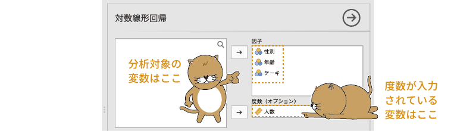
```

実際にはもう少し色々と設定が必要なのですが，ひとまずこれで分析の基本設定はおしまいです。それでは結果を見てみましょう。

### 分析結果{#sub:frequencies-loglin-results}

対数線形モデルの結果は，図\@ref(fig:frequencies-loglin-results)のような形で表示されます。

```{r frequencies-loglin-results, fig.cap='対数線形回帰分析の結果', echo=FALSE}
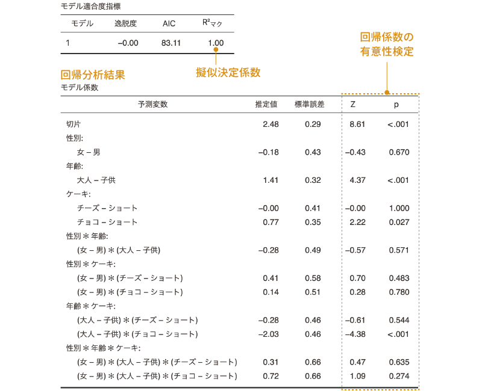
```

分析の手順が簡単だった割に，随分と複雑な結果に見えます。この結果の表について，1つ1つみていきましょう。

まず，結果の1つ目の表は，モデルの適合度に関する指標です。この表には，ロジスティック回帰分析の場合と同様に逸脱度とAIC，擬似決定係数が示されています。ただ，この分析結果では，じつはデータは完全に説明されていて，モデルとデータの残差はありません。このように実際の観測データを完全に説明したモデルは*飽和モデル*と呼ばれます。そのため，逸脱度は「\(-\textsf{2.38e-14}\)（\(-\textsf{2.38}\times \textsf{10}^{-\textsf{14}}\)）」と，限りなく0に近くなっています。また，マクファデンの擬似決定係数も1.00になっています。

そしてその下の表が回帰係数の推定値ですが，この表はとても複雑です。対数線形モデルでは，分析で説明変数として使用する変数はすべて名義型変数であるため，それらはすべて*ダミーコード化*されています。そして，その変数値の1つを基準として比較した結果がここにまとめられているために，このように複雑な表になっているのです。

また，今回のデータにおける「ケーキ」のように，3つ以上のカテゴリがある変数が含まれている場合，このダミーコード化の際にどの変数値を基準としたかによって，この表に示される係数やその係数が有意かどうかが大きく変化します。

そのため，実際にはこのままこの分析結果を解釈することはできません。データに含まれる関係の理解のためには，ここからもう少し分析モデルに修正を加えていく必要があります。

### Model Builder：モデルビルダー{#sub:frequencies-loglin-modelbuilder}

ここからは分析モデルの修正についてみていきましょう。この分析のモデルを修正するには，`r groupbar('Model Builder')`（モデルビルダー）を使用します（図\@ref(fig:frequencies-loglin-modelbuilder)）。

```{r frequencies-loglin-modelbuilder, fig.cap='モデルビルダー', echo=FALSE}
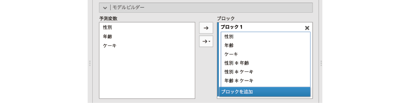
```

分析の初期設定では，このモデルビルダーの「Blocks（ブロック）」には分析に使用する3つの変数（「性別」，「年齢」，「ケーキ」）の主効果と，これらの1次の交互作用，2次の交互作用のすべてが含まれています。これは先ほど結果の見方のところで説明したように「飽和モデル」と呼ばれるモデルで，このモデルでは観測データを完全に説明することが可能です。

飽和モデルはデータを完全に説明できる反面，構造が複雑になってしまうため，理解することが困難になりがちです。データ解析の目的は，そのデータに含まれる変数間の関係を解き明かし，理解することにあるわけですから，それでは困ります。そこで，この飽和モデルから結果に大きな影響を与えていない主効果や交互作用を取り除き，モデルを単純化していくことにします。

まずは，`r blueback('+ Add New Block')`をクリックして，新たなブロックを作成しましょう。そして，その新しく作成したブロックに，飽和モデルに含まれる項目のうち，もっとも複雑な項目である3変数の交互作用（2次の交互作用）「性別＊年齢＊ケーキ」を「**Block 1**」から「**Block 2**」にドラッグして移動します（図\@ref(fig:frequencies-loglin-modelbuilder-2way-interaction)）。

<!--  -->

```{r frequencies-loglin-modelbuilder-2way-interaction, fig.cap='2次の交互作用をBlock 2に移動', echo=FALSE}
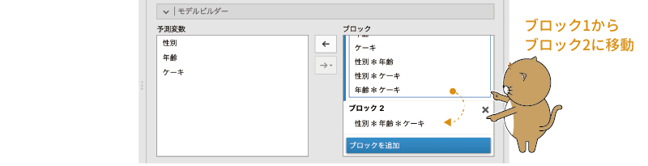
```

この状態で一度結果を見てみましょう。見る必要があるのは，「Model Fit Measures（モデル適合度指標）」と「Model Comparisons（モデルの比較）」の部分です（図\@ref(fig:frequencies-loglin-modelbuilder-comparison)）。

```{r frequencies-loglin-modelbuilder-comparison, fig.cap='モデルの比較', echo=FALSE}

```

この結果を見てみると，すべての項目を含む飽和モデル（Model 2）と，そこから2次の交互作用を取り除いたモデル（Model 1）では，飽和モデルの方がAICの値が大きく，また，この2つのモデルで適合度に有意な差はないことがわかります。これはつまり，2次の交互作用はこのデータを説明するうえで余分というか過剰な項目であるということです。そこで，この交互作用は分析モデルから除外してしまいましょう。

モデルビルダーの「**Block 2**」にある「性別＊年齢＊ケーキ」を選択し，「`r infig('action-back')`」をクリックして分析モデルから除外します（図\@ref(fig:frequencies-loglin-modelbuilder-2way-removed)）。

```{r frequencies-loglin-modelbuilder-2way-removed, fig.cap='分析モデルから交互作用を除外', echo=FALSE}
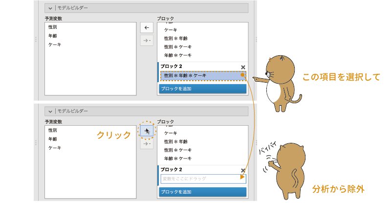
```

今度は1次の交互作用（2つの変数間の交互作用）についても見ていきましょう。1次の交互作用は，「性別＊年齢」，「性別＊ケーキ」，「年齢＊ケーキ」の3つですが，このうち，「性別＊ケーキ」と「年齢＊ケーキ」の交互作用は，それぞれ「性別によってケーキの選択比率が違う」，「大人か子供かによってケーキの選択比率が違う」という意味ですが，「性別＊年齢」の交互作用は「性別によって大人と子供の比率が違う」という意味で，これは今回の分析における関心とは関連がありません。また，今回のデータは大人も子供も男女同数ですので，この分析においては意味がない項目です。

そこで，今度はこの「性別＊年齢」を「**Block 2**」に入れて，これを除外した場合とそうでない場合とでモデルの適合度がどう変化するかを見てみましょう（図\@ref(fig:frequencies-loglin-modelbuilder-compare2)）。

```{r frequencies-loglin-modelbuilder-compare2, fig.cap='再度モデルを比較', echo=FALSE}

```

すると，この場合も「性別＊年齢」を除外したモデルの方がAICの値が小さく，相対的な適合度が高いことが示されました。また，2つのモデルで適合度に有意な差はありません。そこで，この交互作用もモデルから除外してしまいましょう。

1次の交互作用はあと2つ残っています。この2つはどちらも分析の関心と関連があるものですが，念のためモデルへの影響度を見ておきましょう。まずは「年齢＊ケーキ」について，先ほどと同様にして結果を見てみましょう。すると，この場合の結果は図\@ref(fig:frequencies-loglin-modelbuilder-comparison3)のようになります。

<!-- -->

```{r frequencies-loglin-modelbuilder-comparison3, fig.cap='年齢とケーキの交互作用についての検討', echo=FALSE}
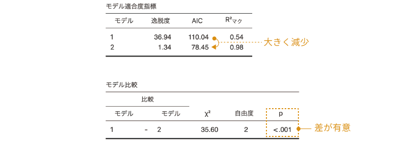
```

この結果では，モデルに「年齢＊ケーキ」の交互作用を加えることによって大きくAICの値が減少しており，また，これを入れたモデルと除外したモデルでは，適合度に有意な差があることがわかります。つまり，この交互作用はモデルから除外すべきではありません。

同様に，「性別＊ケーキ」についても見てみましょう。この場合は図\@ref(fig:frequencies-loglin-modelbuilder-comparison4)の結果が得られます。

```{r frequencies-loglin-modelbuilder-comparison4, fig.cap='性別とケーキの交互作用についての検討', echo=FALSE}

```

この結果から，「性別＊ケーキ」の交互作用もモデルから除外しない方が良さそうです。

さて，次は「性別」，「年齢」，「ケーキ」それぞれの主効果についてですが，ここまでの結果では「性別＊ケーキ」と「年齢＊ケーキ」がモデルに含まれており，そしてこの3つの変数はこの交互作用の少なくとも1つに関係していますので，これらはモデルから除外することができません。そのため，ここでモデルの修正はおしまいということになります。

このようなモデル修正の結果，性別，年齢，ケーキの選択の各主効果と，性別&times;ケーキ，年齢&times;ケーキの交互作用から結果を説明できそうだということがわかりました。なお，ここでの分析の関心は，性別によって選択するケーキの比率に違いがあるか，年齢によって選択するケーキの比率に違いがあるかということでしょうから，これらのうち，とくに交互作用について中心的に見ていくことになります。

### Reference Levels：基準レベル{#sub:frequencies-loglin-referencelevels}

モデルの修正によって分析結果は単純化されたのですが，それでもまだ，「Model Coeffcients（モデル係数）」の結果の表の解釈には注意が必要です。基本設定のみの分析結果のところでも説明したように，この係数の値は，各変数のどの値を基準に考えるかによって大きく変わるからです。そのため，分析結果について検討するには，各変数における基準値をよく確認し，必要に応じて基準値を変更しなくてはなりません。

設定画面の`r groupbar('Reference Levels')`（基準レベル）を展開すると，初期状態では図\@ref(fig:frequencies-loglin-referencelevels)のようになっているはずです。

```{r frequencies-loglin-referencelevels, fig.cap='基準レベルの設定', echo=FALSE}

```

そして，この状態での「Model Coefficients（モデル係数）」の表は，図\@ref(fig:frequencies-loglin-referencelevels-result1)のようになっています。

```{r frequencies-loglin-referencelevels-result1, fig.cap='対数線形回帰分析の結果', echo=FALSE}

```

```{r}
out.data04<-jmv::logLinear(
    data = fq.data04,
    factors = vars(性別, 年齢, ケーキ),
    counts = 人数,
    blocks = list(
        list(
            "性別",
            "年齢",
            "ケーキ",
            c("性別", "ケーキ"),
            c("年齢", "ケーキ")),
        list()),
    refLevels = list(
        list(
            var="性別",
            ref="男"),
        list(
            var="年齢",
            ref="子供"),
        list(
            var="ケーキ",
            ref="ショート")))

ll.intercept<-round(out.data04$models[[1]]$coef$asDF$est[1],2)
ll.sex<-round(out.data04$models[[1]]$coef$asDF$est[3],2)
ll.age<-round(out.data04$models[[1]]$coef$asDF$est[5],2)
ll.cake.cz<-round(out.data04$models[[1]]$coef$asDF$est[7],2)
ll.cake.cc<-round(out.data04$models[[1]]$coef$asDF$est[8],2)
ll.cake.sex.f.cz<-round(out.data04$models[[1]]$coef$asDF$est[10],2)
ll.cake.sex.f.cc<-round(out.data04$models[[1]]$coef$asDF$est[11],2)
ll.age.cake.a.cz<-round(out.data04$models[[1]]$coef$asDF$est[13],2)
ll.age.cake.a.cc<-round(out.data04$models[[1]]$coef$asDF$est[14],2)

```
この場合，結果の表では，「男」の「子供」で「ショート（ケーキ）」を選択した度数が入力されているセルが基準となっており，切片の値は，その基準セルについてこの分析モデルから推定される度数の対数値になっています。つまり，切片の値「`r ll.intercept`」を指数変換したもの（\(e^{\textsf{`r ll.intercept`}}=\textsf{`r round(exp(ll.intercept),2)`}\)）が，「男性・子供・ショートケーキ」のセルの推定度数ということです。

そして，その下の「性別:」の部分には「女 - 男（男性と比較した場合の女性の値）」についての推定値（**Estimate**）があり，そしてこの値のpは0.049で有意になっていますが，これは，男性に比べて女性の度数が有意に小さいという意味ではなく，「**男性**・子供・ショートケーキ」のセルに比べて「**女性**・子供・ショートケーキ」のセルの度数が有意に小さいという意味です。この場合，「女性・子供・ショートケーキ」の推定度数は，切片の`r ll.intercept`に\(-\textsf{`r sprintf('%.2f',abs(ll.sex))`}\)を加えた値を指数変換したもの（\(e^{\textsf{`r ll.intercept`}+(-\textsf{`r sprintf('%.2f',abs(ll.sex))`})}=\textsf{`r round(exp(ll.intercept+ll.sex),2)`}\)）になります。

同様に，その下の「年齢:」の部分にある「大人 - 子供」は，子供に比べて大人の度数が大きいということではなく，「男性・**子供**・ショートケーキ」のセルに比べて「男性・**大人**・ショートケーキ」の度数が有意に大きいという意味です。そしてこの係数から推定されるのは「男性・大人・ショートケーキ」の度数です。もし，「**女**・**大人**・ショートケーキ」の度数について推定したければ，そのセルは切片（男性・子供・ショートケーキ）から男性を女性に，子供を大人に変更した場合ということになるので，「女 - 男」の係数と「大人 - 子供」の係数の両方を切片に加えたもの（`r ll.intercept` + (\(-\textsf{`r sprintf('%.2f',abs(ll.sex))`}\)) + `r sprintf('%.2f',ll.age)` = `r ll.intercept+ll.sex+ll.age`）を指数変換した値（\(e^{\textsf{`r ll.intercept+ll.sex+ll.age`}}=\textsf{`r round(exp( ll.intercept+ll.sex+ll.age),2)`}\)）がその推定値ということになるのです。

その下の交互作用の部分はさらに複雑です。「性別＊ケーキ:」の部分にある「(女 - 男)＊(チーズ - ショート)」は，「大人・女性・チーズケーキ」のセルに関する推定値なのですが，この係数はあくまでも交互作用の影響のみについてのものであるため，このセルの推定値を算出したい場合には，切片の値に「女 - 男」の係数と「チーズ - ショート」の係数を加え，さらにそこにこの係数の値を加えたうえで指数変換する必要があります。

つまり，この結果の表に示されている主効果や交互作用の係数は，図\@ref(fig:frequencies-loglin-results-interpretation)の関係について示したものなのです。

```{r frequencies-loglin-results-interpretation, fig.cap='対数線形回帰分析の係数とクロス集計表の関係', echo=FALSE}
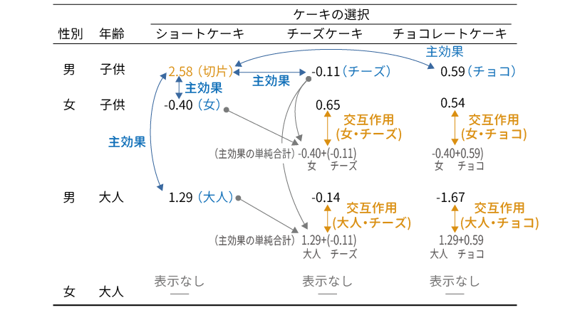
```

そして，これらの結果からいえるのは以下の点ということになります。以下には検定結果が有意であったもののみを示します。

+ ショートケーキを選ぶのは，男児より女児の方が少ない（推定値 = \(-\textsf{`r sprintf('%.2f',abs(ll.sex))`}\), p = 0.049）
+ ショートケーキを選ぶのは，男児より男性の大人の方が多い（推定値 = `r sprintf('%.2f',ll.age)`, p < 0.001）
+ 男児ではショートケーキを選ぶよりチョコレートケーキを選ぶ方が多い（推定値 = `r sprintf('%.2f',ll.cake.cc)`, p < 0.001）
+ 女児でチーズケーキを選ぶのは，「女+子供＋チーズケーキ」の組み合わせから想定される数よりも多い（推定値 = `r sprintf('%.2f',ll.cake.sex.f.cz)`, p = 0.019）
+ 大人の男性でチョコレートケーキを選ぶ人は，「男+大人＋チョコレートケーキ」の組み合わせから想定される数よりも少ない（推定値 = \(-\textsf{`r sprintf('%.2f',abs(ll.age.cake.a.cc))`}\), p < 0.001）

このうち，「ショートケーキを選ぶ人では，大人の男性より男児の方が人数が少ない」の部分については注意が必要です。今回のデータファイルでは子供の人数は大人の半分であり，これはあたりまえの結果だからです。ですので，この部分に何か特別な意味があると勘違いしないようにしましょう。

また，ここに挙げた結果に検討したい部分が含まれていない場合には，`r groupbar('Reference Levels')`で基準レベルを適切に変更し，そこで得られた結果を確認しなくてはなりません。

このように，対数線形回帰分析は結果の解釈が非常に複雑になってしまうのが難点です。

### Model Fit：モデル適合度{#sub:frequencies-loglin-modelfit}

設定画面の`r groupbar('Model Fit')`（モデル適合度）には，図\@ref(fig:frequencies-loglin-model-fit)の項目が含まれています。

```{r frequencies-loglin-model-fit, fig.cap='適合度指標の設定', echo=FALSE}

```

:::{.jmvsettings data-latex=""}
+ **Fit Measures**（適合度指標）
  - Deviance（逸脱度）　モデルの残差逸脱度を算出します。
  - AIC（赤池情報量規準）　赤池情報量規準を算出します。
  - BIC（ベイズ情報量規準）　ベイズ情報量規準を算出します。
  - Overall model test（モデル全体の検定）　$\chi^{2}$を用いてモデル全体の有意性検定を行います。
+ **Pseudo R²**（擬似決定係数）　モデルのあてはまりの程度を標準化した値を算出します。
  - McFadden's R²（マクファデンのR²）　マクファデンの擬似決定係数を算出します。
  - Cox & Snell's R²（コックス=スネルのR²）　コックス＝スネルの擬似決定係数を算出します。
  - Nagelkerke's R²（ナゲルケルケのR²）　ナゲルケルケの擬似決定係数を算出します。
:::

これらの項目は2項ロジスティック回帰（第\@ref(ch:regression)章 \@ref(sec:regression-binomial)）の[モデルの適合度](#sub:regression-binomial-model-fit)と同じものですので，ここでは説明を省略します。

### Model Coefficients：モデル係数 {#sub:frequencies-loglin-coeff}

設定画面の`r groupbar('Model Coefficients')`（モデル係数）には，次の項目が含まれています（図\@ref(fig:frequencies-loglin-coeff)）。

```{r frequencies-loglin-coeff, fig.cap='モデル係数の設定', echo=FALSE}

```

:::{.jmvsettings data-latex=""}
+ **Omnibus Tests**（オムニバス検定）
  - Likelihood ratio tests（尤度比検定）　モデル全体の適合度について尤度比検定を行います。
+ **Estimate (Log Rate Ratio)**（推定値：対数率比）
  - Confidence Interval（信頼区間）　対数率比の信頼区間を算出します。
+ **Rate Ratio**（率比）
  - Rate Ratio（率比）　率比を算出します。
  - Confidence Interval（信頼区間）　率比の信頼区間を算出します。
:::

尤度比を用いたオムニバス検定については，ロジスティック回帰の場合と同じですのでここでは説明を省略します。

それ以外の数値についても，基本はロジスティック回帰分析の場合と同じですが，ここで示されるのは*オッズ比*ではなく，各セルの比率に基づく*率比*（比率の比）である点には注意してください。対数線形モデルでは，回帰モデルの各係数は，*対数オッズ比*ではなく，比率の比の対数になっているからです。ただ，このように回帰係数の値の性質が少し異なるというだけで，表示される結果の見方や考え方はロジスティック回帰分析の場合と同じです。「**Estimate (Log Rate Ratio)**」の「Confidence interval」にチェックを入れれば，回帰係数の信頼区間が算出されますし，「**Rate Ratio**」の部分の設定を行えば，回帰係数を指数変換した値やその信頼区間を表示させることができます。

### Estimated Marginal Means：推定周辺平均 {#sub:frequencies-loglin-emm}

設定画面の`r groupbar('Estimated Marginal Means')`（推定周辺平均）には，次の項目が含まれています。

:::{.jmvsettings data-latex=""}
+ Marginal Means（周辺平均値）　周辺平均値の算出対象を指定します
+ **General Options**（全般オプション）
  - Equal cell weights（均等重みづけ）
  - Confidence interval（信頼区間）　周辺平均値の信頼区間を算出します
+ **Output**（出力）
  - Marginal means plots（周辺平均値のグラフ）
  - Marginal means tables（周辺平均値の表）
:::

`r groupbar('Estimated Marginal Means')`（推定周辺平均）の設定項目やその使用方法は，第\@ref(ch:regression)章の線形回帰のところで説明したのと同じですので，詳細についてはここでは説明は省略します（線形回帰の「[Estimated Marginal Means（推定周辺平均）](#sub:regression-LR-marginalmeans)」を参照）。

なお，このオプションで表示される「推定周辺平均」は，回帰モデルの予測値，つまりは度数の推定値ですので，その点だけ注意してください。

