```{r, echo =F,message=FALSE}
  source("rscripts/_utility.R")
```

# 因子分析 {#ch-factor}

この章では，「`r infig("analysis-factor")`  因子分析」ツールについて見ていきます。jamoviの基本構成では，ここには次の分析メニューが含まれています（図\@ref(fig:factor-menu)）。

```{r}
data01 <- read.csv("data/factor_data01.csv")

# ID
attributes(data01$ID)$`jmv-id` <- TRUE

# 連続変数
attributes(data01$Q1)$measureType <- c("Continuous")
attributes(data01$Q2)$measureType <- c("Continuous")
attributes(data01$Q3)$measureType <- c("Continuous")
attributes(data01$Q4)$measureType <- c("Continuous")
attributes(data01$Q5)$measureType <- c("Continuous")


# 説明
attributes(data01$ID)$description <- "対象者のID"
attributes(data01$Q1)$description <- "メッセージアプリをよく使う"
attributes(data01$Q2)$description <- "メッセージアプリよりメールで連絡することのほうが多い"
attributes(data01$Q3)$description <- "メッセージアプリでやりとりするのは楽しい"
attributes(data01$Q4)$description <- "メッセージアプリは何かとめんどくさい"
attributes(data01$Q5)$description <- "送信メッセージに反応がないとソワソワする"

out <- jmvReadWrite::write_omv(data01, "data/omv/factor_data01.omv", frcWrt = TRUE)

```


```{r factor-menu, fig.cap="因子分析のメニュー", echo=FALSE}

```

:::{.jmvmenu data-latex=""}
+ **尺度分析**
  - 信頼性分析　尺度の内的一貫性についての指標を算出します。
+ **データ縮約**
  - 主成分分析　主成分分析を用いてデータを少数の主成分に集約します。
  - 探索的因子分析　複数の変数の背後にある共通因子を探索します。
  - 確認的因子分析　想定される因子モデルがデータに適合しているかどうかを確かめます。
:::

それではまず，尺度分析の項目から見ていきましょう。

## 信頼性分析{#sec-factor-reliability-analysis}

ある体温計で数分間に3回繰り返して体温を測ったとき，1回目の測定では36.6度，2回目は36.5度，3回目は36.6度だったとしましょう。この体温計では，3回の測定値がほとんど同じです。そして別の体温計で同じように3回の測定を行ったとき，1回目の測定では36.2度，2回目には35.1度，3回目は38.2度だったとします。このような場合，1つ目の体温計と2つ目の体温計のどちらを信頼するかと聞かれたら，ほとんどの人は1つ目の体温計を選ぶことでしょう。2つ目の体温計は，測定値がコロコロ変わり，正しく測れているのかどうかもわからないからです。

それは心理尺度の場合も同様です。尺度による測定値が，測定のたびにコロコロと変わるようでは困ります。測定のたびにIQの値が10も20も変わるようでは，その知能検査の結果はあてになりません。

そして，そうした尺度の*信頼性*について，客観的な指標を用いて確認しようとするのが*信頼性分析*です。信頼性にはいくつかの確認方法がありますが，jamoviでは*内的一貫性*の指標を用いた信頼性分析が利用できます。

### 考え方{#sub:factor-reliability-analysis-basic}

心理学の調査では，*リカート法*^[示された文章の内容について，「まったくあてはまらない」から「とてもよくあてはまる」までの5段階や7段階の選択肢から答えさせる手法。]による心理測定尺度がよく用いられます。通常，それらの尺度は内容的に関連のある複数の質問で構成されており，それら複数の質問に対する回答値を合計したり平均したりすることによって尺度得点が算出されます。

このように，複数の質問に対する回答値を足したり平均したりして1つの尺度得点として使用するためには，当然ながらそれらの質問が同じ内容について測定しているものでなくてはなりません。このような同一尺度内における質問内容の一貫性は，*内的一貫性*や*内的整合性*と呼ばれます。

内的一貫性が高い尺度では，ある質問に対して「5」と答えた回答者は他の質問に対しても「5」と答える可能性が高く，「1」と答えた回答者は「1」と答える可能性が高いというように，同じ1人の回答者の中でその回答値が似通ったものになるはずです。類似した内容を測定しているのであれば測定結果も類似した値が得られるということは，その尺度における測定結果が安定したものである（信頼性のあるものである）ことを意味するわけです。


複数の質問で構成される心理尺度を用いた測定を行う場合には，その尺度における内的一貫性が十分であるかどうかの確認が行われますが，その際の内的一貫性の指標としてよく用いられているのが*クロンバックのアルファ*（α）や*アルファ係数*と呼ばれる値です。この値はしばしば*信頼性係数*とも呼ばれます。このクロンバックのアルファは，次のように尺度に含まれる各質問の回答値の分散と，参加者ごとの回答値の合計の分散から算出されます。

\[
 \alpha = \frac{\text{質問数}}{\text{質問数}-1}\times\left(1-\displaystyle\frac{\text{各質問の分散の合計}}{\text{各回答者の合計の分散}}\right)
\]

このようにして計算すると，質問ごとの回答のばらつきが一人一人の回答のばらつきよりも小さい（つまりそれぞれの質問に対する回答値が似通っている）場合にクロンバックのアルファが1に近くなります。

このアルファの値は0から1の値をとり，その大きさについては表\@ref(tab:factor-cronbach-alpha)のような目安を用いて解釈が行われます。一般に，心理尺度においてはこの値が0.8以上ある場合に内的一貫性があるとみなされます。


```{r, factor-cronbach-alpha}
alpha.cronbach %>%
  kable(
    align = "cc",
    linesep = "",
    caption = "クロンバックのアルファの解釈の目安", booktabs = T) %>%
  kable_styling(latex_options = "HOLD_position")
```


### 基本手順 {#sub:factor-reliability-analysis-method}

ここでは，このサンプルデータ（[factor_data01.omv](https://github.com/sbtseiji/jmv_compguide/raw/main/data/omv/factor_data01.omv)）を用いて尺度の内的一貫性について分析してみましょう。このデータは「メッセージアプリ志向尺度」を用いて測定されたもので，次の変数が含まれています。なお，各質問への回答は，いずれも「1:まったくあてはまらない」から「5:とてもよくあてはまる」までの5段階です（図\@ref(fig:factor-data01)）。

```{r factor-data01, fig.cap="サンプルデータ", echo=FALSE}

```

:::{.jmvvar data-latex=""}
+ `ID`　対象者のID
+ `Q1`　「メッセージアプリをよく使う」への回答値
+ `Q2`　「メッセージアプリよりメールで連絡することのほうが多い」への回答値
+ `Q3`　「メッセージアプリでやりとりするのは楽しい」への回答値
+ `Q4`　「メッセージアプリは何かとめんどくさい」への回答値
+ `Q5`　「送信メッセージに反応がないとソワソワする」への回答値
:::

このデータについて信頼性分析を実施するには，分析タブの「`r infig("analysis-factor")`  因子分析」から「信頼性分析」を選択します（図\@ref(fig:factor-reliability-menu)）。

```{r factor-reliability-menu, fig.cap="信頼性分析の実行", echo=FALSE}
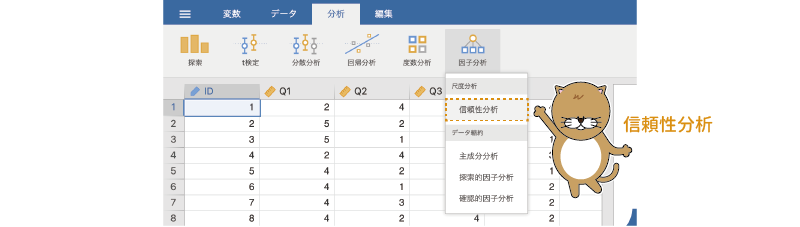
```

すると，図\@ref(fig:factor-reliability-setting)のような設定画面が表示されます。


```{r factor-reliability-setting, fig.cap="信頼性分析の設定", echo=FALSE}
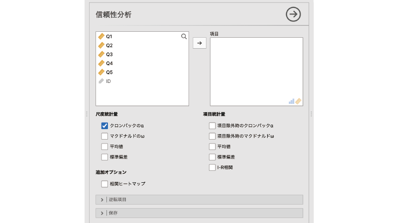
```

:::{.jmvsettings data-latex=""}
+ 項目　分析対象の項目（変数）を指定します。
+ **尺度統計量**　尺度全体についての統計量を算出します。
+ **項目統計量**　各項目（変数）に関する統計量を算出します。
+ **追加オプション**　結果表示に関するその他の設定です。
+ `r groupbar("逆転項目")`　逆転項目に関する設定を行います。
+ `r groupbar("保存")`　計算結果を変数値として保存します。
:::

この画面で，内的一貫性の指標を算出したい質問の回答値が入った変数を指定します。通常は1つの尺度に含まれている質問すべてを指定しますが，その尺度が複数の下位尺度^[1つの尺度の中でさらに小区分に分けられているもののことです。たとえば，ある性格特性尺度が外向性尺度，神経症傾向尺度など複数の小尺度からなる場合，外向性尺度や神経症尺度のことをその性格特性尺度の下位尺度と呼びます。]から構成されている場合には，1つの下位尺度に含まれている質問のみを指定します。サンプルデータのメッセージアプリ志向尺度は「Q1」から「Q5」までの5つの質問で構成されていますので，これら5つを「項目」の領域に移動します（図\@ref(fig:factor-reliability-set-var)）。

```{r factor-reliability-set-var, fig.cap="分析対象の設定", echo=FALSE}

```

これで基本的な分析の設定は終わりです，といいたいところですが，残念ながらそうではありません。今回のデータでは，適切な分析結果を得るためにはあと少しだけ設定が必要です。これでなぜ分析設定が完了でないのかは，出力ウィンドウにある結果の表を見てみるとわかります（図\@ref(fig:factor-reliability-error)）。

```{r factor-reliability-error, fig.cap="分析の設定上の問題", echo=FALSE}

```

まず，この結果ではクロンバックのアルファの値がマイナスになっており，これは明らかに計算が正しくありません。そして，この表の下には何やら注釈が長々と書かれています。この注を見てみると，「項目'Q2'および'Q4'は尺度全体と負の相関関係にあるため，逆転項目として処理したほうがよいでしょう」と書かれています。

実際，このサンプルデータでは，「Q1」と「Q3」，「Q5」はメッセージアプリの使用が多いほど回答値が大きくなる質問ですが，「Q2」と「Q4」はその逆で，メッセージアプリをあまり使わない人ほど回答値が大きくなるような，逆内容の質問です。このような，他の質問とは逆内容の質問を含む項目は*逆転項目*と呼ばれ，内的一貫性の分析においては，これらはそのままでは分析できません。

### 逆転項目 {#sub:factor-reliability-reverse-scaled-items}

尺度を構成する質問の中に逆転項目が含まれている場合には，分析設定画面の［逆転項目］の部分を展開し，それらを適切に設定する必要があります（図\@ref(fig:factor-reliability-reverse-items)）。

```{r factor-reliability-reverse-items, fig.cap="逆転項目の設定画面", echo=FALSE}

```

この画面の左側に通常の尺度項目が，右側に逆転項目が入るように，必要な変数を選択して移動します（図\@ref(fig:factor-reliability-reversed)）。

```{r factor-reliability-reversed, fig.cap="逆転項目の設定", echo=FALSE}
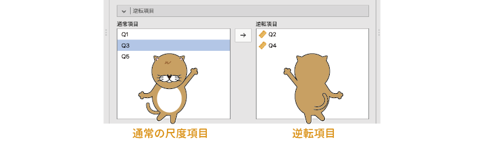
```

すると，図\@ref(fig:factor-reliability-cronbach)のように結果の表の下にあった注釈が消え，そして算出結果も0.84という正常な値になりました。

```{r factor-reliability-cronbach, fig.cap="クロンバックのアルファの算出結果", echo=FALSE}

```

この結果から，このメッセージアプリ志向尺度の内的一貫性の値は0.84で，十分な内的一貫性を持っているといえそうです。

#### 尺度統計量{-#subsub:factor-reliability-scale-statistics}

さて，少し前後しましたが，ここからは分析設定の詳細についてみていくことにしましょう。設定画面の**尺度統計量**の部分では，尺度全体についての内的一貫性を吟味するための指標を設定します。

ここには，次の4つの項目があります。

:::{.jmvsettings data-latex=""}
- クロンバックのα　尺度全体のクロンバックのアルファを算出します。
- マクドナルドのω　尺度全体のマクドナルドのオメガを算出します。
- 平均値　尺度全体の平均値を算出します。
- 標準偏差　尺度全体の標準偏差を算出します。
:::

これらの項目すべてにチェックを入れると，結果の表は図\@ref(fig:factor-reliability-statistics-results)のようになります。

<!--  -->
```{r factor-reliability-statistics-results, fig.cap="さまざまな尺度統計量", echo=FALSE}

```


このうち，クロンバックのアルファについてはすでに説明しましたので，それ以外の項目について見ていきましょう。

##### マクドナルドのω{-}

クロンバックのアルファは計算は単純なのですが，その分，正確さにかける部分があり，近年とくにその問題点がたびたび指摘されるようになっています^[とはいえ，クロンバックのアルファは現在でも尺度の内的一貫性の指標として非常によく用いられています。]。そこで，その代替的な指標として近年注目を集めているのが*マクドナルドのオメガ*（ω）です。この値は，*オメガ係数*とも呼ばれます。

クロンバックのアルファでは，尺度に含まれる各質問に対する回答値をそのまま単純に合計しますが，マクドナルドのオメガでは各質問への回答値が共通因子から受けている影響（因子負荷量）を考慮して重みづけを行ったうえで合計します。このオメガについても基本的な解釈の仕方はクロンバックのアルファと同様で，0.8を超える場合に内的一貫性が高いとみなされます。サンプルデータでは，クロンバックのアルファとマクドナルドのオメガはほぼ同じ値で，オメガを指標とした場合にも十分な内的一貫性があることが示されました。

##### 平均値，標準偏差 {-}

**尺度統計量**の「平均値」と「標準偏差」にチェックを入れると，尺度全体の回答値の平均と標準偏差が算出されます。


#### 項目統計量{-#subsub:factor-reliability-item-statistics}

**項目統計量**には，尺度を構成する個別の質問項目について吟味するための項目が含まれています。

<!--  -->

:::{.jmvsettings data-latex=""}
- 項目除外時のクロンバックα
- 項目除外時のマクドナルドω
- 平均値
- 標準偏差
- I-R相関
:::


ここでも，すべての項目にチェックを入れてその結果を見てみましょう（図\@ref(fig:factor-reliability-item-statistics)）。

<!--結果  -->
```{r factor-reliability-item-statistics, fig.cap="項目ごとの統計量", echo=FALSE}
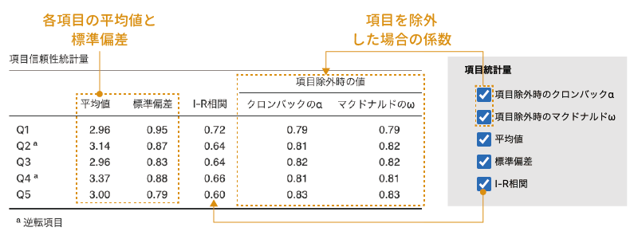
```

##### 項目除外時のクロンバックα

この項目は，各質問項目を分析から除外した場合にクロンバックのアルファの値がどのように変化するかを示します。ここに表示されている値の中に尺度全体の値よりも大きなものがある場合，その項目を分析から除外することで尺度全体のアルファ係数が上昇することを意味します。今回の分析結果では，いずれの値も全体の値を下回っていますので，分析から除外すべき質問項目はなさそうです。

##### 項目除外時のマクドナルドω

この項目は，各質問項目を分析から除外した場合にマクドナルドのオメガの値がどのように変化するかを示します。ここに表示されている値の中に尺度全体の値よりも大きなものがある場合，その項目を分析から除外することで尺度全体のオメガ係数が上昇することを意味します。クロンバックのアルファの場合と同様に，この結果ではオメガの値はいずれも全体の値を下回っていますので，分析から除外すべき質問項目はなさそうです。

##### 平均値，標準偏差 {-}

ここでの「平均値」と「標準偏差」は，「Q1」から「Q5」それぞれの平均値と標準偏差を表示します。

##### I-R相関{-}

一番下にある「I-R相関」の項目にチェックを入れると，*I-R相関*と呼ばれる指標が算出されます。I-R相関は，各質問項目（item）の回答値とそれ以外の項目（rest）の合計値の間の相関係数です。このI-R相関が著しく低い場合には，その質問項目が他の質問項目と異なる回答傾向を持っている（一貫性が低い）ことが考えられます。今回の分析結果では，「Q1」から「Q5」の中にそのような傾向はみられません。

#### 追加オプション{-}

**追加オプション**にある「相関ヒートマップ」にチェックを入れると，相関行列を*ヒートマップ*の形で視覚化した図が作成されます。ヒートマップとは，相関係数の大きさや向きを色の違いや濃淡で示したもののことをいいます。1つの尺度に含まれる質問項目の数が多い場合，ヒートマップの形で視覚化することによって，他と傾向の異なる質問項目を見つけやすくなります（図\@ref(fig:factor-reliability-heatmap)）。

```{r factor-reliability-heatmap, fig.cap="相関係数のヒートマップ", echo=FALSE}
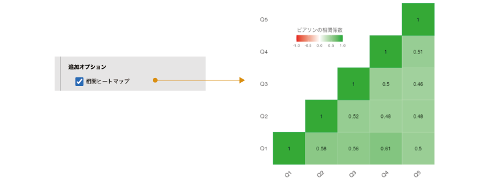
```

このヒートマップでは，正の相関係数が緑，負の相関係数が赤で，そして相関係数の絶対値が大きくなるほど緑または赤の色が濃くなる形で示されています。


### 保存{#sub:factor-reliability-save}

設定画面の一番下にある`r groupbar("保存")`の項目では，逆転項目の処理を行ったうえで，各質問項目の回答値の合計または平均値を新たな変数として保存することができます（図\@ref(fig:factor-reliability-menu)）。

```{r factor-reliability-save-scores, fig.cap="尺度得点の保存", echo=FALSE}

```

:::{.jmvsettings data-latex=""}
- 平均得点　回答値（逆転処理済）の平均値を尺度得点として保存します。
- 合計得点　回答値（逆転処理済）の合計値を尺度得点として保存します。
:::


第\@ref(ch-basics)章の「[尺度得点の算出](sec-practice-handling.html#sub:basics2-scale-score)」では，計算変数を用いて尺度得点を変数に格納する方法を紹介しましたが，jamoviではこのようにして簡単に尺度得点を作成することもできるのです。

このとき，「平均得点」にチェックを入れれば各質問項目への回答値の平均値が，「合計得点」にチェックを入れれば合計値が新たな変数として保存されます。

## 主成分分析{#sec-factor-pca}

ここからは，数学的にデータを縮約する方法について見ていきましょう。

データの縮約とは，たくさんあるデータを類似性などを基準に整理し，それらをより少数の意味あるまとまりとして集約することをいいます。質問紙調査などによる調査研究では，データとして何十種類もの質問文に対する回答値が得られるのが普通ですし，それ以外の場合にも，関心のある事象に関連した指標をできる限り幅広く集めて分析を行おうとすると，分析に使用する変数の種類は膨大になってしまいます。そこで，そのような場合には，多変量解析によって，そうした複雑なデータを，できるだけ元の情報を損なわないようにしながら可能な限り単純化し，理解可能なものに分類，整理しようとするわけです。

このデータ縮約の方法の1つとして，*主成分分析*（PCA）があります。主成分分析では，次に説明するような考え方で複数の変数がもつ情報を統合し，より少ない数の合成変数に集約するということを行います。

### 考え方

ここでは次のサンプルデータ（[factor_data02.omv](https://github.com/sbtseiji/jmv_compguide/raw/main/data/omv/factor_data02.omv)）を用いて主成分分析の基本的な考え方を見ておきましょう。このデータは，ある大学の学生男女計250人を対象に，食堂で提供されている代表的なメニュー6種類に対する満足度を「1:とても不満」から「7:非常に満足」までの7段階でたずねた結果です（図\@ref(fig:factor-data02)）。このデータを用い，この食堂で提供されているメニューに対する総合的な満足度について分析したいと思います。

```{r}
data02 <- read.csv("data/factor_data02.csv")

# ID
attributes(data02$ID)$`jmv-id` <- TRUE

# 連続変数
attributes(data02$パスタ)$measureType <- c("Continuous")
attributes(data02$カレー)$measureType <- c("Continuous")
attributes(data02$ラーメン)$measureType <- c("Continuous")
attributes(data02$カツ丼)$measureType <- c("Continuous")
attributes(data02$オムライス)$measureType <- c("Continuous")
attributes(data02$ドリア)$measureType <- c("Continuous")

# 名義変数
data02$性別 <- factor(data02$性別)
attributes(data02$性別)$levels <- c("男", "女")
attributes(data02$性別)$values <- c(1, 2)
attributes(data02$性別)$measureType <- c("Nominal")

# 説明
attributes(data02$ID)$description <- "回答者のID"
attributes(data02$性別)$description <- "回答者の性別"
attributes(data02$パスタ)$description <- "パスタに対する満足度（1〜7）"
attributes(data02$カレー)$description <- "カレーに対する満足度（1〜7）"
attributes(data02$ラーメン)$description <- "ラーメンに対する満足度（1〜7）"
attributes(data02$カツ丼)$description <- "カツ丼に対する満足度（1〜7）"
attributes(data02$オムライス)$description <- "オムライスに対する満足度（1〜7）"
attributes(data02$ドリア)$description <- "ドリアに対する満足度（1〜7）"


out <- jmvReadWrite::write_omv(data02, "data/omv/factor_data02.omv", frcWrt = TRUE)

```

```{r factor-data02, fig.cap="サンプルデータ", echo=FALSE}

```

:::{.jmvvar data-latex=""}
+ `ID` 回答者のID
+ `性別`　回答者の性別
+ `パスタ`　パスタに対する満足度
+ `カレー`　カレーに対する満足感
+ `ラーメン`　ラーメンに対する満足感
+ `カツ丼`　カツ丼に対する満足感
+ `オムライス`　オムライスに対する満足感
+ `ドリア`　ドリアに対する満足感
:::

このデータには全部で6種類のメニューに対する満足度が記録されているわけですが，これらを個別に分析した場合，個別のメニューに対する満足度の傾向は見ることができても，メニュー全体に対する全体的な満足度についてはわかりません。メニューに対する全体的満足度について知るには，これら6つのメニューに対する満足度を，なんらかの形で統合する必要があります。それにはどうすればよいのでしょうか。ここでは話を単純にするために，2つの変数を1つに統合する場合を例に見ていきます。

ここに，r=0.8の正の相関関係にある2つの変数があるとします。相関係数が0.8の変数の値を散布図に示すと，おおよそ図\@ref(fig:factor-pca-scatter1)のようなものになります。

```{r factor-pca-scatter1, fig.cap="相関r=0.8の2変数の散布図", echo=FALSE}

```


この散布図は，2つの変数が持っている情報を，変数1の軸（横軸）と変数2の軸（縦軸）の2つの軸で表現される平面上の点として表現したものです。そして，この2つの変数がもつ情報を1つに集約するということは，この2つの軸で表現されている情報を1つの軸だけで表現するということになるのです。

ここで，たとえばこの散布図に示されたデータの情報を横軸のみで表現した場合について考えてみましょう。縦軸のみで表現するということは，縦軸の値（変数2）は無視するということですので，ここでは変数2の値をすべて0として散布図上に示しなおします（図\@ref(fig:factor-pca-scatter2)）。

```{r factor-pca-scatter2, fig.cap="データを横軸に集約した場合の散布図", echo=FALSE}
knitr::include_graphics("images/factor/pca-scatter2.png")
```

すると，散布図上の点が横一列に並びました。1つの軸で表現するということは，このようにデータの点が一直線上に並ぶようにするということなのです。

ただし，これでは単に変数2がもつ情報（y軸がもつ情報）を捨てているだけですので，2つの軸がもつ情報を1つの軸に集約したことによって，多くの情報が失われてしまいます（図\@ref(fig:factor-pca-scatter3)）。

```{r factor-pca-scatter3, fig.cap="集約による情報の損失", echo=FALSE}

```

そこで，もう少し工夫をしてみましょう。このように2変数間に正の相関がある場合，その散布図は右肩上がりの楕円形の形になります。その楕円の中央を，楕円の長いほうの軸にそって貫通するような直線を引き，その直線を軸として散布図上の情報を集約させてみます（図\@ref(fig:factor-pca-scatter4)）。

```{r factor-pca-scatter4, fig.cap="情報の損失が少ない軸に集約", echo=FALSE}

```

すると，先ほどの場合よりも失われる情報の量がずっと少なくなりました。このような形で情報を集約できれば，2つの軸で表現される情報を1つの軸で表現したとしても，もとの情報が多く損なわれてしまうということがありません。

主成分分析では，このようにしてデータのもつ情報ができるだけ失われないようにしながら，もとのデータよりも少ない軸を用いてデータを表現しなおすのです。

このとき，この情報を集約する軸は，次のような式によって表現されます。

\[
z = a_1 \times \text{変数}_1 + a_2 \times \text{変数}_2 + \cdots + a_n \times \text{変数}_n
\]


先ほどの2変数の例の場合，情報を集約する軸の式は，\(z=a_1\times\text{変数}_1+a_2\times\text{変数}_2\) となります。つまり，2つの変数の値になんらかの重みづけを行ったうえで合計するという形で合成得点を作成するのです。そして分析においては，このような変換によって失われる情報量が最小となるように，この式における重みづけの部分の値を決定します。

なお，この式は一見すると回帰分析で用いられる回帰式によく似ていますが，式の左辺にあるのが分析に使用する変数ではなく，合成得点zになっているという点に注意してください。この式によって算出される左辺zの値は*主成分得点*と呼ばれます。

それでは，jamoviにおける主成分分析の手順を見ていきましょう。なお，jamoviの主成分分析は，多変量解析の教科書の多くで説明されている主成分分析の形ではなく，かなり*因子分析*寄りの分析手法および結果表示になっています。この後の説明では，主成分分析と因子分析の違いを明確にするためにも，できるだけ統計法の教科書に近い形での結果になるように設定を行いながら分析を進めていきたいと思います。

また，主成分分析には分散共分散行列^[相関行列のような形の表で，相関行列ではつねに1になる表の左上から右下にかけての対角（同じ変数同士の組み合わせの部分）にその変数の分散，相関行列で各変数間の相関係数が示されている部分にそれらの変数の共分散が示されているもの。この分散共分散行列を標準化したものが相関行列です。]を用いる場合と相関行列を用いる場合とがあり，その両者で算出される固有ベクトルの値が異なります。jamoviでは，相関行列を用いた主成分分析が実行されます。

### 基本手順 {#sub:factor-pca-procedure}

主成分分析を実行するには，分析タブの「`r infig("analysis-factor")`  因子分析」から「主成分分析」を選択します（図\@ref(fig:factor-pca-menu)）。


```{r factor-pca-menu, fig.cap="主成分分析の実行", echo=FALSE}

```

すると，図\@ref(fig:factor-pca-setting)のような設定画面が表示されます。

<!-- -->
```{r factor-pca-setting, fig.cap="主成分分析の設定画面", echo=FALSE}

```

:::{.jmvsettings data-latex=""}
+ **方法**
  - 回転法　主成分の回転法を設定します。
+ **主成分数**
  - 平行分析に基づく　平行分析の結果をもとに主成分の個数を決定します。
  - 固有値に基づく　固有値の大きさが指定値以上の主成分を採用します。
  - 数値指定　主成分の個数を直接指定します。
+ 前提チェック
  - バートレットの球面性検定　バートレットの球面性検定を実施します。
  - KMO標本妥当性指標　標本妥当性指標（MSA）を算出します。
+ **因子負荷**
  - これ未満の負荷量を隠す　絶対値の小さい負荷量を非表示にします。
  - 負荷量順に並び替え　負荷量の絶対値が大きい順に変数を並び替えて表示します。
+ **追加の出力**
  - 主成分の要約量　各主成分について要約量を算出します。
  - 主成分の相関　各主成分の間の相関を算出します。
  - 回転前の固有値　回転前の固有値とその寄与率，累積寄与率を算出します。
  - スクリープロット　スクリープロットを表示します。
+ `r groupbar("保存")`　分析結果を新たな変数に保存します。
:::

この設定画面で，主成分分析の対象となる変数（「パスタ」から「ドリア」まで）を「変数」欄に移動します（図\@ref(fig:factor-pca-set-var)）。

<!-- -->
```{r factor-pca-set-var, fig.cap="分析対象の変数を設定", echo=FALSE}

```


これで基本的な分析手順は終わりです。ただし，主成分分析の結果は設定によって大きく変わりますので，結果の見方についての説明に入る前に，いくつかの設定項目について説明しておきたいと思います。

#### 回転法 {-#subsub:factor-pca-method}

主成分分析の目的は，たくさんの変数をできるだけ少数の変数に集約することにあります。そのため，まずは分析に使用した変数全体が持っている情報を1つの軸に集約し，そこで拾いきれなかった情報を2つ目，3つ目の軸に集約していくというのがもともとの考え方です。

しかし，情報の損失を最小限にすることだけを目的として軸を設定した場合，その軸が一体何を表しているのかが解釈困難になる場合もあります。心理学における研究の場合，多数ある変数を少数の軸に集約するだけでなく，それらの軸に対する解釈も重要な関心対象であることがよくあります。そのため，主成分分析の結果を解釈しやすくすることを目的として，分析で得られた軸に対して「*回転*」と呼ばれる操作を行う場合があります。

jamoviの主成分分析では，分析設定画面の「**方法**」にある「回転法」でこの回転方法についての設定ができるようになっており，初期設定値では，回転方法は「バリマックス」が指定されています。ここでは，この設定値を「なし」に設定してください（図\@ref(fig:factor-pca-rotate)）。


<!-- -->
<!-- -->
```{r factor-pca-rotate, fig.cap="主成分の回転法を「なし」に設定", echo=FALSE}
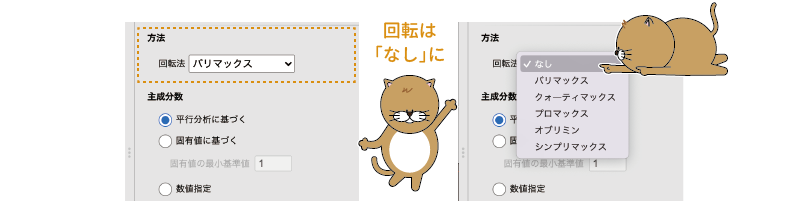
```

いわゆる「総合得点」を算出したい場合には，回転は「なし」にしておきます。そうすることによって，軸を回転する前の主成分分析結果を得ることができるからです。なお，多変量解析の教科書の多くは，主成分分析では回転を行っていません。

「総合得点」を算出することよりも集約した軸の解釈が主な目的の場合には，適切な回転方法を選んで指定します。軸の回転方法については因子分析のところで説明するため，ここでは省略します。


#### 主成分数 {-#subsub:factor-pca-component}

主成分分析では，計算上は元の変数と同じ数だけ主成分が抽出されます。しかし，変数が多いからデータがもつ情報を少数の軸に縮約しようとしているのに，元の変数と同じ個数だけ主成分を抽出したのでは意味がありません。そこで実際の分析では，抽出された中から適切な個数の主成分だけを選んで使用するのですが，その際，主成分の「適切な個数」については，いくつかの判断方法があります。

jamoviの「**主成分数**」の設定項目には，次の3種類が用意されています。

<!-- -->
```{r factor-pca-n-components, fig.cap="採用する主成分の個数の設定", echo=FALSE}

```

:::{.jmvsettings data-latex=""}
- 平行分析に基づく
- 固有値に基づく
- 数値指定
:::

ここでは，これら3つの項目を中心に，適切な主成分の個数を判断する方法について見ていきましょう。

###### 平行分析に基づく {-#subsub:factor-pca-component-parallel}

1つ目の「平行分析に基づく」では，*平行分析*と呼ばれる手法を用いて最適と考えられる主成分の個数を決定します。jamoviでは，この方法が初期設定値になっています。


この方法では，まずコンピューターを用いて，分析データと変数の個数が同じで標本サイズも同じであるランダムなデータを複数発生させます。そして，それらを用いて主成分分析を行った場合の平均的な結果と，実際のデータを主成分分析した場合の結果を比較し，ランダムなデータの場合よりも*固有値*が大きい主成分を採用するという方法をとります。

さて，この「固有値」とは一体何なのでしょうか。これをきちんと説明するのは非常に難しいので，ここでは大まかなイメージをつかんでおくことにしましょう。

先ほど，主成分分析の考え方のところでは，変数が2つの場合を例にとって説明をしました。変数が2つの場合，それらの変数がもつ情報は2つの軸で構成される平面上に表現することができます。もしこれが3つの変数の場合であれば，それらの変数がもつ情報は3つの軸で構成される3次元空間上に表現されることになります。

今回のサンプルデータでは変数の数は6個ですので，これら6つの変数がもつ情報は，6次元の空間（これがどのようなものかを図示することもイメージすることも不可能ですが）に表現されることになるわけです。そして主成分分析では，それらn次元の空間に表現された情報を，できるだけ情報の損失がないような形で集約できる軸を探していきます。

その際，その軸がどの方向を向いているのかを表した値が，先ほどの主成分得点の式における係数の部分です。2変数の場合には，主成分得点の式は「\(z=a_1\times\text{変数}_1+a_2\times\text{変数}_2\)」という形になりますが，これはこの軸が，グラフの原点（横軸・縦軸ともに0）と，横軸の座標が\(a_1\)，縦軸の座標が\(a_2\)の点（\([{a_1}\ \ {a_2}]\)）を通る直線であることを意味しています。変数が3つの場合にも，主成分の軸はやはり原点（\([0\ \ 0\ \ 0]\)）と主成分得点の各係数を座標要素とする3次元空間中の点\([{a_1}\ \ {a_2}\ \ {a_3}]\)を通る直線になります（図\@ref(fig:factor-pca-eigenvector)）。

```{r factor-pca-eigenvector, fig.cap="固有ベクトルと固有値", echo=FALSE}

```


このとき，この主成分得点の式の係数で表現される\([{a_1\ \ a_2}]\)や\([{a_1\ \ a_2\ \ a_3}]\)は，数学的には分析対象データの相関行列（または分散共分散行列）の*固有ベクトル*と呼ばれるものになります。そして，その固有ベクトルにそった直線上にデータがどれだけ集約できているのか（その軸でどれだけのばらつきを表現できているか）を数値化したものが*固有値*です^[固有ベクトルと固有値についてのこのような説明は，数学的には適切ではないかもしれません。しかし，より正確な説明のためにはベクトルや行列の知識が必要となりますので，ここでは便宜的にこのように説明をしておきます。]。


なお，「平行分析に基づく」を選択した状態で「**追加の出力**」にある「スクリープロット」にチェックを入れると，平行分析におけるランダムなデータと実際のデータの固有値の変化を見ることができます（図\@ref(fig:factor-pca-parallel)）。

<!--  -->
```{r factor-pca-parallel, fig.cap="平行分析のスクリープロット", echo=FALSE}
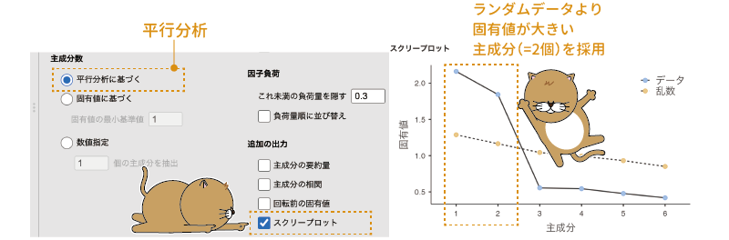
```


###### 固有値に基づく {-#subsub:factor-pca-component-eigen}

2つ目の「固有値に基づく」も非常によく用いられる方法です。一般に，この方法では「固有値が1以上」（これは一般に*カイザー基準*と呼ばれます）の主成分を採用します。SASやSPSSなどの統計ソフトでは，この基準が標準として設定されており，分析で算出される*固有値*の値が1を超える主成分の情報のみが結果に表示されます。

主成分分析で主成分の個数を決める基準として用いられるのはデータの*相関行列*についての固有値ですが，この値はその主成分に「変数何個分」の情報が集約されているかという形で解釈することができます。つまり，「固有値1以上」というのは，最低でも変数1個分の情報を持っているような主成分だけを採用するということなのです。この方法を用いる場合には，「固有値に基づく」を選択して「固有値の最小基準値」を「1」に設定します。

###### 数値指定 {-#subsub:factor-pca-fixednumber}

それ以外の方法で主成分の個数を判断した場合には，その個数を「数値指定」に指定することで，指定した個数の主成分を抽出することができます。

固有値の大きさや平行分析以外の方法で主成分の個数を判断するものとしては，たとえば*スクリープロット*と呼ばれる方法があります。

主成分分析の主成分は，最初のものほど固有値が大きく，2番目の主成分，3番目の主成分と，順番が後ろの主成分になるにつれて固有値は小さくなっていきます。そしてこの各主成分の固有値の大きさをグラフに示したものがスクリープロットで，この方法では，グラフ上で固有値の変化が小さくなる手前までの主成分を採用するという方法をとります。

スクリープロットを利用して主成分の個数を判断したい場合には，この「数値指定」を選択した状態で，「**追加の出力**」にある「スクリープロット」にチェックを入れてスクリープロットを作成します（図\@ref(fig:factor-pca-scree)）。

```{r factor-pca-scree, fig.cap="スクリープロットを用いた判断", echo=FALSE}

```

今回のデータでは，3つ目の主成分以降は固有値の変化がほとんどありませんので，その手前の2つ目までの主成分を採用すると判断するわけです。そして，そのように判断したら，その主成分の個数（「2」）を「数値指定」の数値入力欄に指定します。

その他の基準としては，「累積説明率が70〜80%以上」というものもあります。*説明率*（*寄与率*）とは，データ全体のうち，その主成分に集約されている部分の割合のことで，各主成分の説明率は，その主成分の固有値を分析に使用した変数の個数で割った値になります。この「累積説明率が70〜80%以上」という基準は，最初の主成分から順に2番目，3番目と主成分の説明率を合計していき，その合計値が0.7〜0.8以上になるところまでの主成分を採用するという方法です。

この方法を用いる場合には，「**追加の出力**」にある「回転前の固有値」にチェックを入れます（図\@ref(fig:factor-pca-cumulative)）。すると，各主成分の分散説明率と，その主成分およびその手前の主成分の説明率の合計値（累積%）の表が出力されますので，そこから判断した主成分の個数を「数値指定」の数値入力欄に指定します。

```{r factor-pca-cumulative, fig.cap="累積説明率を基準とする判断", echo=FALSE}

```


なお，これらの基準は，どれも絶対的なものではなく，主成分の適切な個数を判断する際の目安にすぎません。「固有値1以上」という基準では，主成分の個数が多すぎたり少なすぎたりする場合があります。また，分析の目的にもよるでしょうが，「累積説明率70〜80%以上」という基準では，主成分の数が多くなりすぎる傾向があります。平行分析の場合にも，主成分の個数が少なめに判定されることがあるようです。そのため，これらの基準を参考にしながら，最終的には分析者の判断で適切と考えられる主成分の個数を決定することになります。

なお，今回のサンプルデータの分析では，主成分の個数は平行分析に基づいて決定することにしましょう。ここでは，「**主成分数**」は，初期設定値の「平行分析に基づく」にします。

#### 因子負荷 {-#subsub:factor-pca-loadings}

「**因子負荷**」には，次の2つの項目が含まれています（図\@ref(fig:factor-pca-loadings)）。

```{r factor-pca-loadings, fig.cap="因子負荷の設定項目", echo=FALSE}

```

:::{.jmvsettings data-latex=""}
- これ未満の負荷量を隠す　絶対値の小さい負荷量を非表示にします。
- 負荷量順に並び替え　負荷量の絶対値が大きい順に変数を並び替えて表示します。
:::

##### これ未満の負荷量を隠す{-}

1つ目の「これ未満の負荷量を隠す」の項目は，結果の表の中に絶対値が小さな負荷量を表示しないようにするための設定です。分析に使用する変数や主成分の数が多い場合，主成分とほとんど関連がない部分については数値を非表示にしてしまったほうが，主成分と各変数との関係を把握しやすくなります。そのため，jamoviの初期設定では，負荷量の絶対値が0.3未満の場合にその部分が非表示になるように設定されています。

今回の分析結果ではそのような値は1つもありませんでしたが，結果の表の中に数値が表示されていない部分がある場合には，それらの負荷量はここで設定されている基準値よりも小さいということです。

なお，分析の過程では確かに小さい負荷量は非表示のほうが見やすいかもしれませんが，レポートや論文に結果を報告する際には，それら小さな負荷量も含めて報告するほうがよいでしょう。その場合には，「これ未満の負荷量を隠す」の値を「0」にすることですべての負荷量を表示させることができます。

##### 負荷量順に並び替え{-}

この項目は，分析に使用した変数を負荷量の大きさの順に並び替えて表示させるかどうかについての設定です。分析に使用する変数が多い場合や，抽出した主成分の個数が多い場合などは，このチェックをオンにしておくと結果が見やすくなります。

今回の分析では，この設定はオフのままにしておきます。


#### 追加の出力 {-#sub:factor-pca-additional}

「**追加の出力**」には，次の4つの項目が含まれています（図\@ref(fig:factor-pca-additional)）。

```{r factor-pca-additional, fig.cap="追加の出力", echo=FALSE}

```

:::{.jmvsettings data-latex=""}
- 主成分の要約量　各主成分について要約量を算出します。
- 主成分の相関　各主成分の間の相関を算出します。
- 回転前の固有値　回転前の固有値とその寄与率，累積寄与率を算出します。
- スクリープロット　スクリープロットを表示します。
:::

##### 主成分の要約{-}

この項目は，抽出された主成分の固有値や寄与率についての情報を表示させるかどうかの設定です。この設定項目は，主成分に対して回転を行った場合にその回転後の主成分の情報を知りたい場合に使用します。主成分の回転を行わない場合は，この設定で表示される内容は「回転前の固有値」の表の一部とまったく同じですので，今回のサンプルデータを用いた分析ではここは設定の必要はありません。

##### 主成分の相関{-}

この項目は，主成分の間の相関係数を算出するための設定項目です。主成分に対して回転操作を行った場合には，その回転方法によって主成分の間に相関が見られることがあるのですが，主成分に対して回転を行わない場合，それぞれの主成分は互いに**独立**（相関0）になりますので，今回の分析ではここも設定の必要はありません。

##### 回転前の固有値{-}

主成分の[数値指定](#subsub:factor-pca-fixednumber)のところで説明したように，「回転前の固有値」にチェックを入れると，抽出直後の各主成分の固有値と*分散説明率*（寄与率），そしてその主成分までの寄与率の合計（累積%）が表示されます。

##### スクリープロット{-}

すでに[平行分析](#subsub:factor-pca-component-parallel)や主成分の[数値指定](#subsub:factor-pca-fixednumber)のところで説明したように，「スクリープロット」にチェックを入れると固有値の*スクリープロット*
が作成されます。

なお，この「スクリープロット」の項目は，「**主成分数**」で3つのうちのどれが選択されているかによって少しずつ表示が異なります。「**主成分数**」で「平行分析に基づく」が選択されている場合には，分析データとランダムなデータについてのスクリープロットが1つのグラフに示されますが，ここが「固有値に基づく」になっている場合には，「固有値の最小基準値」で指定された位置に点線が示されます。また，「**主成分数**」が「数値指定」になっている場合には，固有値のみがグラフ上に示されます（図\@ref(fig:factor-pca-scree-plots)）。

```{r factor-pca-scree-plots, fig.cap="スクリープロットのバリエーション", echo=FALSE}
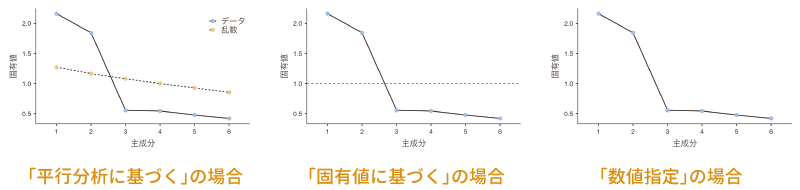
```


### 分析結果 {#sub:factor-pca-results}

主成分の個数は平行分析を基準に決定し，主成分の回転は行わないという設定で分析をすると，その結果は図\@ref(fig:factor-pca-results)のようになります。

```{r factor-pca-results, fig.cap="主成分分析の結果", echo=FALSE}

```

この表の「主成分」の部分に示されているのは*主成分負荷量*と呼ばれる値で，これは各変数と主成分との間の相関関係を示しています。この値は，その主成分の固有値の平方根と固有ベクトルを掛け合わせることによって求められます。

回転を行わない主成分分析の場合，1つ目の主成分は全体を総合するような（総合得点的な）ものになることが多いのですが，今回の結果でも，第1主成分はどの変数の値とも0.5から0.7程度の正の相関関係にあり，メニュー全体に対する総合的な満足度を反映した軸といえるようなものになっています。つまり，この主成分の得点が高い人ほど全体的に満足度が高く，主成分得点が低い人ほど全体的に満足度が低い傾向にあるということです。

これに対し，第2主成分ではカレーとラーメン，カツ丼に対する負荷量がプラスになっており，それ以外がマイナスであることから，この主成分の得点が高い人ほどカレーやラーメンなどのいわゆる「がっつり」したにメニューに対する満足度が高く，この主成分の得点が低い人ほどパスタやオムライスなどの洋食メニューに対する満足度が高くなく傾向にあることがわかります。このことから，この第2主成分は，がっつり志向かどうかという，志向性の違いを表しているといえるでしょう。

結果の表の「*独自性*」の部分は，各変数がもつ情報のうち，この2つの主成分に集約しきれなかった情報の割合を示しています。この独自性の値に，たとえば0.8（80%）を超えるようなものが含まれている場合，その変数は主成分に情報がうまく集約できていないことを意味します。今回の分析結果では，どの変数も独自性は0.3前後ですので，2つの主成分に60%から70%程度の情報が集約できていることになります。これは分析結果としては十分な値でしょう。

### 分析の詳細設定 {#sub:factor-pca-details}

基本的な分析が終わりましたので，ここからは主成分分析のその他の設定項目について見ていきましょう。

#### 前提チェック{-#subsub:factor-pca-assumption}

他の分析手法と同様に，主成分分析にも分析のための全体となる条件がいくつか存在します。それらの条件が満たされているかどうかは，「**前提チェック**」に含まれる項目を用いて確認できます（図\@ref(fig:factor-pca-assumption)）。

```{r factor-pca-assumption, fig.cap="前提チェック", echo=FALSE}

```

:::{.jmvsettings data-latex=""}
- バートレットの球面性検定　バートレットの球面性検定を実施します。
- KMO標本妥当性指標　標本妥当性指標（MSA）を算出します。
:::

##### バートレットの球面性検定{-}

この項目にチェックを入れると，*バートレットの球面性検定*と呼ばれる検定が実施されます。

主成分分析では，複数の変数で表現されている情報をより少数の主成分に集約するということを行うわけですが，その際，分析に使用する変数が互いにまったく無関係なものであると，それらを集約することができません。そこで，分析に使用するデータの中に主成分分析を適切に行えるだけの関連性が見られるかどうかを確かめるのが，このバートレットの球面性検定です。

この検定のチェックをオンにすると，図\@ref(fig:factor-pca-bartlett)のような結果が得られます。

```{r factor-pca-bartlett, fig.cap="球面性検定の結果", echo=FALSE}

```


この検定は，「分析データの相関行列が*単位行列*である」という仮説に対して検定を行っています。単位行列というのは，相関行列の対角（同じ変数同士の相関係数の部分）が1で，それ以外の要素（相関係数）がすべて0である状態です。つまり，この検定結果が有意である場合，「少なくとも1組以上の変数間に0でない相関がある」ということになります。今回の分析データに対する検定結果は有意（p&lt;.001）ですから，分析のための最低限の条件は満たしていることになります。

##### KMO標本妥当性指標{-}

「KMO標本妥当性指標」の項目は，カイザー=マイヤー=オルキン（KMO）の標本妥当性指標（*KMO標本妥当性指標*または*KMO指標*）と呼ばれる値の算出を行います（図\@ref(fig:factor-pca-KMO)）。

```{r factor-pca-KMO, fig.cap="KMO標本妥当性指標", echo=FALSE}

```

この値は，変数間の相関および偏相関の情報をもとに算出されたもので，分析データに主成分として集約可能な部分がありそうな程度を示しています。この値の大きさについての大まかな目安は表\@ref(tab:factor-pca-KMO-table)のとおりです。

```{r factor-pca-KMO-table}
KMO.interpretation %>%
  kable(align = "cc", caption = "KMOの解釈の目安", linesep = "", booktabs = T, escape = F) %>%
  kable_styling(latex_options = "HOLD_position")
```

この値はデータ全体と各変数それぞれについて算出されますが，主成分分析を実施するには，次の表のように全体のKMO指標が0.8以上であることが望ましく，少なくとも0.6以上である必要があるとされます。もし全体指標の値が小さい場合には，個別指標の値が小さな変数を分析から除外するなどの対応をとります。

今回のデータについてのKMO指標は0.69でやや低めですが，分析に適さないというほどではなさそうです。

### 保存{#sub:factor-pca-save}

主成分分析では，各対象者について各主成分の主成分得点を算出し，それを別の分析に使用することが可能です。

主成分得点の保存はとても簡単で，分析設定画面の`r groupbar("保存")`を展開して「主成分得点」にチェックを入れるだけです。この操作をしてからデータを確認すると，新たに「主成分得点1」と「主成分得点2」という変数が追加されていることがわかります（図\@ref(fig:factor-pca-save)）。

<!-- -->
```{r factor-pca-save, fig.cap="主成分得点の保存", echo=FALSE}
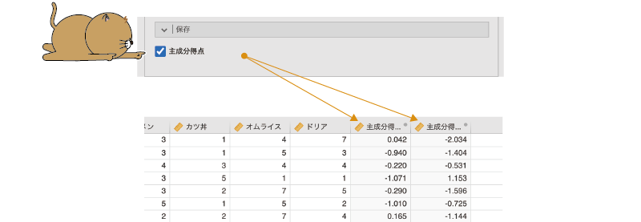
```

今回の分析では2つの主成分を採用しましたので，それぞれについて主成分得点が算出されているのです。なお，主成分得点の算出方法は，分析の考え方のところで示した主成分分析の関係式に各回答者の回答値を代入することによって得られる値です。このデータの場合には，関係式は次のようになります。

\[
z = a_1 \times \text{パスタ} + a_2 \times \text{カレー} + \cdots + a_6 \times \text{ドリア}
\]

そして，主成分1と主成分2のそれぞれについてこの式を用いて計算した結果が，各個人の主成分得点ということになります。

なお，この式における\(a_1\)や\(a_2\)は，主成分負荷量ではなく主成分分析で得られる固有ベクトルである点には注意が必要です。jamoviの分析結果では各主成分における固有ベクトルの値は表示されませんが，必要であれば主成分の負荷量を固有値の平方根で割ることによって求めることができます。


### 主成分得点を用いた分析 {#sub:factor-pca-score-analysis}

さて，分析で得た2つの主成分について主成分得点が求まりましたので，これらの値を使ってさらに別の分析を行ってみましょう。このサンプルデータには，食堂で提供されている代表メニューに対する満足度の他に，回答者の性別についての情報も含まれています。そこで，食堂で提供されているメニューに対する全体的な満足度やメニューに対する好みに男女差が見られるかどうかを見てみることにしましょう。

分析タブの「`r infig("analysis-ttest")` t検定」から「対応なしt検定」を選択し，設定画面の「従属変数」の欄に先ほど算出した2つの主成分得点を，「グループ変数」の部分に「性別」を設定します（図\@ref(fig:factor-pca-t-test-setting)）。


<!-- -->
```{r factor-pca-t-test-setting, fig.cap="主成分得点を用いたt検定", echo=FALSE}

```

また，男児それぞれにおける各主成分得点の平均値を見るために，「**追加の統計量**」で「記述統計」にもチェックを入れておきましょう（図\@ref(fig:factor-pca-ttest-descriptive)）。

<!-- -->
```{r factor-pca-ttest-descriptive, fig.cap="t検定と同時に記述統計量を算出", echo=FALSE}
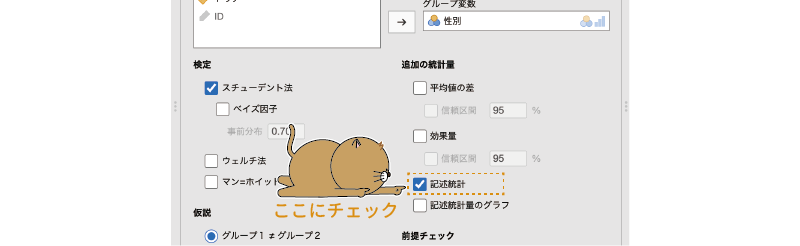
```

そして得られた結果が図\@ref(fig:factor-pca-ttest-results)です。

<!-- -->
```{r factor-pca-ttest-results, fig.cap="主成分得点のt検定の結果", echo=FALSE}
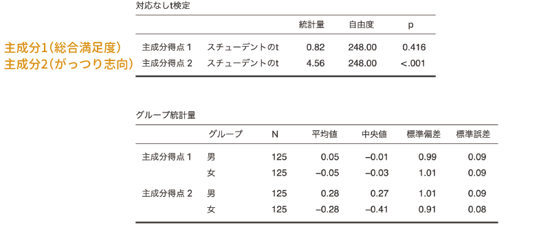
```

この結果から，主成分1の主成分得点（食堂のメニューに対する全体的な満足度）は男女差が有意ではありませんが，主成分2の主成分得点（がっつり志向）においては男女差が有意になっています。また，算出された記述統計量からは，男性の主成分得点2の平均値は女性よりも高い値となっていますので，男性のほうがラーメンやカレー，カツ丼へといった「がっつり系」メニューへの志向が強く，女性はパスタやオムライス，ドリアなどの洋食メニューへの志向が強いことがわかります。

## 探索的因子分析{#sec-factor-efa}

ここまで見てきた主成分分析は，複数の変数を総合した得点を作成することによってそこに情報を集約し，変数の数を減らすという手法でした。これに対し，因子分析では，複数の変数の背後にある少数の*共通因子*を探し出すことによって，データの構造を単純化し，理解しやすくする方法です。

なお，因子分析は大きく*探索的因子分析*と*確認的因子分析*と呼ばれるものとに分けられますが，「因子分析」とだけいった場合には，一般に探索的因子分析のことを意味します。そこで，まずはこの探索的因子分析について見ていくことにしましょう。

### 考え方{#sub:factor-efa-basics}

ここに，ある高校における学力テスト10教科（国語，英語，日本史，世界史，公民，地理，数学，物理，生物，化学）の成績データがあるとします。このデータを用いて各生徒の学力について分析したいとしましょう。この場合，成績データは10科目分もありますので，なんらかの形でデータの縮約（削減）を行わないと，生徒の学力についての全体像を把握することは困難でしょう。この場合，先ほど説明した主成分分析を用いて，これらの成績を総合した得点を算出するというのも1つの方法ですが，ここでは別の方法を考えてみます。

学校の教科は一般に「文系科目」，「理系科目」などと分類されますが，もしこれらの科目の成績の背後に「文系学力」や「理系学力」のようなものがあり，それらの能力の高さが個別の成績に影響を与えているのだとしたら，そしてそれらの能力の高さをなんらかの形で推定することができるとしたらどうでしょうか。この生徒は文系学力は高いが理系学力がいまいちだ，この生徒は文系学力も理系学力も高い，などのように，よりシンプルな形でそれぞれの学生の学力について検討できるようになるはずです。

たとえば，これら10教科の成績の相関係数が図\@ref(fig:factor-efa-basics)のようなものになっていたとしましょう。

```{r factor-efa-basics, fig.cap="10教科の相関係数の例", echo=FALSE}
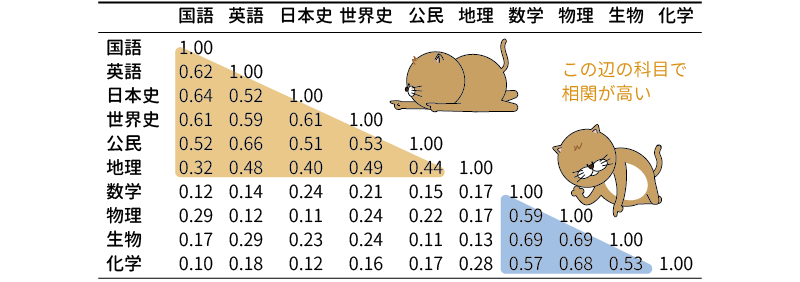
```

この相関行列を見ると，国語から公民まではお互いにだいたい0.4から0.6程度の正の相関があり，数学から化学までの間にも互いに0.5から0.7近い正の相関があります。対照的に，国語や英語と数学や物理の間の相関は0.1や0.2と低いものになっています。これらのことから，国語から公民まで，数学から化学までには成績の点から見た場合にある程度の類似性があり，そして国語や英語などの科目と数学や物理などの科目との間にはそうして類似性が見られないということになります。

因子分析では，このような科目成績間の類似性には，その背後になんらかの共通因子の存在があると考えます。ある共通因子が，程度の差こそあれそれぞれの科目に対して影響を与えているのために，これらの点数が似通ってくると考えるわけです。このようにして考えると，国語から公民までの科目の背後，そして数学から化学までの科目の背後に共通する因子が隠れているといえそうです。

なお，このデータはあくまでも「たとえば」の話として示したもので，かなり誇張した値になっています。ですから，科目間の類似性は相関係数を見ただけでもおおよそわかるのでしょう。しかし，実際のデータではここまでわかりやすい形になっていないことがほとんどです。そこで探索的因子分析では，このような複数の変数の背後にある因子を，数学的な手法を用いて見つけ出そうとするのです。

その際，因子分析では各変数（この例の場合は各教科の成績）と各因子の間の関係を式で表すと次のような形になります。

\begin{eqnarray*}
\text{国語の成績} &=& a_1 \times \text{因子}_1 + b_1 \times \text{因子}_2 +\text{独自因子}_\text{国語}\\
\text{英語語の成績} &=& a_2 \times \text{因子}_1 + b_2 \times \text{因子}_2 +\text{独自因子}_\text{英語}\\
\text{日本史の成績} &=& a_3 \times \text{因子}_1 +\cdots
\end{eqnarray*}

主成分分析の場合とよく似ていますが，式の左側は主成分分析の場合のように合成得点ではなく，各教科の成績得点になっています。つまり，共通因子の影響力を合計したものが実際のテスト成績になるという考え方をとるのです。このとき，各因子の前にある\(a_1\)や\(b_1\)はその教科の成績における各因子の影響力の強さを表しており，これは*因子負荷量*と呼ばれます。このような式は，分析に使用する変数（この例では教科）の個数と同じだけ作成されます。

また，式の最後には「\(\text{独自因子}_\text{国語}\)」というような項目があります。これは，共通因子では説明しきれない，その教科独自の部分を表しており，*独自性*と呼ばれます。これに対し，その教科の得点のばらつきのうち，共通因子によって説明される部分は*共通性*と呼ばれます。

このような考え方に基づいて，因子分析では先ほどの関係式でデータをうまく説明できるような因子負荷量を計算していくのですが，先ほどの関係式で分析前に明らかな値は式の左辺にある各教科の成績（これを*観測変数*と呼びます）のみで，それ以外の共通因子や因子負荷量，独自性（独自因子）の大きさはすべて計算によって求める必要があります。さらに，共通因子がいくつあるのかさえ，分析前にはわからないのです。さすがにこのままではなんでもありな状態になってしまい，最適な値を求めようにも求めようがありません。そこで，因子分析では計算になんらかの条件を設けたうえで，その中で最適と考えられる値を算出するという方法がとられます。

そして，その際にどのような計算上の条件を設けたかによって，因子分析の結果は異なってきます。そのため，因子分析の実施にあたっては，分析をソフトウェア任せにするのではなく，分析者自身が分析データや分析目的に合わせて適切な設定を行うことが非常に重要となります。


### 基本手順 {#sub:factor-efa-procedure}

ここからは，次のサンプルデータ（[factor_data03.omv](https://github.com/sbtseiji/jmv_compguide/raw/main/data/omv/factor_data03.omv)）を用いて探索的因子分析の分析手順についてみていくことにしましょう（図\@ref(fig:factor-data03)）。
<!-- -->

```{r}
data03 <- read.csv("data/factor_data03.csv")

# ID
attributes(data03$ID)$`jmv-id` <- TRUE

# 連続変数
attributes(data03$Q1)$measureType <- c("Continuous")
attributes(data03$Q2)$measureType <- c("Continuous")
attributes(data03$Q3)$measureType <- c("Continuous")
attributes(data03$Q4)$measureType <- c("Continuous")
attributes(data03$Q5)$measureType <- c("Continuous")
attributes(data03$Q6)$measureType <- c("Continuous")
attributes(data03$Q7)$measureType <- c("Continuous")
attributes(data03$Q8)$measureType <- c("Continuous")
attributes(data03$Q9)$measureType <- c("Continuous")

# 説明
attributes(data03$ID)$description <- "回答者のID"
attributes(data03$Q1)$description <- "関心がある対象については徹底して調べ尽くすほうだ"
attributes(data03$Q2)$description <- "好きなものを手に入れるためなら手間やお金は惜しまない"
attributes(data03$Q3)$description <- "趣味に関連するアイテムやグッズなどは全部集めたくなる"
attributes(data03$Q4)$description <- "現実の人間よりフィクションのキャラクターのほうがよいと思うことがある"
attributes(data03$Q5)$description <- "人といるより趣味の時間のほうが楽しい"
attributes(data03$Q6)$description <- "人とは直接話すよりオンラインでやりとりするほうがいい"
attributes(data03$Q7)$description <- "熱くなりすぎて周りに引かれることがある"
attributes(data03$Q8)$description <- "趣味について話し出すととまらない"
attributes(data03$Q9)$description <- "熱中しすぎて我を忘れることがある"

out <- jmvReadWrite::write_omv(data03, "data/omv/factor_data03.omv", frcWrt = TRUE)

```

```{r factor-data03, fig.cap="サンプルデータ", echo=FALSE}

```


このデータには，「オタク傾向」の強さを測定ために作成した9個の質問項目に対する回答データ（いずれも「1:まったくあてはまらない」〜「7:とてもよくあてはまる」の7段階評定）が300人分含まれています。これらの質問への回答から，「オタク傾向」の背後にどのような共通因子がありそうかを探ってみます。


<!-- -->
:::{.jmvvar data-latex=""}
+ `ID`　回答者のID
+ `Q1`　関心がある対象については徹底して調べ尽くすほうだ
+ `Q2`　好きなものを手に入れるためなら手間やお金は惜しまない
+ `Q3`　趣味に関連するアイテムやグッズなどは全部集めたくなる
+ `Q4`　現実の人間よりフィクションのキャラクターのほうがよいと思うことがある
+ `Q5`　人といるより趣味の時間のほうが楽しい
+ `Q6`　人とは直接話すよりオンラインでやりとりするほうがいい
+ `Q7`　熱くなりすぎて周りに引かれることがある
+ `Q8`　趣味について話し出すととまらない
+ `Q9`　熱中しすぎて我を忘れることがある
:::

探索的因子分析の実施には，分析タブの「`r infig("analysis-factor")`  因子分析」から「探索的因子分析」を選択します（図\@ref(fig:factor-efa-menu)）。

```{r factor-efa-menu, fig.cap="探索的因子分析の実行", echo=FALSE}

```

すると，次の設定画面が表示されます。画面の構成は，主成分分析のものと非常によく似ています（図\@ref(fig:factor-efa-setting)）。

```{r factor-efa-setting, fig.cap="探索的因子分析の設定画面", echo=FALSE}
knitr::include_graphics("images/factor/efa-setting.png")
```

ここで，分析に使用する観測変数（質問）を右側の「変数」欄に移動したら基本的な分析設定は終了です（図\@ref(fig:factor-efa-set-var)）。

```{r factor-efa-set-var, fig.cap="分析する変数を設定", echo=FALSE}
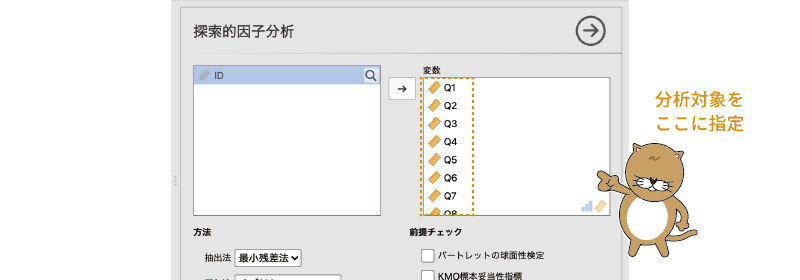
```

ただし，主成分分析の場合と同様，あるいはそれ以上に，因子分析の結果は分析の設定によって異なります。そのため，分析結果を見る前に，因子分析の各設定項目について説明していきたいと思います。

また，因子分析においても，それぞれの回答者について*因子得点*を算出することができます。

#### 方法{-#subsub:factor-efa-method}

データの中から共通因子をとり出すことを因子の**抽出**といいますが，この因子抽出の方法にはさまざまなものがあり，そしてどれを用いるかによって結果が少しずつ変わってきます。また，因子分析の場合，その抽出した因子に対してまず例外なく**回転**と呼ばれる操作が行われます。そして，その回転の方法によっても，分析結果が大きく変わります。

そこで，ここではこれら因子分析の結果に大きく影響するこれらの設定項目について見ていくことにします。

##### 抽出法{-#subsub:factor-fa-extraction}

**方法**の「抽出法」の項目では，因子の抽出方法について設定を行います。今回のサンプルデータの分析では，因子の抽出は初期設定どおり「最小残差法」で行うことにしますが，jamoviで使用可能な因子抽出法には次の3つの選択肢がありますので，ここではそれらについて簡単に説明しておくことにします（図\@ref(fig:factor-efa-extract)）。

```{r factor-efa-extract, fig.cap="因子抽出法", echo=FALSE}

```

:::{.jmvsettings data-latex=""}
+ 最小残差法　最小2乗法を用いて残差が最小となるように因子を抽出します。
+ 最尤法　データの分布に多変量正規分布を仮定し，分析データを説明するモデルとしてもっともあり得そうな（最尤な）因子を抽出します。
+ 主因子法　主成分分析と同様の計算を繰り返し行い，計算結果を収束させていくことによって因子を抽出します。
:::

###### 最小残差法{-#subsub:factor-fa-extraction-minres}

jamoviで用意されている因子抽出法のうち，「*最小残差法*」は「*重みづけなし最小2乗法*（OLS）」とも呼ばれる手法で，因子分析モデルとデータの間の残差が最小になるような形で因子の抽出を行います。この方法は，標本サイズが小さめのデータなど，比較的どのようなデータに対しても因子をうまく抽出することができるとされている方法です。

###### 最尤法{-}

2つ目の「*最尤法*」は，データの分布に*多変量正規分布*と呼ばれる分布を仮定することによって，その分析データの説明モデルとしてもっともあり得そうな因子を抽出するという方法をとります。近年，多くの研究で用いられるようになった手法であり，数学的にも洗練された方法であるとされますが，計算途中で計算不能になってしまうケースが最小残差法などに比べて多く発生します。また，適切な結果を得るためには十分な標本サイズが必要とされます。

###### 主因子法{-}

3つ目の「*主因子法*」は，主成分分析と同様に相関係数の*固有ベクトル*と*固有値*の計算を行うことによって因子を抽出する方法です。ただし，主成分分析ではこの計算は1度しか行われませんが，主因子法では最初の計算で得られた結果をもとに各変数に対する*共通性*を算出し，その共通性の値を相関行列の対角（同じ変数同士の相関で値がつねに1.0になる部分）をその共通性の値で置き換えたうえで，再度固有ベクトルと固有値の計算を行う，という手順を複数回繰り返します。最終的に，共通性の値の変化があらかじめ設定した基準値より小さくなった（固有値の値が安定した）ところで計算をストップし，その結果を因子として抽出します。

この主因子法は，最小残差法と同様に，比較的どのようなデータであっても因子を抽出できることが知られています。また，計算が単純であるということから，コンピューターの計算能力がそれほど発達していなかった頃によく用いられてきた方法です。

なお，この主因子法で反復計算を行わず，共通性の初期値を1.0にして（つまり相関行列そのままで）固有値の計算を行って因子を抽出する方法は「*主成分法*^[ややこしいですが，この相関行列を用いて反復計算を行わずに因子抽出する場合を「主因子法」と呼び，反復計算を行う場合を「*反復主因子法*」と呼んで区別することもあります。]」と呼ばれ，その結果はjamoviの「主成分分析」を用いた場合の分析結果と同じになります。


##### 回転法{-#subsub:factor-fa-rotation}

因子分析の目的は，たくさんの変数の背後にある共通因子を見つけ出し，それらがどのような因子であるかを解釈することにあります。しかし，因子分析の結果は，そのままでは解釈困難なことがほとんどです。そこで，この因子の解釈を容易にするために行われるのが因子の「回転」と呼ばれる操作です。

次の例は，10教科の学力テストデータから因子抽出した場合の結果を図示したものだと考えてください。この図では，各教科に対する因子1の因子負荷量を横軸に，因子2の負荷量を縦軸にとって示したものです。因子分析直後の結果では，この図のようにそれぞれの教科が因子1と2の両方から影響（負荷）を受けていて，この因子1や因子2が何を表す因子なのかがよくわかりません（図\@ref(fig:factor-efa-factor-example)）。

<!-- -->

```{r factor-efa-factor-example, fig.cap="因子抽出直後の状態の例", echo=FALSE}
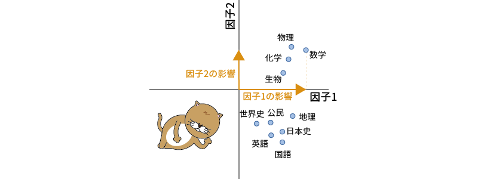
```


しかし，たとえば次の図のように，各教科の相対的な位置関係は保ったままでグラフの軸を回転させると，国語や英語などの教科は横軸の近くに，数学や物理などの教科は他の教科は縦軸の近くに集まるようになります（図\@ref(fig:factor-efa-factor-example2)）。

```{r factor-efa-factor-example2, fig.cap="因子の回転", echo=FALSE}

```

これであれば，横軸（因子1）は国語や英語，日本史などのいわゆる文系科目に強く関連する因子（文系学力因子）であり，縦軸（因子2）は数学や物理，化学などのいわゆる理系科目に強く関連する因子（理系学力因子）である，というように，容易に解釈することができるようになります。このようにして，分析結果を理解可能な形にすることが因子回転の役目です。

その際，因子分析では，分析結果ができるだけ「*単純構造*」に近くなるようにして因子の回転を行います。単純構造とは，それぞれの変数が複数の共通因子のうちのいずれか1つからのみ影響を強く受けている状態，つまり，先ほどの図でそれぞれの変数がいずれかの軸にできるだけ近くなるような状態のことです。

また，因子の軸を回転させる際，それぞれの軸が直角に交わった状態を維持したままで回転させる方法はとくに*直交回転*と呼ばれます。この直交回転では，それぞれの因子の間の相関は0になります。これに対し，因子の軸が互いに直角であるという条件をおかずに回転させる方法は*斜交回転*と呼ばれます。一般的には，直交回転よりも斜交回転のほうが，単純構造に近い結果が得られやすくなります。

なお，かつては直交回転が一般的でしたが，それは当時のコンピューターの計算能力では計算が複雑になりがちな斜交回転は難しかっかたらというのが大きな理由の1つでした。現在のコンピューターではそのようなことはありませんので，近年は因子が互いに独立であるという強い仮説でもない限り，斜交回転を用いることが一般的になりつつあります。

<!--  -->

因子の回転方法にはじつにさまざまなものがありますが，jamoviではそのうち次の6つが利用できるようになっています。今回のサンプルデータの分析では，因子の回転法についても初期設定どおり「オブリミン法」で行うことにしますが，次に各回転方法について簡単に説明を加えておきます（図\@ref(fig:factor-efa-factor-rotation)）。

<!-- -->

```{r factor-efa-factor-rotation, fig.cap="因子の回転方法", echo=FALSE}

```

:::{.jmvsettings data-latex=""}
+ なし　因子の回転は行いません。
+ バリマックス　直交回転におけるもっとも一般的な手法です。因子ごとの因子負荷量2乗の分散を最大化します。
+ クォーティマックス　直交回転における手法の1つです。変数ごとの因子負荷量2乗の分散を最大化します。
+ プロマックス　斜交回転における代表的な手法の1つです。バリマックス回転の結果をもとに斜交回転を行います。
+ オブリミン　斜交回転における手法の1つです。各因子間の因子負荷2乗の共分散を最小化します。
+ シンプリマックス　斜交回転における手法の1つです。因子負荷が0に近い値になる箇所の個数を指定して因子を回転させます。
:::

###### なし{-#fa-efa-rotation-none}
これは因子回転を行わないという設定です。何らかの理由で途中の計算結果を参照したい場合などを除いて，因子分析において回転を「なし」にすることはおそらくほとんどないでしょう。

###### バリマックス{-#fa-efa-rotation-varimax}
バリマックス法は*直交回転*におけるもっとも一般的な手法です。この回転方法では，因子ごとに因子負荷量2乗の分散が最大になるように，つまり，ある因子について，特定の変数に対しては負荷量の絶対値が大きく，他の因子に対しては小さくなるようにして因子軸を回転させます。

###### クォーティマックス{-#fa-efa-rotation-quartimax}
クォーティマックス（コーティマックス）法も*直交回転*における手法の1つです。この方法では，それぞれの変数に対する各因子の負荷量にメリハリがつくようにして因子の軸を回転させます。この方法は，どの変数に対しても1つ目の因子の負荷量が高くなりがちで，すべての変数に対して影響を与える全般因子的なものが抽出されやすいことが知られています。


###### プロマックス{-#fa-efa-rotation-promax}
プロマックス法は*斜交回転*における代表的な手法の1つです。この回転方法では，まずバリマックス回転によって得られた因子負荷を4乗^[統計ソフトによっては，4乗でなく3乗するものもあります。]して因子負荷量のメリハリを強調した状態を作成し，最終的な結果をそれに近づけるようにして因子の回転を行います。

「斜交回転といえばプロマックス法」といえるほどによく使用される回転方法ですが，この方法はあくまでも簡便法であり，適切な結果を得るには別の回転法が望ましいとする考えもあります。


###### オブリミン{-#fa-efa-rotation-oblimin}

オブリミン法は*斜交回転*における手法の1つです。この方法では，各因子間で因子負荷2乗の共分散が最小となるように因子の回転を行います。なお，オブリミン法はいくつかの斜交回転法をひとまとめにした総称で，jamoviの「オブリミン法」の結果は，そのうちの*クォーティミン法*（Quartimin）による回転結果と一致します。


###### シンプリマックス{-#fa-efa-rotation-simplimax}

シンプリマックス法も*斜交回転*における手法の1つです。この方法では，因子負荷行列（各変数に対する因子負荷量をまとめた表）において「因子負荷が0」である箇所が特定の個数になるように回転させます。「因子負荷が0」である箇所の個数を指定して分析できる統計ソフトもありますが，jamoviで「シンプリマックス」による回転を行った場合，「因子負荷量0」に近い値となる箇所が分析に使用した変数と同じ個数になるような形で回転が行われます。

#### 因子数{-#subsub:factor-efa-number-of-factors}

主成分分析の場合と同様に，因子分析においても計算上は分析に使用する変数と同じ個数だけ因子を抽出することができます。実際の分析では，その中からとくに重要な因子だけをとり出して解釈することになります。因子の個数の決め方はすでに主成分分析のところで説明したのとまったく同じですので，ここでは説明は省略します。

なお，サンプルデータの分析では，因子の個数は平行分析によって決める（平行分析に基づく）ことにします。その結果，3つの因子が抽出されたはずです。

#### 前提チェック{-#subsub:factor-efa-assumption-checks}

因子分析の前提についても，設定に含まれている項目やその使用方法，解釈の方法は主成分分析のところで説明したのと同一です。詳細は主成分分析における前提チェックの項目を参照してください。

#### 因子負荷量{-#subsub:factor-efa-factor-loadings}

因子負荷量の項目についても，設定項目やその使用方法は主成分分析のところで説明したのと同じです。ここでは，結果の解釈をしやすくするために「負荷量順に並び替え」にチェックを入れておくことにします。

#### 追加の出力{-#sub:factor-efa-additional-output}

「**追加の出力**」には，次の項目が含まれています（図\@ref(fig:factor-efa-additional-output)）。

```{r factor-efa-additional-output, fig.cap="追加の出力", echo=FALSE}

```

<!-- -->
:::{.jmvsettings data-latex=""}
+ 因子の要約量
+ 因子の相関
+ モデル適合度指標
+ 回転前の固有値
+ スクリープロット
:::

##### 因子の要約量{-#subsub:factor-efa-factor-summary}
最初の「因子の要約量」の項目にチェックを入れると，因子に関する要約情報として図\@ref(fig:factor-efa-factor-summary)のような結果が表示されます。

<!-- -->
```{r factor-efa-factor-summary, fig.cap="因子の要約量", echo=FALSE}

```


このうち，「負荷量2乗和」は各因子の因子負荷量の2乗値の合計で，これはその因子で説明できる情報の量を表します。その隣の「分散説明率（%）」は，データ全体の分散のうち，その因子によって説明される情報量の割合（*因子寄与率*），一番右端の「累積%（累積寄与率）」はその因子までの寄与率の合計です。

この表は，因子抽出法を「最小残差法」，因子の回転法を「オブリミン法」にして分析した結果についての因子の要約ですが，この結果からは，3つの因子がそれぞれ比較的均等な割合でデータを説明できていることがわかります。また，3つの因子による累積寄与率は57.65%で，これら3つの因子でデータ全体の6割近くを説明できていることから十分といえるでしょう。

##### 因子の相関{-#subsub:factor-efa-factor-correlations}

「因子の相関」にチェックを入れると，各因子間の相関係数が図\@ref(fig:factor-efa-factor-correlations)のように相関行列の形で表示されます。

<!-- -->
```{r factor-efa-factor-correlations, fig.cap="因子の相関", echo=FALSE}
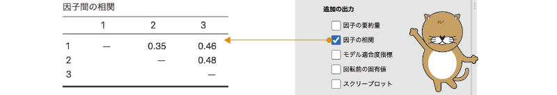
```


この相関行列から，3つの因子の間には互いに中程度からやや弱めの正の相関があることがわかります。


##### モデル適合度指標{-#subsub:factor-efa-fit-measures}

「モデル適合度指標」の項目にチェックを入れると，図\@ref(fig:factor-efa-factor-model-fit)のような表が追加で作成されます。

<!-- -->
```{r factor-efa-factor-model-fit, fig.cap="モデル適合度指標", echo=FALSE}

```

この表には，左から順にRMSEA，RMSEAの90%信頼区間，TLI，BIC，モデルに対する$\chi^2$適合度検定の結果が表示されています。

一番左のRMSEA（*近似誤差2乗平均平方根*）は，回帰分析のところで出てきたRMSE（*誤差2乗平均平方根*，第\@ref(ch-regression)章の[モデル適合度](#sub:regression-LR-modelfit)を参照）の近似値で，この値が小さいほど，分析によって得られた因子モデルとデータのずれ（残差）が小さいことを意味します。一般には，このRMSEAの値が0.05未満の場合にモデルの適合度が良好であるとみなされます。また，RMSEAについては90%（95%ではない点に注意）の信頼区間と合わせて報告されるのが一般的です。


その隣のTLIは*タッカー=ルイス指数*と呼ばれる値で，これは*独立モデル*（因子と各変数の間の関係をまったく考えないモデル）に対して分析モデルのあてはまりがどれだけ改善されているかを示します。一般には，この値が0.95以上である場合にあてはまりがよいとみなされます。

TLIの隣のBIC（*ベイズ情報量規準*）は，回帰分析のモデル適合度のところで説明した値と同じものです。この値はモデルのあてはまりのよさを相対的に示す数値で，この値1つだけでは，モデルが十分に適合しているかどうかの判断はできません。

表の一番右端の「モデルの検定」の部分には，モデルとデータのずれの大きさについての$\chi^2$適合度検定の結果が示されています。この検定は「モデルとデータのずれは0である」という帰無仮説に対するものなので，この検定結果が「有意でない」ことが望ましいといえます。ただし，この$\chi^2$の値は標本サイズが大きいほど，また分析に使用する変数の個数が多いほど有意になりやすい傾向にあるため，この検定結果が有意だったからといって，必ずしもモデルがデータに適合していないというわけではありません。

今回のサンプルデータの分析結果では，RMSEAは0.01と非常に小さく，TLIは1.00，$\chi^2$検定の結果も有意ではありませんので，モデルの適合度は十分なと考えてよいでしょう。

##### 回転前の固有値{-#subsub:factor-efa-initial-eigenvalues}

この設定項目にチェックを入れると，因子回転前の固有値に関する情報が表示されます。この設定項目で表示される内容は主成分分析の場合と同じですので，説明は省略します。

##### スクリープロット{-#subsub:factor-efa-scree-plot}

スクリープロットについても主成分分析の場合と同じですので説明は省略します。

### 保存{#sub:factor-efa-save}

因子分析でも，各対象者について各因子の因子得点を算出し，それを別の分析に使用することが可能です。設定画面の一番下にある`r groupbar("保存")`を展開すると「因子得点」の設定項目がありますので，ここにチェックを入れると因子得点が新たな変数として作成されます（図\@ref(fig:factor-efa-save)）。

```{r factor-efa-save, fig.cap="因子得点の推定法", echo=FALSE}
 
```

ただし，主成分得点と違って因子得点は答えが1つに決まらないため，これをどのように算出するかについては複数とおりの考え方があり，それぞれの方法で算出される因子得点の性質が少しずつ異なります。jamoviに用意されている因子得点の算出方法は，次の5つです。

<!-- -->
:::{.jmvsettings data-latex=""}
+ サーストン　真の因子得点との相関が最大となる因子得点を算出します。
+ バートレット　真の因子得点の不偏推定値となる因子得点を算出します。
+ テン・ベルヘ　因子の相関をできるだけ正確に反映させた因子得点を算出します。
+ アンダーソン=ルビン　直交する因子で因子得点間の相関が0になるような因子得点を算出します。
+ ハーマン　「理想化された」測定値をもとに因子得点を算出します。
:::

なお，ここで作成される因子得点は，いわゆる「洗練された（refined）」因子得点です。因子得点として因子の負荷が大きい項目の合計点や平均点を用いる方法もよく用いられますが^[これらの方法は「洗練されていない（non-refined）」因子得点などと呼ばれることもあります。]，それらの得点は新たな「計算変数」として作成するか，[信頼性分析](#sec-factor-reliability-analysis)の機能を用いて合成変数を作成するなどの方法を用いてください。

###### サーストン {-}

サーストン法は*回帰法*とも呼ばれる方法で，回帰モデルを用いて因子の得点を推定しようとする方法です。より具体的には，変数間の相関行列の逆行列と因子負荷行列を使って因子得点算出のための係数を作成し，この係数を（標準化済みの）各測定値に掛けて因子得点を算出します。

なお，探索的因子分析で抽出される因子は平均値が0，分散が1になるように標準化されていますが，この因子得点の平均は0，分散は回帰モデルの重相関係数の2乗に等しくなり，1にはなりません。また，この方法は，対応する因子と因子得点の間の相関が最大になるように因子得点を算出しますが，他の因子との関係については正確さがやや欠けるため，直交回転された因子についての因子得点であっても，因子得点間の相関が0にならない場合があります。

サーストン法（回帰法）は因子得点算出の方法としてはおそらくもっとも一般的な手法で，他の多くの統計ソフトでも採用されています。


###### バートレット {-}

バートレット法は，サーストン法に改良を加えたもので，共通因子による影響のみを考慮して因子得点を算出します。この方法で算出された因子得点は，「真の」因子得点の*不偏推定値*^[数学上，その平均値が母集団の実際の値と同値になるようにして計算された値のことです。]になりますが，直交因子の因子得点間の相関が完全に0になるわけではありません。また，この方法による因子得点も，因子ごとの平均値は0になりますが，分散は1にはなりません。


###### テン・ベルヘ {-}

テン・ベルヘ法は，斜交回転された因子の相関をできるだけ正確に反映させるような形で算出される因子得点で，アンダーソン=ルビンの因子得点を斜交回転に拡張したような性質を持ちます。アンダーソン=ルビンの因子得点と同様に，この因子得点の平均値は0，分散は1になりますが，バートレット法の因子得点のような不偏推定値にはなっていません。

###### アンダーソン=ルビン {-}

アンダーソン=ルビン法は，直交する因子の因子得点間の相関が0になるようにして算出される因子得点です。また，この因子得点の平均値は0，分散は1になりますが，バートレット法の因子得点のような不偏推定値にはなっていません。

###### ハーマン {-}

ハーマン法は，測定値そのものではなく，因子分析結果から再構築された「理想化された」測定値を用いて因子得点を算出します。この方法は回帰法の修正版で，因子得点の平均値は0になりますが，分散は1にはなりません。


### 分析結果{#sub:factor-efa-results}

サンプルデータについて，「最小残差法」で3因子（因子数は平行分析で決定）を抽出し，「オブリミン法」で回転した結果は図\@ref(fig:factor-efa-factor-results)のとおりです。なお，結果の表示については**因子負荷**の設定項目で「負荷量順に並び替え」にチェックを入れて変数の表示順序を因子負荷量の大きさ順に並び替えてあります。

また，因子間の相関係数についても，**追加の出力**で「因子の相関」にチェックを入れて算出してあります。

<!-- -->
```{r factor-efa-factor-results, fig.cap="探索的因子分析の結果", echo=FALSE}

```

この結果の表には，それぞれの質問項目に対する各因子の負荷量と，各質問項目の独自性の値が示されています。このようにして各変数に対する因子負荷をまとめたものは*因子パターン行列*と呼ばれます。因子の回転を行わない場合や直交回転を用いた場合には，これらの値は因子と各変数の間の相関係数と同じになりますが，斜交回転の場合にはそうではありませんので，その点には注意が必要です。

では，分析結果を見てみましょう。まず，どの質問項目においても独自性が極端に高いことはありませんので，これらの質問への回答は抽出した共通因子で説明できていると考えてよさそうです。もし，分析の結果において独自性が0.8を上回るような質問項目（観測変数）があった場合には，それらは分析から除外したほうがよいでしょう。

また，この表では因子負荷量の絶対値が0.3未満のものは非表示になっています。このようにしてみると，`Q7`から`Q9`は因子1のみから強い負荷を，`Q4`から`Q6`は因子2のみから強い負荷を受けているというように，この分析結果が*単純構造*に近いものになっていることがよくわかります。

今回の分析ではそのような質問項目（観測変数）はありませんでしたが，もし，単純構造を乱すような観測変数，つまり複数の因子の負荷が高い変数が含まれている場合には，それらを分析から除外して再分析することもありますし，分析の目的によっては，そのような変数をそのままにしておく場合もあります。ただし，そのように複数の因子にまたがる変数が多数あるような場合には，分析結果の解釈には注意が必要です。

なお，分析結果を解釈する際には，このように絶対値の小さい負荷量は非表示にしたほうが単純構造になっているかどうかの確認がしやすいのですが，論文やレポートに結果を報告する際には，設定画面の**因子負荷**の「これ未満の負荷量を隠す」に0を入力し，すべての負荷量を表示されるようにしたほうがよいでしょう。


#### 因子の解釈{-#subsub:factor-efa-factor-interpretation}

因子分析では，分析によって抽出された因子をどのように**解釈**できるかということも，分析における重要な関心の1つです。因子の解釈とは，それぞれの共通因子が一体何を意味するものなのかがわかるように，因子にわかりやすく簡潔な名前をつけることをいいます。

たとえば，この分析結果では，因子1は「Q8」，「Q9」，「Q7」の3つの質問に高い負荷を持っていますが，これらの質問は次のとおりの内容でした。

:::{.jmvorange data-latex=""}
+ Q7　熱くなりすぎて周りに引かれることがある
+ Q8　趣味について話し出すととまらない
+ Q9　熱中しすぎて我を忘れることがある
:::

これらの質問内容を見ると，いずれも「熱くなる」部分で共通しているようです。ですので，この因子を「熱中傾向」と名づけることにしましょう。

このように，各因子が高い負荷をもつ観測変数にどのような共通点があるのかを見ながら，因子に名前をつけていくのが因子の解釈です。

同様にして因子2，因子3についても解釈してみましょう。因子2は「Q4」から「Q6」に高い負荷を持っています。

:::{.jmvorange data-latex=""}
+ Q4　現実の人間よりフィクションのキャラクターのほうがよいと思うことがある
+ Q5　人といるより趣味の時間のほうが楽しい
+ Q6　人とは直接話すよりオンラインでやりとりするほうがいい
:::

これらの質問内容は，いずれも人と接することを好まない傾向を示していますので，「非社交性」などと解釈するのが適当でしょう。

また，因子3は「Q1」から「Q3」に高い負荷を持っています。

:::{.jmvorange data-latex=""}
+ Q1　関心がある対象については徹底して調べ尽くすほうだ
+ Q2　好きなものを手に入れるためなら手間やお金は惜しまない
+ Q3　趣味に関連するアイテムやグッズなどは全部集めたくなる
:::

これらの質問内容は，いずれもモノや情報を徹底して集めたいという部分で共通点が見られますので，ここではこれを「収集欲求」と名づけることにしましょう。

このようにして因子を解釈すると，「オタク傾向」には大きく「熱中傾向」，「非社交性」，「収集欲求」が関連しているということがわかります。また，これらの3因子の間には3.35から0.48の中程度の正の相関がありますので，熱中傾向が強い人ほど非社交的で収集欲求も強い傾向にあるということがわかります。このように，因子分析によってたくさんの変数を共通因子に還元することによって，データ全体を非常に簡潔に説明できるようになるのです。


## 確認的因子分析{#sec-factor-cfa}

探索的因子分析によって得られる因子は，あくまでも分析に使用したデータに基づくものであって，それが普遍的な真実であるというわけではない点には注意が必要です。探索的因子分析の結果というのは一般に不安定なことが多く，分析に使用する変数が増えたり減ったりした場合や，別の集団を対象とした調査結果を分析した場合などには，抽出される因子の結果が変わることもよくあるのです。

となると，分析で得られた因子モデルの正しさを別のデータで確かめたい，という考えが当然ながら生じてくるでしょう。ではその場合，新たに収集したデータを用いて探索的因子分析を行えばいいかというとそうではありません。探索的因子分析は，その分析データをもっともうまく説明できると考えられる因子を探索的に抽出する方法であって，因子モデルが正しいかどうかを確かめるための方法ではないからです。

そして，このようにすでにある因子モデルが別のデータにおいてもあてはまるかどうかを確かめたい場合に使用されるのが，*確認的因子分析*と呼ばれる分析手法です。

### 考え方{#sub:factor-cfa-basics}

ここでは，先ほどの探索的因子分析で用いたサンプルデータ（オタク傾向）の分析結果をもとに，確認的因子分析の考え方を見ていきましょう。先ほどの分析では，9つの質問への回答の背後に3つの共通因子が推定されました。そして，9つの質問のうち，Q1からQ3は「収集欲求」因子のみの負荷が高く，Q4からQ6は「非社交性」因子，Q7からQ9は「熱中傾向」因子のみの負荷が高いというように，各質問への回答には3つの因子のうちいずれか1つのみが強く影響している単純構造にあることが示されました。

そして，このような構造が，海外のオタクにおいてもあてはまるといえるかどうかを知りたいとしましょう。そこで，前回の調査で使用した9つの質問を英訳し，英語圏に住む成人400名を対象に調査を実施しました。その結果がこのサンプルデータ（[factor_data04.omv](https://github.com/sbtseiji/jmv_compguide/raw/main/data/omv/factor_data04.omv)）に入力されています（図\@ref(fig:factor-data04)）。

```{r}
data04 <- read.csv("data/factor_data04.csv")

# ID
attributes(data04$ID)$`jmv-id` <- TRUE

# 連続変数
attributes(data04$Q1)$measureType <- c("Continuous")
attributes(data04$Q2)$measureType <- c("Continuous")
attributes(data04$Q3)$measureType <- c("Continuous")
attributes(data04$Q4)$measureType <- c("Continuous")
attributes(data04$Q5)$measureType <- c("Continuous")
attributes(data04$Q6)$measureType <- c("Continuous")
attributes(data04$Q7)$measureType <- c("Continuous")
attributes(data04$Q8)$measureType <- c("Continuous")
attributes(data04$Q9)$measureType <- c("Continuous")

# 説明
attributes(data04$ID)$description <- "回答者のID"
attributes(data04$Q1)$description <- "I'm a thorough researcher when it comes to a subject I'm interested in."
attributes(data04$Q2)$description <- "I'm willing to spend a lot of time and money to get what I want."
attributes(data04$Q3)$description <- "I want to collect all the items and goods related to my hobby."
attributes(data04$Q4)$description <- "Sometimes I think fictional characters are better than real people."
attributes(data04$Q5)$description <- "I enjoy my hobbies more than being with people."
attributes(data04$Q6)$description <- "It's better to communicate with people online than in person."
attributes(data04$Q7)$description <- "Sometimes I get too enthusiastic and stun the people around me."
attributes(data04$Q8)$description <- "I can't stop talking about my hobbies."
attributes(data04$Q9)$description <- "Sometimes I get so absorbed that I lose control of myself."
out <- jmvReadWrite::write_omv(data04, "data/omv/factor_data04.omv", frcWrt = TRUE)

```


<!-- -->
```{r factor-data04, fig.cap="サンプルデータ", echo=FALSE}

```

<!-- -->

:::{.jmvvar data-latex=""}
+ `ID`　回答者のID
+ `Q1`　I'm a thorough researcher when it comes to a subject I'm interested in.
+ `Q2`　I'm willing to spend a lot of time and money to get what I want.
+ `Q3`　I want to collect all the items and goods related to my hobby.
+ `Q4`　Sometimes I think fictional characters are better than real people.
+ `Q5`　I enjoy my hobbies more than being with people.
+ `Q6`　It's better to communicate with people online than in person.
+ `Q7`　Sometimes I get too enthusiastic and stun the people around me.
+ `Q8`　I can't stop talking about my hobbies.
+ `Q9`　Sometimes I get so absorbed that I lose control of myself.
:::

このデータを先ほどの因子モデルでうまく説明できるかどうかを見るためには，まず分析に使用する因子モデルをはっきりさせておく必要があります。

前回の因子分析結果を単純な模式図として示すと図\@ref(fig:factor-cfa-model1)のようになります。まず，「Q1」から「Q3」は「収集欲求」因子の影響を強く受けていました。他の2つの因子からもわずかに影響を受けていましたが，それらは非常に弱いので，ここでは省略します。

<!-- -->


```{r factor-cfa-model1, fig.cap="収集欲求因子と観測変数の関係", echo=FALSE}

```


この図では，因子を楕円で，各観測変数（質問への回答データ）を四角で示しています。因子と各変数は線（*パス*）で繋がれており，このパスは観測変数のほうに向かう矢印の形になっています。この矢印の向きは，変数間の影響の向きを表しています。因子分析の考え方では，各観測変数に対して因子が影響を及ぼしていると考えますので，矢印は因子から各観測変数に向かう形になるのです。

同様に，「Q4」から「Q6」は「非社交性」因子，「Q7」から「Q9」は「熱中傾向」因子の影響を強く受けていました（図\@ref(fig:factor-cfa-model2)）。

<!-- -->

```{r factor-cfa-model2, fig.cap="非社交性因子，熱中傾向因子と観測変数の関係", echo=FALSE}

```

また，これらの因子の間には，中程度からやや弱目の相関関係がありました。相関関係はお互いに関連があるということなので，ここではパスを両矢印で示します（図\@ref(fig:factor-cfa-model3)）。

<!-- -->
```{r factor-cfa-model3, fig.cap="共通因子間の関係", echo=FALSE}

```

このようにして因子間と観測変数間の関係を図示したものは*パス図*と呼ばれます。このパス図は先ほどの因子分析結果を単純化して示したものですが，これが確認的因子分析において使用される分析モデルになるのです。確認的因子分析では，このような単純化された因子モデルを用いて，このモデルでデータをうまく説明できるかどうかを確かめます。

### 分析手順{#sub:factor-cfa-procedure}

確認的因子分析は，一般に高価な専用ソフトウェアを使用するか，分析モデルをコンピュータープログラムのような形で書き表して実行するような形でしか利用できない場合がほとんどですが，jamoviではこれを驚くほど簡単に実行することができます。

jamoviで確認的因子分析を実行するには，分析タブの「`r infig("analysis-factor")`  因子分析」から「確認的因子分析」を選択します（図\@ref(fig:factor-cfa-menu)）。

```{r factor-cfa-menu, fig.cap="確認的因子分析の実行", echo=FALSE}

```

すると，次の設定画面が表示されます（図\@ref(fig:factor-cfa-setting)）。

```{r factor-cfa-setting, fig.cap="確認的因子分析の設定画面", echo=FALSE}

```

この画面右側の「因子」の部分に，分析モデルにそって変数を設定します。

初期状態では，「因子」の部分には「因子1」しかありませんが，その下にある`r blueback("因子を追加")`をクリックすると，因子を追加することができます。今回の分析モデルには3つの因子がありますので，`r blueback("因子を追加")`を2回クリックして因子を2つ追加します（図\@ref(fig:factor-cfa-add-factors)）。

<!-- -->
```{r factor-cfa-add-factors, fig.cap="因子を2つ追加", echo=FALSE}
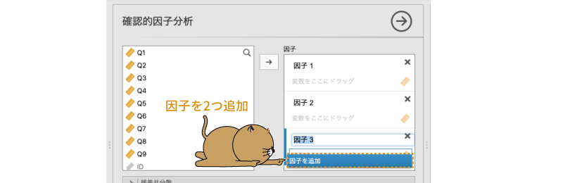
```

次に，作成した因子の名前を設定します。因子の名前は「因子1」や「因子2」のままでも計算上は問題ありませんが，結果を見間違えたりしないよう，きちんと因子名を設定しておいたほうがよいでしょう。ここでは，「因子1」を「収集」，「因子2」を「非社交」，「因子3」を「熱中」としておきます（図\@ref(fig:factor-cfa-rename-factors)）。

<!-- -->
```{r factor-cfa-rename-factors, fig.cap="因子の名前を変更", echo=FALSE}

```

因子名の設定が終わったら，それぞれの因子に関連する変数を指定していきます。まず，「収集」因子の負荷が高いと考えられるのは「Q1」，「Q2」，「Q3」の3つですので，この3つを「収集」の「変数をここにドラッグ」の部分にマウスでドラッグして移動します（図\@ref(fig:factor-cfa-set-vars)）。

<!-- -->
```{r factor-cfa-set-vars, fig.cap="因子1に変数を設定", echo=FALSE}
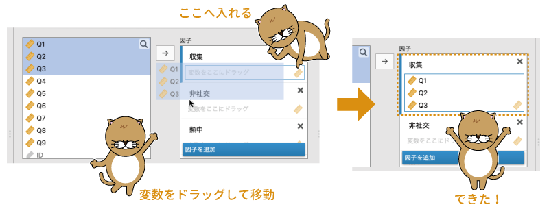
```

同様にして，「非社交」と「熱中」因子も変数を指定します（図\@ref(fig:factor-cfa-set-vars2)）。

<!-- -->
```{r factor-cfa-set-vars2, fig.cap="すべての因子に変数を設定", echo=FALSE}

```

基本的な分析設定はこれでおしまいです。

### 分析結果 {#sub:factor-cfa-results}

それでは分析結果について見てみましょう。基本設定による分析では，図\@ref(fig:factor-cfa-results)のような結果が表示されます。いろいろな値が表示されているので，1つ1つ見ていきましょう。

<!-- -->
```{r factor-cfa-results, fig.cap="確認的因子分析の結果", echo=FALSE}

```

1つ目の「因子負荷」の表には，それぞれの因子から観測変数（各質問）への負荷量の推定値，標準誤差，標準得点（Z），有意確率（p）が示されています。この結果では，すべての値で負荷量の推定値が1を超えていますが，これは分析結果に問題があるわけではなく，この負荷量の値が標準化されていないものだからです。

この結果では，それぞれの因子負荷量について「因子負荷が0である」という帰無仮説を用いた検定の結果が示されており，いずれの検定も有意確率（p）は「&lt;.001」で有意になっています。

2つ目の「因子共分散」の表には，「推定値」の部分に因子の分散および因子間の共分散の値が示されています。なお，この表では各因子の分散は1.00に固定されており，この表に示されているのは因子間の相関係数になっています。各因子間の相関係数についても，因子負荷と同様に標準誤差と標準得点（Z），有意確率（p）の値が示されており，それぞれの有意性検定（帰無仮説：相関係数は0である）の結果を見ることができます。

3つ目と4つ目の表には，この分析モデルのデータへの適合度に関する情報が表示されています。3つ目の表はモデルとデータのずれの大きさについての検定で，これは探索的因子分析の「[モデル適合度指標](#subsub:factor-efa-fit-measures)」の部分で説明したものと同じです。この検定では$\chi^2$が小さく，検定結果が有意でないことが望ましい結果です。今回の分析結果では有意確率p=0.492で検定結果は有意ではありませんので，分析モデルとデータのずれは0でないといえるほど大きなものでない（ずれは小さい）といえます。

その下の「適合度指標」には，モデルのデータの適合度に関する代表的な指標が示されています（図\@ref(fig:factor-cfa-results2)）。

<!-- -->
```{r factor-cfa-results2, fig.cap="適合度関連の結果", echo=FALSE}

```


この表に示されている値のうち，2つ目のTLIと3つ目のRMSEAについては，探索的因子分析の[適合度指標](#subsub:factor-efa-fit-measures)のところで説明したものと同じです。

表の1つ目のCFI（*比較適合度指標*）は，TLIと同様に*独立モデル*（因子と各変数の間の関係をまったく考えないモデル）に比べてどの程度あてはまりが改善しているかを0から1までの数値になるようにして算出した値で，この値が1に近いほどモデルがデータにうまくあてはまっていることを意味します。一般に，この値が0.90または0.95以上である場合に適合度が高いとみなされます。

この分析結果では，適合度指標はCFI=1.00，TLI=1.00，RMSEA=0.00[0.00-0.04]で，いずれも適合のよさを示しています。したがって，今回の外国人を対象としたデータの場合にも，前回の分析結果で得られた3つの共通因子でうまく説明ができる，つまり，外国人の場合にも日本人と同じオタク傾向の3因子モデルがあてはまるということになります。


では，ここからは分析の詳細設定について見ていきましょう。次の設定を適切に使用することで，分析結果についてのより詳しい情報が得られます。

### 残差共分散{#sub:factor-cfa-residual-covariances}

`r groupbar("残差共分散")`の設定項目は，因子によって説明しきれない残差（独自因子）の間で共分散（または相関係数）を算出したい場合に使用します。この項目を展開すると，図\@ref(fig:factor-cfa-residual-covariance)のような画面が表示されます。

<!-- -->
```{r factor-cfa-residual-covariance, fig.cap="残差共分散の設定", echo=FALSE}

```


この*残差共分散*（*誤差共分散*とも呼ばれます）を算出するには，ここで残差の共分散を算出したい変数のペアを選択し，それを右側の「残差共分散」の欄に移動します。なお，「`r infig("analysis-regression")` 回帰分析」メニューの「相関行列」で相関係数を算出する場合とは異なり，ここでは共分散を算出させたい変数のペアを個別に指定する必要があります（図\@ref(fig:factor-cfa-residual-covariance2)）。

```{r factor-cfa-residual-covariance2, fig.cap="残差共分散の設定の例", echo=FALSE}
knitr::include_graphics("images/factor/cfa-residual-covariance2.png")
```


残差共分散を算出するのはモデルの適合度を向上させるためであることがほとんどだと思われますが，残差共分散は因子で説明しきれない部分における変数間の関係であるため，残差共分散を多数算出する必要がある場合には，必要な因子がモデルの中に組み込まれていないなど，想定する因子モデルに問題がある可能性があります。

### オプション{#sub:factor-cfa-options}
`r groupbar("オプション")`では，分析における欠損値の扱いと，計算上の制約条件についての設定を行います（図\@ref(fig:factor-cfa-option)）。


```{r factor-cfa-option, fig.cap="オプションの設定", echo=FALSE}

```


:::{.jmvsettings data-latex=""}
+ **欠損値の処理**
  - 完全情報最尤推定法　欠損値のある行を削除せず，残りの情報を活用して分析します。
  - 行全体を除外　欠損値が含まれるデータ行全体を分析から除外します。
+ **制約**
  - 因子の分散を1に固定　因子の分散を1に固定した場合の計算結果を表示します。
  - 最初の係数を1に固定　各因子の最初の変数の係数を1に固定した場合の計算結果を表示します。
:::

#### 欠損値の処理方法{-#subsub:factor-cfa-missing}

今回のサンプルデータには含まれていませんが，分析データに**欠損値**（データが欠落している部分）がある場合，その欠損値をどのように扱うかによって分析結果に影響が生じます。jamoviの確認的因子分析では，分析データに欠損値が含まれている場合，その値を*完全情報最尤推定法*と呼ばれる方法によって，欠損値を含む行を削除せず，欠損していない部分のデータ値を利用して推定を行います。

欠損値に対して推定値を代入せず，欠損のままにしておきたい場合には，「行全体を除外」に設定を変更してください。完全情報最尤推定法による補完を行うのと，欠損がある場合にデータ行ごと分析から除外するのとでどちらがよいかは一概にはいえませんが，近年，とくに確認的因子分析においては，完全情報最尤推定法など，何らかの形で欠損値を補完して分析することが多いようです。

#### 推定における制約{-#subsub:factor-cfa-constraints}

探索的因子分析でも，何らかの形で計算のための条件や前提を設定しないことには計算結果が1つに定まらなかったのと同様に，確認的因子分析でもまったくの条件なしにはモデルに関する推定ができません。

計算結果を収束させるために，確認的因子分析では「因子の分散を1」に固定するか，「各因子の最初の係数（負荷量）を1」にするか，いずれかの方法で計算を行います。jamoviの分析設定では，「因子の分散を1に固定」が初期設定値になっています。その場合，当然ですが表示される計算結果ではすべての因子で分散が1になります。

もし因子の分散という情報が分析上重要である場合には，「最初の係数を1に固定」に設定して計算を行うことになるでしょう。その場合，各因子の分散の値は算出されますが，各因子の最初の変数では，その係数（因子負荷量）はすべて1になります。

なお，分析結果として標準化された推定値（**標準化推定値**）を使用する場合には，どちらの場合も最終的な計算結果は同じになります。

### 推定値{#sub:factor-cfa-estimates}

`r groupbar("推定値")`では，因子や残差の推定値に関する設定を行います（図\@ref(fig:factor-cfa-estimates)）。


```{r factor-cfa-estimates, fig.cap="推定値の設定", echo=FALSE}

```

<!-- -->

:::{.jmvsettings data-latex=""}
+ **結果**
  - 因子共分散　因子の分散，および因子間の共分散または相関係数を算出します。
  - 因子の切片　因子の切片についての推定量を算出します。
  - 残差共分散　残差の分散，および指定した変数間での残差の共分散，または相関係数を算出します。
  - 残差の切片　残差の切片についての推定量を算出します。
+ **統計量**
  - 検定統計量　推定した各係数についての有意性検定の結果を表示します。
  - 信頼区間　各係数について，信頼区間の算出を行います。
  - 標準化推定値　各係数について，標準化された値を算出します。
:::

#### 結果 {-#subsub:factor-cfa-covariances}

この画面の**結果**の部分では，因子と各観測変数の残差の分散・共分散と切片の算出結果を表示するかどうかについての設定を行います。

この設定で「因子共分散」にチェックを入れた場合には，各因子の分散と，因子間の共分散または相関係数が表示されます。このとき，先ほどの`r groupbar("オプション")`のところで推定のための制約を「因子の分散を1に固定」に設定した場合には，結果に表示される値は各因子の分散（すべて1.00で固定）と，因子間の相関係数になります。これに対し，制約条件を「最初の係数を1に固定」に設定した場合には，結果の表には各因子の分散と因子間の共分散の値が表示されます。

その下の「因子の切片」の部分にチェックを入れると，*因子の切片*（因子の平均値）についての情報が表示されるのですが，jamoviの現在のバージョンでは確認的因子分析で複数グループのデータを同時に分析するといったことはできませんので，この値はいずれの因子においても1.00で固定になります。そのため，この項目については現在のところ使い道はありません。

3つ目の「残差共分散」の項目にチェックを入れると，各観測変数の残差の分散が表示されます。また，`r groupbar("残差共分散")`の設定で共分散を算出するように設定した場合には，設定した観測変数のペアについて，算出された共分散の値が表示されます。

一番下の「残差の切片」の部分にチェックを入れると**残差の切片**についての情報が表示されるのですが，その推定値および標準誤差は，どのような場合にもすべて観測変数の平均値と標準誤差の値に等しくなります（図\@ref(fig:factor-cfa-estimates-results)）。そのため，この項目についても今のところ使い道はなさそうです。

```{r factor-cfa-estimates-results, fig.cap="各設定項目の出力結果の例", echo=FALSE}
knitr::include_graphics("images/factor/cfa-estimates-results.png")
```


#### 統計量 {-#subsub:factor-cfa-statistics}

`r groupbar("推定値")`右側の**統計量**の部分では，係数の推定に関する設定を行うことができます。1つ目の「検定統計量」にチェックを入れると，算出した係数（分散や共分散も含む）の推定値について，その係数が0でないかどうかの有意性検定の結果が表示されます。確認的因子分析では，いずれの係数についても標準得点zを用いた検定が行われます。

2つ目の「信頼区間」にチェックを入れると，それぞれの係数について指定した幅の信頼区間が表示されます。

3つ目の「標準化推定値」にチェックを入れると，各係数を標準化した値が表示されます。この標準化推定値の値は，`r groupbar("オプション")`のところで計算上の制約として「因子の分散を1に固定」を選択した場合にも「最初の係数を1に固定」を選択した場合にも同じになります（図\@ref(fig:factor-cfa-standardized)）。


```{r factor-cfa-standardized, fig.cap="標準化推定値", echo=FALSE}
knitr::include_graphics("images/factor/cfa-standardized.png")
```


心理学の研究論文では，確認的因子分析の結果を報告する際にはこの標準化推定値を用いることが多いようです。考え方説明のところで用いた因子モデルの図に標準化推定値を示すと，分析結果は図\@ref(fig:factor-cfa-result-model)のようになります。


```{r factor-cfa-result-model, fig.cap="分析結果のパス図", echo=FALSE}

```


### モデル適合度{#sub:factor-cfa-model-fit}

`r groupbar("モデル適合度")`では，モデル全体の適合度に関する情報の設定を行います（図\@ref(fig:factor-cfa-model-fit)）。

```{r factor-cfa-model-fit, fig.cap="モデル適合度の設定項目", echo=FALSE}

```


:::{.jmvsettings data-latex=""}
+ **適合度検定**
  - $\chi^2$検定　モデル適合度についての$\chi^2$検定の結果を表示します。
+ **適合度指標**
  - CFI　モデルのあてはまりのよさについての指標（比較適合度指標）を示します。
  - TLI　モデルのあてはまりのよさについての指標（タッカー=ルイス指数）を示します。
  - SRMR　モデルの残差の大きさについての指標（標準化残差2乗平均平方根）を示します。
  - RMSEA　モデル残差の大きさについての指標（近似誤差2乗平均平方根）を示します。
  - AIC　モデル残差の相対的な大きさについての情報（赤池情報量規準）を示します。
  - BIC　モデル残差の相対的な大きさについての情報（ベイズ情報量規準）を示します。
:::

#### 適合度検定{-}

画面左側の「**適合度検定**」の部分では，モデルの適合度に関して$\chi^2$検定を行うかどうかを設定できます。この検定では，「このモデルはデータがもつ情報を完全に説明できている（モデルによる残差が0である）」が帰無仮説ですので，この検定結果は有意にならない（pが0.05より大きい）ことが望ましいという点に注意してください。

今回のサンプルデータでは\(\chi^2(\textsf{21})=\textsf{17.37}\)で，有意確率p=0.688ですから，検定結果は有意ではありません。したがって，分析モデルでデータをうまく説明できている（モデルとデータのずれは大きくない）といえます。

なお，探索的因子分析のところでも説明しましたが，この$\chi^2$検定の結果は分析に使用する観測変数がたくさんある場合や標本サイズが大きい場合には有意になりやすい傾向があります。そのため，この検定結果が有意になっていたらだめだというわけでは必ずしもありません。モデルの適合度は，他の適合度指標と合わせて総合的に判断します。

#### 適合度指標{-}

画面右側の**適合度指標**の部分では，適合度指標として表示させる値を選択します。

##### CFI，TLI {-}

CFIとTLIについては，すでに探索的因子分析のところで説明しました。これらの値は，分析モデルの適合度が独立モデル（因子と観測変数がまったく無関係なモデル）に比べてどれだけ改善したかを示す値で，この値が1に近いほどあてはまりがよいことを意味します。一般には，0.9以上あるいは0.95以上の場合にあてはまりが良好であるとみなされます。

##### SRMR，RMSEA {-}

SRMRとRMSEAは残差の大きさに関する指標で，これらは0に近いほどよいということになります。RMSEAについては探索的因子分析のところで説明したとおりです。SRMRは，データから求められる共分散と推定モデルの共分散の差をもとに算出されます。これらの指標は，いずれの場合も算出した結果が0.05未満である場合にあてはまりが良好であるとみなすのが一般的です。

##### AIC，BIC {-}

AICとBICについては，回帰分析の[モデル適合度](#sub:regression-LR-modelfit)
で説明したとおりです。これらはモデルの残差の大きさを表す値ですが，この値未満であればよいというようなものではなく，複数のモデル候補の間で相対的にあてはまりのよさを判断するための指標です。いくつかのモデル候補がある場合には，その中でこれらの値がもっとも小さくなるモデルを選択するのが一般的です。

このように，確認的因子分析ではさまざまなモデル適合度指標を算出することができるのですが，逆にいえばこれは，この値さえ求めておけばよいというような定番の指標がないということでもあります。研究論文でも，モデル適合度の指標として$\chi^2$検定の結果，あてはまりのよさの指標（CFIやTLI）を1つ以上，残差の大きさの指標（SRMRやRMSEA）を1つ以上の3種類の指標をセットで報告するのが一般的です。

また，適合度指標としてどれを報告するかには流行（？）のようなものもあり，あてはまりのよさの指標として少し前まではGFIとAGFIという指標が報告されることが多かったのですが，近年ではそうでもないようです。少なくとも，それらの指標はjamoviのオプションには含まれていません。

### 追加の出力{#sub:factor-cfa-additional-output}

`r groupbar("追加の出力")`では，分析結果に基づいてモデルの適合度を向上させるための参考指標などについて設定することができます（図\@ref(fig:factor-cfa-additional)）。


```{r factor-cfa-additional, fig.cap="追加の出力に関する設定項目", echo=FALSE}

```

:::{.jmvsettings data-latex=""}
+ **モデルの事後修正**
  - 相関行列の残差　モデルから算出される相関係数とデータから算出される相関係数の残差を求めます。
  - 修正指数　モデル適合度の向上につながりそうな修正候補を指数として示します。

+ **グラフ**
  - パス図　モデルのパス図を作成します。
:::

#### モデルの事後修正 {-#subsub:factor-cfa-posthoc}

今回のサンプルデータではモデルに十分な適合度がありましたが，実際の分析場面では適合度が十分とはいえない結果になる場合もあるでしょう。その場合，モデルのどの部分に問題があるのかを調べることで，モデルの適合度を向上させられることがあります。

##### 相関行列の残差{-}

そのための参考指標の1つが，モデルから算出される観測変数間の相関係数と，実際のデータにおける観測変数間の相関係数の間の残差です。相関係数の残差を算出するには，「相関行列の残差」の部分にチェックを入れます。またその際，「これ以上の値を強調」に指定されている数値より大きな絶対値の部分が赤色の文字で強調表示されます（図\@ref(fig:factor-cfa-residual-correlation)）。

<!-- -->
```{r factor-cfa-residual-correlation, fig.cap="相関行列の残差", echo=FALSE}
knitr::include_graphics("images/factor/cfa-residual-correlation.png")
```


この相関係数の残差に大きな値（たとえば0.1を超えるようなもの）がある場合には，分析モデルではその関係がうまく説明できていないということになります。そうした部分が特定の変数（表の列または行）に集中しているようであれば，その変数を分析から除外してみたり，モデルにおけるその変数の扱いを修正したりすることによってモデルの適合度が向上するかもしれません。

##### 修正指標{-}

また，「修正指数」にチェックを入れると，分析に使用したモデルには含まれていない関係（パス）について，それらを加えたときにモデル適合度がどの程度向上するかを示す*修正指数*が算出されます。jamoviの初期設定では，この修正指数が3を超える部分が赤色で強調されるようになっていますが，この値は「これ以上の値を強調」の数値を指定することによって変更可能です。

今回の分析結果について修正指数を算出してみると，図\@ref(fig:factor-cfa-residual-modification-indices)のような結果になります。

<!-- -->
```{r factor-cfa-residual-modification-indices, fig.cap="モデル修正指数", echo=FALSE}
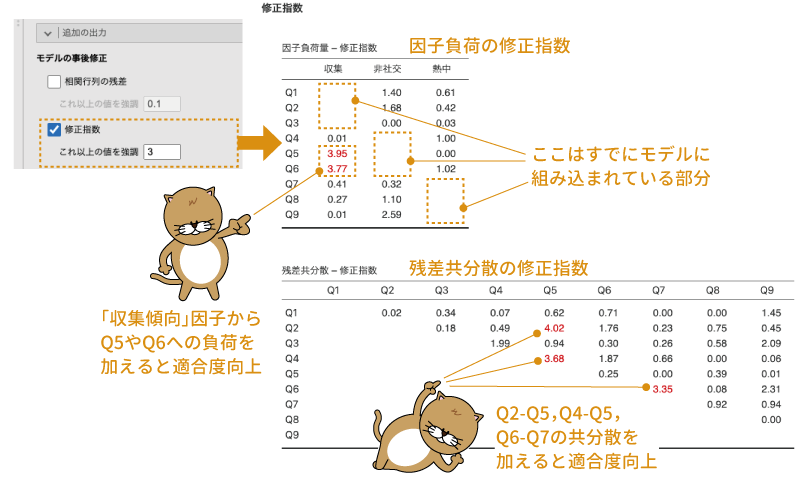
```

この結果の1つ目の表から，「収集傾向」の因子で「Q5」と「Q6」の部分が赤になっていますから，現在のモデルに対してこれらのパス（「収集傾向」因子から「Q5」と「Q6」への因子負荷）をモデルに追加すると，さらにモデルの適合度が向上する可能性が高いということがわかります。

2つ目の表は残差共分散に関する修正指数です。今回のこの結果は，ここで赤字になっている部分，たとえば「Q2」と「Q5」の間で残差共分散を算出するようにモデルを修正するとモデル適合度が向上する可能性が高いということを示しています。

ただし，これらの数値はあくまでも「計算上，ここにパスを追加すると適合度があがる可能性がある」というものであって，そのようなパスが理解可能なものかどうかまでは保証されません。これらの指数にそって闇雲にモデルに修正を加えていくと，最終的に解釈不能なモデルになってしまう可能性が高くなります。モデルに修正を加える場合には，その修正が理解可能なものかどうかをよく考えるようにしてください。

そもそも，確認的因子分析はすでにある仮説モデルでデータをうまく説明できるかどうかを確認することを目的とした分析です。分析結果が思わしくなかったからといって，データに合わせて大幅に探索的にモデルを修正していくのは決して好ましいとはいえないでしょう。モデルの修正は，元の仮説で想定される範囲を超えない程度に留めておくことが重要です。

#### グラフ {-}
なお，モデルに複数の修正を加えた場合，そのままではそのモデルがどのような形になっているのかを把握することが困難になっていきます。その場合，**グラフ**の部分にある「パス図」にチェックを入れて，モデルを図示してみるとよいでしょう。「**グラフ**」の項目にチェックを入れると，図\@ref(fig:factor-cfa-plots-diagram)のように各因子と観測変数の関係，因子間の相関，残差間の相関を図示してくれます。


<!-- -->
```{r factor-cfa-plots-diagram, fig.cap="モデルのパス図", echo=FALSE}

```

<!--  -->

なお，今回の分析ではモデルの修正は行っていませんので，ここに示されるパス図は，縦横の向きは違うだけで分析前に示したパス図と同じものになっています。
