# 棒グラフ {#sec-barchart}

```{r, echo =F, message=FALSE}
 source("rscripts/_utility.R")
```

```{r}
bar_raw <- read.csv("data/chart_bar_raw.csv", stringsAsFactors = FALSE)

# ID
attributes(bar_raw$ID)$`jmv-id` <- TRUE

# 名義変数
bar_raw$学部 <- factor(bar_raw$学部)
attributes(bar_raw$学部)$measureType <- c("Nominal")

bar_raw$学年 <- factor(bar_raw$学年)
attributes(bar_raw$学年)$measureType <- c("Nominal")

bar_raw$性別 <- factor(bar_raw$性別)
attributes(bar_raw$性別)$measureType <- c("Nominal")

bar_raw$受講形態 <- factor(bar_raw$受講形態)
attributes(bar_raw$受講形態)$measureType <- c("Nominal")

bar_raw$クラス <- factor(bar_raw$クラス)
attributes(bar_raw$クラス)$measureType <- c("Nominal")

# 順序変数
bar_raw$満足度 <- factor(bar_raw$満足度, ordered = TRUE)
attributes(bar_raw$満足度)$measureType <- c("Ordinal")

# 連続変数
attributes(bar_raw$テスト得点)$measureType <- c("Continuous")
attributes(bar_raw$課題得点)$measureType <- c("Continuous")
attributes(bar_raw$学習時間)$measureType <- c("Continuous")
attributes(bar_raw$出席率)$measureType <- c("Continuous")

# 説明
attributes(bar_raw$ID)$description <- "受講者ID"
attributes(bar_raw$学部)$description <- "所属学部"
attributes(bar_raw$学年)$description <- "学年"
attributes(bar_raw$性別)$description <- "性別"
attributes(bar_raw$受講形態)$description <- "授業の受講形態（対面／オンライン）"
attributes(bar_raw$クラス)$description <- "クラス（A/B/C）"
attributes(bar_raw$満足度)$description <- "授業満足度（1〜5）"
attributes(bar_raw$テスト得点)$description <- "テスト得点"
attributes(bar_raw$課題得点)$description <- "課題得点"
attributes(bar_raw$学習時間)$description <- "1週間あたりの学習時間（時間）"
attributes(bar_raw$出席率)$description <- "出席率（%）"

out <- jmvReadWrite::write_omv(bar_raw, "data/omv/chart_bar_raw.omv", frcWrt = TRUE)

bar_freq <- read.csv("data/chart_bar_freq.csv", stringsAsFactors = FALSE)

# 名義変数
bar_freq$商品カテゴリ <- factor(bar_freq$商品カテゴリ)
attributes(bar_freq$商品カテゴリ)$measureType <- c("Nominal")

bar_freq$店舗 <- factor(bar_freq$店舗)
attributes(bar_freq$店舗)$measureType <- c("Nominal")

# 連続変数（度数として利用）
attributes(bar_freq$販売数)$measureType <- c("Continuous")
attributes(bar_freq$売上金額)$measureType <- c("Continuous")

# 説明
attributes(bar_freq$商品カテゴリ)$description <- "商品カテゴリ"
attributes(bar_freq$店舗)$description <- "店舗"
attributes(bar_freq$販売数)$description <- "販売数（集計済み度数）"
attributes(bar_freq$売上金額)$description <- "売上金額（円）"

out <- jmvReadWrite::write_omv(bar_freq, "data/omv/chart_bar_freq.omv", frcWrt = TRUE)
```

棒グラフは，主にカテゴリカルデータの頻度や割合を視覚化する際に用いられるグラフです。各カテゴリに対応する棒の高さが，そのカテゴリの量を表します。カテゴリごとの大小関係を直感的に比較しやすいため，たとえば，性別，学年，回答の選択肢などのように，グループごとの人数や割合を示したい場合に適しています。

ここでは，次のサンプルデータ（[chart_bar_raw.omv](https://github.com/sbtseiji/jmv_compguide/raw/main/data/omv/chart_bar_raw.omv)）を使いながら，jamoviにおける棒グラフの作成方法について見ていくことにします。

:::{.jmvvar data-latex=""}
+ `ID`　受講者ID
+ `学部`　所属学部
+ `学年`　学年
+ `性別`　性別
+ `受講形態`　授業の受講形態（対面／オンライン）
+ `クラス`　クラス（A/B/C）
+ `満足度`　授業満足度（1〜5）
+ `テスト得点`　テスト得点
+ `課題得点`　課題得点
+ `学習時間`　1週間あたりの学習時間（時間）
+ `出席率`　出席率（%）
:::

このデータファイルは，ある大学の授業データ（架空）で，受講生の所属学部や学年，性別のほか，授業形態，クラス，授業満足度，テストや課題の得点，学習時間および出席率が含まれています。このデータを用いて，さまざまな棒グラフを作成してみましょう。


棒グラフを作成するには，「`r infig("analysis-scatr-jmvbar")` 棒グラフ」を選択します（[@fig-plots-barplot-menu]）。

```{r fig-plots-barplot-menu, fig.cap="棒グラフ", echo=FALSE}

```

すると，次のような設定パネルが表示されます（[@fig-plots-barplot-setting]）。

```{r fig-plots-barplot-setting, fig.cap="棒グラフの設定パネル", echo=FALSE}
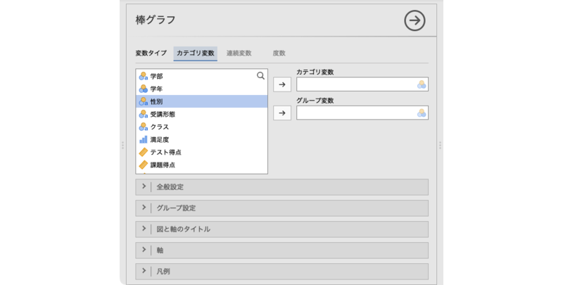
```

「棒グラフ」というタイトルの下には「変数タイプ」という項目があり，次の3つのタイプが選択できます。

:::{.jmvsettings data-latex=""}
+ カテゴリ変数　名義尺度変数の度数を図示したい場合に使用します。
+ 連続変数　数値変数の平均値を図示したい場合に使用します。
+ 度数　集計済みデータで度数を図示したい場合に使用します。
:::

ここでどのタイプを選択するかによって，パネルに表示される設定項目が異なります。それぞれのタイプ別に基本的な部分を見ていきましょう。

## カテゴリ変数 {#sub:plots-barplot-categorical}

変数タイプが「カテゴリ変数」の場合，次のような設定パネルになります（[@fig-plots-barplot-categorical]）。

```{r fig-plots-barplot-categorical, fig.cap="「カテゴリ変数」の設定パネル", echo=FALSE}
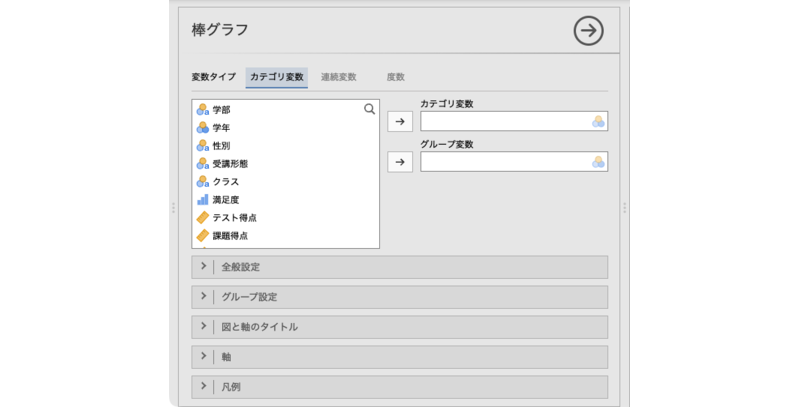
```


:::{.jmvsettings data-latex=""}
+ カテゴリ変数　図示したいカテゴリ変数を指定します。
+ グループ変数　グループ別に図示したい場合に使用します。
+ `r groupbar("全般設定")`　図の向きや棒の幅など，棒グラフの全体的な見た目の設定を行います。
+ `r groupbar("グループ設定")`　作図の際のグループ変数の扱い方を設定します。
+ `r groupbar("図と軸のタイトル")`　図のタイトルやサブタイトル，軸のタイトル，キャプションの表示方法を設定します。
+ `r groupbar("軸")`　軸の範囲や軸ラベルの向きなどを設定します。
+ `r groupbar("凡例")`　凡例（レジェンド）の表示方法や位置を設定します。
:::

一例として，何学部の学生が何人いるのかを図示したいとします。その場合，所属学部は名義尺度データでカテゴリ変数ですので，「変数タイプ」は「カテゴリ変数」が適切です。そして，「カテゴリ変数」のところに「学部」変数を移動すると，各学部の人数（度数）の棒グラフが作成されます（[@fig-plots-barplot-categorical-freq]）。

```{r fig-plots-barplot-categorical-freq, fig.cap="「カテゴリ変数」の棒グラフ", echo=FALSE}
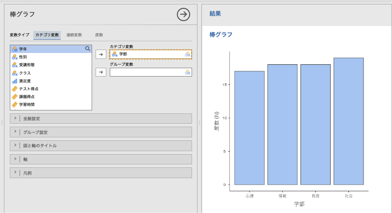
```

今度は，各学部の人数を受講形態別に図示してみましょう。そして，「グループ変数」に「受講形態」変数を移動すると，各学部の人数（度数）の棒グラフが受講形態別に作成されます（[@fig-plots-barplot-categorical-freq-grouped]）。

```{r fig-plots-barplot-categorical-freq-grouped, fig.cap="「カテゴリ変数」の棒グラフ（グループ別）", echo=FALSE}
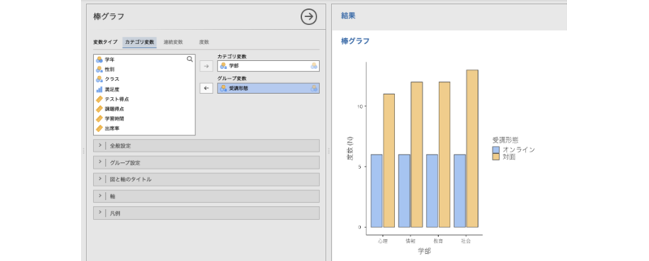  
```


### 全般設定 {#sub:plots-barplot-categorical-general}

設定パネルの`r groupbar("全般設定")`には，次の項目が含まれています。

```{r plots-barplot-categorical-general, fig.cap="全般設定", echo=FALSE}
  
```


:::{.jmvsettings data-latex=""}
- **棒**　
  - 幅　棒グラフの棒の幅を設定します（初期値0.9）。
  - 値ラベル　棒の先に度数を表示させたい場合にはチェックを入れます。
- **図の向き**
  - 軸を入れ替え  縦軸と横軸を入れ替えたい場合にはチェックを入れます。
:::

### グループ設定 {#sub:plots-barplot-categorical-group}

`r groupbar("グループ設定")`には，次の項目が含まれています。

```{r plots-barplot-categorical-group-example, fig.cap="グループ設定", echo=FALSE}
  
```


:::{.jmvsettings data-latex=""}
- **棒**　
  - グループ　棒グラフをグループ別に横並びに表示します。
  - 積上げ  各グループの値を積み上げて表示します。
:::

グループ設定が「グループ」の場合と「積上げ」の場合で，棒グラフはそれぞれ次のようになります。

```{r plots-barplot-categorical-group, fig.cap="グループ設定の種類とグラフの表示方法", echo=FALSE}
  
```

### 図と軸のタイトル {#sub:plots-barplot-categorical-title}

`r groupbar("図と軸のタイトル")`には，次の5つのタブが含まれています。


:::{.jmvsettings data-latex=""}
- 図のタイトル　タイトルの内容やサイズ，書体，揃え位置を設定します。
- 図のサブタイトル　サブタイトルの内容やサイズ，書体，揃え位置を設定します。
- 図のキャプション　キャプションの内容やサイズ，書体，揃え位置を設定します。
- X軸タイトル　X軸のタイトルやサイズ，書体，揃え位置を設定します。
- Y軸タイトル　Y軸のタイトルやサイズ，書体，揃え位置を設定します。
:::

各タイトルは，図の次の部分を指します（[@fig-plots-barplot-categorical-plot-titles]）。

```{r fig-plots-barplot-categorical-plot-titles, fig.cap="タイトル設定", echo=FALSE}
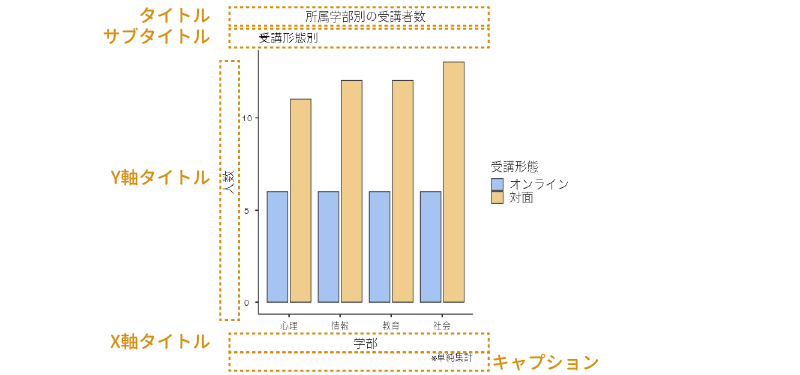  
```


### 軸 {#sub:plots-barplot-categorical-axes}

`r groupbar("軸")`には，次の項目が含まれています。

```{r plots-barplot-categorical-axes, fig.cap="軸の設定", echo=FALSE}
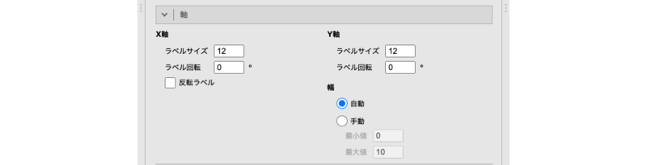  
```


:::{.jmvsettings data-latex=""}
- **X軸**
  - ラベルサイズ　ラベルのサイズを指定します。
  - ラベル回転　ラベルの回転角度を指定します。
  - ラベルを反転　軸ラベル（項目）の表示順序を反転させたい場合にチェックします。
- **Y軸**
  - ラベルサイズ　ラベルのサイズを指定します。
  - ラベル回転　ラベルの回転角度を指定します。
- **幅**　Y軸の表示範囲を指定します。
  - 自動（初期値）　データに合わせて自動で範囲を設定します。
  - 手動
    - 最小値　Y軸の最小値を指定します。
    - 最大値　Y軸の最大値を指定します。
:::


### 凡例 {#sub:plots-barplot-categorical-legend}

`r groupbar("凡例")`には，次の項目が含まれています。

```{r plots-barplot-categorical-legend, fig.cap="凡例の設定", echo=FALSE}
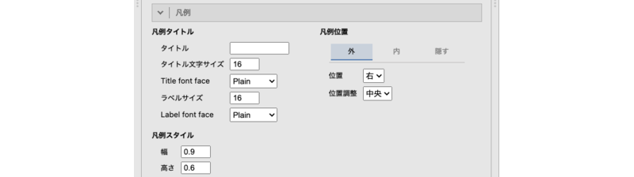  
```


:::{.jmvsettings data-latex=""}
- **凡例タイトル**
  - タイトル　凡例のタイトルを指定します。
  - タイトル文字サイズ　凡例タイトルの文字サイズを指定します。
  - タイトル書体　凡例タイトルの書体を指定します。
  - ラベルサイズ　凡例ラベルのサイズを指定します。
  - ラベル書体　凡例ラベルの書体を指定します。
- **凡例スタイル**
  - 幅　凡例に表示させるマーカーの幅を指定します（初期値：0.6）。
  - 高さ　凡例に表示させるマーカーの高さを指定します（初期値：0.6）。
- **凡例位置**　凡例を表示する位置を設定します。
  - 外／内／隠す　凡例をグラフエリアの外側（初期値）に表示するか，内側に表示するか，非表示にするかを設定します。
    - 外の場合の設定項目 
      - 位置　凡例の表示位置（上下左右）を指定します。
      - 位置揃え　凡例の揃え位置を指定します。
    - 内の場合の設定項目 
      - X位置　凡例の表示位置（X軸方向）を調整します。
      - Y位置　凡例の表示位置（Y軸方向）を調整します。
      - 向き　凡例を縦に揃えるか，横に揃えるかを指定します。
    - 隠すの場合の設定項目はありません。
:::


## 連続変数 {#sub:plots-barplot-continuous}

先ほどのデータファイルで，テストの得点がクラスや受講形態でどのように異なるかを視覚化したいとしましょう。その場合，テストの点数は連続変数ですので，「変数タイプ」は「連続変数」が適切です。棒グラフのメニューで変数タイプを「連続変数」に設定すると，次のような設定パネルになります（[@fig-plots-barplot-continuous]）。


```{r fig-plots-barplot-continuous, fig.cap="「連続変数」の設定パネル", echo=FALSE}
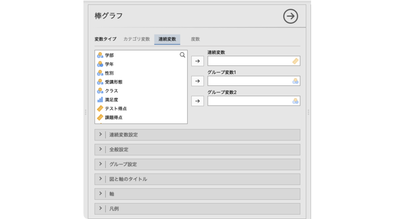   
```


:::{.jmvsettings data-latex=""}
+ 連続変数　平均値を図示したい値が含まれている連続変数を指定します。
+ グループ変数1　グループ別に集計した値を図示したい場合に使用します。
+ グループ変数2　複数種類のグループを組み合わせて図示したい場合に使用します。
+ `r groupbar("連続変数設定")`　グラフに表示する誤差線を設定します。
+ `r groupbar("全般設定")`　図の向きや棒の幅など，棒グラフの全体的な見た目の設定を行います。
+ `r groupbar("グループ設定")`　作図の際のグループ変数の扱い方を設定します。
+ `r groupbar("図と軸のタイトル")`　図のタイトルやサブタイトル，軸のタイトル，キャプションの表示方法を設定します。
+ `r groupbar("軸")`　軸の範囲や軸ラベルの向きなどを設定します。
+ `r groupbar("凡例")`　凡例（レジェンド）の表示方法や位置を設定します。
:::

「連続変数」のところに「テスト得点」変数を移動しただけでは，[@fig-plots-barplot-plot-continuous]のような全体の平均値を示しただけの棒グラフになってしまうので，グループ変数を適切に指定する必要があります。

```{r fig-plots-barplot-plot-continuous, fig.cap="テスト得点の平均値のグラフ", echo=FALSE}
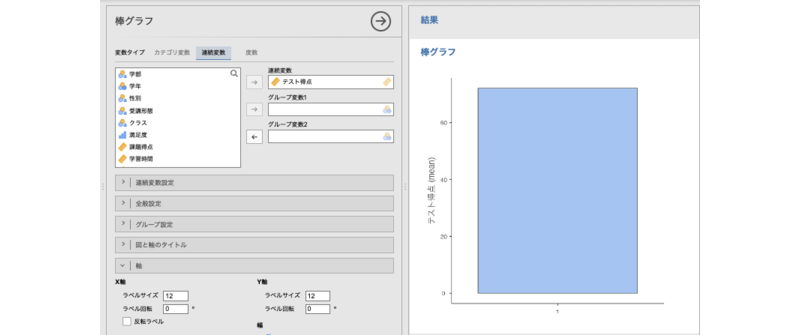   
```


受講形態によるテスト得点の違いを示したい場合，「グループ変数1」に「受講形態」を入れると，[@fig-plots-barplot-plot-continuous-group1]のように，受講形態ごとの平均値が表示されます。

```{r fig-plots-barplot-plot-continuous-group1, fig.cap="受講形態ごとのテスト得点の平均値のグラフ", echo=FALSE}
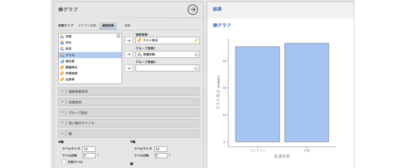   
```

さらにこれをクラス別に図示したい場合，「グループ変数2」に「クラス」を入れると，[@fig-plots-barplot-plot-continuous-group2]のように，オンラインと対面のそれぞれの平均値が，クラスごとに表示されるようになります。

```{r fig-plots-barplot-plot-continuous-group2, fig.cap="テスト得点の受講形態×クラスごとの平均値のグラフ", echo=FALSE}
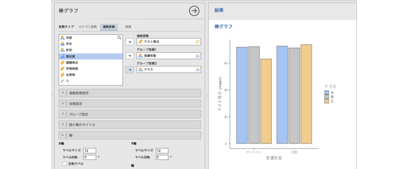   
```

グループ1に指定したグループ変数はグラフのX軸に，グループ2に指定したグループ変数は凡例に表示されるので，目的に応じて設定しましょう。たとえば，受講形態ごとにクラス間で得点がどのように違うかを示したいのであれば，[@fig-plots-barplot-plot-continuous-group2]のように受講形態をグループ変数1にしてX軸に示したほうがよいでしょうし，クラスごとに受講形態の違いによる得点の違いが見られるかどうかを示したいのであれば，クラスをグループ変数1にしたほうが，各クラスの受講形態別の平均点が横に並ぶので，違いがわかりやすくなります。

### 連続変数設定 {#sub:plots-barplot-continuous-error}

`r groupbar("連続変数設定")`には，次の項目が含まれています。

```{r plots-barplot-continuous-error, fig.cap="連続変数設定の設定項目", echo=FALSE}
  
```


:::{.jmvsettings data-latex=""}
- **誤差線**
  - なし　誤差線（エラーバー）は表示しません。
  - 標準偏差　誤差線に標準偏差を表示します。
  - 標準誤差　誤差線に標準誤差を表示します。
  - 信頼区間　誤差線に信頼区間を表示します。
    - 幅［ ］%　使用する信頼区間の幅を指定します（初期値：95）。

- **誤差先のスタイル**
  - 誤差線の太さ　誤差線の線の太さを指定します（初期値：0.5）。
  - キャップの幅　誤差線両端のキャップ（端点）の幅を指定します（初期値：0.1）。
:::

誤差線を用いる場合，その誤差線の示す値が何であるのか（標準偏差，標準誤差，信頼区間）を忘れずに示すようにしましょう。

### その他の設定 {#sub:plots-barplot-continuous-other}

`r groupbar("全般設定")`以降の設定項目は，カテゴリ変数の場合と同じですので（カテゴリ変数の[「全般設定」](#sub:plots-barplot-categorical-general)参照），ここでは説明を省略します。


### 度数 {#sub:plots-barplot-frequency}

今度は別のサンプルデータ（[chart_bar_freq.omv](https://github.com/sbtseiji/jmv_compguide/raw/main/data/omv/chart_bar_freq.omv)）を使って，集計済みデータの視覚化の方法について見ていきましょう。このデータファイルには，商品カテゴリごとの販売数と売上金額が，店舗別に集計されたデータとして格納されています。

:::{.jmvvar data-latex=""}
+ `商品カテゴリ`　商品カテゴリ（飲料・菓子・弁当・日用品・文具）
+ `店舗`　店舗（駅前店・大学前店・住宅街店）
+ `販売数`　販売数（集計済み度数）
+ `売上金額`　売上金額（円）
:::

各商品の販売数をグラフにしたい場合，「販売数」は集計済みの度数ですので，「変数タイプ」は「度数」が適切です。変数タイプを「度数」に設定した場合，次のような設定パネルになります（[@fig-plots-barplot-frequency]）。

```{r fig-plots-barplot-frequency, fig.cap="「度数」の設定パネル", echo=FALSE}
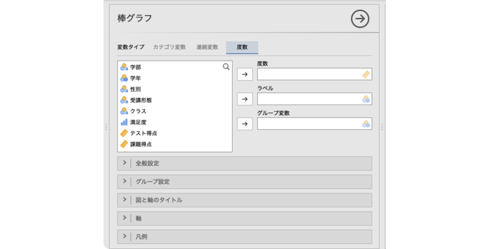 
```


:::{.jmvsettings data-latex=""}
+ 度数　度数が含まれている変数を指定します。
+ ラベル　グラフのラベルとして使用する変数を指定します。
+ グループ変数　グループ別に図示したい場合に使用します。
+ `r groupbar("全般設定")`　図の向きや棒の幅など，棒グラフの全体的な見た目の設定を行います。
+ `r groupbar("グループ設定")`　作図の際のグループ変数の扱い方を設定します。
+ `r groupbar("図と軸のタイトル")`　図のタイトルやサブタイトル，軸のタイトル，キャプションの表示方法を設定します。
+ `r groupbar("軸")`　軸の範囲や軸ラベルの向きなどを設定します。
+ `r groupbar("凡例")`　凡例（レジェンド）の表示方法や位置を設定します。
:::

販売数をグラフにしたい場合，「度数」に「販売数」を入れただけでは，[@fig-plots-barplot-plot-frequency]のように項目ラベルが正しく表示されません。

```{r fig-plots-barplot-plot-frequency, fig.cap="「販売数」の棒グラフ", echo=FALSE}
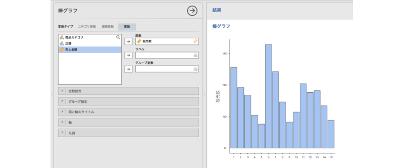
```

適切な項目ラベルを表示させるために，「ラベル」に「商品カテゴリ」を指定します。すると，[@fig-plots-barplot-plot-frequency-label]のように，項目ラベルが商品カテゴリの値になります。

```{r fig-plots-barplot-plot-frequency-label, fig.cap="項目ラベルを設定したグラフ", echo=FALSE}
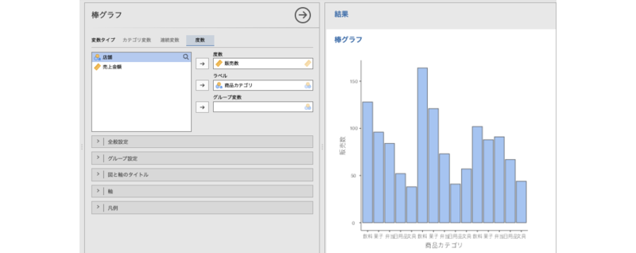
```

ただし，このままだと項目ラベル同士が重なってしまって正しく表示されませんので，項目ラベルの表示を調整しましょう。`r groupbar("軸")`を開き，「X軸」の「ラベル回転」の値を90にしてください。すると，[@fig-plots-barplot-plot-frequency-label-rotated]のように項目ラベルの向きが変わり，しっかり確認できるようになります。

```{r fig-plots-barplot-plot-frequency-label-rotated, fig.cap="項目ラベルを回転させたグラフ", echo=FALSE}
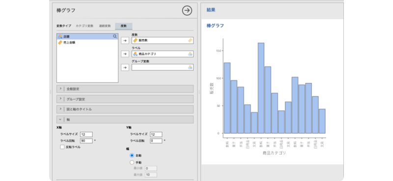
```

さらに販売数を店舗ごとに整理して表示しましょう。「グループ変数」に「店舗」を指定すると，[@fig-plots-barplot-plot-frequency-label-grouped]のように各店舗の値が色分けされて表示されます。

```{r fig-plots-barplot-plot-frequency-label-grouped, fig.cap="店舗別の集計結果", echo=FALSE}
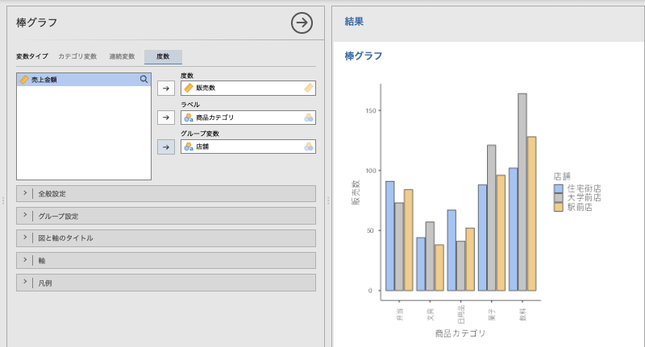
```

`r groupbar("全般設定")`以降の設定項目は，カテゴリ変数の場合と同じですので（カテゴリ変数の[「全般設定」](#sub:plots-barplot-categorical-general)参照），ここでは説明を省略します。
