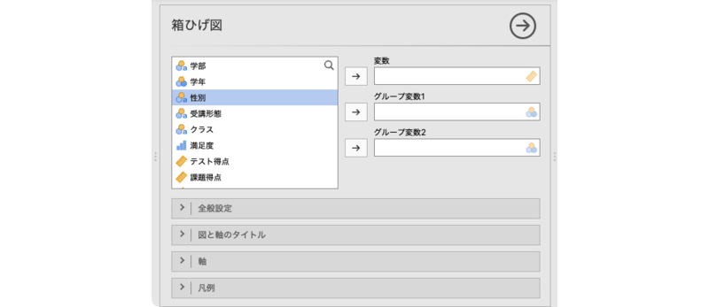
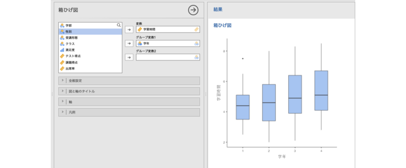
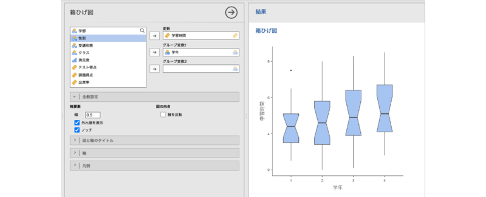

# 箱ひげ図 {#sec-boxplot}

```{r, echo =F, message=FALSE}
 source("rscripts/_utility.R")
```


箱ひげ図は，データの分布を視覚化するためのグラフです(#subsubsub:exp-plots-box)参照）。棒グラフに比べ，データの分布の特徴についての情報（中央値や第1・第3四分位など）がより多く含まれるため，平均値だけでは見えない偏りやばらつきを確認しやすいのが特徴です。

ここでは，棒グラフのところで用いたサンプルデータ（[chart_bar_raw.omv](https://github.com/sbtseiji/jmv_compguide/raw/main/data/omv/chart_bar_raw.omv)）を使いながら，jamoviでの箱ひげ図の作成方法を見ていくことにします。

:::{.jmvvar data-latex=""}
+ `ID`　受講者ID
+ `学部`　所属学部
+ `学年`　学年
+ `性別`　性別
+ `受講形態`　授業の受講形態（対面／オンライン）
+ `クラス`　クラス（A/B/C）
+ `満足度`　授業満足度（1〜5）
+ `テスト得点`　テスト得点
+ `課題得点`　課題得点
+ `学習時間`　1週間あたりの学習時間（時間）
+ `出席率`　出席率（%）
:::

箱ひげ図を作成するには，グラフタブで「`r infig("analysis-scatr-jmvbox")` 箱ひげ図」を選択します（[@fig-plots-boxplot-menu]）。

```{r fig-plots-boxplot-menu, fig.cap="箱ひげ図", echo=FALSE}

```

すると，次のような設定パネルが表示されます（[@fig-plots-boxplot-setting]）。

```{r fig-plots-boxplot-setting, fig.cap="箱ひげ図の設定パネル", echo=FALSE}

```

:::{.jmvsettings data-latex=""}
+ 変数　分析対象の変数を指定します。
+ グループ変数1　グループ別にデータを集計する場合に指定します。
+ グループ変数2　複数種類のグループを組み合わせて集計する場合に指定します。
+ `r groupbar("全般設定")`　図の向きや棒の幅など，棒グラフの全体的な見た目の設定を行います。
+ `r groupbar("グループ設定")`　作図の際のグループ変数の扱い方を設定します。
+ `r groupbar("図と軸のタイトル")`　図のタイトルやサブタイトル，軸のタイトル，キャプションの表示方法を設定します。
+ `r groupbar("軸")`　軸の範囲や軸ラベルの向きなどを設定します。
+ `r groupbar("凡例")`　凡例（レジェンド）の表示方法や位置を設定します。
:::

なお，`r groupbar("図と軸のタイトル")`以降の設定項目は「[棒グラフ](#sec-barchart)」と同じですので，ここでは説明を省略します。

ここでは，学年ごとの学習時間のデータを箱ひげ図で図示してみましょう。「学習時間」変数を「変数」に，「学年」変数を「グループ変数1」に指定すると，次のように箱ひげ図が表示されます（[@fig-plots-boxplot-plot]）。

```{r fig-plots-boxplot-plot, fig.cap="箱ひげ図", echo=FALSE}
 
```


## 全般設定 {#sub:plots-boxplot-general}

設定パネルの`r groupbar("全般設定")`には，次の項目が含まれています。

```{r plots-boxplot-settings-general, fig.cap="全般設定", echo=FALSE}
  
```


:::{.jmvsettings data-latex=""}
- **箱要素**　
  - 幅　箱の幅を設定します（初期値0.5）。
  - 外れ値を表示　外れ値を表示させたい場合にチェックを入れます。
  - ノッチ　中央値の周辺にくびれ（ノッチ）を表示します。
- **図の向き**
  - 軸を入れ替え　縦軸と横軸を入れ替えたい場合にチェックを入れます。
:::

ここで，「ノッチ」には説明が必要かもしれません。ノッチは複数のデータグループ間で中央値に違いがあるかどうかを比較する際に使用するもので，箱の中央にある「くびれ」部分の上下が、中央値の95%信頼区間（近似）を表します。複数のグループ間でノッチが重なっていない場合，中央値に統計的な差がある可能性が高いことを示唆します。

ノッチの幅は，通常，次のように計算されます。

$$
\text{ノッチ幅}=\text{中央値} \pm 1.58 \times \frac{\text{四分位範囲}}{\sqrt{\text{データ数}}}
$$


サンプルデータでノッチの表示をオンにすると次のようになります（[@fig-plots-boxplot-plot-notch]）。

```{r fig-plots-boxplot-plot-notch, fig.cap="ノッチありの箱ひげ図", echo=FALSE}
 
```

この例では，どの学年でもノッチの範囲に重複がありますので，学習時間の中央値に統計的な差はないと判断できます。

