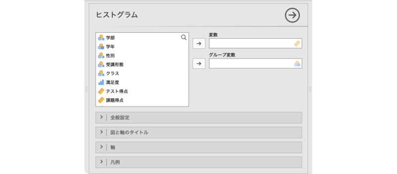
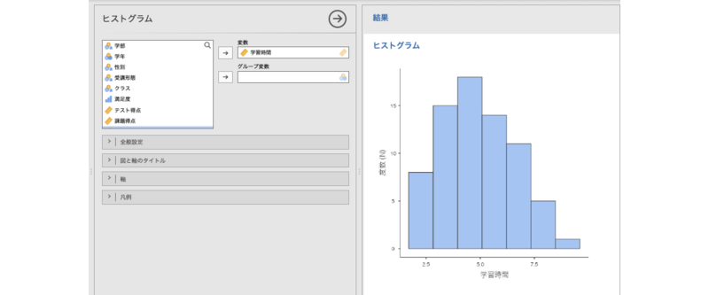
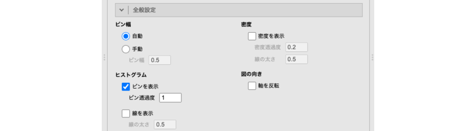

# ヒストグラム {#sec-histogram}

```{r, echo =F, message=FALSE}
 source("rscripts/_utility.R")
```


ヒストグラムは，数値データの分布を視覚化するためのグラフです。データを一定の幅の区間（ビン）に分割し，各ビンに含まれるデータの頻度を棒の高さで表します。ヒストグラムは，データの中心傾向やばらつき，偏りなどを把握するのに役立ちます。分布のかたちが視覚的に表現可能なため，分布の歪みや多峰性を確認する際に便利です。


ヒストグラムを作成するには，グラフタブで「`r infig("analysis-scatr-jmvhist")` ヒストグラム」を選択します（[@fig-plots-histogram-menu]）。

```{r fig-plots-histogram-menu, fig.cap="ヒストグラム", echo=FALSE}

```

すると，次のような設定パネルが表示されます（[@fig-plots-histogram-setting]）。

```{r fig-plots-histogram-setting, fig.cap="ヒストグラムの設定パネル", echo=FALSE}

```

:::{.jmvsettings data-latex=""}
+ 変数　分析対象の変数を指定します。
+ グループ変数　グループ別にデータを集計する場合に指定します。
+ `r groupbar("全般設定")`　図の向きや棒の幅など，棒グラフの全体的な見た目の設定を行います。
+ `r groupbar("図と軸のタイトル")`　図のタイトルやサブタイトル，軸のタイトル，キャプションの表示方法を設定します。
+ `r groupbar("軸")`　軸の範囲や軸ラベルの向きなどを設定します。
+ `r groupbar("凡例")`　凡例（レジェンド）の表示方法や位置を設定します。
:::

なお，`r groupbar("図と軸のタイトル")`以降の設定項目は「[棒グラフ](#sec-barchart)」と同じですので，ここでは説明を省略します。

ここでは，学習時間の分布をヒストグラムで図示してみましょう。「学習時間」変数を「変数」に指定すると，次のようなヒストグラムが表示されます（[@fig-plots-histogram-plot]）。

```{r fig-plots-histogram-plot, fig.cap="学習時間のヒストグラム", echo=FALSE}
 
```


## 全般設定 {#sub:plots-histogram-general}

設定パネルの`r groupbar("全般設定")`には，次の項目が含まれています。

```{r plots-histogram-settings-general, fig.cap="全般設定", echo=FALSE}
  
```


:::{.jmvsettings data-latex=""}
- **ビン幅**　
  - 自動　ビン（階級）の幅を自動で設定します。
  - 手動　ビン（階級）の幅を数値で指定します。
- **ヒストグラム**
  - ビンを表示（初期値）　ヒストグラムにビンを表示します。
    - ビン不透明度　ビンの塗りの不透明度を0〜1で設定します。
  - 線を表示　ビンの頂点を直線で結びます。
    - 線の太さ　直線の太さを設定します。
- **密度**
  - 密度を表示　分布の形状を滑らかな曲線で描写します。
    - 密度不透明度　密度曲線エリアの不透明度を0〜1で設定します。
    - 線の太さ　密度曲線の太さを設定します。
- **図の向き**
  - 軸を入れ替え 縦軸と横軸を入れ替えたい場合にチェックを入れます。
:::

