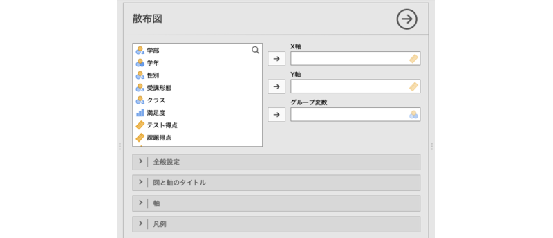
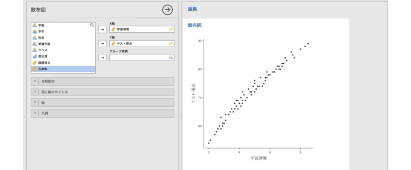
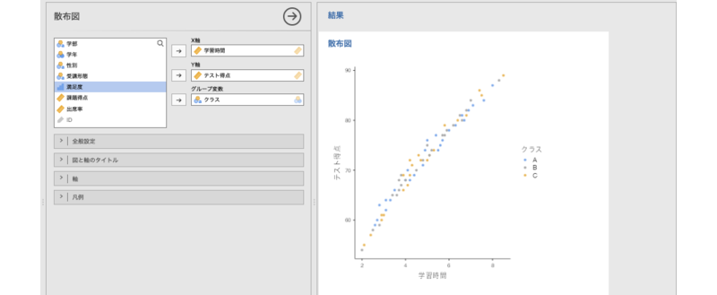

# 散布図 {#sec-scatterplot}

```{r, echo =F, message=FALSE}
 source("rscripts/_utility.R")
```

散布図は，2つの数値変数の関係を視覚化するためのグラフです。各データ点を平面上に配置することで，変数間の相関や分布の傾向，外れ値の有無などを確認できます。


ここでも，棒グラフのところで用いたサンプルデータ（[chart_bar_raw.omv](https://github.com/sbtseiji/jmv_compguide/raw/main/data/omv/chart_bar_raw.omv)）を使いながら，jamoviでの散布図の作成方法を見ていくことにします。

:::{.jmvvar data-latex=""}
+ `ID`　受講者ID
+ `学部`　所属学部
+ `学年`　学年
+ `性別`　性別
+ `受講形態`　授業の受講形態（対面／オンライン）
+ `クラス`　クラス（A/B/C）
+ `満足度`　授業満足度（1〜5）
+ `テスト得点`　テスト得点
+ `課題得点`　課題得点
+ `学習時間`　1週間あたりの学習時間（時間）
+ `出席率`　出席率（%）
:::

散布図を作成するには，グラフタブで「`r infig("analysis-scatr-jmvscatter")` 散布図」を選択します（[@fig-plots-scatterplot-menu]）。

```{r fig-plots-scatterplot-menu, fig.cap="散布図", echo=FALSE}

```

すると，次のような設定パネルが表示されます（[@fig-plots-scatterplot-setting]）。

```{r fig-plots-scatterplot-setting, fig.cap="散布図の設定パネル", echo=FALSE}

```

:::{.jmvsettings data-latex=""}
+ X軸　X軸に配置する変数を指定します。
+ Y軸　Y軸に配置する変数を指定します。
+ グループ変数　グループ別に図示したい場合に指定します。
+ `r groupbar("全般設定")`　点のサイズや回帰線の表示など，散布図の全体的な見た目の設定を行います。
+ `r groupbar("図と軸のタイトル")`　図のタイトルやサブタイトル，軸のタイトル，キャプションの表示方法を設定します。
+ `r groupbar("軸")`　軸の範囲や軸ラベルの向きなどを設定します。
+ `r groupbar("凡例")`　凡例（レジェンド）の表示方法や位置を設定します。
:::

なお，`r groupbar("図と軸のタイトル")`以降の設定項目は「[棒グラフ](#sec-barchart)」と同じですので，ここでは説明を省略します。

では，学習時間とテスト得点の分布を散布図に示してみましょう。「学習時間」変数を「X軸」に，「テスト得点」を「Y軸」に指定すると，次のような散布図が表示されます（[@fig-plots-scatterplot-plot]）。

```{r fig-plots-scatterplot-plot, fig.cap="学習時間とテスト得点の散布図", echo=FALSE}
 
```

人工的な架空データだということもありますが，学習時間とテスト得点の間にはっきりと右肩上がりの傾向が見られます。

グループ変数を用いた例についても見てみましょう。「クラス」を「グループ変数」に入れると，散布図が次のようにグループ別に色分けされます（[@fig-plots-scatterplot-plot-grouped]）。


```{r fig-plots-scatterplot-plot-grouped, fig.cap="グループを用いた散布図", echo=FALSE}
 
```


## 全般設定 {#sub:plots-scatterplot-general}

設定パネルの`r groupbar("全般設定")`には，次の項目が含まれています。

```{r plots-scatterplot-settings-general, fig.cap="全般設定", echo=FALSE}
  
```


:::{.jmvsettings data-latex=""}
- **散布図**　
  - 点のサイズ　データ点の大きさを指定します（初期値：2）。
- **回帰直線**　散布図に回帰線を表示したい場合に使用します。
  - 線を表示　回帰線を表示したい場合にチェックを入れます。
    - 方法　直線・平滑化（曲線）のいずれかで指定します。
    - 信頼区間　回帰線の周囲に信頼区間幅を示したい場合にチェックを入れます。
- **図の向き**
  - 軸を入れ替え　縦軸と横軸を入れ替えたい場合にチェックを入れます。
:::
