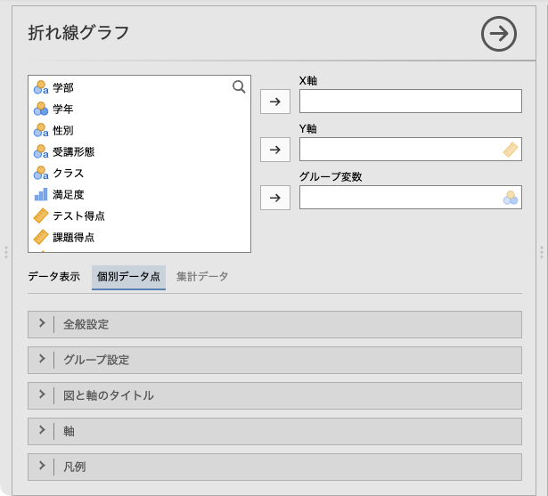
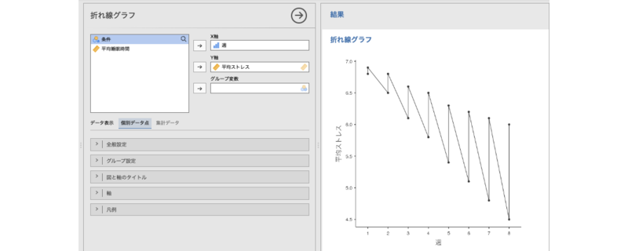
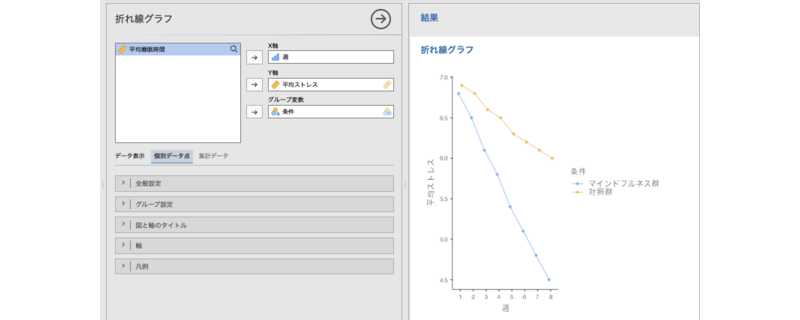
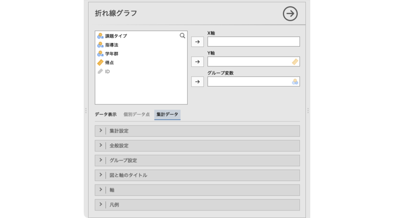
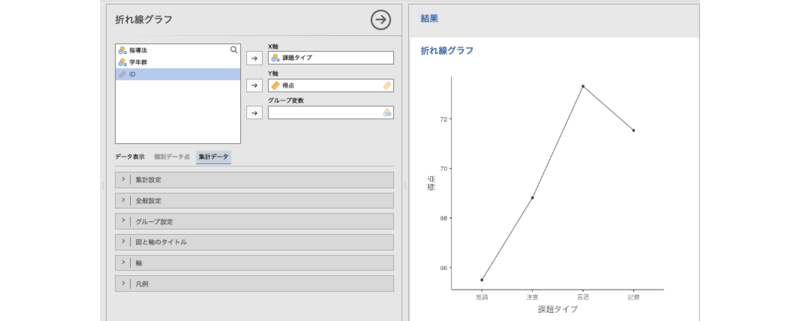
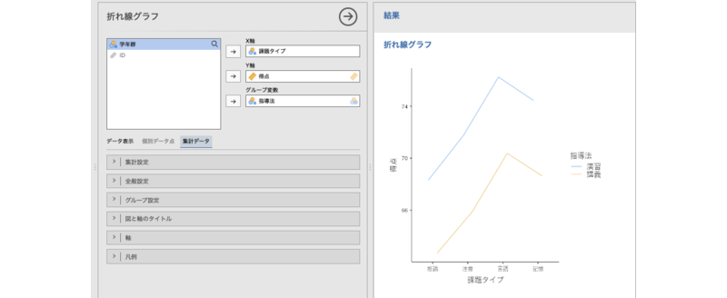
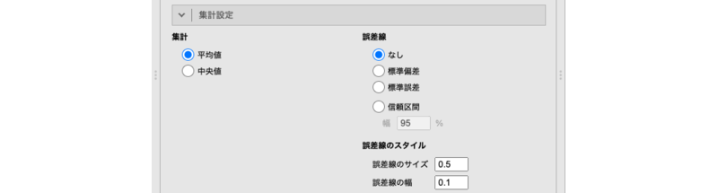

# 折れ線グラフ {#sec-linechart}


```{r, echo =F, message=FALSE}
 source("rscripts/_utility.R")
```

```{r}
line_ts <- read.csv("data/chart_line_timeseries.csv", stringsAsFactors = FALSE)

# 順序/名義変数
line_ts$週 <- factor(line_ts$週, ordered = TRUE)
attributes(line_ts$週)$measureType <- c("Ordinal")

line_ts$条件 <- factor(line_ts$条件)
attributes(line_ts$条件)$measureType <- c("Nominal")

# 連続変数
attributes(line_ts$平均ストレス)$measureType <- c("Continuous")
attributes(line_ts$平均睡眠時間)$measureType <- c("Continuous")

# 説明
attributes(line_ts$週)$description <- "測定週（1〜8週）"
attributes(line_ts$条件)$description <- "介入条件（マインドフルネス群／対照群）"
attributes(line_ts$平均ストレス)$description <- "週ごとの平均ストレス得点"
attributes(line_ts$平均睡眠時間)$description <- "週ごとの平均睡眠時間（時間）"

out <- jmvReadWrite::write_omv(line_ts, "data/omv/chart_line_timeseries.omv", frcWrt = TRUE)

line_raw <- read.csv("data/chart_line_raw.csv", stringsAsFactors = FALSE)

# ID
attributes(line_raw$ID)$`jmv-id` <- TRUE

# 順序/名義変数
line_raw$課題タイプ <- factor(line_raw$課題タイプ)
attributes(line_raw$課題タイプ)$measureType <- c("Nominal")

line_raw$指導法 <- factor(line_raw$指導法)
attributes(line_raw$指導法)$measureType <- c("Nominal")

line_raw$学年群 <- factor(line_raw$学年群)
attributes(line_raw$学年群)$measureType <- c("Nominal")

# 連続変数
attributes(line_raw$得点)$measureType <- c("Continuous")

# 説明
attributes(line_raw$ID)$description <- "受講者ID"
attributes(line_raw$課題タイプ)$description <- "課題タイプ（記憶／注意／推論／言語）"
attributes(line_raw$指導法)$description <- "指導法（講義／演習）"
attributes(line_raw$学年群)$description <- "学年群（1〜2年／3〜4年）"
attributes(line_raw$得点)$description <- "課題得点（0〜100）"

out <- jmvReadWrite::write_omv(line_raw, "data/omv/chart_line_raw.omv", frcWrt = TRUE)
```

折れ線グラフは，時間の経過や順序に沿った値の変化を視覚化するためのグラフです。データ点を線で結ぶことで，増減の傾向や変化のパターンを把握しやすくなります。

jamoviの折れ線グラフツールは，集計済みのデータを用いて作成する場合と，未集計データを用いて作成する場合でメニューの構成が異なるので，それぞれ個別に見ていくことにしましょう。

## 個別データ点 {#sub:plots-lineplot-datapoint}

まずは集計済みデータを用いる場合の方法を見ていきます。このサンプルデータ（[chart_line_timeseries.omv](https://github.com/sbtseiji/jmv_compguide/raw/main/data/omv/chart_line_timeseries.omv)）には次の値が入力されています。

:::{.jmvvar data-latex=""}
+ `週`　測定週（1〜8週）
+ `条件`　介入条件（マインドフルネス群／対照群）
+ `平均ストレス`　週ごとの平均ストレス得点
+ `平均睡眠時間`　週ごとの平均睡眠時間（時間）
:::

これは，マインドフルネスのセッションを行った群とそうでない群の，週ごとのストレス値，および睡眠時間の平均値のデータです。集計済みデータの折れ線グラフ作成機能は，このような**時系列データ**の視覚化に適しています。

折れ線グラフを作成するには，「`r infig("analysis-scatr-jmvline")` 折れ線グラフ」を選択します（[@fig-plots-lineplot-menu-aggregated]）。

```{r fig-plots-lineplot-menu-aggregated, fig.cap="折れ線グラフ", echo=FALSE}

```

すると，次のような設定パネルが表示されます（[@fig-plots-lineplot-datapoint-setting]）。

```{r fig-plots-lineplot-datapoint-setting, fig.cap="折れ線グラフ（個別データ点）の設定パネル", echo=FALSE}

```

:::{.jmvsettings data-latex=""}
+ X軸　X軸に配置する変数を指定します。
+ Y軸　Y軸に配置する変数を指定します。
+ データ表示　個別データ点をグラフにするか，集計値をグラフにするかを選択します。
+ `r groupbar("全般設定")`　線のスタイルや点のサイズなど，折れ線グラフの全体的な見た目の設定を行います。
+ `r groupbar("グループ設定")`　グループ間で線や点のスタイルを変えるかどうかなどを設定します。
+ `r groupbar("図と軸のタイトル")`　図のタイトルやサブタイトル，軸のタイトル，キャプションの表示方法を設定します。
+ `r groupbar("軸")`　軸の範囲や軸ラベルの向きなどを設定します。
+ `r groupbar("凡例")`　凡例（レジェンド）の表示方法や位置を設定します。
:::

ここで，「データ表示」が「個別データ点」になっていることを確認してください。なお，他のグラフと同様に，`r groupbar("図と軸のタイトル")`以降の設定項目は「[棒グラフ](#sec-barchart)」と同じですので，ここでは説明を省略します。

では，平均ストレスが週ごとの変化を図示してみましょう。「X軸」に「週」変数を，「Y軸」に「平均ストレス」を指定すると，次のような折れ線グラフが表示されます（[@fig-plots-lineplot-datapoint-plot]）。

```{r fig-plots-lineplot-datapoint-plot, fig.cap="平均ストレスの折れ線グラフ", echo=FALSE}
 
```

表示されます……が，どこかおかしいですね。これは，この集計データには「マインドフルネス群」と「対照群」の2群の集計値が入力されているからです。複数グループの集計値が入力されているデータでは，「グループ変数」を適切に設定する必要があります。

「グループ変数」に「条件」を指定すると，折れ線グラフが次のようにグループ別に表示されます（[@fig-plots-lineplot-datapoint-plot-grouped]）。


```{r fig-plots-lineplot-datapoint-plot-grouped, fig.cap="グループを用いた折れ線グラフ", echo=FALSE}
 
```

### 全般設定 {#sub:plots-lineplot-datapoint-general}

設定パネルの`r groupbar("全般設定")`には，次の項目が含まれています。

```{r plots-lineplot-datapoint-general, fig.cap="全般設定", echo=FALSE}
  
```

:::{.jmvsettings data-latex=""}
- **折れ線**　
  - 線を表示　線を表示させる場合はチェックを入れます。
  - 線の太さ　線の太さを設定します（初期値：0.5）。
- **点**
  - 点を表示　点（マーカー）を表示させる場合はチェックを入れます。
  - 点のサイズ　点（マーカー）のサイズを指定します（初期値：2）
- **図の向き**
  - 軸を入れ替え　縦軸と横軸を入れ替えたい場合はチェックを入れます。
:::

### グループ設定 {#sub:plots-lineplot-datapoint-group}

`r groupbar("グループ設定")`には，次の項目が含まれています。

```{r plots-lineplot-datapoint-group-example, fig.cap="グループ設定", echo=FALSE}
  
```

:::{.jmvsettings data-latex=""}
- **線・点スタイル**　
  - 色　グループ間で色を変えたい場合はチェックを入れます。
  - 線種　グループ間で線の種類（実線・点線）を変えたい場合はチェックを入れます。
  - 点種　グループ間で点（マーカー）のかたちを変えたい場合はチェックを入れます。
- **重なり防止**
  - ずれ幅　グループ間で点（マーカー）が重ならないよう，横にずらす幅を指定します（初期値：0.5）。
:::

この「重なり防止」の機能は，Excelなどの表計算ソフトのグラフ機能では難しいため，わかりやすいグラフを作成する上で重宝することでしょう。

## 集計値 {#sub:plots-lineplot-aggregated}

今度は未集計データを用いる場合の方法を見ていきます。サンプルデータ（[chart_line_raw.omv](https://github.com/sbtseiji/jmv_compguide/raw/main/data/omv/chart_line_raw.omv)）には次の値が入力されています。

:::{.jmvvar data-latex=""}
+ `ID`　受講者ID
+ `課題タイプ`　課題タイプ（記憶／注意／推論／言語）
+ `指導法`　指導法（講義／演習）
+ `学年群`　学年群（1〜2年／3〜4年）
+ `得点`　課題得点（0〜100）
:::

このデータは，課題タイプごとの得点を，指導法と学年群の2種類のグループで測定したデータです（架空データ）。折れ線グラフの「集計値」表示を使うと，このような個票データから平均値などの集計値を自動算出して図示できます。実際のデータ分析では，こちらの機能を使うことが多いでしょう。

グラフタブから「`r infig("analysis-scatr-jmvline")` 折れ線グラフ」を選択するところまでは，集計済みデータを用いたグラフ作成の場合と同じです（[@fig-plots-lineplot-menu2]）。

```{r fig-plots-lineplot-menu2, fig.cap="折れ線グラフ", echo=FALSE}

```

折れ線グラフの設定パネルが開いたら，「データ表示」で「集計値」を選択します。すると，設定パネルの画面が次のようになります（[@fig-plots-lineplot-aggregated-setting]）。

```{r fig-plots-lineplot-aggregated-setting, fig.cap="折れ線グラフ（集計値）の設定パネル", echo=FALSE}

```

:::{.jmvsettings data-latex=""}
- X軸　X軸に配置する変数を指定します。通常，X軸には順序尺度または名義尺度変数を用います。
- Y軸　値を集計して示したい変数を指定します。Y軸には連続変数のみ使用可能です。
- グループ変数　グループ別に集計したい場合に使用します。
+ `r groupbar("集計設定")`　図に示す集計値の種類や誤差線の種類を設定します。
+ `r groupbar("全般設定")`　線のスタイルや点のサイズなど，折れ線グラフの全体的な見た目の設定を行います。
+ `r groupbar("グループ設定")`　グループ間で線や点のスタイルを変えるかどうかなどを設定します。
+ `r groupbar("図と軸のタイトル")`　図のタイトルやサブタイトル，軸のタイトル，キャプションの表示方法を設定します。
+ `r groupbar("軸")`　軸の範囲や軸ラベルの向きなどを設定します。
+ `r groupbar("凡例")`　凡例（レジェンド）の表示方法や位置を設定します。
:::

このうち，`r groupbar("全般設定")`以降の項目は，集計済みデータの折れ線グラフ作成（[個別データ点](#sub:plots-lineplot-datapoint)）の場合と同じですので，ここでは説明を省略します。

ここでは，課題タイプごとの得点の平均値をグラフにしてみましょう。設定パネルの「X軸」に「課題タイプ」を，「Y軸」に「得点」を設定します。すると，次のようなグラフが表示されます（[@fig-plots-lineplot-aggregated-plot]）。

```{r fig-plots-lineplot-aggregated-plot, fig.cap="課題タイプごとの得点の平均値のグラフ", echo=FALSE}

```

さらにこれを「指導法」別の集計にしてみましょう。「グループ変数」に「指導法」を設定すると，グラフはこのようになります（[@fig-plots-lineplot-aggregated-plot-grouped]）。

```{r fig-plots-lineplot-aggregated-plot-grouped, fig.cap="グループ変数を用いた場合の折れ線グラフ", echo=FALSE}

```

「X軸」と「グループ変数」はどちらも名義尺度や順序尺度の**離散型**の変数ですが，それぞれX軸に表示されるか，凡例に表示されるかが異なるので，内容に応じて適切に選択しましょう。たとえば，名義尺度変数と順序尺度変数がある場合には，順序尺度変数をX軸にしたほうが，変化が視覚的に捉えやすくなります。

### 集計設定 {#sub:plots-lineplot-aggregated-aggregate-setting}

設定パネルの`r groupbar("集計設定")`には，次の項目が含まれています。

```{r plots-lineplot-aggregated-aggregate-setting, fig.cap="集計設定", echo=FALSE}
  
```

:::{.jmvsettings data-latex=""}
- **集計**　
  - 平均値　グラフに表示する集計値に平均値を用います（初期値）。
  - 中央値　グラフに表示する集計値に中央値を用います。
- **誤差線**
  - なし　誤差線は表示しません（初期値）。
  - 標準偏差　誤差線に標準偏差を示します。
  - 標準誤差　誤差線に標準誤差を示します。
  - 信頼区間　誤差線に信頼区間を示します。
    - 幅［　］%　信頼区間の幅を設定します。
- **誤差線のスタイル**
  - 誤差線の太さ　誤差線の線の太さを指定します（初期値：0.5）
  - キャップの幅　誤差線両端のキャップ（端点）の幅を指定します（初期値：0.1）。
:::

平均値のみではデータのばらつきがわからないため，平均値を図に示す場合には誤差線も合わせて示すようにしましょう。その際，誤差線に何を用いたのかを，図のタイトルやキャプションに明記するようにしてください。

なお，Excelで標準偏差や標準誤差を誤差線に示すためには，「誤差範囲」の種類を「ユーザー設定」にした上で，あらかじめ計算しておいた標準偏差や標準誤差が入力されているセルを指定する必要がありますが^[誤差範囲の種類に「標準偏差」などの項目はありますが，あれは正しい値になりません。また，「ユーザー設定」はWebアプリ版やタブレット版のExcelでは使用できません。]，jamoviの折れ線グラフでは，誤差線の種類を選べばデータから自動で適切な値を計算してそれを図示してくれるので，とても簡単です。


